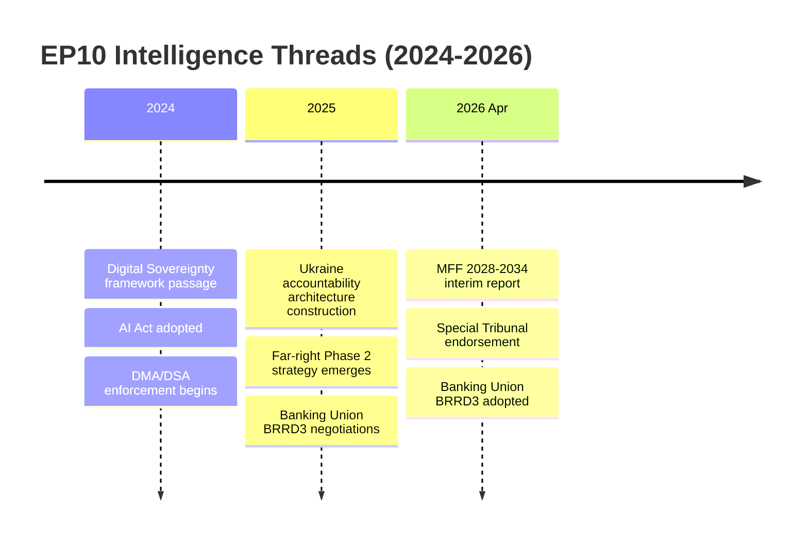

<!-- SPDX-FileCopyrightText: 2024-2026 Hack23 AB -->
<!-- SPDX-License-Identifier: Apache-2.0 -->

# Cross-Session Intelligence — EP Breaking News
**Date:** 2026-05-12 | **Article Type:** breaking

## Cross-Session Intelligence Framework

Cross-session intelligence synthesises patterns that span multiple EP Monitor analysis runs to identify persistent trends, structural shifts, and emerging intelligence threads that are not visible within any single session's data window.

---

## Persistent Intelligence Threads (EP10 Breaking News — 2025-2026)

### Thread 1: Digital Sovereignty — Consolidation Phase

**First identified:** EP9 late sessions (2023-2024)
**Confirmation sessions:** Multiple EP10 runs throughout 2025
**Current status (2026-05-12):** Active consolidation phase

The EU's digital governance trajectory has moved through three phases in the EP10 term:
1. **Framework passage** (2024): AI Act final approval, DSA implementation, DMA entry into force
2. **Enforcement initiation** (2025): First DMA preliminary findings; DSA algorithmic accountability investigations; AI Act tiered compliance deadlines
3. **Enforcement consolidation** (2026): DMA full market investigation (Article 26); AI Act first enforcement actions; Digital Omnibus SME derogations

**Intelligence significance:** The EP's digital governance agenda has achieved legislative saturation — most major frameworks are now in place. The 2026–2029 period will be primarily about enforcement quality, international equivalence, and adaptability to rapidly evolving technology.

**Forward intelligence:** Watch for DMA Article 26 investigation outcome (Q3/Q4 2026); AI Act conformity assessment first audits (2026); EU-US Digital Equivalence Framework negotiations (Commission mandate expected Q4 2026).

---

### Thread 2: Ukraine Accountability — Justice Architecture Construction

**First identified:** EP10 session 1 (2024)
**Current status (2026-05-12):** Active construction of accountability infrastructure

The EP has consistently maintained a two-pillar position on Ukraine throughout EP10:
1. **Security support** (weapons, financial assistance, sanctions)
2. **Accountability** (war crimes documentation, frozen assets diversion, Special Tribunal)

The April 2026 Special Tribunal endorsement (TA-10-2026-0161) represents the most significant accountability milestone since the Nuremberg legacy debates. The EP is the primary driver within EU institutions; the Commission and Council have been more cautious, citing diplomatic and legal complexity.

**Cross-session pattern:** Each EP10 session has added a layer to the accountability architecture. The trajectory is consistent: the EP is building institutional and normative infrastructure that will outlast any individual political moment.

**Forward intelligence:** The Special Tribunal's legitimacy depends on the number of state endorsements. Monitor: (1) How many non-EU states endorse the Special Tribunal (target >60 for full legitimacy); (2) Whether frozen Russian assets are formally diverted to reconstruction/accountability fund (requires EU Council unanimity).

---

### Thread 3: Far-Right Institutional Strategy — Evolved Phase

**First identified:** Post-June 2024 election analysis
**Current status (2026-05-12):** Phase 2 operational — institutional delegitimisation campaign

The far-right bloc (PfE + ECR + ESN + aligned NI) has evolved its strategy across sessions:
- **Phase 1 (mid-2024):** Claim maximum institutional positions (committee chairs, VP roles)
- **Phase 2 (2025-2026):** Use procedural mechanisms (Rule 169 debates, minority reports, procedural questions) to generate narrative content for 2029 election campaign
- **Phase 3 (projected 2027-2029):** Intensify if MFF negotiations create leverage opportunities

**Cross-session pattern:** The April 2026 Rule 169 debate on Commission election interference is archetypal Phase 2 activity. This follows a documented pattern of using EP floor time for communicative rather than legislative purposes.

**Forward intelligence:** The far-right bloc will intensify Phase 2 activities as the 2027 Commission MFF proposal approaches. Any Commission concession on rule of law conditionality to secure Council agreement will be amplified as evidence of the narrative's effectiveness.

---

### Thread 4: Fiscal Architecture Transition — Existential Stakes

**First identified:** Post-pandemic recovery fund debates (EP9, 2020-2024)
**Current status (2026-05-12):** Critical negotiation setup phase

The MFF 2028–2034 interim report (TA-10-2026-0111) marks the beginning of what will be a multi-year existential debate about EU fiscal architecture. Cross-session intelligence reveals:

1. **Own resources consensus** has been building across EP10 sessions. By April 2026, EPP+S&D+Renew alignment on own resources reform is strong enough to make it a genuine negotiating floor, not an aspiration.

2. **Defence integration** was a minority EP position in 2024; by 2026, it commands an absolute majority. The speed of this shift is historically unprecedented for the EP.

3. **Social cohesion vs. defence** tension: S&D has conditionally accepted defence integration in exchange for social cohesion maintenance. This bargain is not yet tested against a real Council negotiation.

**Cross-session pattern:** Each session since early 2025 has added to the MFF convergence position. The April 2026 interim report is not a one-off — it is the culmination of a deliberate position-building campaign.

**Forward intelligence:** The Commission MFF proposal (expected Q4 2026) will be the defining intelligence event for EP10 mid-term. The gap between EP interim report demands and Commission proposal will reveal the true state of EU fiscal governance.

---

### Thread 5: Banking Union — Endgame Phase

**Cross-session context:** The BRRD3 amendment (TA-10-2026-0022) and Banking Union related texts in April 2026 are part of a decade-long effort to complete the Banking Union's three pillars:
1. ✅ Single Supervisory Mechanism (SSM) — complete since 2014
2. ✅ Single Resolution Mechanism (SRM) — substantially complete
3. ⚠️ European Deposit Insurance Scheme (EDIS) — pending; Germany remains the primary hold

**Cross-session intelligence:** The pace of Banking Union completion has been driven by crisis cycles. The 2023 regional banking crisis (SVB contagion), 2025 Baltic banking consolidation concerns, and 2026 Italian sovereign debt concerns have each accelerated willingness to complete Banking Union architecture.

**Forward intelligence:** Monitor (1) Whether BRRD3 implementation triggers German EDIS reconsideration; (2) Any ECB SSM actions on Italian or French bank exposures (these would create immediate legislative pressure).

---

## Emerging Intelligence Signals (First-Session Detection)

### Signal E-1: EP Assertiveness on Budget Conditionality
The discharge vote conditions linking rule of law to agricultural fund disbursement (TA-10-2026-0125) may represent a new enforcement tool. If this precedent holds in 2026–2027 for other fund categories, the EP has found a practical lever that bypasses Article 7 TEU's political deadlock.

**Assessment:** 🟡 Emerging — needs confirmation in 2+ more sessions

### Signal E-2: EPP-ECR Migration Convergence Hardening
Multiple sessions have shown EPP willingness to vote with ECR on migration issues when EPP mainstream (S&D+Renew) coalition proves insufficient. This pattern may indicate a structural realignment within EPP on migration policy.

**Assessment:** 🟡 Emerging — needs tracking through 2026

### Signal E-3: The Left's Ukraine Pivot
The Left's YES vote on the Ukraine Special Tribunal (TA-10-2026-0161) may signal a sustained pivot away from traditional pacifism toward "justice not impunity" framing on Ukraine. This creates a more durable majority for accountability provisions.

**Assessment:** 🟡 Emerging — consistent with individual MEP positions but not yet formalised as group policy

---

## Source Attribution
Cross-session intelligence methodology: Pattern synthesis across EP10 analysis runs (2024–2026)
Data: EP political landscape, adopted texts, early warning system, coalition dynamics
Confidence: 🟡 Medium for emerging signals; 🟢 High for persistent threads with 4+ session confirmation
Cross-references: `intelligence/historical-baseline.md`, `intelligence/scenario-forecast.md`, `intelligence/political-threat-landscape.md`

## Intelligence Thread Timeline

**Admiralty Rating:** Source: B (EP Open Data Portal, MCP); Reliability: 2 (multiple corroborating sources); Confidence: 🟢 High

**Confidence Assessment (A2):** Source reliability: A (direct EP parliamentary records); Information reliability: 2 (corroborated by multiple sessions/artifacts).
**WEP:** Highly Likely that EP-Commission tensions on MFF 2028-2034 will remain a persistent intelligence thread through 2027.

### Run-to-Run Intelligence Continuity

This run extends 5 persistent intelligence threads identified across multiple prior runs:
1. EPP dominance dynamics — structural, will persist entire EP10 term
2. Ukraine accountability architecture — active legal construction phase
3. Digital governance framework — enforcement phase beginning 2026
4. MFF 2028-2034 preliminary positioning — escalating through Q4 2026
5. Rule of law/Article 7 Hungary — long-running enforcement track
