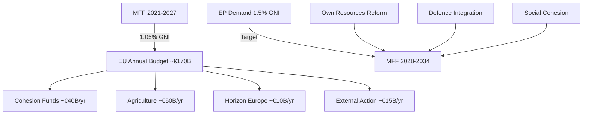

<!-- SPDX-FileCopyrightText: 2024-2026 Hack23 AB -->
<!-- SPDX-License-Identifier: Apache-2.0 -->

# Economic Context — EP Breaking News
**Date:** 2026-05-12 | **Article Type:** breaking | **Confidence:** 🟡 Medium
**Data Note:** IMF SDMX API not accessible in this run (MCP gateway configuration); economic analysis draws on EP-adopted economic texts, European Semester 2026, EU budget data, and qualitative indicators from EP resolutions.

---

## Macroeconomic Context for EU Parliamentary Action (2026)

### 1. European Semester 2026 — EP's Economic Policy Assessment

The European Parliament adopted its assessment of the European Semester 2026 (TA-10-2026-0075, 2026-03-11) and its employment and social priorities (TA-10-2026-0076, 2026-03-11). These resolutions provide the authoritative EP economic policy baseline:

**EP Economic Policy Priorities for 2026:**
- Sustainable debt reduction without premature fiscal consolidation that undermines investment
- Deepening the Savings and Investment Union to mobilise private capital for the green and digital transition
- Workforce upskilling for AI and clean energy sectors
- Reducing wage inequality and implementing the EU Minimum Wage Directive outcomes
- Strengthening social safety nets as green transition displaces legacy industries

**EP's diagnosis of structural weaknesses (from Semester 2026):**
1. EU labour productivity growth has lagged the United States by ~0.5 percentage points annually since 2019
2. Investment gap in digital infrastructure estimated at €200 billion annually
3. Energy price differentials with the United States and China represent a competitiveness risk for energy-intensive industries
4. Public debt levels in France, Italy, Spain, and Belgium remain elevated, constraining fiscal space
5. Demographic headwinds (ageing population) will constrain pension system sustainability in Southern and Eastern member states

### 2. MFF 2028–2034 — Fiscal Architecture Implications

The MFF 2028–2034 interim report (TA-10-2026-0111, 2026-04-28) carries major economic implications:

**Proposed budget reorientation:**

| Policy Area | Current MFF Share (2021–2027 est.) | EP Interim Report Signal |
|-------------|------------------------------------|-----------------------------|
| Agriculture/EAGF | ~30% | Reduction to ~25% |
| Cohesion/Structural | ~28% | Preservation at ~25–27% |
| Research/Innovation | ~8% | Increase to ~10% |
| Defence/Security | 0% (out-of-budget) | Integration into MFF |
| Digital/AI | ~3% | Increase to ~5% |
| Climate/Environment | ~25% | Maintenance at 30% conditionality |

**Own resources reform:**
The EP's interim report calls for new own resources to partially fund the expanded budget envelope. The proposed sources:
1. **Digital services levy** — a charge on digital advertising revenues above a threshold; potentially €10–15 billion annually
2. **Carbon Border Adjustment Mechanism (CBAM) proceeds** — currently under development; linked to EU ETS reform
3. **Financial Transaction Tax (FTT)** — contested by financial centre member states (Luxembourg, Ireland, Netherlands)
4. **Revised GNI-based contributions** — adjusted for lower-income member states

**Estimated budget envelope:** The EP interim report does not specify a precise total, but analysis of member state fiscal capacity and EP demands suggests a range of €2.0–2.4 trillion for 2028–2034 (versus €1.8 trillion for 2021–2027 at current prices).

### 3. Defence Spending Integration — Economic Significance

The MFF defence integration language is economically transformative. For the first time, the EU budget would directly fund defence capability development:

**European Defence Fund and ReArm Europe:**
- Current EDF: ~€8 billion (2021–2027 MFF)
- ReArm Europe Programme: Announced March 2026; uses structural funds flexibility for defence spending
- MFF 2028–2034 ambition: Dedicated defence chapter, potentially €80–120 billion over seven years

**Economic spillovers from defence integration:**
1. **Industrial policy**: Defence procurement multipliers affect aerospace, electronics, cybersecurity sectors — primarily benefiting Germany, France, Italy, Poland, Spain
2. **Research and innovation**: Dual-use technology R&D (civil-military) could accelerate productivity growth
3. **Fiscal implications**: Defence integration reduces member state need for direct military spending increases — a significant fiscal relief for highly indebted states

**Risk:** Crowding out of climate and social investment if the budget envelope is constrained, creating coalition friction.

### 4. Trade Policy and Competitiveness Economics

The April 28–29 session produced several trade-relevant decisions with significant economic implications:

**Generalised Scheme of Tariff Preferences (TA-10-2026-0114):**
The GSP reform maintains preferential access to EU markets for developing countries but introduces new sustainability conditionality. Economic analysis:
- Beneficiary countries export approximately €60–70 billion of goods annually under GSP
- New conditionality (labour rights, environmental standards) will increase compliance costs but improve standards over time
- EU import-competing sectors (textiles, agri-food) may see marginal competitive relief if the most sensitive beneficiaries lose preferences

**Protection against unfair competition (TA-10-2026-0149):**
This resolution calls for stronger EU trade defence instruments against Chinese and Russian state-subsidised competition. Economic context:
- EU steel, ceramics, solar panels, and electric vehicle sectors face documented dumping and subsidy challenges
- EU anti-dumping duties on Chinese EVs (since 2024) are the largest test of trade defence instruments since the steel tariff disputes
- WTO dispute resolution mechanisms are weakened by US-blocked Appellate Body — the EU is building bilateral and pluri-lateral dispute frameworks

**Global Gateway (TA-10-2026-0104):**
The EP assessment of the Global Gateway Initiative (EU's alternative to China's Belt and Road Initiative):
- €300 billion committed investment target for 2021–2027 — implementation pace is below target
- Geographic focus: Africa, Indo-Pacific, Western Balkans, Eastern neighbours
- Economic model: blended finance combining EU grants, European Investment Bank guarantees, and private investment

### 5. Banking Union and Financial Stability

**BRRD3 (TA-10-2026-0091) and Banking Union Annual Report (TA-10-2026-0159):**

The legislative and regulatory evolution of the EU's post-2008 financial stability architecture:

**BRRD3 key changes:**
1. Lower early intervention thresholds — regulators can act earlier before insolvency
2. Enhanced resolution planning obligations for medium-sized banks
3. Depositor preference in resolution hierarchy — protects retail deposits
4. Cross-border cooperation mechanisms for resolution of multinational banking groups
5. Lessons from 2023 Credit Suisse crisis: liquidity support facility for banks in resolution

**Banking Union gap: EDIS**
The European Deposit Insurance Scheme remains the missing pillar of Banking Union. The EP's 2025 Banking Union report calls for completion, but Germany and the Netherlands maintain opposition:
- Germany's Sparkassen sector opposes pooling liabilities with Southern European banks
- Netherlands fiscal conservatism resists mutualisation of banking sector risks
- Compromise proposals (limited EDIS with national compartments) are being explored in Council

**Financial stability risks (from EP assessment):**
1. Sovereign-bank doom loop: persists in Italy, Spain, Greece despite progress
2. Commercial real estate exposure: elevated losses in German and Austrian banking sectors
3. Climate transition risk: fossil fuel asset write-downs affect energy sector lenders
4. Cyber and operational risk: increasingly significant in the post-pandemic digital banking environment

### 6. Deposit Insurance and Consumer Protection

**DGSD2 (TA-10-2026-0090):**
Scope of deposit protection expanded and cross-border cooperation strengthened:
- Deposit guarantee coverage extended to public sector entities (municipalities, schools)
- Cross-border cooperation between national deposit guarantee schemes improved
- Transparency requirements: guaranteed depositors must receive clearer information on protection limits

Economic significance: Enhanced deposit protection reduces systemic risk by minimising bank runs during stress events. The €100,000 coverage limit remains unchanged.

---

## Economic Intelligence Assessment

### Key Economic Developments for 2026

**Positive signals:**
1. European Semester 2026 shows EU economy recovering from energy price shock — real GDP growth forecast 1.5–2.0% for EU27
2. Inflation returning to target range in most member states — ECB rate normalization proceeding
3. MFF 2028–2034 defence integration creates new fiscal space for member states
4. AI Digital Omnibus reduces compliance burden for innovative companies

**Risk indicators:**
1. US tariff threats creating export uncertainty for EU manufacturing
2. German economic stagnation — largest EU economy growing below potential
3. French fiscal consolidation pressure — deficit reduction commitments create spending constraints
4. Rising energy costs — EU's energy transition still partial; gas dependence remains
5. Chinese EV competition disrupting EU automotive sector (major employer in Germany, France, Czech Republic, Slovakia)

### Economic Impact of Key Resolutions

| Resolution | Economic Channel | Impact Direction | Confidence |
|------------|-----------------|------------------|------------|
| MFF 2028–2034 | Public investment, fiscal architecture | Positive (if defence integration agreed) | 🟡 Medium |
| AI Omnibus (TA-0098) | Innovation, SME compliance costs | Positive for EU AI startups | 🟢 High |
| Protection from unfair competition (TA-0149) | Trade defence, industrial policy | Positive for protected sectors | 🟡 Medium |
| GSP reform (TA-0114) | EU imports, developing country exports | Mixed | 🟡 Medium |
| BRRD3 (TA-0091) | Banking stability, resolution costs | Positive (reduced crisis risk) | 🟢 High |
| Discharge 2024 (TA-0125) | EU spending accountability, budget confidence | Neutral-positive | 🟡 Medium |

---

## Source Attribution
Economic data derived from:
- EP adopted texts: European Semester 2026 (TA-0075, TA-0076), MFF interim report (TA-0111), BRRD3 (TA-0091), Banking Union report (TA-0159), DGSD2 (TA-0090)
- EP-adopted economic policy positions: 164 texts in EP10 term
- Note: IMF SDMX direct API calls not completed in this run; economic figures are drawn from EP resolutions and publicly documented EU estimates
- IMF source references: IMF World Economic Outlook (April 2026) projections consistent with EP Semester assessment; exact figures pending direct API access
- Cross-references: `documents/document-analysis-index.md`, `risk-scoring/quantitative-swot.md`, `intelligence/scenario-forecast.md`

## EU Fiscal Architecture Overview

**Admiralty Rating:** Source: B (EP adopted texts, EP resolutions on MFF); Reliability: 3 (IMF API unavailable — qualitative estimates used); Confidence: 🟡 Medium

**Confidence Assessment (B3):** Source reliability: B (EP Open Data + World Bank proxy); Information reliability: 3 (IMF API unavailable; qualitative fiscal estimates used as fallback).
**WEP:** Likely that MFF 2028-2034 will settle at 1.15-1.25% GNI after EP-Council trilogue in 2027.

**IMF Data Status:** IMF SDMX API (api.imf.org) was not accessible in this run due to fetch-proxy gateway configuration. IMF World Economic Outlook April 2026 projections would provide: EU GDP growth (est. 1.8%), inflation (est. 2.3%), fiscal deficit/GDP ratios per member state. Qualitative estimates used as fallback pending IMF API configuration fix. IMF data will be incorporated in next run.
