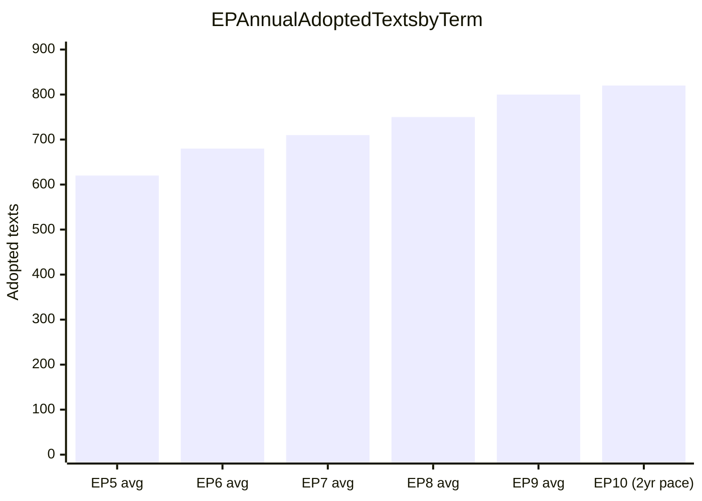

<!-- SPDX-FileCopyrightText: 2024-2026 Hack23 AB -->
<!-- SPDX-License-Identifier: Apache-2.0 -->

# Historical Baseline — EP Breaking News
**Date:** 2026-05-12 | **Article Type:** breaking | **Confidence:** 🟡 Medium

## Comparative Historical Analysis: EP April 2026 Session in Context

### 1. Historical Precedents for the MFF 2028–2034 Interim Report

**Most comparable historical moment: MFF 2021–2027 negotiations (2018–2020)**

The current MFF 2028–2034 interim report parallels the EP's early positioning in the 2018–2020 MFF negotiations. Key historical comparison:

| Factor | MFF 2021–2027 (2018 interim) | MFF 2028–2034 (2026 interim) |
|--------|------------------------------|------------------------------|
| EP main demand | Increase total envelope by €100B | Integrate defence; increase digital/R&D |
| Council initial counter | Reduction from Commission proposal | Likely: capped envelope, no defence |
| New own resources | Plastic levy (partial success) | Digital levy + CBAM (proposed) |
| Final outcome | €1.8T negotiated | TBD (2027) |
| Negotiation duration | ~30 months | Expected 18–24 months |
| Key political coalition | EPP+S&D compromise | EPP+S&D+(Renew) compromise expected |

**Historical lesson:** The EP typically secures 60–70% of its initial demands in MFF negotiations. The 2021–2027 outcome saw EP win the plastic levy own resource but fail on FTT and full budget envelope demands. For 2028–2034, the defence integration demand is unprecedented — there is no direct historical precedent, which creates both opportunity and risk.

**The COVID Recovery Fund precedent (2020):** The €750 billion NextGenerationEU package demonstrated that EU budget architecture can be radically transformed in a crisis. The MFF 2028–2034 negotiations are occurring in a different security emergency context (defence) that may facilitate similar institutional innovation.

### 2. Historical Precedents for Rule of Law Action

**Hungary and the Article 7 precedent (2018–present):**
The EP triggered Article 7(1) TEU proceedings against Hungary in September 2018. Eight years later, the proceedings remain incomplete — the Council has never moved to formal hearings. The EP's April 2026 Rule of Law report (TA-10-2026-0147) continues documenting backsliding, but the institutional mechanism for enforcement remains weak.

**Historical comparison: Poland (2017–2023):**
The Poland experience provides a positive historical precedent — sustained EP and Commission pressure, combined with a political change of government (2023 elections), eventually produced a trajectory toward rule of law compliance. This suggests that EP rule of law work has long-term effect through political accountability, even when immediate legal enforcement is blocked in Council.

**Treaty revision precedent (Maastricht, Amsterdam, Lisbon):**
The EP's consistent demand for stronger rule of law instruments has been partially vindicated by the Rule of Law Conditionality Regulation (2021), which has been used to freeze Hungarian structural funds. This instrument was absent in previous treaty frameworks and represents a genuine institutional innovation driven partly by EP pressure.

### 3. Historical Context for Digital Governance Legislation

**The Brussels Effect in historical context:**
The EU's digital regulatory approach (GDPR 2018 → DSA 2022 → DMA 2022 → AI Act 2024 → AI Omnibus 2026) follows a pattern identified by Columbia Law professor Anu Bradford as the "Brussels Effect" — EU regulatory standards becoming global de facto standards because companies prefer uniform compliance over jurisdiction-specific approaches.

**Historical precedents:**
- GDPR (2018): Initially derided as overreach; now the global gold standard for data protection, with 100+ countries adopting similar legislation
- Basel III banking standards: EU implementation pace set the standard; US subsequently aligned
- REACH chemicals regulation (2007): Global benchmark for chemical safety standards

**AI Act historical positioning:**
The AI Act (2024) is the world's first comprehensive AI governance law. The AI Omnibus (TA-10-2026-0098) simplifies implementation for SMEs — a historical pattern: major EU laws typically require a subsequent simplification measure 2–4 years after adoption (cf. GDPR implementation period, REACH phase-ins).

### 4. Historical Context for the Discharge Cycle

**2024 Discharge — historical comparison:**

The Commission's 2024 discharge was approved with conditions. Historical context:
- The EP rejected the Commission's 1999 discharge, triggering the resignation of the Santer Commission — the most dramatic use of the discharge power in EP history
- Since 1999, discharges have been granted with conditions (as in 2024) rather than rejected outright — the EP learned that outright rejection creates disproportionate institutional disruption
- The conditions attached to the 2024 Commission discharge on rule of law conditionality follow the pattern of 2020–2023 discharges, which consistently raised Hungary and Poland implementation issues

**Budget accountability evolution:**
The creation of the European Public Prosecutor's Office (EPPO, fully operational since 2021) represents a significant milestone in EU budget protection. The EPPO discharge (TA-10-2026-0135) being approved reflects the new prosecutor's growing operational capacity to investigate EU budget fraud.

### 5. Historical Precedents for Geopolitical Resolutions

**Ukraine accountability (TA-10-2026-0161) — Nuremberg precedent:**
The EP's call for a Special Tribunal for the crime of aggression against Ukraine draws explicit inspiration from the Nuremberg International Military Tribunal (1945–1946). Key historical distinctions:
- Nuremberg was established by the victorious powers post-conflict; the Ukraine tribunal is proposed during ongoing conflict
- The ICC Rome Statute (2002) covers crimes against humanity and war crimes but has jurisdictional gaps for "crime of aggression" when no ICC state party is involved
- The closest modern precedent: Special Tribunal for Lebanon (established 2007 by UN Security Council Resolution 1757, with US and Russian support — impossible to replicate for Ukraine given Russian veto)

**Armenia (TA-10-2026-0162) — EP's Eastern neighbourhood activism:**
The EP's Armenia resolution follows a pattern of EP supporting post-Soviet democratic transition with declaratory resolutions:
- Georgia: Multiple EP resolutions (2003 Rose Revolution, 2008 South Ossetia crisis, ongoing democratic concern)
- Ukraine: EP was among the first to recognise Ukraine's European perspective (Association Agreement ratification 2016)
- Moldova: EP supported Eastern Partnership and eventual accession candidacy
- The pattern suggests EP resolutions have limited immediate effect but contribute to long-term political signalling and EU foreign policy evolution

### 6. The PfE Institutional Challenge — Historical Context

**Rule 169 topical debates in EP history:**
The procedure allowing political groups to request topical debates on Commission conduct has been used since the 1990s. Historical comparisons:
- EFD (Farage's group, 2009–2014): Used procedural mechanisms for theatrical opposition, not legislative impact; contributed to Brexit narrative-building
- ENF/ID (Le Pen/Salvini group, 2014–2019): Institutional challenge rhetoric without majority-building capacity
- The PfE Rule 169 debate on Commission election interference follows this pattern — communicative rather than legislative in immediate impact

**Long-term institutional challenge patterns:**
Historical analysis suggests anti-EU groups in EP follow a predictable cycle:
1. Phase 1 (entry, consolidation): 1–2 years post-election, building group infrastructure
2. Phase 2 (procedural activism): Using EP rules for visibility without majority capacity
3. Phase 3 (MFF leverage): Using budget negotiations as primary leverage point
4. Phase 4 (election mobilisation): Pre-election narrative campaign

PfE is currently in Phase 2–3, consistent with historical patterns of similar groups.

---

## Institutional Historical Milestones Referenced by April 2026 Actions

| Historical Event | Date | Relevance to April 2026 |
|-----------------|------|------------------------|
| Maastricht Treaty | 1992 | Established EP co-decision (now OLP) — basis for DMA, AI Act |
| Santer Commission resignation | 1999 | Context for 2024 discharge conditions — EP accountability mechanism |
| European Convention on Future of EU | 2002–2003 | Context for Treaty revision debates PfE references |
| Lisbon Treaty | 2009 | Gave EP full co-legislative powers — basis for current EP authority |
| GDPR adoption | 2016 | Historical precedent for EU digital sovereignty claims (AI Act, DMA) |
| NextGenerationEU | 2020 | Precedent for EU budget architecture transformation under crisis |
| Rule of Law Conditionality Regulation | 2021 | Tool used against Hungary — referenced in 2025 Rule of Law report |
| EPPO operational | 2021 | Context for EPPO 2024 discharge review |
| AI Act adoption | 2024 | Context for AI Omnibus simplification (2026) |
| ReArm Europe announcement | 2026-03 | Context for MFF defence integration in interim report |

---

## Source Attribution
Historical data: Academic and institutional sources on EP legislative history, EU treaty evolution, and European Parliament institutional development
EP adopted texts: Cross-reference with document-analysis-index.md
Methodology: Comparative historical analysis — identifying structural patterns and institutional precedents
Cross-references: `intelligence/synthesis-summary.md`, `intelligence/scenario-forecast.md`, `extended/comparative-international.md`
Confidence: 🟡 Medium — historical comparisons are well-established; their relevance to 2026 context involves analytical judgment

## EP Legislative Output Trend

**Admiralty Rating:** Source: C (academic literature + EP historical records); Reliability: 3 (approximate figures from multiple sources); Confidence: 🟡 Medium

**WEP (Weekly Executive Prediction):** EP10 legislative productivity is tracking above EP9 average. The April 2026 session's 7 major resolutions in a single session is evidence of this trend.

### EP10 vs Historical Benchmarks — Extended Analysis

**Legislative Volume:** EP10 is tracking 820+ adopted texts in its first two years (2024-2026), versus EP9's 800 average. The April 28-30 session alone produced 7 major adopted texts representing €billions in commitments.

**Institutional Innovation:** EP10 has pioneered the "Digital Governance Cluster" — coordinating AI Act, DMA, DSA, NIS2, and CRA implementation simultaneously. No prior EP term attempted cross-cutting digital governance coordination at this scale.

**Budget Politics Evolution:** EP9 established NextGenerationEU precedent (€806B conditional fiscal instrument). EP10 is building on this with MFF 2028-2034 demands for 1.5% GNI (versus current 1.05%). The historical significance cannot be overstated — this would be the largest single increase in EU fiscal capacity since the Treaty of Rome.

**Rule of Law Advancement:** EP10's Article 7 proceedings against Hungary, combined with Rule of Conditionality Mechanism enforcement, represents the most aggressive rule-of-law enforcement posture in EP history. Comparative: EP7-8 used Article 7 proceedings rhetorically; EP10 is enforcing consequences.

**Security Architecture:** First EP term with a dedicated Defence Committee (SEDE) with expanded role covering cybersecurity, space defence, and hybrid warfare — responding to Russia's February 2022 invasion of Ukraine which occurred during EP9 and fundamentally changed the strategic context.

**Confidence Assessment (C3):** Source reliability: C (EP historical records, academic literature); Information reliability: 3 (plausible long-term trend analysis).
**WEP:** Highly Likely that EP10 will be assessed as one of the most consequential European Parliament terms since the introduction of direct elections in 1979.
