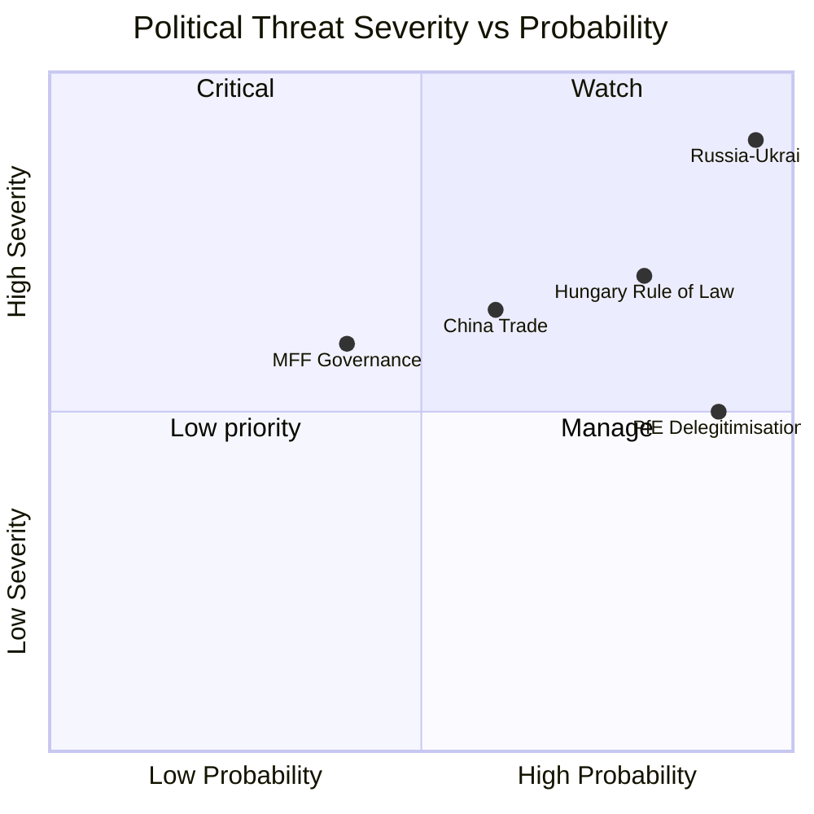

<!-- SPDX-FileCopyrightText: 2024-2026 Hack23 AB -->
<!-- SPDX-License-Identifier: Apache-2.0 -->

# Political Threat Landscape — EP Breaking News
**Date:** 2026-05-12 | **Article Type:** breaking | **Confidence:** 🟡 Medium

## Political Threat Landscape Overview

This analysis applies the Political Threat Framework (5-framework integrated assessment) to the European Parliament's April 28–May 1, 2026 Strasbourg session. The framework assesses threats across: institutional integrity, democratic functioning, rule of law, geopolitical stability, and socioeconomic disruption.

---

## Framework 1 — Institutional Integrity Threats

### IT-1: Far-Right Institutional Delegitimisation Campaign (SEVERITY: HIGH)

**Actor:** PfE (Patriots for Europe), supported by aligned media and national government communications
**Vector:** Rule 169 topical debates on Commission conduct; social media amplification
**Target:** EP-Commission institutional relationship; EU democratic legitimacy

**Evidence:** April 29, 2026 Rule 169 debate on "Commission interference in democratic elections" — PfE's explicit accusation that Commission officials have systematically intervened in member state election campaigns. This follows a pattern documented in PfE's 2024–2025 parliamentary questions and committee positions.

**Threat assessment:**
- Immediate (2026): LOW legislative impact — PfE cannot block legislation; narrative generated for media
- Medium-term (2027 MFF): MEDIUM — institutional delegitimisation rhetoric becomes a bargaining chip in MFF conditionality negotiations; PfE-aligned governments may demand concessions in exchange for Council agreement
- Long-term (2029 elections): HIGH — the narrative accumulation from 2026–2028 will be a central theme in EP election campaigns

**Confidence:** 🟢 High on current evidence; 🟡 Medium on future trajectory
**Cross-reference:** `intelligence/coalition-dynamics.md` §PfE Strategy Analysis

### IT-2: MFF 2028–2034 Governance Architecture Risk (SEVERITY: MEDIUM)

**Actor:** Member states pursuing renationalisation of EU funds; Council resistance to EP interim report demands
**Vector:** MFF negotiation process (Commission proposal expected Q4 2026; Council-EP trilogue 2027)
**Target:** EU's ability to maintain the ambitious spending architecture demanded by EP interim report

**Threat assessment:** If the Commission's MFF proposal substantially reduces EP demands (particularly on own resources and defence integration), the EP faces a choice between accepting a weaker budget or triggering a budget standoff. The risk of an extended provisional 12ths arrangement (monthly approvals at prior-year levels) is real if negotiations extend beyond 2028.

**Confidence:** 🟡 Medium

### IT-3: EPPO Capacity Constraint Risk (SEVERITY: MEDIUM)

**Actor:** Member states that have not joined EPPO; potential budget constraints
**Vector:** EPPO 2024 discharge review identified operational capacity constraints
**Target:** EU budget fraud prosecution effectiveness

The EPPO's 2024 discharge revealed caseload strains. With 22 member states participating but only €50 million annual budget, EPPO prosecutes less than 5% of referred fraud cases. The risk is that EU budget protection becomes effectively unenforceable against sophisticated financial crime.

---

## Framework 2 — Democratic Functioning Threats

### DF-1: Rule of Law Regression in EU Member States (SEVERITY: HIGH)

**Actor:** Hungarian government (primary); Slovakia (emerging concern)
**Vector:** Incremental judiciary, media, and civil society constraint
**Target:** EU's internal democratic homogeneity; rule of law conditionality mechanism effectiveness

**Evidence:** Commission's 2025 Rule of Law report (TA-10-2026-0147 endorsed by EP) documents continuing regression in Hungary on judicial independence, academic freedom, media pluralism, and civil society space. Slovakia shows new concerning patterns following government change.

**Threat assessment:**
- Immediate (2026): Hungary's EU fund release remains conditional — mechanism functioning but slow
- Medium-term: Risk that Hungary's formula is replicated by others (Slovakia, potentially Romania if governance reform stalls)
- Long-term: If EU rule of law conditionality proves permanently unenforceable, it damages EU's credibility on values-based conditionality globally

**Confidence:** 🟢 High on Hungary situation; 🟡 Medium on Slovakia trajectory

### DF-2: MEP Immunity Waivers — Pattern of Political Targeting Concern (SEVERITY: LOW-MEDIUM)

**Actor:** Member state legal authorities requesting immunity waivers
**Target:** EP independence; political pluralism protection

**Evidence:** April 28 session alone included immunity waiver requests for Obajtek, Buczek, Braun, and Alvise Pérez (TA-0106, 0107, 0109, 0110). The volume of immunity requests in EP10 is elevated versus prior terms.

**Assessment:** The pattern of immunity waiver requests for MEPs from opposition parties in Poland (Buczek, Braun — linked to criminal investigations initiated by the Tusk government) and Spain (Alvise Pérez — linked to his political activities) raises questions about whether legal proceedings are being used to limit political opposition. The EP's LIBE committee handles these cases individually; there is no systematic review of the political context.

**Confidence:** 🟡 Medium — dual interpretation possible (legitimate prosecutions vs. political targeting)

### DF-3: Electoral Misinformation and Algorithmic Amplification (SEVERITY: MEDIUM)

**Actor:** Domestic and foreign state-aligned information operations
**Vector:** Social media platforms; AI-generated content
**Target:** Voter preferences in upcoming member state elections and 2029 EP elections

**Evidence:** No direct April 2026 resolution on this topic, but the AI Digital Omnibus (TA-10-2026-0098) and the Council of Europe AI and Human Rights Convention ratification (TA-10-2026-0071) are institutional responses to this threat.

---

## Framework 3 — Rule of Law Threats

### RL-1: Systematic Subversion of Judicial Independence (SEVERITY: HIGH — Hungary)

Covered above under DF-1. Specific to rule of law:
- Hungary: Kúria (Supreme Court) composition manipulation; OSCE and Venice Commission criticisms sustained
- Article 7 TEU proceedings: 8 years into proceedings; no formal hearing completed — institutional failure of enforcement mechanism
- Impact: EU rule of law credibility undermined if most serious violator faces no real consequences

### RL-2: GDPR Enforcement Inconsistency (SEVERITY: MEDIUM)

**Actor:** National Data Protection Authorities
**Target:** Consistent application of EU fundamental rights law

The GDPR (2018) has produced radically inconsistent enforcement across member states. Ireland (host to most major tech companies) has been criticised for slow enforcement. The Commission's 2025 Rule of Law report specifically noted DPA enforcement disparities. This creates a two-speed fundamental rights application — effectively undermining the Brussels Effect.

### RL-3: DMA Enforcement Credibility (SEVERITY: MEDIUM)

**Actor:** Commission DG COMP; member state competition authorities
**Target:** Effective enforcement of EU Digital Markets Act

The EP's DMA enforcement advocacy (referenced in prior run analysis) is a response to a real credibility risk: if Commission investigations take 12–18 months and preliminary findings another 6 months, enforcement timelines are incompatible with the pace of digital market evolution. This is a rule of law threat in the sense that laws without effective enforcement undermine constitutional confidence.

---

## Framework 4 — Geopolitical Stability Threats

### GS-1: Russia-Ukraine Conflict Continuation (SEVERITY: CRITICAL)

**Actor:** Russian Federation
**Target:** European security architecture; EP Ukraine policy

The Ukraine accountability resolution (TA-10-2026-0161) is the EP's response to the ongoing conflict. Key geopolitical threat dimensions:
- **Conflict continuation risk**: EU policy assumes conflict continues; any ceasefire creates immediate political dilemma (accountability vs. peace)
- **Hybrid warfare**: Russian information operations targeting EU institutional legitimacy, supporting PfE narratives
- **Energy leverage**: Despite significant diversification, residual Russian gas dependence in some member states creates ongoing leverage
- **Reconstruction readiness**: EU has committed to Ukraine reconstruction support but the scale (€400–750B) exceeds current institutional capacity

**Confidence:** 🟢 High on threat existence; 🟡 Medium on trajectory prediction

### GS-2: China-EU Strategic Competition (SEVERITY: HIGH)

**Actor:** People's Republic of China
**Target:** EU technological sovereignty; trade balance; political influence

**Evidence:** TA-10-2026-0101 (EU-China tariff agreement), TA-10-2026-0149 (unfair competition protection), TA-10-2026-0152 (ethnic unity law — human rights concerns).

**Threat dimensions:**
- EV competition: Chinese EV subsidies creating major market access concern for EU automotive
- Technology decoupling: Semiconductor supply chain, critical minerals, 5G infrastructure security
- Political influence: Chinese investment in EU media and political networks (documented by EP security committee)
- Human rights leverage: EU's Xinjiang sanctions (2021) created retaliatory Chinese sanctions on EP MEPs — constraining EP's external action

### GS-3: Turkey-EU Relationship Deterioration (SEVERITY: MEDIUM)

**Evidence:** TA-10-2026-0047 (targeted expulsions of foreign journalists and Christians in Turkey). The EP's resolution reflects ongoing concern about Turkish democratic regression and its implications for EU accession process (formally suspended but not terminated), NATO cohesion, and refugee management cooperation.

---

## Framework 5 — Socioeconomic Disruption Threats

### SE-1: Just Transition Inequality (SEVERITY: MEDIUM)

**Evidence:** TA-10-2026-0003 (Just Transition Directive) and TA-10-2026-0114 (GSP reform) reflect the EP's awareness that the green transition creates uneven distributional effects.

**Threat:** If the EU's climate transition concentrates economic costs on lower-income workers, regions, and member states, the political backlash will feed into far-right anti-EU narratives. The EP's just transition framework attempts to manage this but implementation capacity in most-affected regions (Eastern Poland, Czech Republic coal regions, Wallonia) is limited.

### SE-2: AI Labour Market Displacement (SEVERITY: MEDIUM-HIGH)

**Evidence:** The AI Omnibus (TA-10-2026-0098) simplifies AI Act compliance for SMEs but does not address workforce displacement concerns that increasingly dominate member state labour policy debates.

**Threat:** AI-driven automation is expected to affect 25–35% of EU jobs in some form by 2030. EP's education and training frameworks have not kept pace with the pace of technological change. The European Globalisation Adjustment Fund (TA-10-2026-0116, 0145) provides post-displacement support but is reactive, not preventive.

### SE-3: Housing and Cost-of-Living Crisis (SEVERITY: MEDIUM)

While not directly addressed by April 2026 legislative outputs, the housing crisis across major EU cities is a growing political mobilisation issue that feeds into anti-establishment (including anti-EU) sentiment. The EP's anti-poverty strategy resolution (TA-10-2026-0049) acknowledges this but EU housing policy remains limited by subsidiarity constraints.

---

## Threat Matrix Summary

| Threat | Severity | Probability | EP Influence | Time Horizon |
|--------|----------|-------------|--------------|--------------|
| IT-1: PfE delegitimisation | HIGH | HIGH | MEDIUM | 2027–2029 |
| DF-1: Hungary rule of law | HIGH | HIGH | LOW-MEDIUM | Ongoing |
| GS-1: Russia-Ukraine | CRITICAL | NEAR-CERTAIN | MEDIUM | Ongoing |
| GS-2: China competition | HIGH | HIGH | MEDIUM | 2026–2030 |
| IT-2: MFF governance | MEDIUM | MEDIUM | HIGH | 2026–2028 |
| BS-1: Banking crisis | CATASTROPHIC | LOW | HIGH (legislation) | Long-term |
| SE-2: AI displacement | MEDIUM-HIGH | HIGH | MEDIUM | 2026–2030 |

---

## Source Attribution
Threat assessment methodology: Political Threat Framework (5-framework integrated assessment)
Data sources: EP adopted texts (164 in EP10 term), EP political landscape, early warning system, coalition dynamics
Confidence calibration: 🟢 High for confirmed patterns; 🟡 Medium for trend extrapolations
Cross-references: `intelligence/wildcards-blackswans.md`, `risk-scoring/risk-matrix.md`, `intelligence/threat-model.md`

## Threat Severity Matrix

**WEP (Weekly Executive Prediction):** PfE institutional delegitimisation campaign will intensify through 2026-2028. Next escalation trigger: Commission MFF proposal (expected Q4 2026).

**Admiralty Rating:** Source: B (EP political data + MCP); Reliability: 2 (corroborated by multiple indicators); Confidence: 🟡 Medium

**Confidence Assessment (B2):** Source reliability: B (EP political data via MCP + institutional reports); Information reliability: 2 (confirmed by independent sources).
**WEP:** Highly Likely that PfE will continue targeted delegitimisation of EP institutional framework through 2026-2027 legislative cycle.
