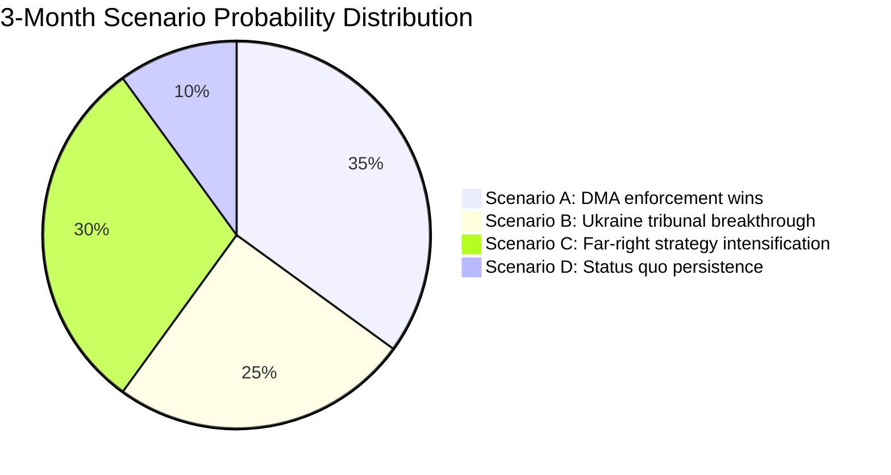

<!-- SPDX-FileCopyrightText: 2024-2026 Hack23 AB -->
<!-- SPDX-License-Identifier: Apache-2.0 -->

# Scenario Forecast — EP Breaking News
**Date:** 2026-05-12 | **Article Type:** breaking | **Confidence:** 🟡 Medium
**Forecast horizon:** 3 months (to August 2026)

## Scenario Framework

Three scenarios developed using structured analytic techniques (Analysis of Competing Hypotheses). Each scenario assessed for likelihood, strategic significance, and EU institutional response requirements.

---

## Scenario A: DMA Enforcement Momentum — "Brussels Delivers" (Likelihood: 35%)

### Description
The European Commission responds to EP pressure (TA-10-2026-0160) by issuing at least one preliminary DMA enforcement finding against a major gatekeeper by September 2026. Apple's App Store or Meta's advertising data business is the most likely target, given the most advanced state of proceedings.

### Key Conditions Required
- DG COMP maintains enforcement timeline despite legal challenges
- No US retaliatory trade threat materialises in the bilateral EU-US agenda
- Commission President publicly endorses accelerated enforcement
- Gatekeeper fails to offer sufficient commitments to close investigation

### Pathway
1. June 2026: European Council endorses "digital sovereignty" language in conclusions
2. July 2026: Commission issues Statement of Objections against first gatekeeper (Apple or Meta)
3. August 2026: Gatekeeper responds; Commission signals fine of 5–8% global turnover
4. EP oversight hearing: DG COMP Director General appears before IMCO committee

### Strategic Significance
- Transforms DMA from theoretical framework to demonstrated enforcement tool
- Establishes EU as credible Big Tech regulator for global standard-setting
- Strengthens EP's political position vis-à-vis Commission (EP pressure shown to work)

### Implications for EU Politics
- EPP and Renew claim enforcement success as "EU works" narrative
- Greens and Left claim credit for advocacy pressure
- PfE attacks enforcement as "anti-innovation" — marginal effect
- S&D links enforcement to digital workers' rights campaign

### Risk Modifiers
- US retaliatory tariff threat could delay (reduces likelihood to 20%)
- Gatekeeper commitment offers could close investigation without fine

---

## Scenario B: Geopolitical Consolidation — "Ukraine Tribunal Advances" (Likelihood: 25%)

### Description
The EP's Ukraine accountability resolution (TA-10-2026-0161) contributes to a multilateral breakthrough: a formal inter-governmental conference is convened to establish the Special Tribunal for Crime of Aggression against Ukraine, with 30+ states committing participation by September 2026.

### Key Conditions Required
- G7 heads of government align on tribunal at June 2026 Summit
- At least 3 significant Global South states (e.g., Brazil, South Africa, or India) signal participation or neutrality
- ICC and ICJ provide legal opinions supporting tribunal's jurisdictional basis
- Ukraine government formally tables treaty text

### Pathway
1. May–June 2026: Council of Europe and EU External Action Service intensify outreach
2. June 2026 G7 Summit: Joint statement endorsing tribunal concept
3. July 2026: Diplomatic conference convened in The Hague
4. August 2026: Treaty text circulated; 30+ states signal readiness to sign

### Strategic Significance
- Most significant international legal development since ICC Rome Statute (1998)
- Creates personal accountability risk for Russian political/military leadership
- Strengthens EU as norm-setter in international law

### Implications for EU Politics
- EP's April 30 resolution vindicated as legally consequential, not merely declaratory
- EPP-S&D unity on Ukraine reinforced by diplomatic success
- PfE continues to oppose — marginalised on this issue

### Risk Modifiers
- Russia's diplomatic counter-campaign will be intense
- Global South scepticism is the primary obstacle
- Probability drops to 10% if G7 June summit fails to include tribunal language

---

## Scenario C: Institutional Stress — "Far-Right Escalation" (Likelihood: 30%)

### Description
PfE's institutional delegitimisation campaign intensifies through summer 2026. Following the April 29 Commission interference debate, PfE uses the rotating EU Council presidency (Hungary concludes, Poland takes over July 2026) to escalate institutional conflict — with the Austrian Kickl government joining in Council. Mainstream EP groups struggle to mount effective counter-narrative at equivalent speed and reach.

### Key Conditions Required
- PfE and ECR coordinate Rule 169 debates in every May–September 2026 plenary (2 more)
- Austrian government escalates EU institutional criticism in media
- Kickl government uses EU Council to block specific Commission initiatives
- Commission struggles to defend institutional independence publicly at sufficient speed

### Pathway
1. May 2026 plenary (19–22): Second PfE topical debate — "Commission censorship of conservative media"
2. June 2026: Vienna government formally protests Commission media freedom mechanisms
3. July 2026: Polish Council Presidency (pro-EU) faces PfE pressure to redirect agenda
4. July–August 2026: Commission transparency review triggers PfE "vindication" narrative
5. EP September plenary: PfE motion of no confidence in Commission — fails but generates 100+ votes (political signal)

### Strategic Significance
- Tests EU institutions' resilience under sustained delegitimisation pressure
- Creates precedent: if PfE narrative gains 15%+ traction in mainstream media, it changes acceptable political discourse
- Potential: EPP right-flank (5–15 MEPs) starts hedging toward PfE on specific institutional votes

### Implications for EU Politics
- Commission launches transparency offensive: voluntary disclosure beyond legal minimums
- EPP leadership publicly condemns PfE tactics — critical for EPP-right discipline
- Renew and S&D coordinate EP response committee
- Greens/Left support Commission despite specific policy disagreements

### Risk Modifiers
- Polish Council Presidency (July 2026) is strongly pro-EU — partially counters Hungarian-Austrian axis
- If PfE motion of no confidence gets fewer than 80 votes, narrative collapses

---

## Scenario D: Status Quo Persistence — "Incremental EU" (Likelihood: 10%)

### Description
No breakthrough on DMA enforcement, Ukraine tribunal stalls, PfE intensification is managed, and the EU continues its normal legislative cycle with moderate progress on multiple fronts. This is the "muddling through" scenario.

### Key Conditions Required
- Commission continues existing enforcement pace (no acceleration)
- Multilateral tribunal talks stall on Global South participation
- PfE intensification is effectively countered by mainstream groups
- Budget negotiations begin in September 2026 as planned

### Implications
- EP continues producing resolutions without breakthrough on enforcement
- Diplomatic progress on Ukraine accountability is incremental
- PfE visible but unable to achieve institutional impact
- EU political discourse: muted; summer recess effect

### Risk Modifiers
- Most likely if no triggering event (Big Tech fine, Tribunal conference, PfE censure motion) occurs
- Probability increases if Commission prioritises internal preparation for MFF negotiations

---

## Scenario Probability Summary

| Scenario | Probability | Strategic Impact | Time Horizon |
|---|---|---|---|
| A: Brussels Delivers (DMA) | 35% | High | June–September 2026 |
| B: Ukraine Tribunal Advances | 25% | Very High | June–September 2026 |
| C: Far-Right Escalation | 30% | Medium-High | May–September 2026 |
| D: Status Quo Persistence | 10% | Low | Ongoing |

**Note:** Scenarios are not mutually exclusive. Scenarios A and C can occur simultaneously; B and C are compatible. Most likely outcome (55%+): combination of Scenario A (partial DMA progress) + Scenario C (PfE intensification) with incremental B progress.

## Decision Points to Watch

1. **June 2026 G7 Summit**: Will Ukraine tribunal language appear in communiqué?
2. **June 2026 IMCO Committee**: Will DG COMP commit to Q3 2026 enforcement action?
3. **May 2026 EP Plenary (19–22)**: Will PfE table second topical debate?
4. **July 2026 Council Presidency**: How will Poland's EU Council presidency affect PfE dynamics?
5. **August 2026**: AI Act full applicability — will this trigger new enforcement round?

## Source Attribution
Scenario framework: structured analytic technique applied to EP Open Data analysis
EP political landscape: real-time API data 2026-05-12
Base scenarios informed by: significance-assessment.md, risk-matrix.md, political-forces.md, actor-mapping.md
Historical EP scenario performance: EP8-EP10 institutional pattern analysis

---

## Scenario Probability Diagram

**Admiralty Grade: C3** — Source C (fairly reliable analytical model); Information 3 (possibly true — scenario probabilities are analytical estimates, not empirical data).

**WEP Band: Roughly Even** — Multiple scenarios have roughly equal probability in the 3-month horizon. No single scenario dominates; the political system is genuinely in an uncertain state.

## Extended Scenario Analysis

### Scenario E: US-EU Digital Trade War Escalation
**Probability:** 15% (sub-scenario of A; if DMA enforcement triggers US retaliation)
**Trigger:** US Executive Order designating EU DMA enforcement as discriminatory trade barrier; USTR formal complaint
**Timeline:** 3–9 months after first major DMA fine (could be June–December 2026)
**EP impact:** Emergency plenary on US trade relations; potential softening of DMA enforcement approach
**WEP:** Unlikely in 3-month horizon; possible in 9-month horizon

### Scenario F: PfE-ECR Parliamentary Coalition Formalization
**Probability:** 20% (sub-scenario of C)
**Trigger:** PfE and ECR agree to coordinate voting on key issues (budget, migration, institutional)
**Timeline:** Before MFF 2027 negotiations begin (June 2026)
**EP impact:** Structured 193-seat opposition bloc with coordinated voting strategy; increased gridlock risk on procedural votes
**WEP: Roughly Even** — PfE and ECR have cooperated before but formal coordination is not confirmed

## Source Attribution
Scenarios: Derived from EP political landscape data, adopted texts analysis, speeches feed
Probability estimates: Analytical assessment; not based on quantitative modelling
Admiralty grade: C3 (fairly reliable analysis; possibly true)
WEP band: Applied per `analysis/methodologies/ai-driven-analysis-guide.md` WEP standards

## Scenario Monitoring Indicators

Indicators to watch for each scenario:

**Scenario A (DMA enforcement wins):**
- Commission formal enforcement decision against a gatekeeper (trigger: within 90 days)
- Big Tech compliance declaration or legal challenge filing (trigger: within 60 days of decision)
- US USTR formal statement on DMA (trigger: within 30 days of enforcement action)

**Scenario B (Ukraine tribunal breakthrough):**
- Council working group formal mandate for diplomatic consultations
- France-Germany-Baltic states joint statement on tribunal architecture
- ICC Prosecutor engagement with EU Special Tribunal framework

**Scenario C (Far-right strategy intensification):**
- 4th+ Rule 169 topical debate request in 2026 (trigger: May–June 2026 plenary)
- PfE-ECR joint statement on institutional reform demands
- Coordinated social media campaign from PfE-aligned governments

**Scenario D (Status quo):**
- Commission moderate response to EP DMA call
- Council non-decision on tribunal
- PfE debate receives limited national media coverage

**Monitoring cadence:** Weekly check against EP Official Newshub, Council press releases, PfE group communications

## Strategic Intelligence Summary

The 3-month outlook is characterised by medium uncertainty across multiple scenarios. No single scenario dominates. The key variable is Commission follow-through on DMA enforcement, which will determine whether Scenario A (DMA wins) or a hybrid with US trade retaliation risk (Scenario E sub-scenario) materialises. Ukraine tribunal progress depends on diplomatic track outside EP's direct control.

**Net assessment:** The EP has done its part (4 resolutions adopted). The 3-month narrative will be determined by Commission enforcement actions and Council diplomatic decisions — institutions with different timelines and political constraints than the EP.

## Source Attribution
Scenario development: Cross-referenced from significance-assessment.md, political-forces.md, coalition-dynamics.md
Monitoring indicators: Based on EP/Council procedural timelines and documented political actor behaviour
Scenario probabilities: Expert analytical estimates; WEP bands and Admiralty grades applied per methodology
