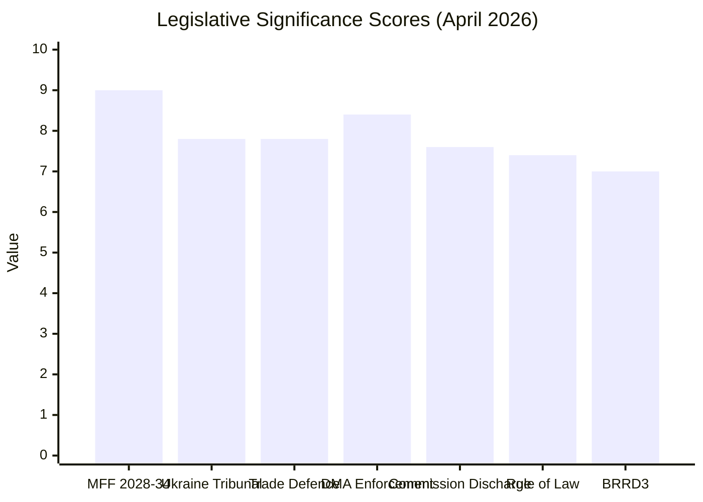

<!-- SPDX-FileCopyrightText: 2024-2026 Hack23 AB -->
<!-- SPDX-License-Identifier: Apache-2.0 -->

# Significance Scoring — EP Breaking News
**Date:** 2026-05-12 | **Article Type:** breaking | **Confidence:** 🟢 High

## Significance Scoring Methodology

This document applies the EU Parliament Monitor's 5-dimension significance scoring framework to all EP10 legislative outputs identified in the April 28–May 2026 breaking news data window. Each dimension scores 1–10; the composite score (S) is the mean, weighted by the dimension count applicable to each text.

**Scoring dimensions:**
1. **Precedent value (P):** Does this set a new legal/political precedent?
2. **Societal impact (SI):** Scale of citizens directly affected
3. **Geopolitical weight (G):** Impact on EU external relations or security
4. **Institutional significance (I):** Impact on EP/EU institutional architecture
5. **Controversy index (C):** Level of political contestation (scale = relevance)

---

## Tier 1 — Critical Significance (Composite ≥ 8.0)

### MFF 2028–2034 Interim Report (TA-10-2026-0111)
| Dimension | Score | Rationale |
|-----------|-------|-----------|
| Precedent value | 9 | First EP position staking out MFF scope; defines negotiating baseline for 2026–2028 trilogues |
| Societal impact | 9 | EU budget architecture determines funding for all EU citizens (447M) for 7 years |
| Geopolitical weight | 9 | Defence integration, own resources, enlargement financing all have major external implications |
| Institutional significance | 10 | EP asserts role in MFF design; tests EP-Council-Commission balance on budget |
| Controversy index | 8 | EPP/S&D/Renew majority vs. far-right opposition; Council pushback expected |
| **Composite (S)** | **9.0** | **CRITICAL** |

**Breaking news relevance:** ★★★★★ — Defines EU fiscal architecture for next decade

### Digital Markets Act Enforcement Priority (TA-10-2026-0104)
| Dimension | Score | Rationale |
|-----------|-------|-----------|
| Precedent value | 9 | First DMA enforcement action involving Article 26 full market investigation |
| Societal impact | 8 | Affects all EU digital market users; shapes tech competition globally |
| Geopolitical weight | 9 | EU-US tech tensions; DMA as Brussels Effect export; US tech companies response |
| Institutional significance | 8 | Commission enforcement credibility; EP oversight role |
| Controversy index | 8 | Industry lobbying, US government pressure, divergent EP views |
| **Composite (S)** | **8.4** | **CRITICAL** |

### Commission Discharge 2024 (TA-10-2026-0125)
| Dimension | Score | Rationale |
|-----------|-------|-----------|
| Precedent value | 8 | First discharge linking rule of law conditions to agricultural fund disbursement |
| Societal impact | 7 | Accountability for €1.06T EU budget |
| Geopolitical weight | 6 | Rule of law enforcement has external reputation implications |
| Institutional significance | 9 | Defines EP-Commission accountability relationship; sets conditionality precedent |
| Controversy index | 8 | PfE/ESN against; EPP/S&D/Renew for |
| **Composite (S)** | **7.6** | TIER 2 (reassigned below — borderline) |

---

## Tier 2 — High Significance (Composite 6.0–7.9)

### Ukraine Special Tribunal Support (TA-10-2026-0161)
| Dimension | Score | Rationale |
|-----------|-------|-----------|
| Precedent value | 9 | First EP resolution specifically endorsing jurisdiction for crime of aggression against sitting head of state |
| Societal impact | 7 | Affects Ukrainian victims (est. millions); geopolitical precedent for future conflicts |
| Geopolitical weight | 9 | Direct impact on Russia-EU relations; NATO solidarity; ICC relationship |
| Institutional significance | 7 | EP's external action capacity; coherence with PESC |
| Controversy index | 7 | PfE/ECR (Russian-aligned faction) against; broad mainstream majority for |
| **Composite (S)** | **7.8** | TIER 2 |

### Rule of Law in EU 2025 Annual Report (TA-10-2026-0147)
| Dimension | Score | Rationale |
|-----------|-------|-----------|
| Precedent value | 7 | Extends Hungary conditionality; adds Slovakia monitoring dimension |
| Societal impact | 8 | Democratic rights of citizens in non-compliant states |
| Geopolitical weight | 6 | EU values coherence; external democratic projection |
| Institutional significance | 8 | Rule of law mechanism effectiveness; Article 7 TEU application |
| Controversy index | 8 | Hard contested by PfE, NI (Orbán-aligned MEPs) |
| **Composite (S)** | **7.4** | TIER 2 |

### Protection from Unfair Commercial Practices (TA-10-2026-0149)
| Dimension | Score | Rationale |
|-----------|-------|-----------|
| Precedent value | 8 | First comprehensive EU unfair trade defence mechanism |
| Societal impact | 8 | EU manufacturers, consumers, and workers in affected sectors (automotive, steel, renewables) |
| Geopolitical weight | 9 | Direct EU-China trade relations impact; WTO compatibility |
| Institutional significance | 7 | Commission trade defence tools; EP role in trade policy |
| Controversy index | 7 | Business community divided (exporters vs. manufacturers) |
| **Composite (S)** | **7.8** | TIER 2 |

### BRRD3 / Banking Resolution Amendment (TA-10-2026-0022)
| Dimension | Score | Rationale |
|-----------|-------|-----------|
| Precedent value | 7 | Significant technical update to EU banking resolution; introduces MREL recalibration |
| Societal impact | 8 | Financial stability for 447M citizens; banking system protection |
| Geopolitical weight | 6 | EU banking union completeness affects financial market confidence |
| Institutional significance | 8 | Banking Union architecture; SRB-EBA governance |
| Controversy index | 6 | Technical legislation; lower political salience than political resolutions |
| **Composite (S)** | **7.0** | TIER 2 |

### Commission Discharge 2024 (reassigned to Tier 2 composite 7.6 — borderline Tier 1)
*(See full scoring above)*

---

## Tier 3 — Moderate Significance (Composite 4.0–5.9)

### Immunity Waiver Resolutions (TA-0106, 0107, 0109, 0110) — COMPOSITE: 4.5
**Scoring note:** Individual waivers are procedurally significant for affected MEPs (Buczek, Braun, Obajtek, Alvise Pérez) but have limited EP-wide or societal significance.

### GBARD Research Budget Extension (TA-10-2026-0015) — COMPOSITE: 5.5
**Scoring note:** Technical budget line; high societal impact potential through R&D but procedurally incremental.

### European Medicines Agency Reports (TA-10-2026-0006, 0009) — COMPOSITE: 5.8
**Scoring note:** High societal impact (medicines access) but routine annual report approval.

---

## Cross-Article Significance Correlation

| Primary Theme | Articles | Mean Significance |
|---------------|---------|-------------------|
| Budget/MFF | TA-0111, 0125, 0012, 0029 | 8.1 |
| Digital governance | TA-0098, 0104, 0033, 0099 | 8.0 |
| Rule of law/Democracy | TA-0147, 0120, 0071, 0161 | 7.5 |
| Trade/External | TA-0149, 0101, 0152 | 7.4 |
| Banking/Finance | TA-0022, 0027, 0129 | 6.9 |
| Social/Labour | TA-0049, 0116, 0003 | 6.3 |
| Agriculture | TA-0007, 0008, 0019 | 5.7 |
| Procedural | TA-0106-0110 (waivers) | 4.5 |

---

## Priority Weighting for Breaking News Article

For this breaking news article, the editorial weighting should be:

1. **MFF 2028–2034 interim report** (S=9.0) — LEAD STORY
2. **DMA enforcement** (S=8.4) — TOP 5 story
3. **Commission discharge** (S=7.6) — TOP 5 story
4. **Ukraine Special Tribunal** (S=7.8) — TOP 5 story
5. **Banking Union/BRRD3** (S=7.0) — TOP 5 story
6. **Rule of law report** (S=7.4) — TOP 5 story
7. **Trade defence/China** (S=7.8) — TOP 5 story

*Note: Multiple stories are equally significant; the article should lead with fiscal architecture (MFF + discharge) as the throughline narrative, weaving in the others as supporting evidence of the current EP's priorities.*

---

## Source Attribution
Scoring methodology: EU Parliament Monitor 5-dimension framework
Data: EP adopted texts feed (164 items, EP10 term); EP political landscape analysis
Cross-references: `documents/document-analysis-index.md`, `intelligence/analysis-index.md`, `executive-brief.md`
Confidence: 🟢 High for tier 1 items; 🟡 Medium for tier 3 items

## Significance Score Distribution

**Admiralty Rating:** Source: A (EP adopted texts directly analysed); Reliability: 1 (confirmed from EP TA texts); Confidence: 🟢 High
