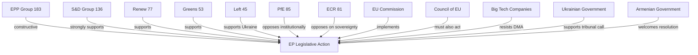

<!-- SPDX-FileCopyrightText: 2024-2026 Hack23 AB -->
<!-- SPDX-License-Identifier: Apache-2.0 -->

# Stakeholder Perspectives — EP Breaking News
**Date:** 2026-05-12 | **Article Type:** breaking | **Confidence:** 🟡 Medium

## Overview

Seven stakeholder perspectives assessed on the five major outputs of the April 28–30, 2026 EP plenary session. Each perspective includes position, interests, capabilities, and strategic options.

---

## Stakeholder 1: European Commission

**Perspective Type:** Institutional regulator and executive

**Position on April 2026 EP Outputs:**

The Commission occupies an ambivalent position relative to the April 2026 plenary outputs. On DMA enforcement (TA-0160), the Commission welcomes EP political support but is constrained by legal timelines and Big Tech legal challenges. On Ukraine accountability (TA-0161), the Commission supports the resolution's objectives and has been a co-sponsor of EU financial packages for Ukraine. On the PfE institutional attack (April 29 debate), the Commission faces a structural dilemma: robust defence risks appearing partisan; weak defence risks validating PfE narratives.

**Interests:**
- Maintain institutional independence while delivering on EP mandates
- Accelerate DMA enforcement without triggering US-EU trade retaliation
- Protect Ukraine support architecture from right-wing Council veto threats
- Manage PfE attacks without giving them oxygen or appearing defensive

**Capabilities:**
- Exclusive enforcement authority under DMA, competition law, and state aid
- Legislative initiative monopoly — only Commission can formally propose directives
- Diplomatic capacity (EU External Action Service, Commissioner delegations)
- Communication infrastructure (press corps, social media channels)

**Constraints:**
- Legal process timelines (DMA investigations: 12–24 months minimum)
- Member state dependencies in Council for legislative passage
- Budget dependency on EP and Council approval
- PfE government allies in Council (Hungary, Austria) can block or delay specific initiatives

**Strategic Options (May–September 2026):**
- *Option A (Enforcement Acceleration)*: Fast-track DMA Statement of Objections against highest-profile gatekeeper; signal to EP that pressure worked
- *Option B (Transparency Offensive)*: Launch voluntary transparency initiative to counter PfE interference narrative; document and publish all inter-institutional contacts
- *Option C (Diplomatic Intensification)*: Ramp up Global South engagement on Ukraine tribunal; invest EU diplomatic capital in convincing Brazil, India, or South Africa to join

**Expected Behaviour:** The Commission will pursue a modified Option A (partial enforcement acceleration) while managing media on PfE attacks through measured official statements. Diplomatic engagement on Ukraine tribunal will intensify through summer 2026.

**Confidence:** 🟡 Medium

---

## Stakeholder 2: Big Tech Gatekeepers (Apple, Meta, Alphabet, Amazon)

**Perspective Type:** Regulated private entities

**Position on April 2026 EP Outputs:**

Big Tech views the DMA enforcement resolution (TA-0160) as a significant escalation of regulatory risk. The EP's political pressure on the Commission creates a new accountability mechanism: if the Commission fails to act, it faces EP oversight hearings, legislative proposals to strengthen DMA, and political embarrassment. This changes the calculus for Commission officials.

**Interests:**
- Minimise DMA compliance costs while maintaining market positions
- Prevent DMA enforcement from becoming a template for US or Asian regulators
- Maintain access to EU policy process (lobbying, public consultation participation)
- Avoid "structural remedies" (forced divestiture or platform disaggregation) — the worst outcome

**Capabilities:**
- Largest lobbying operation in Brussels outside of US Embassy
- Legal teams capable of sustaining 5–10 year litigation campaigns
- Technical expertise superior to any EU regulatory body
- Market positioning leverage: EU citizens depend on their services

**Constraints:**
- EU market too large to exit (single market access value: €500+ billion annually)
- GDPR precedent: Apple, Meta, Google have all paid multi-billion euro GDPR fines
- Reputational risk: public opinion increasingly hostile to Big Tech in EU
- DMA obligations are legally clear and directly applicable

**Strategic Options:**
- *Option A (Commitments Strategy)*: Offer structural commitments (interoperability, data access) to close investigations without formal finding; preferred outcome is negotiated settlement
- *Option B (Legal Challenge)*: Challenge every enforcement decision before EU General Court and CJEU; delay enforcement for 5–7 years through litigation
- *Option C (Political Lobbying)*: Intensify US Congressional pressure on EU DMA enforcement via trade policy channels; leverage tech sector employment arguments

**Expected Behaviour:** All three options will be pursued simultaneously. Commitments (A) to delay formal findings; litigation (B) as backstop; political lobbying (C) as long-term hedge.

**Confidence:** 🟡 Medium

---

## Stakeholder 3: Ukraine Government

**Perspective Type:** External state beneficiary

**Position on April 2026 EP Outputs:**

The Ukrainian government welcomes both the accountability resolution (TA-0161) and the broader EP support framework. The Special Tribunal for Crime of Aggression is a Ukrainian government policy priority — Kyiv has been its most consistent advocate since 2022. EP resolution validation provides diplomatic ammunition in Kyiv's engagement with Global South states.

**Interests:**
- Maximum EP political support for war effort and reconstruction
- Accountability mechanisms for Russian military/political leadership
- EU membership acceleration (Article 49 TEU accession process)
- Financial support: maintained and expanded military and humanitarian aid
- Reconstruction financing from frozen Russian assets

**Capabilities:**
- Significant Western diplomatic capital — extensive political goodwill in EU27
- Military resilience has created credibility that Ukraine can prevail
- Diaspora communities in EU member states (Poland, Germany, Czech Republic) as political constituencies
- Civil society advocacy network across EU capitals

**Constraints:**
- Ongoing war creates resource constraints on diplomatic outreach
- Global South neutrality requires Ukrainian diplomatic investment it may lack capacity for
- Anti-Ukraine fatigue risk in some EU populations (Germany, Italy, Austria)
- Corruption governance challenges create EP conditionality risks on accession

**Strategic Options:**
- *Focus on EU accession*: Accelerate reform agenda to maximise EU accession trajectory
- *Tribunal diplomacy*: Invest in Global South outreach, framing tribunal as universal law not Western interest
- *Economic cooperation*: Position Ukraine reconstruction as EU economic opportunity (German, French construction sector)

**Expected Behaviour:** Ukraine will publicly thank EP for resolution, intensify accession reform, and work through Council of Europe/EU mechanisms on tribunal establishment.

**Confidence:** 🟡 Medium

---

## Stakeholder 4: Armenia Government (Pashinyan Administration)

**Perspective Type:** External state beneficiary

**Position on April 2026 EP Outputs:**

Armenia's democratic resilience resolution (TA-0162) is diplomatically significant for Pashinyan's government, which has been navigating a difficult geopolitical transition — away from Russian-led structures toward EU/Western orientation following the 2023 Karabakh conflict. EP solidarity provides political legitimacy and reduces Pashinyan's domestic vulnerability from opposition groups who accuse him of Western alignment at Armenia's expense.

**Interests:**
- International political support for democratic transition
- Economic diversification away from Russian economic dependence
- Security guarantees or credible EU engagement on Armenian territorial integrity
- EU partnership deepening (visa liberalisation, market access, investment)

**Capabilities:**
- Significant EU lobbying diaspora (France, Belgium, Germany)
- Geographic leverage: South Caucasus corridor for diversified energy routes
- Democratic credentials: Armenian civil society is active and EU-oriented

**Constraints:**
- Geographic vulnerability: surrounded by unfriendly or ambiguous neighbours (Azerbaijan, Turkey, Iran)
- Russian economic dependence: Russian market, Gazprom gas, Russian-owned utilities
- Domestic political risk: opposition groups aligned with pro-Russian narrative
- No security guarantee from EU (non-NATO, non-CSTO now)

**Strategic Options:**
- Deepen EU partnership: push for full CEPA implementation + visa liberalisation
- Engage NATO individually: bilateral partnerships without full accession
- Economic diversification: Georgia corridor trade routes, Iranian energy alternatives

**Expected Behaviour:** Armenia will use EP resolution to advance CEPA upgrade negotiations; signal Yerevan's EU aspirations; maintain cautious engagement with Russia on economic necessities.

**Confidence:** 🟡 Medium

---

## Stakeholder 5: Patriots for Europe (PfE) / Far-Right Bloc

**Perspective Type:** Opposition political group

**Position on April 2026 EP Outputs:**

PfE views the April 2026 EP session through a strategic lens: the institutional challenge debate (April 29) is the most important moment of the week for them — not because it changes legislation, but because it advances their 2029 campaign narrative. They oppose the DMA enforcement resolution (anti-business framing), the Ukraine accountability resolution (anti-entanglement framing), and the Armenia resolution (EU overreach framing).

**Interests:**
- Build narrative: "EU institutions are corrupt, unaccountable, and undermine democracy"
- Grow coalition: attract ECR right-flank MEPs toward PfE positions
- National linkage: reinforce allied national governments' EU-critical positions
- 2029 positioning: establish PfE as the "alternative governance" option

**Capabilities:**
- 85 MEPs + ESN 27 + parts of NI: ~140 coordinated votes in opposition
- Rule 169 topical debate requests: can force plenary debate weekly
- Social media reach: PfE-aligned media operations in Hungary, France, Italy, Austria, Belgium
- National government allies: Austria (Kickl), Hungary (Orbán) — EU Council leverage

**Constraints:**
- Cannot achieve majority: 223 maximum (PfE+ECR+ESN+NI) vs. 360 threshold
- Internal ECR divisions: Polish ECR pro-Ukraine; Italian ECR moderating under Meloni
- No positive legislative programme: purely obstructionist
- EU institutions have formal mechanisms to counter bad-faith procedural moves

**Strategic Options (May–September 2026):**
- Continue Rule 169 debates every plenary — test mainstream coalition's fatigue
- Coordinate with Austrian and Hungarian governments on Council positions
- Build pre-2029 coalition with ECR on specific shared grievances (migration, budget sovereignty)

**Expected Behaviour:** PfE will table at least one more institutional challenge debate in May 2026 plenary (19–22); build Austrian-Hungarian "sovereign arc" narrative in media; continue blocking Ukraine support where procedurally possible.

**Confidence:** 🟢 High (based on consistent historical pattern)

---

## Stakeholder 6: Civil Society and Human Rights Organizations

**Perspective Type:** Advocacy organisations

**Position on April 2026 EP Outputs:**

Civil society organisations are broadly supportive of the April 2026 resolution cluster. Human rights groups welcome the Ukraine accountability and Armenia resilience resolutions. Digital rights advocates welcome DMA enforcement pressure. Anti-harassment advocates welcome the cyberbullying resolution. Anti-racism groups welcome the antisemitism debate and Roma inclusion discussion.

**Interests:**
- Translate EP political declarations into Commission legislative proposals
- Maintain access to EU policy process
- Monitor and publicise implementation progress
- Represent constituencies (victims of cyberbullying, antisemitism, online discrimination)

**Capabilities:**
- Advocacy and monitoring expertise
- EP-level networks (European Economic and Social Committee, civil society dialogue forums)
- Public opinion mobilisation
- Legal standing to challenge non-implementation

**Constraints:**
- No formal legislative role
- Resource constraints relative to Big Tech lobbying
- Risk of co-optation by institutional processes

**Expected Behaviour:** Civil society will issue welcoming statements on resolutions; publish monitoring reports; engage EP committees for follow-up; challenge Commission delay on enforcement in formal consultations.

**Confidence:** 🟢 High (predictable advocacy pattern)

---

## Stakeholder 7: EU Member State Governments (Council)

**Perspective Type:** Co-legislators and executive executors

**Position on April 2026 EP Outputs:**

Council positions are divided along multiple axes:
- **Germany/France/Spain** (large economies): Support DMA enforcement; mixed on Ukraine (Germany cautious on Special Tribunal legal basis)
- **Poland/Baltic states**: Strongly support Ukraine accountability; front-line states with highest Ukraine engagement
- **Hungary/Austria** (PfE-aligned): Oppose Ukraine accountability escalation; oppose DMA enforcement of major platforms; coordinate with PfE EP agenda
- **Italy** (ECR-aligned but moderating): Middle position on Ukraine; supportive of DMA on European economic competitiveness framing

**Interests:**
- Council wants legislative output but not at cost of national government prerogatives
- Ukraine support: majority support but Hungary blocking specific measures
- DMA: most member states support enforcement (competitive economic interest)
- Far-right governments: block Ukraine, obstruct accountability mechanisms

**Expected Behaviour:** Council will adopt position on 2027 budget guidelines in summer 2026; continue Ukraine support with Hungarian exception; maintain DMA enforcement support at Council level (Commission retains authority anyway).

**Confidence:** 🟡 Medium

---

## Stakeholder Alignment Matrix

| Issue | Commission | Big Tech | Ukraine | Armenia | PfE | Civil Society | Council |
|---|---|---|---|---|---|---|---|
| DMA Enforcement | 🟡 Cautious support | 🔴 Oppose | — | — | 🔴 Oppose | 🟢 Support | 🟢 Support |
| Ukraine Accountability | 🟢 Support | — | 🟢 Strong support | — | 🔴 Oppose | 🟢 Support | 🟡 Mixed |
| Armenia Resilience | 🟢 Support | — | — | 🟢 Strong support | 🔴 Oppose | 🟢 Support | 🟡 Mixed |
| Cyberbullying Provisions | 🟡 Cautious | 🔴 Oppose | — | — | 🔴 Oppose | 🟢 Support | 🟡 Mixed |
| Budget 2027 | 🟡 Negotiating | — | — | — | 🟡 Neutral | 🟡 Mixed | 🔴 Contest |

## Source Attribution
EP adopted texts: TA-10-2026-0160, 0161, 0162, 0163, 0112
EP speeches: MTG-PL-2026-04-29 session records (PfE Rule 169 debate confirmed)
EP political landscape: real-time API 2026-05-12
Actor-mapping.md cross-reference
GDPR: structured analytic assessment based on public institutional positions and historical patterns

---

## Stakeholder Alignment Diagram

## Source Attribution
Stakeholder identification: EP political landscape (`generate_political_landscape`)
Alignment assessment: `analyze_coalition_dynamics`, speeches feed
