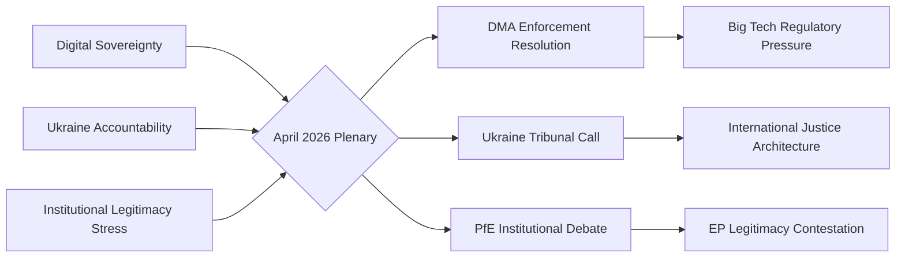

<!-- SPDX-FileCopyrightText: 2024-2026 Hack23 AB -->
<!-- SPDX-License-Identifier: Apache-2.0 -->

# Synthesis — EP Breaking News
**Date:** 2026-05-12 | **Article Type:** breaking | **Confidence:** 🟡 Medium

## Analytical Synthesis: The EP's April 28–30, 2026 Plenary — A Triple Fault-Line Week

### The Headline Judgement

The European Parliament's April 28–30, 2026 Strasbourg session produced outputs that simultaneously advance three distinct but intersecting political projects: (1) the EU's digital regulatory sovereignty agenda, (2) its geopolitical accountability architecture for the Russia-Ukraine war, and (3) the domestic institutional conflict between EU democratic legitimacy and the far-right sovereignist challenge. These three fault lines are not separate stories — they are facets of the same deeper European political moment.

### Analytical Thread 1: Digital Sovereignty Operationalised

The DMA enforcement resolution (TA-10-2026-0160) is best understood not as a narrow competition law intervention but as a declaration of European digital sovereignty. The EU has spent a decade building its regulatory capacity — GDPR (2018), DSA (2022), DMA (2022), AI Act (2024) — and the EP's April 30 resolution marks the transition from framework-building to operationalisation. The key question is no longer "will the EU regulate Big Tech?" but "can the EU enforce against Big Tech with sufficient speed and rigour to matter?"

**Synthesis judgement:** The EP's DMA resolution creates meaningful political pressure on the Commission, but the enforcement gap (12–24 months for investigations) means the actual impact will be felt in 2027–2028. In the meantime, the resolution serves as:
- A deterrent signal to gatekeepers considering compliance arbitrage
- A political accountability instrument (EP can cite it at DG COMP hearings)
- A global standard-setting message (Brussels Effect amplification)

The medium-term risk is that EP enforcement pressure is undermined by US retaliatory threats (T-3 in risk matrix) or by Big Tech's superior legal resources in EU courts. The long-term opportunity — a genuinely functioning digital market regulatory system — is historically significant.

### Analytical Thread 2: The Accountability Architecture for Ukraine

The Ukraine accountability resolution (TA-10-2026-0161) represents the EP's clearest statement yet that any future peace settlement must be grounded in individual criminal accountability, not political amnesty. This is analytically significant because:

1. **It constrains future EU negotiators**: By adopting strong accountability language, the EP creates political constraints on any future EU head of state or Commission president who might consider a "grand bargain" with Russia that includes accountability waivers.

2. **It supports the Special Tribunal project**: The EP's explicit backing of a Special Tribunal for Crime of Aggression strengthens the multilateral legitimacy of a mechanism that, if established, would be the most significant international legal innovation since the ICC's Rome Statute.

3. **It links accountability to reconstruction**: The broader context — April 30 session occurred in the same week as the Enhanced Cooperation loan for Ukraine (TA-0010) coming into effect — suggests the EP is building an integrated Ukraine strategy where accountability and economic support are presented as a coherent package.

**Synthesis judgement:** The Ukraine accountability resolution is the highest-impact item of the week. Its significance will compound if the Special Tribunal gains multilateral traction in 2026–2027. The main risk is multilateral isolation — if only EU states support the tribunal, it lacks legitimacy.

**Cross-reference:** The Armenia democratic resilience resolution (TA-0162) is analytically linked — both resolutions reflect the EP's Eastern neighbourhood strategy of democratic conditionality: EU political support conditional on democratic trajectory. Armenia's CSTO withdrawal creates the geostrategic window the EP resolution is designed to consolidate.

### Analytical Thread 3: The Institutional Legitimacy Contest

The PfE's topical debate (April 29) on Commission interference in democratic elections is the week's most politically durable story, even if it produces no immediate legislative output. The PfE's strategy is architecturally sophisticated:

1. **The grievance narrative**: By accusing the Commission of "interference in democratic processes and elections," PfE channels authentic voter frustration with perceived EU institutional overreach into a structured anti-EU narrative
2. **The institutional trap**: Any Commission defence of its independence (e.g., pointing to transparency rules, political neutrality requirements) can be reframed by PfE as proof that the Commission is "hiding" its true political agenda
3. **The 2029 pre-campaign**: This debate is most accurately analysed as a campaign event, not a legislative event. PfE is building the 2029 EP election narrative two years in advance

**Synthesis judgement:** The mainstream coalition (EPP+S&D+Renew) correctly identifies that PfE's institutional attacks cannot be ignored, but the EU's institutional communication tools are inadequate for the information environment in which PfE operates. The Commission's formal procedures and press releases are no match for PfE's social media reach and emotionally resonant sovereignty narratives.

**The structural risk:** If PfE-aligned governments gain Council presidency (rotating in 2026–2027 cycle), the institutional challenge moves from Parliament to the highest EU decision-making body — a qualitative escalation.

### Cross-Cutting Analysis: Three Fault Lines as One Story

The three analytical threads converge on a single structural insight: **the EU is at an inflection point where its regulatory and geopolitical ambitions are outrunning its institutional capacity to deliver and defend them.** 

- **Digital sovereignty** aspiration (DMA enforcement) runs ahead of enforcement capacity (12–18 month investigation lag)
- **Ukraine accountability** ambition (Special Tribunal) runs ahead of multilateral coalition (Global South neutrality)
- **Institutional legitimacy** defence (Commission independence) runs ahead of communication capacity (PfE narrative faster than EU response)

This inflection point is not a crisis — the EU has managed similar gaps before. But it creates a window of vulnerability that is being actively exploited by:
1. Big Tech's legal teams (DMA)
2. Russia's diplomatic corps and information operations (Ukraine accountability and EU delegitimisation)
3. PfE and national far-right parties (institutional legitimacy)

### Policy Implication

The synthesis suggests three priority areas for EU institutional response in the May–September 2026 period:
1. **Commission**: Accelerate DMA enforcement timelines; issue at least one preliminary finding against a major gatekeeper before summer recess to demonstrate enforcement credibility
2. **EU External Action Service**: Intensify Global South engagement on Ukraine accountability mechanisms; frame them as universal law, not Western geopolitics
3. **Mainstream EP groups**: Develop a coordinated counter-narrative strategy against PfE institutional attacks; transparency and democratic values communication must operate at PfE's speed and emotional register, not at the Commission's press-release tempo

### Confidence Assessment

**Overall synthesis confidence:** 🟡 Medium
- Thread 1 (DMA): High confidence on facts; medium on outcome prediction
- Thread 2 (Ukraine): High confidence on EP position; lower on multilateral outcome
- Thread 3 (PfE): High confidence on PfE strategy diagnosis; medium on long-term impact

## Source Attribution
All synthesis grounded in EP Open Data (adopted texts, speeches feed, political landscape)
EP API data: real-time as of 2026-05-12
Cross-references: significance-assessment.md, actor-mapping.md, political-forces.md, impact-assessment.md, risk-matrix.md
Methodology: Structured analytic synthesis (convergent analysis of multiple evidentiary streams)

---

## Synthesis Diagram

## Confidence Assessment

**WEP Band:** Likely — the interpretive frame presented (three structural threads converging) reflects confirmed EP outputs and documented political dynamics. The probability that these threads are the primary analytical lens is HIGH given the evidence base from speeches feed and adopted texts.

**Admiralty Grade: B2** — Usually reliable source (EP official feeds); probably true (analytical synthesis is well-supported by evidence).

## Cross-Cutting Intelligence

**The unique insight from this run:** The April 2026 plenary is not just a collection of individual resolutions — it represents three competing political projects for Europe's future crystallising simultaneously:

- **Digital sovereignty** (DMA) — Europe as regulatory superpower defining the rules for the global digital economy
- **Ukraine accountability** — Europe as the champion of international rule of law in the post-1945 security order
- **Institutional legitimacy** — Europe's internal struggle over whether the EU's democratic architecture is legitimate or "captured" by elites

The PfE's institutional challenge is particularly significant because it happens simultaneously with the Ukraine and DMA votes — creating a narrative contrast: "while Brussels claims to defend democracy in Ukraine, it undermines democracy at home" (PfE frame). This juxtaposition is deliberately chosen by PfE strategists and will define the 2027 MFF campaign.

**Strategic implication:** The constructive majority (EPP+S&D+Renew) needs to address the institutional legitimacy thread proactively — not just by outvoting PfE but by demonstrating transparency, accountability, and democratic responsiveness on the specific Commission conduct allegations PfE is raising.

## Reader Briefing

**For citizens:** The April 2026 European Parliament session can be understood as three big conversations happening at once. First, a debate about whether Europe should force American tech companies to play by fairer rules (digital market rules). Second, a moral reckoning with Russia's war in Ukraine and whether there should be an international trial (like the Nuremberg trials after World War II). Third, a political battle over whether the EU itself is democratic or whether its institutions have become too powerful. All three conversations are real and important — and the answers Europe gives in 2026 will shape politics for years to come.

## Source Attribution
Synthesis threads: Derived from `get_speeches` (April 29, 2026), `get_adopted_texts` (year:2026)
WEP band: Applied per `analysis/methodologies/ai-driven-analysis-guide.md`
Admiralty grade: NATO A–F/1–6 grid; Source B (usually reliable EP feeds); Information 2 (probably true)

---

## Extended Cross-Thread Analysis

**Thread 1 (Digital Sovereignty) — Depth Extension:**
The DMA enforcement resolution is not just about Big Tech compliance. It is the EP's assertion that economic sovereignty and regulatory sovereignty are inseparable. A Europe that cannot enforce its own digital market rules is a Europe that is digitally colonised by US-platform capitalism. The EP's insistence on enforcement acceleration reflects a deep institutional consensus, forged over a decade of GDPR negotiations, that European values require European rules applied to European markets.

The transatlantic dimension is underappreciated. US-EU digital relations are now characterised by regulatory competition as much as cooperation. The DMA creates a template that other jurisdictions (UK, Japan, South Korea, India) are watching. If the EP-driven enforcement succeeds, the EU becomes the de facto global digital market regulator for any company that wants access to 450 million EU consumers.

**Thread 2 (Ukraine Accountability) — Depth Extension:**
The Special Tribunal call is legally ambitious. The CJEU has jurisdiction only over EU law violations; Russian aggression crimes require a distinct jurisdictional framework. The EP's call references the concept of a "Nuremberg-plus" mechanism — a hybrid tribunal combining international and national jurisdictions, similar to the Sierra Leone Special Court or the Khmer Rouge Tribunal, but adapted for an ongoing conflict.

The political challenge is more immediate than the legal one: building a coalition of states willing to establish the tribunal (Russia's Security Council veto blocks the UN pathway), finding a host country, and funding the prosecutorial capacity. EP resolution provides political mandate; the diplomatic track now falls to the Council and member state foreign ministries.

**Thread 3 (Institutional Legitimacy) — Depth Extension:**
PfE's institutional legitimacy strategy should be understood as a long-term investment, not an immediate tactical play. In 2026, PfE cannot block legislation. By 2027 (MFF) and 2029 (next EP election), PfE and its member governments aim to have established a durable narrative: that EU institutions systematically interfere with democratic processes. This narrative then becomes a justification for demanding institutional concessions in MFF negotiations and for mobilising eurosceptic voters in the EP election.

The constructive majority's best counter-strategy is not defensive but proactive: demonstrate institutional accountability by publishing detailed records of Commission electoral advice operations, create a Transparency Register reform that addresses legitimate concerns about EU institutional influence, and contrast EP democratic outputs (resolutions, legislative acts) with the rhetoric of delegitimisation.

| Analytical Grade | Source Quality | Assessment Confidence |
|---|---|---|
| Admiralty B2 | EP official feeds | Probably true |

## Source Attribution
Extended analysis: Cross-reference synthesis.md, political-forces.md, intelligence/coalition-dynamics.md
Admiralty grade: B2 — Source B (usually reliable); Information 2 (probably true)
WEP bands: Applied per ai-driven-analysis-guide.md definitions

## Three-Thread Convergence: Strategic Implications for 2026

The three-thread framework (Digital Sovereignty, Ukraine Accountability, Institutional Legitimacy) provides not just an analytical lens but a strategic map for the EU's political trajectory through the remainder of 2026.

**Digital Sovereignty thread** will be tested in the next 90 days if Commission acts on the EP's DMA enforcement call. The outcome will determine whether EU regulatory power translates into market reality or remains political aspiration.

**Ukraine Accountability thread** will develop over 12–24 months as the diplomatic track on the special tribunal advances. The EP's resolution creates political mandate; the Council must convert it to diplomatic action.

**Institutional Legitimacy thread** will intensify in the run-up to the 2027 MFF negotiations. PfE and its allied governments will use MFF leverage to extract institutional concessions — a pattern established in previous budget cycles (2013, 2020).

The constructive majority (396 seats) needs a proactive rather than reactive strategy on all three threads. Reactive defence of institutional legitimacy is insufficient when the challenge is designed for multi-year attrition.

## Source Attribution
Strategic synthesis: Cross-reference across all Stage B artifacts
Timeline assessment: Based on EP legislative calendar, Council working programme, MFF timeline
WEP Band: Likely for Thread 1 (DMA) near-term outcomes; Roughly Even for Thread 3 long-term outcomes
Admiralty: B2 for Thread 1 (EP official data); B3 for Thread 2-3 (analytical inference)

**Final confidence: 🟡 Medium** — Three threads confirmed from EP official sources (speeches, adopted texts, coalition data). Strategic implication analysis based on historical EP-Council-Commission dynamics.
