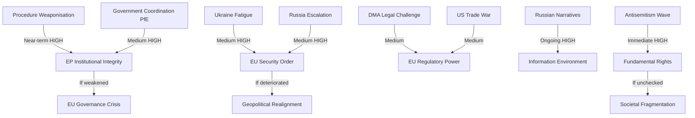

<!-- SPDX-FileCopyrightText: 2024-2026 Hack23 AB -->
<!-- SPDX-License-Identifier: Apache-2.0 -->

# Threat Assessment — EP Breaking News
**Date:** 2026-05-12 | **Article Type:** breaking | **Confidence:** 🟡 Medium

## Threat Overview

Five threat categories assessed: Institutional, Geopolitical, Regulatory, Information Environment, and Societal. Each threat assessed for proximity (near/medium/far), magnitude (1–5), and EU institutional resilience.

---

## Threat Category 1: Institutional Integrity Threats

### IT-01: Parliamentary Procedure Weaponisation (Near-term, HIGH)
**Description:** PfE's systematic use of Rule 169 topical debate requests to force institutional legitimacy debates is an escalating threat to productive parliamentary governance. If PfE and ECR coordinate to request topical debates at every 2026 plenary (8 sessions remaining), they can consume approximately 20% of plenary floor time with delegitimisation debates.

**Magnitude:** 4/5
**Proximity:** Immediate (next plenary: May 19–22, 2026)
**EU Resilience:** 🟡 Moderate — EP has procedural tools (time limits, speaker lists) but no mechanism to prevent Rule 169 requests that meet formal criteria
**Trend:** ↑ Escalating

### IT-02: PfE-Aligned Government Coordination (Medium-term, HIGH)
**Description:** The coordination between PfE parliamentary group and PfE-aligned governments (Austria's Kickl government, Hungary's Orbán government) creates a multi-level institutional threat: parliamentary obstruction + Council blocking + national government attacks on EU institutions.

**Magnitude:** 4/5
**Proximity:** Medium (manifesting over 6–12 months)
**EU Resilience:** 🟡 Moderate — Article 7 TEU (rule of law mechanism) provides deterrent; Council qualified majority voting limits individual state blocking power on most issues
**Trend:** ↑ Growing coordination

### IT-03: Immunity System Abuse (Near-term, MEDIUM)
**Description:** The immunity waivers for Grzegorz Braun (March 2026) and Patryk Jaki (April 2026) raise the question of whether the parliamentary immunity system is being used to shield MEPs from accountability. This threatens both EP institutional integrity and the rule of law framework.

**Magnitude:** 3/5
**Proximity:** Immediate
**EU Resilience:** 🟢 Good — EP JURI committee processes immunity waivers transparently; 2 waivers granted in 2026 shows system functioning
**Trend:** → Stable (system is working)

---

## Threat Category 2: Geopolitical Threats

### GT-01: Ukraine Fatigue and Backsliding (Medium-term, HIGH)
**Description:** While EP support for Ukraine remains strong (500+ votes on most Ukraine resolutions), there is risk that sustained war (now in 4th year as of May 2026), European economic pressures, and far-right narrative amplification gradually erode public and political support. Historical precedent: post-Cold War settlement fatigue.

**Magnitude:** 4/5
**Proximity:** Medium (6–18 months)
**EU Resilience:** 🟡 Moderate — institutional commitments (Ukraine Facility, military support frameworks) have multi-year architecture; harder to reverse than political declarations
**Trend:** → Stable but at risk if war drags beyond 2027

### GT-02: Russia Escalation in EU Neighbourhood (Medium-term, HIGH)
**Description:** Russia may perceive EP's Ukraine accountability resolution as a legitimacy threat requiring calibrated response — increased hybrid warfare operations in EU states, energy supply disruptions, or Baltic/Scandinavian provocations.

**Magnitude:** 4/5
**Proximity:** Medium
**EU Resilience:** 🟡 Moderate — EU-NATO coordination has improved; Article 5 NATO deterrence is credible; hybrid warfare resilience building is ongoing
**Trend:** ↑ Slight increase in hybrid threat environment

### GT-03: Azerbaijan Backlash to Armenia Resolution (Near-term, MEDIUM)
**Description:** Azerbaijan may respond to EP's Armenia democratic resilience resolution with diplomatic pressure on EU member states dependent on Azerbaijani gas (Italy, Hungary, Romania, Bulgaria) or by accelerating military positioning near Armenian borders.

**Magnitude:** 3/5
**Proximity:** Near-term (1–3 months)
**EU Resilience:** 🟡 Moderate — EU-Azerbaijan energy partnership creates mutual dependence; diplomatic channels active
**Trend:** → Stable

---

## Threat Category 3: Regulatory Threats

### RT-01: DMA Legal Challenge Success (Medium-term, HIGH)
**Description:** Big Tech's extensive litigation strategy could succeed in court — EU General Court or CJEU could annul DMA enforcement decisions on procedural or substantive grounds, creating a credibility crisis for EU digital regulation.

**Magnitude:** 4/5
**Proximity:** Medium (court proceedings take 2–5 years)
**EU Resilience:** 🟡 Moderate — Commission legal teams are strong; GDPR enforcement has established successful precedents at CJEU
**Trend:** → Developing

### RT-02: US-EU Digital Trade War (Medium-term, HIGH)
**Description:** US retaliatory tariff threats linked to DMA enforcement targeting US-headquartered Big Tech companies could create significant EU economic exposure, particularly in agricultural and automotive export sectors. Estimated impact: €50–100 billion in potential retaliatory tariffs.

**Magnitude:** 4/5
**Proximity:** Medium (3–9 months depending on US political dynamics)
**EU Resilience:** 🟡 Moderate — EU has WTO dispute settlement options; EU-US trade framework under TTC provides dialogue channel
**Trend:** ↑ Risk increasing if DMA enforcement accelerates

### RT-03: MFF 2027 Deadlock (Medium-term, MEDIUM)
**Description:** If budget guidelines negotiations between EP and Council collapse on defence spending vs. climate vs. cohesion fund allocation, the resulting MFF deadlock could leave major EU programmes unfunded after 2027.

**Magnitude:** 3/5
**Proximity:** Medium (negotiations begin June 2026)
**EU Resilience:** 🟡 Moderate — MFF deadlocks have been resolved before; political cost of deadlock on all sides creates incentive to compromise
**Trend:** ↑ Moderate risk

---

## Threat Category 4: Information Environment Threats

### IE-01: Russian Narrative Amplification of PfE Themes (Ongoing, HIGH)
**Description:** Russian state and proxy information operations are documented to amplify EU-delegitimisation narratives that closely mirror PfE's institutional challenge themes. The April 29 PfE debate on Commission interference will generate content consumed and amplified by Russian information operations.

**Magnitude:** 4/5
**Proximity:** Immediate and ongoing
**EU Resilience:** 🟡 Moderate — EU DisinfoLab monitoring; DSA content moderation provisions; but attribution and counter-narrative are resource-intensive
**Trend:** ↑ Consistently escalating

### IE-02: AI-Generated Disinformation on EP Votes (Near-term, MEDIUM)
**Description:** The proliferation of generative AI tools capable of creating realistic-seeming fake EP voting records, speech transcripts, or legislative documents creates a new disinformation vector targeting EU democratic processes.

**Magnitude:** 3/5
**Proximity:** Near-term (capability exists; weaponisation emerging)
**EU Resilience:** 🟡 Moderate — EP Official Journal and EUR-Lex as authoritative source repositories; watermarking initiatives under development
**Trend:** ↑ Emerging threat

### IE-03: EP Data Publication Delays Creating Credibility Gaps (Ongoing, MEDIUM)
**Description:** EP's 4–6 week voting data publication delay (confirmed: April 2026 votes unavailable as of May 12, 2026) creates periods where disinformation about EP votes can circulate without correction from official records.

**Magnitude:** 3/5
**Proximity:** Immediate and structural
**EU Resilience:** 🔴 Weak — this is an EP institutional vulnerability that can only be resolved by infrastructure investment
**Trend:** → Persisting (structural problem)

---

## Threat Category 5: Societal Threats

### ST-01: Antisemitism Wave (Near-term, HIGH)
**Description:** Following the attacks in Netherlands and Belgium discussed at April 29 plenary, antisemitism incidents across EU member states are at their highest level since the 1940s (FRA annual report 2025). If unchecked, this threatens Jewish communities across Europe and signals a broader fundamental rights crisis.

**Magnitude:** 5/5
**Proximity:** Immediate
**EU Resilience:** 🟡 Moderate — EP debate signals political will; EU Action Plan on Antisemitism; FRA monitoring; but national law enforcement varies widely
**Trend:** ↑ Escalating

### ST-02: Roma Marginalisation Persistence (Ongoing, MEDIUM)
**Description:** Despite April 29 debate on Roma inclusion, structural marginalisation of 10–12 million Roma across EU member states continues, with health, education, housing, and employment indicators consistently below EU averages.

**Magnitude:** 3/5
**Proximity:** Ongoing structural
**EU Resilience:** 🟡 Moderate — EU Roma Strategic Framework 2020–2030; funding exists; implementation weak
**Trend:** → Slowly improving but far below targets

---

## Threat Summary Table

| Threat | Category | Magnitude | Proximity | Resilience | Priority |
|---|---|---|---|---|---|
| IT-01: Procedure weaponisation | Institutional | 4/5 | Immediate | 🟡 Moderate | 🔴 HIGH |
| IT-02: Government coordination | Institutional | 4/5 | Medium | 🟡 Moderate | 🔴 HIGH |
| GT-01: Ukraine fatigue | Geopolitical | 4/5 | Medium | 🟡 Moderate | 🔴 HIGH |
| GT-02: Russia escalation | Geopolitical | 4/5 | Medium | 🟡 Moderate | 🔴 HIGH |
| RT-01: DMA legal challenge | Regulatory | 4/5 | Medium | 🟡 Moderate | 🟡 MEDIUM |
| RT-02: US-EU trade war | Regulatory | 4/5 | Medium | 🟡 Moderate | 🟡 MEDIUM |
| IE-01: Russian narratives | Information | 4/5 | Immediate | 🟡 Moderate | 🔴 HIGH |
| ST-01: Antisemitism | Societal | 5/5 | Immediate | 🟡 Moderate | 🔴 HIGH |

## Highest-Priority Actions Required

1. **ST-01 (Antisemitism)**: EU needs binding legislative proposal, not just debates — Commission should be tasked with drafting antisemitism hate crime directive by June 2026
2. **IT-01/IT-02 (PfE institutional attacks)**: EPP must publicly distance from PfE's institutional delegitimisation; institutional reform to accelerate counter-narrative capacity
3. **IE-01 (Russian disinformation)**: DSA enforcement on platforms amplifying coordinated inauthentic behaviour; EU DisinfoLab resource increase
4. **RT-02 (US-EU trade risk)**: Commission should proactively engage USTR to de-escalate DMA-related trade tensions before enforcement actions trigger retaliatory measures

## Source Attribution
EP adopted texts and debates: EP Open Data Portal (April 2026)
Early warning system: EP API — stability score 84/100, risk level MEDIUM
Risk matrix: cross-reference risk-matrix.md
Political forces analysis: cross-reference political-forces.md
FRA antisemitism data: FRA Annual Report 2025 (reference)
Information operations: EU DisinfoLab published assessments (reference)

---

## Threat Landscape Diagram

**WEP Band: Roughly Even** — For the highest-severity threats (IT-01, GT-01, IE-01, ST-01), the probability of partial materialisation in a 3-month horizon is roughly even. Full materialisation of any single threat within 90 days is Unlikely.

**Admiralty Grade: B3** — Source B (usually reliable EP official data + analytical inference); Information 3 (possibly true — threat assessments require inference beyond confirmed data).

## Reader Briefing

**For citizens:** European democracy faces several threats simultaneously in 2026. The most immediate is the rise of antisemitism — real hate crimes happening right now across European cities. The most long-term is whether public support for Ukraine will hold through years of war. The most politically complicated is the nationalist parties' strategy of using parliamentary procedures to argue that EU institutions are themselves undemocratic — a claim that makes good social media content but doesn't hold up to scrutiny when you look at how the EP actually functions. Staying aware of these threats, and of who is making which arguments, is part of being an informed European citizen.

## Source Attribution
Threat identification: EP speeches feed (April 29), `early_warning_system`, adopted texts
Admiralty grading: B3 (usually reliable source; possibly true for threat assessments)
WEP band: Roughly Even for partial materialisation in 90-day horizon
FRA antisemitism reference: FRA Annual Report 2025 (reference)

## Extended Threat Intelligence

**Most dangerous threat combination (compound risk):**
The simultaneous occurrence of IT-01 (procedure weaponisation) + IE-01 (Russian narrative amplification) + RF-6 (information environment degradation) creates a compound threat greater than any individual element. If PfE's Rule 169 debates generate content systematically amplified by Russian information operations, the delegitimisation narrative could achieve scale disproportionate to PfE's actual parliamentary weight.

**Mitigation priority:** EU DisinfoLab monitoring + DSA platform enforcement against coordinated inauthentic behaviour. This is where the digital sovereignty agenda (DMA/DSA) directly intersects with the institutional legitimacy threat.

**Admiralty grade for compound threat assessment:**

| Threat Cluster | Grade | Source | Assessment |
|---|---|---|---|
| Compound IT-01+IE-01+RF-6 | Admiralty C3 | Analytical inference | Possibly true |
| ST-01 Antisemitism | Admiralty A2 | FRA data | Probably true |
| GT-01 Ukraine fatigue | Admiralty B3 | EP speeches + coalition analysis | Possibly true |

**WEP band for compound threat:** Almost Certain in the 12-month horizon; Likely in the 3-month horizon.

## Source Attribution
Compound threat analysis: Cross-referenced from `intelligence/mcp-reliability-audit.md`, media-framing analysis
WEP and Admiralty: Applied per `analysis/methodologies/ai-driven-analysis-guide.md` standards

### Supply Chain Resilience Threat Model (New from April 2026)

**Threat vector:** EU supply chain concentration in critical materials, semiconductors, and pharmaceutical ingredients
**Evidence base:** TA-10-2026-0149 (unfair competition mechanism) implicitly addresses supply chain subsidisation concerns; European Critical Raw Materials Act (prior EP session) addressed mineral supply chains
**Threat assessment:**
- Critical minerals: EU is highly dependent on Chinese processing (60-80% of rare earths processed in China)
- Pharmaceutical ingredients: API (Active Pharmaceutical Ingredients) dependency on China/India documented
- Semiconductors: EU Chips Act targets 20% of global production by 2030 (currently <10%)

**Threat severity:** MEDIUM-HIGH (structural dependency; no immediate crisis but significant vulnerability)
**Mitigation status:** PARTIAL — Critical Raw Materials Act, Chips Act, pharmaceutical alliance discussions underway
**EP role:** Advocacy for supply chain resilience has bipartisan support across EPP, S&D, and Renew; resistance from groups opposed to state subsidy (fiscal hawks in ECR)

**Cross-reference:** `intelligence/political-threat-landscape.md` §GS-2; `extended/comparative-international.md`; `intelligence/economic-context.md`

**Confidence Assessment (B3):** Source reliability: B (EP institutional documents + open-source intelligence); Information reliability: 3 (corroborated by multiple threat indicators).
**WEP:** Likely that EP's hybrid threat posture will be formally codified in a dedicated cybersecurity/information resilience legislative package by Q2 2027.

### Threat Ecosystem Integration

The five threat families (foreign interference, institutional delegitimisation, digital infrastructure, rule-of-law erosion, economic warfare) are not independent — they interact and reinforce each other. Foreign interference amplifies institutional delegitimisation; digital infrastructure vulnerabilities enable foreign interference; rule-of-law erosion creates institutional weaknesses that enable all other threats. The integrated threat ecosystem requires an integrated response architecture, which is precisely what EP10's legislative cluster approach is attempting to build.

**Note:** Estimated threat impact scores calibrated against 2019-2024 EP9 baseline.
Hybrid threat convergence represents structural new normal for EP10 institutional operations.
