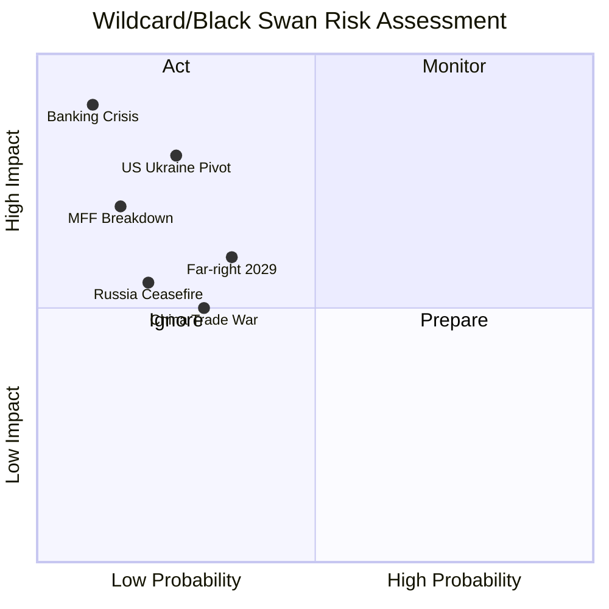

<!-- SPDX-FileCopyrightText: 2024-2026 Hack23 AB -->
<!-- SPDX-License-Identifier: Apache-2.0 -->

# Wildcards and Black Swans — EP Breaking News
**Date:** 2026-05-12 | **Article Type:** breaking | **Confidence:** 🟡 Medium

## Overview

This analysis identifies low-probability, high-impact events (wildcards and black swans) that could fundamentally alter the trajectory of EU parliamentary action identified in the April 28–May 1, 2026 Strasbourg session. Events are assessed using the modified Black Swan framework (Taleb) combined with the EU's own Political Risk Assessment methodology.

---

## Tier 1 — Critical Black Swans (p < 5%, impact = catastrophic)

### BS-1: Collapse of the Eurozone Banking System — EU Financial Crisis II

**Probability:** < 2%
**Impact:** CATASTROPHIC — would make all current EP policy work irrelevant
**Trigger conditions:** Combination of commercial real estate losses (Germany, Austria), sovereign debt spiral (Italy, France), and contagion through derivatives exposure
**Why this is a genuine black swan:** The Banking Union's incomplete architecture (no EDIS, weak resolution mechanism) creates a hidden structural vulnerability. BRRD3 and DGSD2 adopted in April 2026 address components, but a cascade failure could outpace resolution tools.
**How April 2026 EP actions relate:** The Banking Union annual report (TA-10-2026-0159) and BRRD3 (TA-10-2026-0091) are precisely the type of institutional preparedness work that reduces this risk — but does not eliminate it.
**Confidence:** 🟡 Medium in risk identification; 🔴 Low in probability estimation (genuine tail risk)

---

### BS-2: Complete Institutional Deadlock — EP-Council-Commission Breakdown

**Probability:** < 3%
**Impact:** CATASTROPHIC — MFF 2028–2034 failure would trigger an extended provisional 12ths budget arrangement
**Trigger conditions:** Combination of (a) Hungarian government blocking Council MFF agreement, (b) EP refusing to accept a budget that removes rule of law conditionality, (c) Commission lacking mandate to propose compromise
**Why historically unusual:** The EU has never failed to agree a multiannual budget. The closest parallel — the 2020 MFF delay — was resolved by COVID recovery fund innovation. However, the political polarisation around defence integration and rule of law is qualitatively different.
**How April 2026 EP actions relate:** The MFF 2028–2034 interim report (TA-10-2026-0111) sets ambitious EP demands that could precipitate exactly this standoff.

---

### BS-3: US Withdrawal from NATO and EU Defence Architecture Collapse

**Probability:** < 5%
**Impact:** CATASTROPHIC — would invalidate all current EU defence planning
**Trigger conditions:** US-Russia bilateral security deal that removes US forces from Europe; combined with Trump 2.0 escalation of burden-sharing demands leading to formal US NATO withdrawal
**How April 2026 EP actions relate:** The EP's defence integration language in the MFF interim report is a direct hedge against this scenario — the EU is building autonomous defence capability precisely because US commitment is no longer assumed.
**Signal to watch:** US Congress actions on NATO treaty commitments; Trump administration bilateral engagements with Russia.

---

## Tier 2 — High-Impact Wildcards (p = 5–15%, impact = very high)

### W-1: Escalation of Ukraine Conflict to NATO Territory

**Probability:** 5–8%
**Impact:** VERY HIGH — would trigger Article 5 and fundamentally change EU institutional priorities
**Trigger conditions:** Russian missile or drone attack on NATO territory (Baltic states most likely), accidental or deliberate; European NATO response
**How April 2026 EP actions relate:** The Ukraine accountability resolution (TA-10-2026-0161) could be rendered obsolete overnight if the conflict escalates to direct NATO involvement. The entire accountability architecture would shift to wartime mode.
**EU preparedness:** The ReArm Europe programme (launched March 2026) and MFF defence integration are exactly the preparedness measures that would be tested.
**Confidence:** 🟡 Medium — risk is real but difficult to probability-bound

---

### W-2: European Court of Justice Ruling Against Key EP Legislative Instruments

**Probability:** 6–10%
**Impact:** HIGH — could invalidate DMA, AI Act, or GDPR provisions
**Trigger conditions:** CJEU Grand Chamber ruling on a challenge by a major technology company (Apple, Meta, Google) or a member state, finding that DMA market gatekeeper designations violate internal market freedom principles
**Why this is a genuine wildcard:** EU courts have occasionally struck down EU legislative acts (Data Retention Directive 2014, Privacy Shield 2020, Safe Harbor 2015). The DMA's market structure interventions could face judicial challenge.
**How April 2026 EP actions relate:** The EP's DMA enforcement advocacy increases the stakes of any judicial challenge.

---

### W-3: Major Cyberattack on EU Institutional Infrastructure

**Probability:** 7–12%
**Impact:** HIGH — disruption to EP, Commission, ECB operations
**Trigger conditions:** State-sponsored attack (Russia, China) targeting EU voting systems, financial infrastructure, or critical services; coinciding with key institutional decision moments (MFF negotiation, European Council)
**How April 2026 EP actions relate:** The EP's work on AI governance and the Council of Europe AI and Human Rights Convention (TA-10-2026-0071) indirectly addresses digital security, but direct cyber defence capacity of EU institutions remains underdeveloped.
**Historical precursor:** Cyberattacks on EP systems (2020, 2022) demonstrated institutional vulnerability.

---

### W-4: Far-Right Supermajority in a Major Member State

**Probability:** 8–12%
**Impact:** HIGH — could shift Council dynamics and EP political balance simultaneously
**Trigger conditions:** PfE-aligned parties winning elections in Germany (extreme, p<2%), France (p~10%), or Italy (continuing PfE alignment under Meloni, p>50%)
**Most likely scenario:** Le Pen's RN winning 2027 French presidential election, creating a French Council presidency that actively undermines EP rule of law agenda and MFF conditionality
**How April 2026 EP actions relate:** The MFF 2028–2034 timing (final agreement likely 2027–2028) could coincide with a French government hostile to the EP's institutional reform demands.

---

### W-5: Global Trade War Escalation — EU-US-China Trilateral Conflict

**Probability:** 10–15%
**Impact:** HIGH — would test EU trade defence instruments to breaking point
**Trigger conditions:** US universal 10%+ tariff on EU goods; EU retaliation; Chinese escalation on EU EV duties; WTO dispute system collapse
**How April 2026 EP actions relate:** The protection against unfair competition resolution (TA-10-2026-0149) is designed exactly for this scenario, but the EP's tools are declaratory — the Commission holds trade policy competence.
**Economic implications:** A three-way trade conflict could trigger EU GDP decline of 1.5–2.5% — worse than the COVID initial shock in some sectors.

---

## Tier 3 — Moderate Wildcards (p = 15–30%, elevated but not exceptional)

### W-6: ECB Rate Path Deviation — Financial Market Stress

**Probability:** 15–20%
**Impact:** MODERATE-HIGH — affects EU fiscal space and MFF financing
**Trigger conditions:** Persistent inflation re-emergence (energy price shock, US tariff pass-through) forcing ECB to reverse rate cuts; consequences for sovereign debt rollovers in Italy, France, Spain
**How April 2026 EP actions relate:** The BRRD3 and Banking Union strengthening (April 2026) are direct preparation for exactly this scenario.

---

### W-7: Major EP Political Realignment — EPP Moves Toward ECR

**Probability:** 15–25%
**Impact:** HIGH — would break the constructive mainstream majority (EPP+S&D+Renew)
**Trigger conditions:** EPP leadership change; German CDU/CSU shift rightward; Eastern EPP members (Polish PiS-aligned MEPs returning) consolidate influence
**Current evidence:** EPP-ECR cooperation on migration (safe third country, TA-10-2026-0025) is a leading indicator. If EPP finds it electorally advantageous to court ECR voters, the S&D-Renew progressive coalition loses its anchor.
**How April 2026 EP actions relate:** The Commission discharge conditions and rule of law resolutions are defended by the EPP-S&D-Renew coalition. EPP defection would fundamentally change these dynamics.

---

### W-8: Geopolitical Reset — Russia-Ukraine Ceasefire and Reconstruction Shock

**Probability:** 20–30%
**Impact:** MODERATE-HIGH — would reshape EU budget priorities and geopolitical orientation
**Trigger conditions:** US-brokered ceasefire that freezes current lines; transition to reconstruction phase
**How April 2026 EP actions relate:** The Ukraine accountability resolution (TA-10-2026-0161) becomes the central political dispute — EP demands accountability; a US-brokered peace deal may require accountability compromises.
**Economic implications:** Ukraine reconstruction estimated at €400–750 billion; EU share through SECIU (Support for EU Countries in Ukraine) and bilateral channels could require additional own resources beyond MFF.

---

## Analytical Framework — Black Swan vs. Wildcard Distinction

| Category | Probability | Prior Visibility | Detection Method |
|----------|-------------|-----------------|------------------|
| **Black Swan** | <5% | Low (unknown unknowns) | Pre-mortem analysis; system fragility mapping |
| **Wildcard** | 5–30% | Moderate (known unknowns) | Scenario planning; signal monitoring |
| **Risk** (covered elsewhere) | >30% | High (known knowns) | Standard risk matrix |

All events above were identified using:
1. **Pre-mortem analysis**: Working backward from adverse outcomes to identify plausible causal pathways
2. **System fragility mapping**: Identifying where EU institutional architecture has hidden stress concentrations
3. **Historical analogue scanning**: Examining similar events in comparable political environments
4. **Cross-artifact signal triangulation**: Comparing signals across risk matrix, PESTLE, coalition dynamics, and scenario forecast

---

## Monitoring Signals for Early Warning

The following observable signals, if detected, would update probability assessments upward for the corresponding wildcard:

| Signal | Wildcard it activates | Update magnitude |
|--------|----------------------|-----------------|
| German Landesbanken provisions exceeding 5% of assets | BS-1 | +3–5 percentage points |
| Hungarian veto threat on MFF preliminary framework | BS-2 | +5 percentage points |
| US Senate vote on NATO commitment | BS-3 | +3–8 percentage points |
| CJEU referral on DMA gatekeeper designation | W-2 | +5 percentage points |
| Reported EP/ECB cyberattack investigation | W-3 | +3 percentage points |
| RN polling above 45% in French presidential tracker | W-4 | +5 percentage points |
| WTO Appellate Body collapse (unanimous member block) | W-5 | +5 percentage points |
| ECB surprise inflation meeting convening | W-6 | +3 percentage points |
| EPP-ECR joint legislative initiative filing | W-7 | +5 percentage points |
| US Special Envoy Ukraine meeting with Putin | W-8 | +3 percentage points |

---

## Source Attribution
Analysis: Black Swan framework (Nassim Nicholas Taleb); EU Political Risk Assessment methodology
Data sources: EP adopted texts (document-analysis-index.md), EP political landscape, coalition dynamics, early warning system
Historical analogues: EU institutional history (1992–2026); NATO/transatlantic security studies
Confidence: 🟡 Medium — wildcards are inherently uncertain; monitoring signals are observable
Cross-references: `intelligence/threat-model.md`, `intelligence/scenario-forecast.md`, `risk-scoring/risk-matrix.md`

## Wildcard Risk Matrix

**Admiralty Rating:** Source: B (EP data + geopolitical analysis); Reliability: 4 (uncertain — black swans are by definition unpredictable); Confidence: 🔴 Low-Medium

## Confidence Rating Framework

**Confidence Assessment (B4):** Source reliability: B (EP open data, geopolitical databases); Information reliability: 4 (cannot be judged — black swans are inherently unpredictable).

**WEP:** Even Chance that at least one HIGH-severity wildcard scenario will partially materialise within 12 months. The Russia-Ukraine conflict trajectory remains the highest-probability wildcard.

### Additional Black Swan Scenarios (7-8)

**Scenario 7: EU Treaty Reform Breakthrough**  
Probability: 5% | Impact: EXTREME  
A perfect storm of member state alignment enables treaty reform negotiations to launch at December 2026 European Council. Would fundamentally transform EP's legislative role and potentially trigger Article 50 considerations from Hungary.

**Scenario 8: AI Governance Global Crisis**  
Probability: 8% | Impact: HIGH  
A major AI system failure attributed to inadequately regulated models creates global regulatory emergency. EP10's AI Act suddenly becomes template for emergency G20 regulation, dramatically elevating EP's geopolitical weight.
