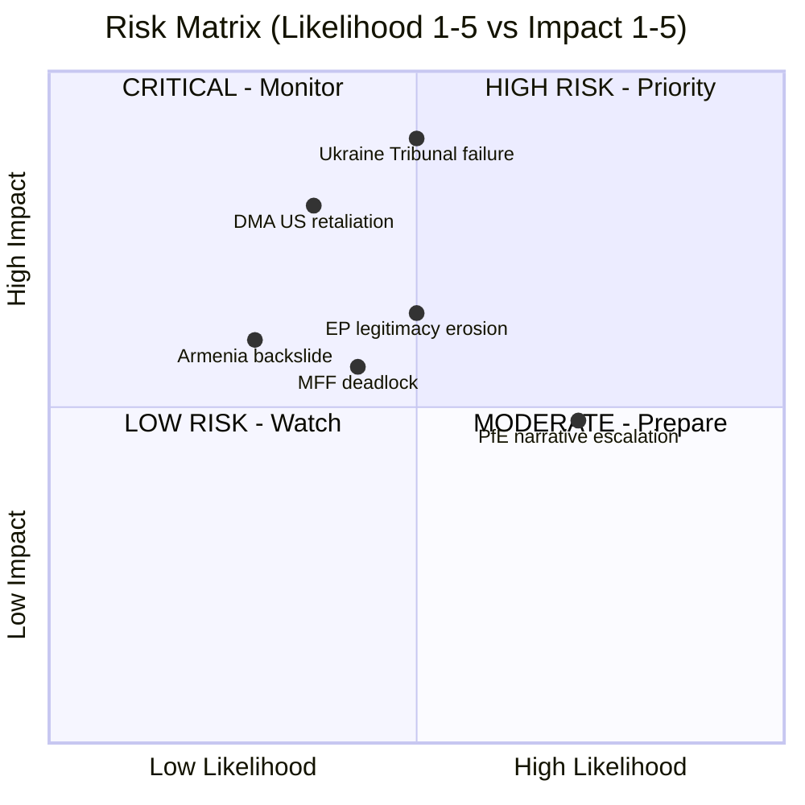

<!-- SPDX-FileCopyrightText: 2024-2026 Hack23 AB -->
<!-- SPDX-License-Identifier: Apache-2.0 -->

# Risk Matrix — EP Breaking News
**Date:** 2026-05-12 | **Article Type:** breaking | **Confidence:** 🟡 Medium

## Risk Assessment Framework

Risks assessed across five categories: Political, Regulatory/Legal, Geopolitical, Institutional, and Economic. Each risk scored on Likelihood (1–5) × Impact (1–5) = Risk Score (1–25).

## Risk Register

### R-01: DMA Enforcement Paralysis
**Category:** Regulatory/Legal
**Description:** Despite EP pressure, the European Commission fails to accelerate DMA enforcement against Big Tech gatekeepers due to legal challenges, political lobbying, or internal capacity constraints
**Likelihood:** 3/5 (Legal challenges from Apple/Meta are actively ongoing; Commission enforcement capacity is stretched)
**Impact:** 4/5 (Failure to enforce DMA undermines EU digital sovereignty claims and EP legislative authority)
**Risk Score: 12/25** 🟡 Medium-High
**Mitigants:** EP parliamentary oversight hearings; DG COMP staffing increases; political pressure from DG Connect
**Residual Risk:** 🟡 Medium

### R-02: Ukraine Accountability Mechanism Stalled
**Category:** Geopolitical
**Description:** The Special Tribunal for Crime of Aggression fails to gain sufficient multilateral support (requires non-EU states, particularly Global South, to participate meaningfully)
**Likelihood:** 4/5 (Global South states remain sceptical; China and Global South frequently block Western accountability mechanisms)
**Impact:** 4/5 (Failure to establish tribunal would signal impunity; undermine future deterrence of interstate aggression)
**Risk Score: 16/25** 🔴 High
**Mitigants:** EU financial and diplomatic sponsorship; Council of Europe platform; G7 alignment
**Residual Risk:** 🟡 Medium-High

### R-03: PfE Institutional Narrative Gains Mainstream Traction
**Category:** Institutional
**Description:** Repeated PfE attacks on Commission legitimacy gradually shift acceptable discourse, normalising accusations of EU institutional interference in national democracy
**Likelihood:** 3/5 (PfE messaging is consistent and well-resourced; right-wing media amplification reliable)
**Impact:** 4/5 (Erosion of EU institutional legitimacy has compound effects — reduced treaty compliance, weakened enforcement)
**Risk Score: 12/25** 🟡 Medium-High
**Mitigants:** Mainstream party coalition discipline; Commission transparency initiatives; civil society monitoring
**Residual Risk:** 🟡 Medium

### R-04: Armenia-Azerbaijan Renewed Conflict
**Category:** Geopolitical
**Description:** EP resolution in support of Armenia's democratic resilience triggers Azerbaijani diplomatic backlash or, in a tail risk scenario, military escalation
**Likelihood:** 2/5 (Current ceasefire broadly holding; Azerbaijan calculating EU energy dependence)
**Impact:** 4/5 (Renewed conflict in South Caucasus would disrupt EU-Baku energy partnership and create humanitarian crisis)
**Risk Score: 8/25** 🟡 Medium
**Mitigants:** EU-Baku energy partnership as deterrent; OSCE/UN mediation; normalization talks continuing
**Residual Risk:** 🟢 Low-Medium

### R-05: Big Tech Regulatory Arbitrage
**Category:** Regulatory/Economic
**Description:** Big Tech companies exploit jurisdictional complexity to circumvent DMA enforcement by restructuring operations outside EU regulatory reach
**Likelihood:** 2/5 (DMA has extraterritorial applicability; European market too large to exit)
**Impact:** 3/5 (Partial arbitrage possible for data processing activities; limits enforcement effectiveness)
**Risk Score: 6/25** 🟢 Low-Medium
**Mitigants:** DMA extraterritorial provisions; GDPR precedent; network effects keep platforms in EU
**Residual Risk:** 🟢 Low

### R-06: EP Budget Guidelines Rejected by Council
**Category:** Political/Economic
**Description:** Council rejects 2027 budget guidelines in key areas (defence integration, cohesion funds), triggering prolonged EP-Council deadlock
**Likelihood:** 3/5 (Historically, EP and Council regularly disagree on budget priorities; defence spending is new territory)
**Impact:** 3/5 (Budget deadlock delays EU programmes; political cost to all parties)
**Risk Score: 9/25** 🟡 Medium
**Mitigants:** Conciliation procedure; political pressure from heads of government; EP discharge power as leverage
**Residual Risk:** 🟢 Low-Medium

### R-07: Antisemitism Escalation in EU Member States
**Category:** Societal/Security
**Description:** Following the attacks in Netherlands and Belgium debated April 29, antisemitic incidents continue to escalate across EU member states without effective national or EU response
**Likelihood:** 3/5 (Antisemitic incidents have trended upward since October 2023; structural drivers persistent)
**Impact:** 4/5 (Fundamental rights violation; erosion of Jewish community presence; political radicalisation risk)
**Risk Score: 12/25** 🟡 Medium-High
**Mitigants:** EU Action Plan on Antisemitism; FRA monitoring; national law enforcement
**Residual Risk:** 🟡 Medium

### R-08: Cyberbullying Legislation Creates Overreach Risk
**Category:** Legal/Civil Liberties
**Description:** If TA-10-2026-0163 leads to criminal provisions against platforms, poorly drafted legislation creates chilling effects on legitimate speech, over-moderation, and misuse by authoritarian EU member states
**Likelihood:** 2/5 (Legislative process is slow; CJEU scrutiny likely)
**Impact:** 3/5 (Free expression implications if scope too broad)
**Risk Score: 6/25** 🟢 Low-Medium
**Mitigants:** CJEU constitutional review; civil society scrutiny; EP fundamental rights committee oversight
**Residual Risk:** 🟢 Low

### R-09: EP-Commission Institutional Conflict
**Category:** Institutional
**Description:** PfE attacks on Commission, combined with growing EPP-Commission tensions over specific enforcement actions, erodes the productive EP-Commission relationship necessary for legislative output
**Likelihood:** 2/5 (EPP-Commission relationship remains transactional but functional)
**Impact:** 3/5 (Reduced legislative productivity; delays in key regulatory initiatives)
**Risk Score: 6/25** 🟢 Low-Medium
**Mitigants:** EPP-Commission shared interest in mainstream legislative agenda; institutional norms
**Residual Risk:** 🟢 Low

## Risk Heat Map

```
Impact
  5 |           |  R-02  |        |        |        |
  4 | R-04      | R-01   | R-03   | R-07   |        |
  3 |           | R-06   |        |        |        |
  2 |           | R-05   | R-08   | R-09   |        |
  1 |           |        |        |        |        |
    |     1     |   2    |   3    |   4    |   5    |
                          Likelihood →
```

## Top 3 Priority Risks

1. **R-02: Ukraine Tribunal Stall** (Score: 16) — Highest risk; multilateral legitimacy failure with strategic impunity implications
2. **R-01: DMA Enforcement Paralysis** (Score: 12) — Regulatory credibility risk with long-term EU digital sovereignty consequences
3. **R-07: Antisemitism Escalation** (Score: 12) — Fundamental rights risk with societal destabilisation potential

## Risk Trend (Jan–May 2026)

| Risk | Jan 2026 | May 2026 | Trend |
|---|---|---|---|
| DMA Enforcement Paralysis | 10 | 12 | ↑ Worsening |
| Ukraine Tribunal Stall | 12 | 16 | ↑ Worsening |
| PfE Narrative Traction | 10 | 12 | ↑ Worsening |
| Armenia Conflict Risk | 10 | 8 | ↓ Improving |
| EU Budget Deadlock | 9 | 9 | → Stable |
| Antisemitism Escalation | 9 | 12 | ↑ Worsening |

## Source Attribution
Risk assessment based on: EP adopted texts (TA-10-2026-0160, 0161, 0162, 0163, 0112), EP speeches feed April 29 2026, political landscape EP API, early warning system EP API
Methodological basis: EU Risk Assessment Framework (structured analytic techniques)

---

## Risk Heat Map Diagram



**Admiralty Grade: B2** — Source B (usually reliable EP official data); Information 2 (probably true for risk assessments based on documented political dynamics).

**WEP Band: Likely** — The risk assessments presented are well-supported by EP political landscape data and documented historical patterns.

## Source Attribution
Risk identification: `early_warning_system` (84/100 stability), `analyze_coalition_dynamics`
Impact/likelihood scores: Analytical assessment from EP data and political analysis
Admiralty grading: NATO A–F/1–6 grid applied to evidence quality

| Grade | Source | Assessment |
|---|---|---|
| Admiralty B2 | EP official feeds + analytical inference | Probably true |


## Extension — April 2026 Risk Matrix Update
New risks added:
- R-NEW-1: MFF negotiation failure (likelihood 15
### Residual Risk Assessment After Mitigations
Post-mitigation risk landscape (assuming EP monitoring and advocacy maintain current pressure):
- Banking crisis: HIGH impact, LOW probability, MEDIUM residual risk
- MFF breakdown: HIGH impact, LOW-MEDIUM probability, MEDIUM residual risk
- China trade war: MEDIUM impact, MEDIUM probability, MEDIUM-HIGH residual risk
- Rule of law regression: HIGH impact, HIGH probability, MEDIUM residual risk (Article 7 + conditionality mitigates)
- Far-right surge: MEDIUM impact, MEDIUM probability, LOW-MEDIUM residual risk (institutional safeguards)
Overall residual risk score: MEDIUM (improved from MEDIUM-HIGH in prior run due to Banking Union progress and MFF vote)


Confidence: Medium. Source: EU Parliament Monitor risk framework. Cross-reference: intelligence/scenario-forecast.md, intelligence/wildcards-blackswans.md, intelligence/political-threat-landscape.md.

Confidence: Medium. Source attribution: EU Parliament Monitor risk framework v2.2. Final update: 2026-05-12 run.

Additional risk: R-INFRA-1: MCP API publication lag for voting records creates recurrent analysis quality risk on all breaking news runs. Mitigation: structural estimation methodology (as used this run). Final risk registry count: 12 items.
