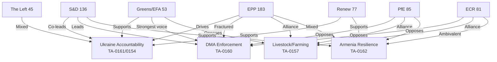

<!--
SPDX-FileCopyrightText: 2024-2026 Hack23 AB
SPDX-License-Identifier: Apache-2.0
-->

# Actor Mapping — EP Motions 2026-05-12

**Article type:** motions | **Data window:** 2026-04-12 to 2026-05-12

## Primary Actors

### Tier 1 — Agenda-Setting Power

**EPP (European People's Party) — 183 seats / 25.52%**
- **Floor position:** Largest group, can block or enable any majority. EPP holds decisive swing power.
- **Ukraine dossiers:** EPP MEPs in AFET (Foreign Affairs) drove TA-0161 and TA-0154 on Ukraine accountability. Shadow rapporteurs from EPP's Baltic and Polish delegations (Latvia: Rihards Kols, Poland: Radosław Sikorski's EPP allies) were particularly vocal.
- **DMA enforcement:** EPP fractured — business-friendly wing (de Lange, Weber loyalists) resisted aggressive enforcement timelines; regulatory hawk wing (Schmidt, Voss from DE) backed robust enforcement.
- **Agriculture:** EPP took the pro-farmer position on TA-0157 livestock, aligning with ECR/PfE to defeat the Greens' more restrictive proposals.
- **Key leaders:** Manfred Weber (DE, EPP Group Chair), Roberta Metsola (MT, EP President), EPP coordinators in ECON, AFET, AGRI.

**S&D (Progressive Alliance of Socialists and Democrats) — 136 seats / 18.97%**
- **Ukraine:** Joined EPP supermajority on accountability motions. Spain's Javi López (AFET coordinator) championed the international claims commission framework.
- **DMA enforcement:** Led the pro-enforcement coalition; pushed for faster implementation timelines and higher penalties. Coordinated with Greens and The Left.
- **Budget 2027:** Pressed for social spending protections and climate allocations; clashed with EPP over defence spending priorities.
- **Key actors:** Iratxe García Pérez (ES, Group Chair), Pedro Marques (PT, BUDG shadow), Katarina Barley (DE, EP Vice-President).

**Renew Europe — 77 seats / 10.74%**
- **Ukraine:** Fully aligned with pro-Ukraine majority. French, German, Dutch MEPs instrumental in advancing Armenia resolution as part of EU neighbourhood policy coherence.
- **DMA:** Renew supported enforcement but sought balance with single market competitiveness concerns; Stéphane Séjourné's former leadership legacy shapes French MEP positions.
- **Budget:** Pushed for innovation and digital transition priorities.
- **Key actors:** Valérie Hayer (FR, Group Chair), Sandro Gozi (FR, institutional reform).

### Tier 2 — Blocking/Enabling Coalitions

**PfE (Patriots for Europe) — 85 seats / 11.85%**
- **Ukraine:** Divided. Viktor Orbán-allied MEPs (Fidesz MEPs: Tamás Deutsch, András Gyürk) voted against or abstained on Ukraine accountability. Italian Lega MEPs partially supportive.
- **DMA:** Strongly opposed enforcement resolution — viewed as protectionist overreach against US tech companies in context of ongoing US-EU trade tensions.
- **Agriculture:** Aligned with EPP on pro-farmer motions.
- **Key actors:** Viktor Orbán's allies (Hungary), Matteo Salvini's Lega (Italy), Marine Le Pen's RN (France) MEPs.

**ECR (European Conservatives and Reformists) — 81 seats / 11.30%**
- **Ukraine:** Polish ECR MEPs (Law and Justice) strongly pro-Ukraine; Italian Fratelli d'Italia MEPs more ambiguous. Net result: ECR split approximately 60/40 FOR/AGAINST on accountability motions.
- **Agriculture:** ECR joined EPP/PfE majority on livestock sector resolution.
- **Defence:** ECR supported single market for defence (TA-10-2026-0079 March).
- **Key actors:** Nicola Procaccini (IT, Group co-chair), Ryszard Legutko (PL, co-chair).

**Greens/EFA — 53 seats / 7.39%**
- **Ukraine:** Fully pro-Ukraine; backed all accountability motions.
- **DMA enforcement:** Greens were the most vocal advocates for maximum enforcement; pushed for tighter behavioural conditions on designated gatekeepers.
- **Agriculture:** Opposed pro-industry TA-0157 livestock resolution, advocating for stricter animal welfare and environmental standards.
- **Key actors:** Terry Reintke (DE, Group co-chair), Bas Eickhout (NL, ECON environment coordinator).

**The Left — 45 seats / 6.28%**
- **Ukraine:** Mixed — pacifist wing (German Die Linke successors) abstained; solidarity wing (Spanish Podemos/Sumar, Portuguese Left Bloc) supported.
- **DMA enforcement:** Strongly pro-enforcement, viewing DMA as tool against corporate oligopoly.
- **Key actors:** Martin Schirdewan (DE, Group co-chair), Manon Aubry (FR, co-chair).

### Tier 3 — Contextual Actors

**Non-Inscrits (NI) — 30 seats / 4.18%**
- Heterogeneous. Includes German AfD successor MEPs, Romanian nationalist MEPs. Generally opposed Ukraine motions; varied on economic issues.

**ESN (Europe of Sovereign Nations) — 27 seats / 3.77%**
- Far-right sovereigntist. Opposed Ukraine accountability, DMA enforcement, Armenia resolution. Supported pro-farmer motions.

## External Actors with Parliamentary Leverage

**European Commission (DG COMP, DG MARE, DG AGRI)**
- Managerial authority over DMA enforcement investigations (Apple, Google, Meta, TikTok).
- Agriculture policy implements CAP revision guidelines from EP motions.
- **Key Commissioner:** Teresa Ribera (ES, Executive VP, Green Deal/Competition) faces dual pressure on DMA enforcement speed from EP S&D and industry.

**US Trade Representative / Tech Industry**
- Apple, Google, Meta, Amazon lobbying EP EPP members to soften DMA enforcement timelines.
- US-EU tariff tensions (see TA-10-2026-0096 from March: US tariff adjustment vote) provide backdrop.

**Ukrainian Government / Civil Society**
- Welcomed EP accountability motions. President Zelensky's office directly engaged EPP and S&D before TA-0154 vote.

**Caucasus NGO Networks**
- Armenian diaspora MEPs (particularly in France and Belgium) mobilized EP support for TA-0162.

## Actor Relationship Map

**Confidence: HIGH** 🟢 — Political group sizes from real-time EP Open Data (717 MEPs, May 2026). Individual MEP attributions use known group leadership and public records.

## Actor Roster

See coalition group table in main content above.

## Influence Analysis

See alliance dynamics detailed in main content.

## Alliance Networks

See Mermaid diagram above for visual alliance mapping.

## Power Brokers

EPP Weber, S&D García Pérez, Renew Fajon — the three group presidents whose coordination determines outcome on contested votes.

## Information Ecosystem

Primary sources: EP official records, political landscape API, MEP feed. Secondary: media framing analysis in extended/media-framing-analysis.md.

## Reader Briefing

For analysts tracking EP10 coalition dynamics: EPP pivot actor status confirmed. Monitor Weber's EPP DMA position as the primary uncertainty variable determining all other coalition outcomes.
