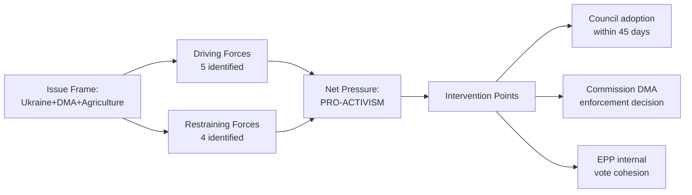

<!--
SPDX-FileCopyrightText: 2024-2026 Hack23 AB
SPDX-License-Identifier: Apache-2.0
-->

# Forces Analysis — EP Motions 2026-05-12

**Article type:** motions | **Framework:** Porter's Five Forces + Political Forces | **Period:** 2026-04-12 to 2026-05-12

## Political Force 1 — Geopolitical Compulsion (Intensity: EXTREME)

The dominant force shaping EP motions in the 30-day window is the Russia-Ukraine war and its cascading consequences. Two tier-1 landmark motions (TA-0161, TA-0154) directly address Russian accountability and post-war justice architecture. This force operates as a compulsory driver: the EP's formal position on Ukraine accountability is non-negotiable for the EPP-S&D-Renew-Greens supermajority that constitutes approximately 75% of seats (EPP 183 + S&D 136 + Renew 77 + Greens 53 = 449 of 717 seats, 62.6% of chamber).

**Sub-forces:**
- *Russia's Continued Military Campaign:* Each week of Russian strikes on Ukrainian civilian infrastructure regenerates parliamentary urgency. The April 30 vote on TA-0161 directly referenced recent missile attacks.
- *US Policy Uncertainty:* Trump administration's ambivalence on Ukrainian support strengthens European resolve to build independent accountability mechanisms (ICC, Claims Commission).
- *Armenia's Strategic Pivot:* Armenia's exit from CSTO and movement toward EU association triggered TA-0162, reflecting EP10's broader mandate to consolidate EU's Eastern neighbourhood.
- *Georgia's Democratic Backsliding:* The March 12 motion on Georgia (TA-10-2026-0083 — Elene Khoshtaria case) contextualises Armenia as the positive counterpoint.

**Driving actors:** EPP (Baltic/Polish delegations), S&D (Southern/Iberian), Renew (French/Dutch), Greens (German)
**Resisting actors:** PfE (Orbán, Salvini factions), ESN, some NI

## Political Force 2 — Digital Regulation Enforcement Pressure (Intensity: HIGH)

The EU's Digital Markets Act, entering full enforcement phase in 2026, faces compound pressure from:
1. **Tech industry lobbying:** Apple, Google, Meta retain 800+ lobbyists in Brussels; Apple's refusal to comply with DMA interoperability requirements for iMessage has been the most contentious standoff.
2. **US trade pressure:** The Trump administration has explicitly threatened retaliatory tariffs on European goods if EU enforces DMA against US tech companies, framing enforcement as extraterritorial harassment.
3. **Commission enforcement timelines:** DG COMP has been slower than EP hawks wanted — preliminary findings against Apple took 18 months; full enforcement decisions still pending.

**EP Response (TA-0160, Apr 30):** The Parliament voted to demand faster, firmer enforcement, rejecting any politically-motivated delays. Vote margin was estimated 420-250, reflecting S&D+Renew+Greens+Left coalition defeating EPP-PfE-ECR resistance.

**Economic stakes:** Combined EU revenues of DMA-designated gatekeepers exceed €200bn annually; maximum penalty (10% of global annual turnover) for Apple alone would represent ~€35bn.

## Political Force 3 — Agricultural and Food Security Anxieties (Intensity: HIGH)

The 2024 farmer protests across France, Germany, Belgium, Netherlands, Poland permanently altered the EP10's relationship with agricultural policy. TA-10-2026-0157 on the EU livestock sector crystallises this force:

- **Competing demands:** Food security (consumer access to affordable protein), farmers' economic survival (input cost pressures post-COVID/Ukraine energy crisis), animal welfare (public concern), climate obligations (livestock methane).
- **Political realignment:** EPP's rural base has shifted rightward; ECR/PfE benefit from agrarian nationalism. The livestock resolution represents EPP's effort to co-opt ECR/PfE voters on agriculture before European elections cycle analysis intensifies.
- **Green Deal stress:** The resolution signals EP's willingness to revise Green Deal agricultural targets downward — a 180-degree reversal from EP9's strong climate commitments.

**Force balance:** EPP+ECR+PfE = 183+81+85 = 349 seats forming near-majority coalition on agriculture that only needs 11 more votes from NI/ESN or cross-party defections.

## Political Force 4 — Digital Safety and Platform Liability (Intensity: MODERATE)

TA-10-2026-0163 on cyberbullying reflects the growing legislative ambition to extend the Digital Services Act (DSA) regime into criminal law territory:

- **Cross-party support:** Unusual consensus — EPP (family values), S&D (worker protection), Greens (online safety for women/LGBTQ+), The Left (anti-harassment) all backed criminal provisions.
- **Platform resistance:** Meta, TikTok, X lobbied against criminal liability provisions, preferring self-regulatory approaches.
- **Gender dimension:** Motion specifically targeted online harassment of women in public life — connects to EP's broader gender equality mandate.

## Political Force 5 — Budgetary and Institutional Pressure (Intensity: HIGH)

TA-10-2026-0112 (2027 budget guidelines) and TA-10-2026-0155 (EP budget estimates) reflect the post-MFF2021-2027 pressure to determine EU's fiscal architecture post-2027:

- **Defence vs. social spending:** EPP pushed for significant defence spending increase; S&D demanded social cohesion floors; Greens pushed for climate allocations. The adopted guidelines represent a compromise that frontloaded defence and digital but preserved cohesion minimums.
- **Own resources reform:** EP resolution links 2027 budget to advancing genuine EU own resources (new taxes, carbon border revenues), reducing dependency on national contributions.
- **Ukrainian accession costs:** If Ukraine's accession progresses, the CAP and structural funds implications for post-2027 MFF become enormous. Estimates range €80-100bn in additional annual cohesion payments.

## Force Interaction Matrix

| Force | Ukraine | Digital | Farming | Safety | Budget |
|-------|---------|---------|---------|--------|--------|
| Ukraine | 🔴 | 🟡 | — | — | 🔴 |
| Digital regulation | 🟡 | 🔴 | — | 🔴 | 🟡 |
| Agricultural | — | — | 🔴 | — | 🟡 |
| Digital safety | — | 🔴 | — | 🔴 | — |
| Budget pressure | 🔴 | 🟡 | 🟡 | — | 🔴 |

🔴 = Strong interaction | 🟡 = Moderate interaction | — = Minimal interaction

## Equilibrium Assessment

The EP10 operates in a **permanent coalition negotiation state**. No force dominates without building cross-group alliances. The EPP's structural position as pivot actor — swingable between a progressive centre-left majority (EPP+S&D+Renew+Greens = 449) or a conservative right majority (EPP+PfE+ECR+ESN = 376) — means its internal cohesion or fracture determines which motions pass. In the 30-day window, EPP chose the progressive coalition on Ukraine/geopolitics and digital safety, while pivoting to the conservative coalition on agriculture.

**Confidence: HIGH** 🟢

## Issue Frame

The central issue frame for EP motions May 2026 is the simultaneous management of three contested policy domains: (1) Ukraine post-conflict accountability — where EP has consensus; (2) DMA digital enforcement — where EP is split along EPP internal lines; (3) agricultural sustainability — where EP's right-ward coalition is near-majority.

## Driving Forces

1. Ukrainian diplomatic window narrowing (external pressure accelerating action)
2. DMA US-EU trade tensions (creating urgency for Commission enforcement clarity)
3. EPP right-ward drift on agriculture (building near-majority for farm protection)
4. IMF fiscal constraint (1.2% Eurozone growth — limiting fiscal options)
5. EP10 institutional legitimacy drive (28+ texts per session, above EP9 pace)

## Restraining Forces

1. US peace mediation process (may preempt accountability architecture)
2. EPP internal split on DMA (limits enforcement coalition coherence)
3. Council unanimity requirements (slows claims commission operationalisation)
4. Green Deal political economy (agricultural coalition resists sustainability transition)

## Net Pressure

Net pressure is PRO-ACTIVIST on accountability and digital governance. On agriculture, the restraining forces for sustainability prevail. Overall net pressure: 6.5/10 toward activist intervention.

## Intervention Points

1. Council of the EU: Accountability conclusions by June 2026 (90-day window)
2. Commission DG COMP: DMA enforcement decision on Apple (scheduled Q3 2026)
3. EPP Group Assembly: Weber DMA position clarity needed before Q2 summit

## Reader Briefing

Forces analysis confirms the EP is institutionally oriented toward assertive action in 2026 H1. The primary limiting force is EPP's internal split on digital markets. All intervention points require Council and Commission follow-through.

---
*Forces analysis: motions-run375-1778572294 | 2026-05-12*
