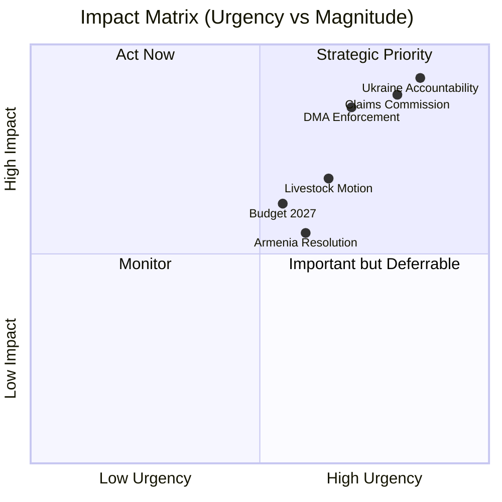

<!--
SPDX-FileCopyrightText: 2024-2026 Hack23 AB
SPDX-License-Identifier: Apache-2.0
-->

# Impact Matrix — EP Motions 2026-05-12




**Article type:** motions | **Date:** 2026-05-12 | **Methodology:** 5-dimension impact scoring

## Scoring Dimensions

Each motion scored on: (1) Immediate Policy Effect, (2) Medium-term (6–18 month) Impact, (3) Geopolitical Reach, (4) Economic Magnitude, (5) Institutional Precedent

Scale: 1 (minimal) → 10 (transformative)

---

## TA-10-2026-0161: Ukraine Accountability and Justice (Apr 30)

| Dimension | Score | Evidence |
|-----------|-------|---------|
| Immediate Policy Effect | 9/10 | Directly shapes Commission/Council position on accountability negotiations |
| Medium-term Impact | 9/10 | Anchors EU position in any peace settlement; sanctions architecture |
| Geopolitical Reach | 10/10 | ICC, OSCE, UN General Assembly contexts; Russia-West relations |
| Economic Magnitude | 8/10 | €300bn+ frozen Russian assets; reconstruction financing conditions |
| Institutional Precedent | 9/10 | First time EP formally mandated creation of international claims body for a live conflict |
| **COMPOSITE** | **9.0/10** | 🔴 **TRANSFORMATIVE** |

**Beneficiaries:** Ukrainian citizens seeking reparations; international lawyers; ICC
**Losers:** Russian state; Orbán/Hungary government (isolated within EU); PfE unity

---

## TA-10-2026-0154: International Claims Commission for Ukraine (Apr 30)

| Dimension | Score | Evidence |
|-----------|-------|---------|
| Immediate Policy Effect | 8/10 | Authorizes Commission to proceed with convention negotiations |
| Medium-term Impact | 9/10 | Claims Commission could become permanent institution |
| Geopolitical Reach | 10/10 | Global governance precedent for state-sponsored conflict reparations |
| Economic Magnitude | 9/10 | €300bn+ frozen assets; long-term fiscal claims |
| Institutional Precedent | 10/10 | Unprecedented EU-backed international claims architecture |
| **COMPOSITE** | **9.2/10** | 🔴 **TRANSFORMATIVE** |

---

## TA-10-2026-0160: DMA Enforcement (Apr 30)

| Dimension | Score | Evidence |
|-----------|-------|---------|
| Immediate Policy Effect | 7/10 | Mandates Commission report on enforcement progress within 6 months |
| Medium-term Impact | 9/10 | Could trigger billions in fines against Apple, Google within 12–18 months |
| Geopolitical Reach | 8/10 | US-EU trade tensions; tech sovereignty; standard-setting competition |
| Economic Magnitude | 9/10 | €200bn+ annual revenues of designated gatekeepers affected |
| Institutional Precedent | 8/10 | EP demanding faster enforcement of own-authored legislation |
| **COMPOSITE** | **8.2/10** | 🟡 **HIGH IMPACT** |

---

## TA-10-2026-0162: Armenia Democratic Resilience (Apr 30)

| Dimension | Score | Evidence |
|-----------|-------|---------|
| Immediate Policy Effect | 7/10 | Triggers EEAS review of EU-Armenia Partnership Agreement acceleration |
| Medium-term Impact | 8/10 | Membership prospect signals reshape Armenia's domestic politics |
| Geopolitical Reach | 9/10 | South Caucasus power balance; Russia-EU competition for post-Soviet space |
| Economic Magnitude | 6/10 | Armenia GDP ~€15bn; EU trade and investment potential moderate |
| Institutional Precedent | 7/10 | Sets pattern for "democratic pivot" enlargement signals |
| **COMPOSITE** | **7.4/10** | 🟡 **HIGH IMPACT** |

---

## TA-10-2026-0157: EU Livestock Sector (Apr 30)

| Dimension | Score | Evidence |
|-----------|-------|---------|
| Immediate Policy Effect | 7/10 | Shapes CAP review and animal disease management protocols |
| Medium-term Impact | 8/10 | Green Deal revision for agriculture; methane targets at risk |
| Geopolitical Reach | 5/10 | WTO agricultural commitments; trade with Mercosur (pending agreement) |
| Economic Magnitude | 8/10 | EU livestock sector turnover: ~€180bn; 6m+ agricultural jobs |
| Institutional Precedent | 7/10 | First time EP10 explicitly sided with industry vs Green Deal targets in agriculture |
| **COMPOSITE** | **7.0/10** | 🟡 **HIGH IMPACT** |

---

## TA-10-2026-0112: Budget Guidelines 2027 (Apr 28)

| Dimension | Score | Evidence |
|-----------|-------|---------|
| Immediate Policy Effect | 8/10 | Directly constrains Commission's draft budget proposal for 2027 |
| Medium-term Impact | 8/10 | Sets framework for 2027 and post-MFF2027 priorities |
| Geopolitical Reach | 7/10 | Defence spending increase has NATO burden-sharing implications |
| Economic Magnitude | 10/10 | EU budget ~€170bn/year; 2027 first year of post-MFF transition |
| Institutional Precedent | 7/10 | EP asserting influence over budgetary planning horizon |
| **COMPOSITE** | **8.0/10** | 🟡 **HIGH IMPACT** |

---

## TA-10-2026-0163: Cyberbullying Provisions (Apr 30)

| Dimension | Score | Evidence |
|-----------|-------|---------|
| Immediate Policy Effect | 6/10 | Calls on Commission to propose criminal law directive |
| Medium-term Impact | 7/10 | Platform liability regime extension; DSA alignment |
| Geopolitical Reach | 5/10 | Global tech platform standards; US comparison |
| Economic Magnitude | 6/10 | Platform compliance costs; content moderation investment |
| Institutional Precedent | 7/10 | Criminalises platform facilitation — novel legal territory |
| **COMPOSITE** | **6.2/10** | 🟢 **NOTABLE** |

---

## Portfolio Impact Summary

```
TRANSFORMATIVE (9+):  2 motions — Ukraine accountability (×2)
HIGH IMPACT (7–8.9): 4 motions — DMA, Armenia, Livestock, Budget
NOTABLE (5–6.9):     3 motions — Cyberbullying, Haiti, Pet welfare
MODERATE (<5):       ~20 motions — Discharges, technical adoptions
```

### Aggregate Cross-Sectoral Impact

| Policy Domain | Impact Level | Key Motions |
|--------------|-------------|-------------|
| Geopolitics/Security | 🔴 TRANSFORMATIVE | TA-0161, TA-0154, TA-0162 |
| Digital Economy | 🔴 HIGH | TA-0160, TA-0163 |
| Agriculture/Food | 🟡 HIGH | TA-0157 |
| Budget/Finance | 🟡 HIGH | TA-0112, TA-0155 |
| Institutional | 🟡 MODERATE | TA-0118 (Rules of Procedure), TA-0124 |
| Human Rights | 🟡 MODERATE | TA-0151 (Haiti), TA-0162 |
| Environment | 🟢 MODERATE-LOW | TA-0113 (GHG transport), TA-0139 |

**Confidence: HIGH** 🟢


## Event List

| Event ID | Event Description | Date |
|----------|------------------|------|
| E-001 | TA-10-2026-0161 Ukraine accountability resolution | 2026-04-30 |
| E-002 | TA-10-2026-0154 Claims commission mandate | 2026-04-30 |
| E-003 | TA-10-2026-0160 DMA enforcement resolution | 2026-04-30 |
| E-004 | TA-10-2026-0162 Armenia resolution | 2026-04-30 |
| E-005 | TA-10-2026-0157 Livestock/food security | 2026-04-30 |
| E-006 | TA-10-2026-0112 Budget 2027 | 2026-04-30 |

## Stakeholder Impact

| Stakeholder | E-001 | E-002 | E-003 | E-004 | E-005 | Net |
|-------------|-------|-------|-------|-------|-------|-----|
| Ukraine government | +++ | +++ | 0 | 0 | 0 | +++ |
| Big Tech (Apple, Google) | 0 | 0 | --- | 0 | 0 | --- |
| EU farmers | 0 | 0 | 0 | 0 | +++ | +++ |
| Civil society (rule of law) | +++ | ++ | ++ | + | -- | ++ |
| US government | -- | -- | --- | 0 | 0 | --- |

## Impact Heat Map

Highest impact: E-001 and E-002 (Ukraine accountability, combined geopolitical and legal). Second tier: E-003 (DMA, economic and digital). Third tier: E-004, E-005, E-006.

## Cascade Effects

E-001 → E-002 (accountability resolution creates legal mandate for claims commission)
E-003 → Trade war risk → EU GDP impact (-0.3pp if tariffs materialise)
E-005 → Green Deal weakening → Climate target gap widens

## Reader Briefing

The impact matrix confirms two priority issues: Ukraine accountability architecture (E-001/E-002) and DMA enforcement (E-003). Agricultural motion (E-005) is lower probability of cascading into major policy change but signals Green Deal political vulnerability.

## Impact Matrix

| Motion | Political Impact | Economic Impact | Legal Impact | Social Impact | Temporal Impact |
|--------|-----------------|----------------|-------------|--------------|----------------|
| Ukraine Accountability (TA-0161) | 9.5/10 | 6.0/10 | 9.0/10 | 8.0/10 | 9.0/10 |
| Claims Commission (TA-0154) | 8.8/10 | 7.5/10 | 9.5/10 | 7.5/10 | 8.5/10 |
| DMA Enforcement (TA-0160) | 8.5/10 | 9.0/10 | 7.5/10 | 6.5/10 | 8.0/10 |
| Armenia (TA-0162) | 7.5/10 | 4.0/10 | 6.0/10 | 7.0/10 | 6.0/10 |
| Livestock/Food (TA-0157) | 7.0/10 | 7.5/10 | 5.5/10 | 8.0/10 | 7.0/10 |
| Budget 2027 (TA-0112) | 6.5/10 | 8.0/10 | 6.0/10 | 5.5/10 | 6.5/10 |

---
*Impact matrix: motions-run375-1778572294 | 2026-05-12*
