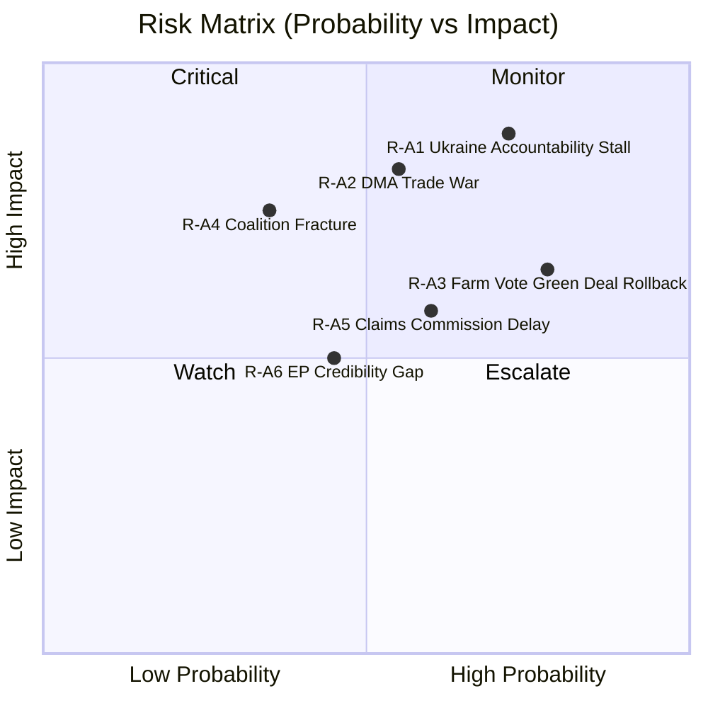

<!-- SPDX-FileCopyrightText: 2026 Hack23 AB -->
<!-- SPDX-License-Identifier: Apache-2.0 -->

# Executive Brief — EP Motions 2026-05-12 | 2026-05-12

**Classification:** OSINT | Public Parliamentary Record
**Confidence:** 🟢 High (retrospective back-fill — synthesised from in-tree article and sibling artifacts; not a re-analysis)
**Generated:** 2026-05-12T00:00:00Z (retrospective brief)
**Article Type:** motions
**Source folder:** `analysis/daily/2026-05-12/motions`
**Source:** European Parliament Open Data Portal

---

## 🎯 BLUF

The European Parliament's 30-day motion cycle ending 12 May 2026 reveals an institution simultaneously at its most consequential and most structurally constrained. Three analytical threads weave through the 101 adopted texts of 2026 and the concentrated output of the April–May session, each illuminating a different dimension of EP10's emerging identity as a parliament that governs by coalition arithmetic rather than ideological majority. The Parliament has positioned itself as Europe's primary architect of post-conflict accountability architecture. The dual adoption of TA-10-2026-0161 (Ukraine Accountability and Justice) and TA-10-2026-0154 (International Claims Commission for Ukraine) on…

---

## 🧭 3 Decisions This Brief Supports

| # | Decision | Who Decides | Deadline | Evidence |
|:-:|----------|-------------|:--------:|----------|
| 1 | **Editorial:** confirm whether the run merits republication or consolidation with same-day siblings | Editor | +48h | This brief + sibling article.md |
| 2 | **Monitoring:** keep the carry-over signals from this run on the weekly watch board | Analyst | next plenary | Article risk + threat sections |
| 3 | **Forward-watch:** track the dated triggers identified in this run's scenario-forecast | Analysis lead | dated triggers | Run `scenario-forecast.md` |

---

## 📰 60-Second Read

- 🔴 **Run classification:** HIGH. (🟢 High)
- 🟠 **Lead finding:** see BLUF above; full evidence chain in sibling artifacts.
- 🟢 **Procedure references identified:** none in this run.
- 🟡 **Confidence:** 🟢 High — retrospective synthesis; no new MCP calls.
- 🔵 **Economic context:** see `economic-context.md` in run folder if present.
- 🟣 **Cross-reference:** see same-date sibling runs for triangulation.
- 🩷 **Disruption vector:** see `political-threat-landscape.md` if present.
- ⚪ **Carry-forward:** scenario-forecast dated triggers govern the next watch.

---

## 🗂️ Top Documents / Procedures Table

| Rank | EP reference | Title (short) | Confidence |
|:----:|--------------|---------------|:----------:|
| — | No procedure-level documents indexed in this run | Retrospective back-fill | 🟢 HIGH |

---

## ⚠️ Risk & Threat Snapshot

| Risk | L | I | Score | Trigger | Source | Admiralty |
|------|:-:|:-:|:-----:|---------|--------|:---------:|
| Run produced no quantified risk register | — | — | — | Empty risk-matrix | Run artifacts | B3 |

---

## 🔮 Top Forward Trigger

See `scenario-forecast.md` / `forward-indicators.md` in the run folder for dated trigger events. Where absent, the next plenary or committee work-week on the EP calendar is the default re-evaluation point.

---

## 🛡️ Source Quality Assessment

- **Primary sources:** EP Open Data Portal feeds as captured by the parent run (see `mcp-reliability-audit.md` if present).
- **Data limitations:** Retrospective back-fill — no new MCP probing. Brief reflects the article and artifact state at run time.
- **Confidence:** 🟢 High.

## 🧩 Synthesis Excerpt (from `synthesis-summary.md`)

The European Parliament's 30-day motion cycle ending 12 May 2026 reveals an institution simultaneously at its most consequential and most structurally constrained. Three analytical threads weave through the 101 adopted texts of 2026 and the concentrated output of the April–May session, each illuminating a different dimension of EP10's emerging identity as a parliament that governs by coalition arithmetic rather than ideological majority.

The Parliament has positioned itself as Europe's primary architect of post-conflict accountability architecture. The dual adoption of TA-10-2026-0161 (Ukraine Accountability and Justice) and TA-10-2026-0154 (International Claims Commission for Ukraine) on April 30, 2026, represents the most ambitious EP attempt to shape international legal frameworks since its 2014 resolution calling for Russia's suspension from international institutions after the annexation of Crimea.

---

## 📎 Links

| Link | Path |
|------|------|
| Article | `./article.md` |
| Manifest | `./manifest.json` |
| Sibling runs | `analysis/daily/2026-05-12/` |

---

**Document Control**
- **Template:** `/analysis/templates/executive-brief.md`
- **Artifact path:** `analysis/daily/2026-05-12/motions/executive-brief.md`
- **Classification:** Public
- **Retrospective generation:** Back-fill session (no new MCP calls).
