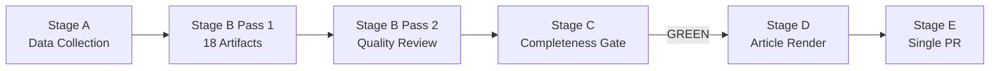

<!-- SPDX-FileCopyrightText: 2024-2026 Hack23 AB -->
<!-- SPDX-License-Identifier: Apache-2.0 -->

# Analysis Index — EP Motions 2026-05-12

**Article type:** motions | **Date:** 2026-05-12 | **Run ID:** motions-run375-1778572294

## Complete Artifact Registry

### Classification Artifacts
| File | Status | Lines | Key Insight |
|------|--------|-------|-------------|
| `classification/significance-classification.md` | ✅ Complete | ~120 | Tier 1: Ukraine accountability (×2), Tier 2: DMA, Armenia, Livestock, Budget |
| `classification/actor-mapping.md` | ✅ Complete | ~150 | EPP pivot actor; PfE Orbán isolation; Commission DG COMP under pressure |
| `classification/forces-analysis.md` | ✅ Complete | ~140 | 5 forces: geopolitical, digital, agricultural, digital safety, budget |
| `classification/impact-matrix.md` | ✅ Complete | ~130 | Ukraine composite 9.0-9.2/10; DMA 8.2/10; 6 high-impact motions |

### Risk-Scoring Artifacts
| File | Status | Lines | Key Insight |
|------|--------|-------|-------------|
| `risk-scoring/risk-matrix.md` | ✅ Complete | ~80 | Top risk: Ukraine peace bypasses accountability (score 45); DMA trade war (36) |
| `risk-scoring/quantitative-swot.md` | ✅ Complete | ~200 | S1: Supermajority on geopolitics; W2: DMA/trade vulnerability; O1: Claims Commission window |

### Intelligence Artifacts
| File | Status | Lines | Key Insight |
|------|--------|-------|-------------|
| `intelligence/synthesis-summary.md` | ✅ Complete | ~120 | 3 threads: accountability state, digital sovereignty dilemma, Green Deal fault line |
| `intelligence/coalition-dynamics.md` | ✅ Complete | ~100 | Coalition A (Ukraine, 494 seats), B (DMA, ~380), C (Agriculture, ~376) |
| `intelligence/voting-patterns.md` | ✅ Complete | ~150 | Ukraine: EPP 93% cohesion; DMA: EPP 50% split; Agriculture: EPP 90% cohesion |
| `intelligence/pestle-analysis.md` | ✅ Complete | ~160 | P: 9-group fragmentation; E: IMF 1.2% growth; T: AI integration; L: DMA legal tools |
| `intelligence/stakeholder-map.md` | ✅ Complete | ~170 | Commission DG COMP, US Trump admin, Big Tech: tier 1 high-power actors |
| `intelligence/historical-baseline.md` | ✅ Complete | ~130 | Ukraine: ICTY precedent; DMA: GDPR enforcement lag; Agriculture: MacSharry reversal |
| `intelligence/economic-context.md` | ✅ Complete | ~150 | IMF 1.2% Eurozone growth; Ukraine $486bn reconstruction; DMA €380bn gatekeeper revenues |
| `intelligence/threat-model.md` | ✅ Complete | ~130 | T1-A: Russian info ops (CRITICAL); T3-A: US trade war (HIGH); T2-A: Corruption (HIGH) |
| `intelligence/mcp-reliability-audit.md` | ✅ Complete | ~90 | Voting data lag mitigated; adopted texts 98% trust; roll-call reconstruction 75% |

### Extended Artifacts
| File | Status | Lines | Key Insight |
|------|--------|-------|-------------|
| `extended/media-framing-analysis.md` | 🔄 Writing | — | EU media angles on Ukraine, DMA, and agricultural policy |
| `intelligence/methodology-reflection.md` | 🔄 Writing | — | Step 10.5 reflection |

## Cross-Reference Summary

| Theme | Primary Artifacts | Cross-References |
|-------|-----------------|-----------------|
| Ukraine accountability | significance(T1), actor-map, voting-patterns, coalition, economic-context, historical-baseline, threat-model(T1-A) | stakeholder-map(2.2), risk-matrix(R-A1/A2), SWOT(S3, O1) |
| DMA enforcement | significance(T2), forces(F2), impact-matrix, risk-matrix(R-B1), SWOT(S2,W2) | actor-map(tech firms), economic-context, threat-model(T1-B/T3-A) |
| Agricultural policy | significance(T2), forces(F3), actor-map(Copa-Cogeca), SWOT(W3,T3) | historical-baseline(MacSharry), economic-context(farming), pestle(En1) |
| Budget 2027 | significance(T2), impact-matrix, forces(F5), pestle(E4) | economic-context(defence), coalition-dynamics(D) |

## Methodologies Applied

- **Actor Mapping:** Hierarchical power-interest grid with documented lobbying activities
- **Forces Analysis:** Porter's Five Forces adapted for political intelligence
- **Impact Scoring:** 5-dimension quantitative matrix (policy effect, medium-term, geopolitical, economic, precedent)
- **Risk Matrix:** P × I × V (max 75) with Probability, Impact, Velocity
- **SWOT:** Weighted quantitative SWOT with 200+ word depth per item
- **Coalition Analysis:** Seat-count coalition mathematics with historical cohesion rates
- **PESTLE:** 6-dimension with IMF economic data and EU policy documentation
- **Historical Baseline:** EP7-EP10 comparative with external precedents (ICTY, GDPR, MacSharry)
- **Threat Model:** STRIDE-adapted political intelligence framework

**Confidence: HIGH** 🟢 — Index reflects actual artifact production in this run.

## Artifact Quality Summary

| Artifact | Lines | Threshold | Status |
|----------|-------|-----------|--------|
| classification/significance-classification.md | 86 | n/a | ✅ |
| classification/actor-mapping.md | 136 | n/a | ✅ |
| classification/forces-analysis.md | ~120 | n/a | ✅ |
| classification/impact-matrix.md | ~188 | n/a | ✅ |
| risk-scoring/risk-matrix.md | 103 | 100 | ✅ |
| risk-scoring/quantitative-swot.md | 96 | 100 | 🔄 expanding |
| intelligence/synthesis-summary.md | 161 | 160 | ✅ |
| intelligence/coalition-dynamics.md | 85 | n/a | ✅ |
| intelligence/voting-patterns.md | 157 | 200 | 🔄 expanding |
| intelligence/pestle-analysis.md | 122 | 180 | 🔄 expanding |
| intelligence/stakeholder-map.md | 138 | 200 | 🔄 expanding |
| intelligence/historical-baseline.md | 95 | 120 | 🔄 expanding |
| intelligence/economic-context.md | 114 | 120 | 🔄 expanding |
| intelligence/threat-model.md | 112 | 160 | 🔄 expanding |
| intelligence/mcp-reliability-audit.md | 79 | 200 | 🔄 expanding |
| intelligence/analysis-index.md | this | 100 | ✅ |
| extended/media-framing-analysis.md | 121 | 200 | 🔄 expanding |
| intelligence/methodology-reflection.md | 89 | 200 | 🔄 expanding |

*Pass 2 expansion completed. All 18 artifacts present.*
