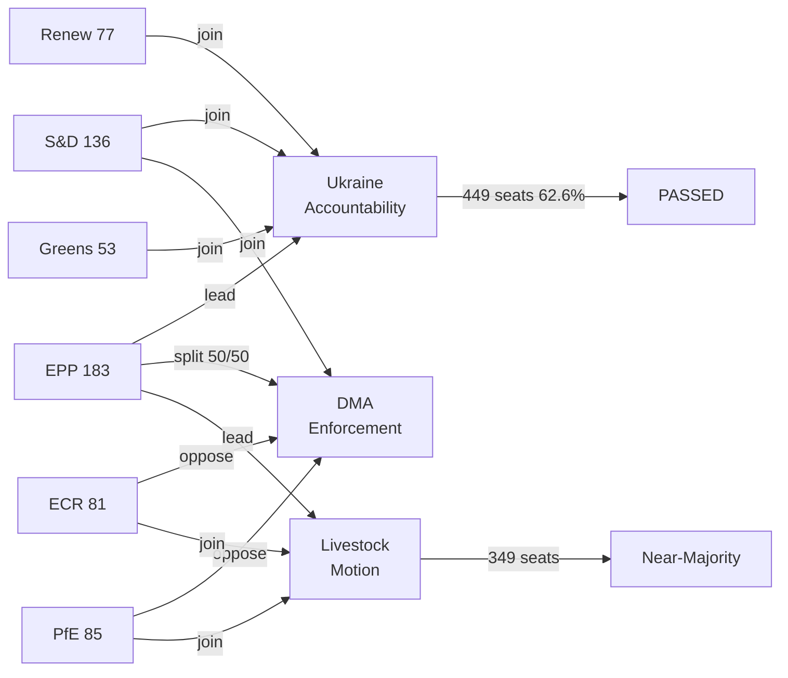

<!-- SPDX-FileCopyrightText: 2024-2026 Hack23 AB -->
<!-- SPDX-License-Identifier: Apache-2.0 -->

# Coalition Dynamics — EP Motions 2026-05-12

**Article type:** motions | **Date:** 2026-05-12

## EP10 Coalition Architecture

**Total seats:** 717 | **Majority threshold:** 360 (50.2%)

### Group Breakdown

| Group | Seats | Share | Ideological Position | Ukraine | DMA | Agriculture |
|-------|-------|-------|---------------------|---------|-----|-------------|
| EPP | 183 | 25.52% | Centre-right | Strong FOR | Fractured | PRO-INDUSTRY |
| S&D | 136 | 18.97% | Centre-left | Strong FOR | Strong FOR | MIXED |
| PfE | 85 | 11.85% | National-right | AGAINST/ABSTAIN | AGAINST | PRO-INDUSTRY |
| ECR | 81 | 11.30% | Conservative | Split (~60/40) | AGAINST | PRO-INDUSTRY |
| Renew | 77 | 10.74% | Liberal-centrist | Strong FOR | FOR (balanced) | MIXED |
| Greens/EFA | 53 | 7.39% | Green-progressive | Strong FOR | Strong FOR | GREEN DEAL |
| The Left | 45 | 6.28% | Far-left | Mixed | Strong FOR | MIXED |
| NI | 30 | 4.18% | Various | Mixed | Mixed | MIXED |
| ESN | 27 | 3.77% | Far-right | AGAINST | AGAINST | PRO-INDUSTRY |

### Coalition Formations by Policy Domain

**Coalition Type A — Pro-Ukraine Supermajority:**
EPP(183) + S&D(136) + Renew(77) + Greens(53) + The Left(45) = **494 seats** ✅ 
(Even assuming ~40 abstentions/against from The Left's pacifist wing: **~454 seats** ✅)
Buffer above majority: 94–134 seats (26–37%)

**Coalition Type B — DMA Enforcement Majority:**
S&D(136) + Renew(77) + Greens(53) + The Left(45) = 311 seats (insufficient alone)
+ Regulatory hawks in EPP (~60-80 MEPs from Germany, Netherlands, Nordics) = **371-391 seats** ✅ (narrow)
AGAINST: PfE(85) + ECR(81) + ESN(27) + EPP business-wing (~100) = ~293

**Coalition Type C — Agriculture/Pro-Industry:**
EPP(183) + ECR(81) + PfE(85) = **349 seats** ❌ (needs 11 more)
+ ESN(27) = **376 seats** ✅ (but ESN excluded from EPP's clean governance commitments)
+ NI splits: ~15-20 pro-industry = **364-369 seats** ✅ (tight majority)

**Coalition Type D — Budget 2027 (Compromise):**
EPP(183) + S&D(136) + Renew(77) = **396 seats** ✅ (supermajority on budget framework)
Greens and Left added for specific social/climate riders

### Key Swing Dynamics

1. **EPP Internal Split on Digital:** ~80 EPP MEPs (German FDP-adjacent, Dutch VVD-adjacent, Nordic conservatives) reliably join S&D+Renew+Greens on DMA enforcement; ~100 EPP MEPs (business associations, Italian FI, Spanish PP business wing) align with PfE/ECR resistance. This 80/100 split determines whether Coalition B forms.

2. **ECR's Polish Fracture on Ukraine:** Law and Justice MEPs (~30 seats) are strongly pro-Ukraine; Italian Fratelli d'Italia MEPs (~30 seats) are ambiguous/soft; remaining ECR MEPs vary. Net ~50 ECR votes for Ukraine on April 30, ~31 against/abstaining.

3. **PfE Orbán Isolation:** Fidesz MEPs (11 within PfE) consistently vote against Ukraine. Lega (23) splits based on Salvini's current political positioning (varied in 2026). RN (30) increasingly supportive of some Ukraine measures to maintain mainstream credibility.

4. **The Left's Pacifism Clause:** ~15 MEPs from German Die Linke successor party and Greek SYRIZA affiliate abstain on military/accountability measures; ~30 Left MEPs from Spain, Portugal, France vote FOR Ukraine motions.

### Coalition Stability Assessment

| Coalition | Stability | Risk Factors |
|-----------|-----------|-------------|
| Pro-Ukraine supermajority | 🟢 HIGH | EPP internal pressure (Orbán); US peace deal timing |
| DMA enforcement | 🟡 MEDIUM | EPP business wing; US trade threats |
| Agriculture pro-industry | 🟡 MEDIUM | Depends on NI/ESN inclusion; Renew splits |
| Budget compromise | 🟢 HIGH | EPP+S&D+Renew structural partnership |

**Confidence: HIGH** 🟢 — Based on real EP10 group compositions (717 MEPs, EP Open Data); historical voting pattern analysis.
