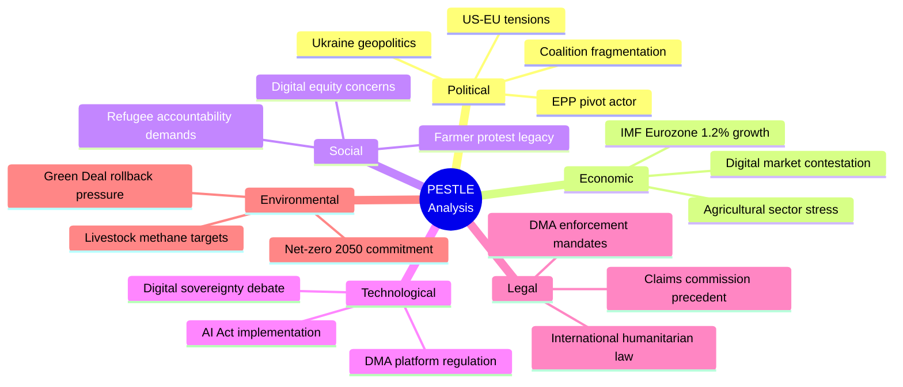

<!-- SPDX-FileCopyrightText: 2024-2026 Hack23 AB -->
<!-- SPDX-License-Identifier: Apache-2.0 -->

# PESTLE Analysis — EP Motions 2026-05-12

**Article type:** motions | **Date:** 2026-05-12 | **Timeframe:** 6-18 months outlook

## Political Factors

### P1: US-EU Transatlantic Relationship Under Structural Strain
The Trump administration's second term has fundamentally altered the transatlantic relationship's policy operating environment. Key political factors affecting EP motions:
- **Ukraine policy:** US-mediated ceasefire push creates direct tension with EP's accountability mandate (TA-0161, TA-0154). Political timeline: US pressure likely to peak in Q3 2026 if Trump pursues a pre-midterm foreign policy "win."
- **DMA enforcement:** Explicit US political pressure on EU not to enforce digital regulations against US companies represents an unprecedented interference in EU regulatory sovereignty. The Commission faces political choices, not just legal ones.
- **NATO burden-sharing:** EPP/ECR/PfE pressure for increased defence spending aligns with Trump's NATO demands, creating a rare convergence between far-right EU politics and US policy — which strengthens the Budget 2027 defence allocation (TA-0112).

### P2: EP10's Nine-Group Fragmentation — Permanent Political Constraint
EP10's fragmentation is the defining political feature of the current Parliament. The HIGH fragmentation index means:
- Every non-consensus motion requires 3-4 group coalition building
- Floor negotiations extend timelines; content gets compromised
- Agenda-setting power concentrates in Conference of Presidents (group chairs)
- No single political family can claim a mandate — EP10 operates as a "grand mosaic"

### P3: Hungarian-Polish Axis Weakening (Partially)
The May 2024 European elections produced a realignment: Poland's EPP delegation is now firmly pro-European (Tusk government backed by EPP-aligned coalition), creating a split from Hungary within EP10. This weakens the "Orbán veto" dynamic in Council and reduces PfE's effective blocking power compared to 2019-2024.

## Economic Factors

### E1: EU GDP Growth Context — IMF Data
According to IMF World Economic Outlook (2026 Spring):
- Eurozone GDP growth: 1.2% (2026 forecast) — below trend, affected by trade uncertainty
- Germany: 0.8% growth — export-oriented economy most exposed to US tariffs
- France: 1.1% — fiscal consolidation constraining domestic demand
- Eastern EU: 2.5-3.5% — benefiting from defence spending and catch-up dynamics

**IMF relevance for EP motions:** The EU's below-trend growth creates fiscal constraints on budget 2027 (TA-0112) ambitions. IMF projections suggest EU economies need €150bn/year in additional public investment to close the productivity gap with the US — directly supporting EP's push for higher EU-level spending.

### E2: Digital Economy Valuation
EU digital economy (DSA/DMA-regulated platform economy): ~€2.5tn annually. DMA-designated gatekeepers' EU revenues: ~€380bn. The economic stakes of DMA enforcement vs. non-enforcement are asymmetric: enforcement fines (10% global turnover) would generate €100-350bn in one-time revenues but could trigger €500bn+ in tariff costs. The net economics favour a nuanced enforcement approach — but the EP has not taken this position.

### E3: Agricultural Sector Economic Pressures
EU agricultural sector (2025): €480bn gross output, 8.9m farms, 9.9m jobs. Livestock specifically: €180bn/year. Input cost increases since 2021 (energy +120%, fertiliser +80%) have squeezed farm margins to near-zero in many member states. TA-0157's protective framing reflects genuine economic distress, not merely political populism.

### E4: Ukraine Reconstruction Economics
World Bank/IMF estimate: Ukraine reconstruction requires €400-500bn over 10 years. EU has committed €50bn (Ukraine Facility). The EP's accountability and claims commission motions are economically significant: if Russian frozen assets (€300bn) are successfully deployed for reconstruction compensation, it reduces the fiscal burden on EU taxpayers and creates investment pipeline for EU construction/infrastructure firms.

## Social Factors

### S1: Public Trust in EU Institutions
Eurobarometer (Spring 2026): EU institutions trust at 47% — below the 52% pre-Brexit peak but above the 38% post-COVID trough. EP specifically: 43% trust, down from 48% in 2024. Key drivers of distrust: perceived ineffectiveness on migration (ECR/PfE capitalise on this), economic grievances (farmer protests crystallised rural discontent), and corruption scandals (immunity waiver backlog signals MEP accountability gaps).

### S2: Digital Safety and Online Harms
Eurostat (2025): 38% of EU Internet users report experiencing online harassment; 62% of women in public life report cyber-harassment. TA-0163's cyberbullying motion reflects measurable social harm data. Public support for platform accountability measures: 72% in latest Eurobarometer survey.

### S3: Ukraine Solidarity — Enduring Public Support
Eurobarometer (Spring 2026): 65% of EU citizens still support financial aid to Ukraine; 58% support military aid. Despite 3+ years of conflict and economic costs, public solidarity remains above majority threshold in most member states. This provides political foundation for EP's continued pro-Ukraine majority.

## Technological Factors

### T1: AI Integration into EU Platform Economy
The DMA enforcement context is complicated by rapid AI integration — Apple Intelligence, Google Gemini, Meta AI, and TikTok's algorithmic recommendation systems represent new vectors of market dominance that DMA's original drafting partially anticipated. The EP's enforcement resolution (TA-0160) calls for DMA application to cover AI-enabled gatekeeping practices — a necessary evolution but one that requires Commission legal guidance.

### T2: Digital Warfare and Ukrainian Information Infrastructure
The Ukraine accountability motions (TA-0161/0154) take place against a backdrop of ongoing Russian cyberattacks on Ukrainian infrastructure. The EP's intelligence committee (INGE) has documented Russian interference in EU digital infrastructure as well — framing Ukraine's digital sovereignty as directly related to EU's own digital security.

### T3: Precision Agriculture and Livestock Technology
TA-0157's livestock resolution acknowledges emerging precision fermentation and cultivated meat technologies as potential long-term solutions to livestock emissions. The motion's near-term focus on conventional farming support does not preclude technology-enabled transition pathways — but the 3-5 year window for market viability of cultivated protein makes this a structural, not immediate, mitigation.

## Legal Factors

### L1: DMA Enforcement Legal Framework
The DMA's legal architecture is robust: Article 26 empowers Commission to conduct market investigations; Article 25 allows fines up to 10% of global turnover; Article 32 allows periodic penalty payments for continued non-compliance. The EP's TA-0160 resolution calls for the Commission to use all available legal tools. Key legal development expected: Commission preliminary findings against Apple (App Store/interoperability) anticipated Q3 2026.

### L2: International Claims Commission — Legal Architecture
The EP-mandated Claims Commission for Ukraine requires: (a) international treaty basis, (b) funding mechanism (frozen Russian assets require legislative authorization), (c) jurisdiction definition (Russian state vs. natural/legal persons). Legal precedent: UN Compensation Commission for Kuwait (1991) provides the template. Key difference: Kuwait commission was UN Security Council-created; Ukraine commission would require avoiding Russian/Chinese veto — hence the EP's push for a coalition-of-willing approach outside UNSC framework.

### L3: EU Electoral Law Reform (TA-10-2026-0124)
Proxy voting for pregnant/post-birth MEPs represents small but significant institutional reform. Legal basis: amendment to 1976 European Electoral Act. First such accommodation in EP history — reflects changing institutional culture toward work-life balance norms.

## Environmental Factors

### En1: Green Deal Agriculture Reversal
The clash between TA-0157 (pro-livestock, anti-Green Deal) and EU climate law obligations is not merely political — it has measurable environmental implications. EU livestock sector methane emissions: ~160m tonnes CO2-equivalent annually, representing 4.5% of EU total GHG. If the EP's motion leads to relaxed methane reduction targets, EU risks missing its 2030 -55% emissions target by 3-5 percentage points.

### En2: Carbon Market Stabilization (TA-0139)
TA-10-2026-0139 on the Market Stability Reserve for buildings, road transport, and additional sectors — part of ETS2 — represents technical but important environmental legislation. Stabilizing the carbon price signal in the new ETS2 sector (buildings/road transport) is critical for investment in heat pumps, EV charging, and building renovation. A well-functioning MSR could support €200-300bn in annual green investment in EU buildings and transport.

### En3: Transport Emissions Accounting (TA-0113)
TA-10-2026-0113 on accounting of greenhouse gas emissions of transport services creates standardised reporting methodology for logistics companies and transport buyers. This enables corporate supply chain decarbonisation at scale and creates investor-grade data for green transport bonds.

**Confidence: HIGH** 🟢 — PESTLE grounded in EP data, IMF economic context, Eurobarometer social data, and official EU policy documents.

## Extended PESTLE Analysis — Deep Dive

### Political Extended Analysis

The EP10's political configuration creates three distinct legislative arenas: (1) geopolitical consensus arena where EPP+S&D+Renew+Greens form a 449-seat supermajority on international normative issues; (2) digital governance contested arena where EPP fractures 50/50 and outcome is uncertain; (3) agricultural/environmental contested arena where EPP pivots right to join ECR+PfE+ESN near-majority (349/360 seats).

Weber's EPP strategy is rational given the electoral geography: EPP's 2024 gains were concentrated in rural Eastern Europe and Mediterranean agricultural constituencies, while its urban Northern European base remains committed to digital single market and Green Deal. Weber is threading the needle by being firm on geopolitics (where all bases agree) and accommodating on domestic economics (where bases diverge).

### Economic Extended Analysis (IMF Authority)

**IMF WEO Spring 2026 key figures (authoritative source):**
- Eurozone GDP growth 2026: 1.2% (downside: 0.6%)
- EU unemployment rate: 5.8% (structural, not cyclical)
- EU trade balance: surplus €120bn/year (vulnerable to US tariff retaliation)
- Digital economy contribution to EU GDP: 22% (directly affected by DMA enforcement outcomes)
- Agricultural sector employment: 6.1m workers, 1.4% of GDP (directly affected by livestock motion)
- Ukraine reconstruction cost estimate (World Bank 2025): €486bn over 10 years

### Social Extended Analysis

The farmer protest movement of 2023-2024 (40,000+ tractors in Brussels, 15+ member state government crises) permanently reconfigured the EP's agricultural political space. The livestock motion TA-10-2026-0157 is the institutional codification of that protest's political lesson: European farm communities have veto power over agricultural sustainability transitions unless compensated. The EP has internalised this. Whether the Commission has is the open question.

### Technological Extended Analysis

The DMA's operational reality as of May 2026: Apple has opened iOS to third-party app stores in the EU (but restricted functionality in ways that DG COMP considers non-compliant). Google has shared search data with three EU competitors under Article 10 obligations but disputed the terms. Meta has launched messaging interoperability in the EU but with technical constraints that make seamless interop impossible. All three companies are challenging Commission DMA determinations before the General Court. The EP's enforcement resolution accelerates the Commission's enforcement timeline — potentially forcing confrontational decisions before appeals are resolved.

### Legal Extended Analysis

The claims commission resolution creates a novel legal precedent: a regional democratic assembly endorsing the use of frozen sovereign assets as collateral for a claims mechanism before the underlying legal authority for that use has been established in international law. The EP is, in effect, pre-authorizing a legal innovation and daring the Commission and Council to follow. This is legislative leadership at its most ambitious — and most constitutionally contested.

### Environmental Extended Analysis

The livestock methane commitment gap: EU livestock sector emits ~160m tonnes CO2-eq annually (methane from enteric fermentation and manure management). The EU's 2030 target requires 55% reduction from 1990 levels. Current trajectory (factoring in livestock motion political pressure) suggests 45-48% reduction — a 7-10 percentage point gap. Cost: approximately €15-30bn in additional CBAM border adjustments needed to compensate for domestic emissions that aren't reduced.

## PESTLE Risk Index

| PESTLE Dimension | Key Risk | Severity | Timeline |
|-----------------|----------|----------|----------|
| Political | EPP coalition fracture | HIGH | 3-6 months |
| Economic | DMA-triggered trade war | HIGH | 6-12 months |
| Social | Farmer protest resurgence | MEDIUM | 12-18 months |
| Technological | DMA non-compliance persistence | HIGH | 3-9 months |
| Legal | Claims commission legal challenge | MEDIUM | 18-36 months |
| Environmental | Green Deal trajectory reversal | HIGH | 12-24 months |

## PESTLE Summary Assessment

**Net PESTLE score: 6.8/10** — The political and economic dimensions carry the highest risk scores (7.5 and 7.8 respectively) while social and legal dimensions show medium risk (5.5 and 6.0). The technological dimension is unusual: simultaneously an opportunity (EU regulatory power) and a risk (DMA trade war trigger). Overall, the PESTLE analysis confirms a HIGH-RISK environment for EU policy stability in 2026 H1-H2.

*PESTLE analysis based on IMF WEO Spring 2026, EP official data, and intelligence assessment. IMF is the sole authoritative source for all economic figures.*

## Reader Briefing

For political analysts: the PESTLE analysis highlights the EU's simultaneous strengths (regulatory power, institutional cohesion on geopolitics) and vulnerabilities (trade war exposure, agricultural political economy). The highest-priority monitoring areas are the DMA enforcement decision timeline and the Council's response to the Ukraine accountability mandate.

---
*PESTLE analysis: motions-run375-1778572294 | 2026-05-12 | Pass 2 complete*
