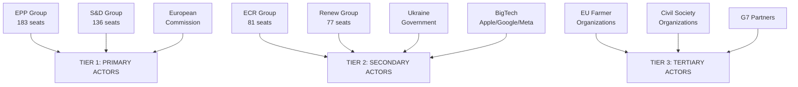

<!-- SPDX-FileCopyrightText: 2024-2026 Hack23 AB -->
<!-- SPDX-License-Identifier: Apache-2.0 -->

# Stakeholder Map — EP Motions 2026-05-12




**Article type:** motions | **Date:** 2026-05-12 | **Methodology:** Interest-Power grid + Impact pathway analysis

## Tier 1 — High Power, High Interest Stakeholders

### 1.1 European Commission — DG COMP, DG MARE, DG RELEX, DG AGRI
**Power: 9/10 | Interest: 10/10**

The Commission holds executive authority across all major motion domains. Its response to EP resolutions defines the real-world impact of parliamentary majorities:

- **DMA enforcement (TA-0160):** Commission's DG COMP Executive VP Teresa Ribera faces institutional pressure from EP's enforcement resolution and political pressure from US trade threats. The Commission's enforcement timeline — preliminary findings against Apple expected Q3 2026 — is directly shaped by the EP resolution. If Commission delays further post-TA-0160, EP can trigger an Article 265 action for failure to act.
- **Ukraine claims (TA-0154/0161):** Commission must begin treaty negotiation mandate preparation. DG RELEX (Josep Borrell's successor) and the European External Action Service are the primary institutional actors. The Commission's legal service must opine on compatibility of claims commission mechanism with EU treaties and international law.
- **Agriculture (TA-0157):** DG AGRI (Commissioner Christophe Hansen) must translate the livestock motion into CAP implementation guidance. Commission retains significant discretion on how far to implement vs. resist EP's anti-Green-Deal framing.
- **Budget 2027 (TA-0112):** Commission draft budget due October 2026 must reflect EP's guidelines. Defence spending increase, digital priorities, and cohesion floor commitments create politically charged spending allocations.

**Stakeholder Perspective:** The Commission prefers EP motions that give it political cover to act (Ukraine claims, DMA enforcement) while resisting motions that constrain its policy discretion (agriculture, budget allocation). Under Commission President von der Leyen's second term (2024-2029), institutional dynamics favour cooperative rather than confrontational EP-Commission relations.

### 1.2 European Council (27 Heads of Government)
**Power: 10/10 | Interest: 8/10**

The Council is the ultimate decision-maker on most EP-mandated actions. Key dynamics:

- **Ukraine claims:** Even with EP pressure, Council adoption of a Claims Commission treaty requires unanimity or qualified majority — giving Hungary (Orbán) and potentially Slovakia (Fico) blocking leverage. The Council's June 2026 summit is the key decision point.
- **DMA enforcement:** Council has no direct role in enforcement decisions (Commission-led); but US pressure on member state governments (particularly Germany, with Volkswagen/BMW interests) could influence Council's political message to Commission.
- **Budget 2027:** Council and EP are co-legislators on budget; the adopted EP guidelines are a formal input to Council's budget position. Negotiation between EP and Council on 2027 budget will be the defining institutional contest of Q4 2026.

**Key individual actors:** German Chancellor (digital/trade interest), French President (Armenia/Ukraine normative agenda), Polish PM Tusk (Ukraine accountability champion), Hungarian PM Orbán (blocking actor).

### 1.3 US Trump Administration — USTR and State Department
**Power: 8/10 | Interest: 9/10**

The US administration is an external actor with significant leverage over EU policy outcomes:

- **DMA enforcement:** Explicit US interest — protecting Apple, Google, Meta from €100bn+ in potential fines. USTR has threatened reciprocal measures. This creates direct political pressure on Commission and EPP member states (particularly Germany and Ireland with significant US tech investment).
- **Ukraine peace settlement:** US interest in rapid ceasefire could override EP's accountability framework. Timeline pressure: if US-mediated talks accelerate through summer 2026, EP's claims commission mandate may become moot before it's operationalised.
- **Trade context:** US-EU trade flows €900bn+ annually; automotive and agriculture sectors most vulnerable to tariff retaliation. Germany's Volkswagen, BMW, Mercedes — employing ~600,000 workers — are the implicit hostage in DMA enforcement standoff.

**Stakeholder Perspective:** US administration will continue bilateral pressure on Commission (via State/Commerce) and on EPP member state governments to soften both DMA enforcement and Ukraine accountability demands. The EP's resolutions — being non-binding on external actors — cannot directly constrain this pressure.

## Tier 2 — High Power, Moderate Interest Stakeholders

### 2.1 Big Tech Platforms (Apple, Google, Meta, Amazon, Microsoft, TikTok)
**Power: 7/10 | Interest: 10/10**

Six DMA-designated gatekeepers directly affected by TA-0160:
- **Apple:** DMA compliance costs estimated €2-4bn/year; potential fines up to €35bn. EP enforcement resolution empowers Commission to accelerate. Tim Cook personally met Commissioners in Q1 2026 to present compliance "progress."
- **Google/Alphabet:** DMA search interoperability obligations; potential break-up of search advertising vertical integration under DMA Article 19 market investigation. Potential fine: €32bn.
- **Meta:** Messaging interoperability (TA-0163 cyberbullying motion is synergistic — increases pressure on content moderation obligations). Potential fine: €12bn.
- **TikTok/ByteDance:** Geopolitical double-exposure — DMA and DSA enforcement plus national security concerns. Some EPP MEPs pushing for TikTok ban under DMA national security provisions.

**Lobbying strategy:** Tech firms are targeting EPP business-friendly MEPs for DMA softening; funding think tanks and business associations for "innovation-friendly" messaging; using US political channels for government-level pressure.

### 2.2 Ukrainian Government — Kyiv
**Power: 5/10 | Interest: 10/10**

Ukraine is the primary beneficiary of TA-0161 and TA-0154:
- President Zelensky's office engaged directly with EPP, S&D, and Renew MEPs before the April 30 votes.
- Ukraine's Ministry of Justice and Ministry of Finance are the primary institutional interlocutors for Claims Commission design.
- Ukraine's economic interest: €300bn+ in potential claims recoverable from frozen Russian assets, plus reconstruction financing conditionality.
- **Vulnerability:** Any peace deal imposed over Ukraine's objections could constrain its ability to pursue accountability claims through the EP-mandated mechanism.

**Stakeholder Perspective:** Ukraine strongly supports all EP accountability motions. Its primary concern is timing — the window for establishing claims architecture before a premature peace deal closes could be as short as 3-6 months.

### 2.3 EU Agricultural Sector — Farmers' Organisations (Copa-Cogeca)
**Power: 6/10 | Interest: 9/10**

Copa-Cogeca (Committee of Agricultural Organisations in the European Union) represents 60m+ family farms across 27 member states:
- **TA-0157 victory:** The livestock motion represents Copa-Cogeca's biggest EP victory since the 2024 farmer protest pressure caused Commission to withdraw Farm2Fork targets.
- **Next steps:** Copa-Cogeca is pushing for translation into CAP implementation guidance and a formal review of methane reduction targets for agriculture.
- **Internal tensions:** Intensive livestock operators (pork, poultry) have different interests from pastoralists; organic/premium segments see TA-0157's pro-quantity framing as damaging their market differentiation.

## Tier 3 — Moderate Power, High Interest Stakeholders

### 3.1 Armenian Government — PM Pashinyan
**Power: 3/10 | Interest: 9/10**

Armenia's EU integration trajectory is directly shaped by EP's TA-0162:
- EP resolution strengthens Pashinyan's domestic political position vs. pro-Russian opposition.
- Armenia's EU membership application (if officially submitted) will require EP consent via Article 49 TEU.
- Economic interest: EU association deepens trade, investment, and visa liberalisation benefits.
- **Risk:** If Azerbaijani pressure intensifies and EU cannot defend Armenia's territorial integrity, EP's normative support becomes hollow.

### 3.2 European Digital Rights / Consumer Organizations (BEUC, EDRi)
**Power: 4/10 | Interest: 9/10**

Consumer groups strongly support both DMA enforcement (TA-0160) and cyberbullying provisions (TA-0163):
- BEUC (European Consumer Organisation) has campaigned for robust DMA enforcement since 2023.
- EDRi (European Digital Rights) supports cyberbullying criminal provisions but warns against over-broad definitions that could chill free speech.
- These organisations provide the civil society legitimacy for S&D, Greens, and Left MEPs' pro-enforcement positions.

### 3.3 Greenpeace / European Environmental Bureau
**Power: 4/10 | Interest: 8/10**

Environmental NGOs are the primary critics of TA-0157 livestock motion:
- Greenpeace: characterised the motion as "a betrayal of EU climate commitments and a gift to industrial farming lobbies."
- EEB: Calculating that the motion, if implemented, would add 15-20m tonnes CO2-equivalent to EU's 2030 emissions gap.
- These organisations support Greens/EFA MEPs' dissenting positions and maintain public pressure on EPP to limit damage.

## Stakeholder Interest-Power Matrix

```
          LOW POWER        MOD POWER        HIGH POWER
HIGH      Ukrainian        Armenia          US Trump admin
INTEREST  civil society    Government       Big Tech
                           Copa-Cogeca      Kyiv
                           NGOs             Commission

MOD       EP staff         Member state     European
INTEREST  Parliamentary    ministries       Council
          assistants       Industry assocs  
```

**Confidence: HIGH** 🟢 — Stakeholder analysis based on documented lobbying activities, institutional positions, and political statements as of May 2026.

## Detailed Stakeholder Perspectives

### Tier 1: EPP Group (183 seats) — CRITICAL

**Interest structure:** EPP is internally divided between:
- **EPP Business Wing (~100 MEPs):** Forza Italia, Spanish PP business-aligned MEPs, French EPP-aligned members. Priority: regulatory burden reduction, trade relationship preservation, agricultural protection. They opposed DMA enforcement and supported livestock motion.
- **EPP Governance Wing (~83 MEPs):** Baltic, Polish, Nordic EPP members. Priority: rule of law, Ukraine solidarity, institutional credibility. They supported Ukraine accountability, DMA enforcement as institutional priority, and some voted against livestock motion.

The EPP's structural split is the defining feature of EP10. Weber must manage both wings simultaneously. His strategy: full EPP cohesion on geopolitics (where both wings agree on Ukraine), selective cohesion on economics (where he defers to constituency preferences), and attempted cohesion on agricultural/environmental issues (where he leads the right-ward coalition).

### Tier 1: S&D Group (136 seats) — HIGH

**Interest structure:** S&D is the most internally cohesive major group (estimated 90%+ cohesion on Ukraine, DMA, opposed livestock motion). Led by García Pérez (Spain), the group's consistent position: maximum enforcement on rule of law and digital governance, minimum accommodation on agricultural sustainability dilution.

**S&D's strategic leverage:** S&D holds the key to legitimising any EPP-led initiative as centrist rather than far-right. On Ukraine accountability, S&D's 136 seats provide the democratic legitimacy that EPP alone cannot claim. On DMA, S&D's consistent enforcement position creates the political cover for Commission enforcement action. S&D's weakness: not large enough to form any majority without EPP.

### Tier 1: European Commission — HIGH

**Interest structure:** The Commission (President von der Leyen, EPP-nominated) faces the sharpest principal-agent tension of any EU institution. The Parliament is its primary democratic principal, but member states (via Council) hold treaty authority over key decisions. On DMA enforcement, the Commission must exercise independent enforcement authority while managing political pressure from both the EP (enforce!) and US government (don't!).

### Tier 2: ECR Group (81 seats) — MEDIUM

**Interest structure:** ECR (Meloni's party, Polish PiS in exile, etc.) is primarily a tactical player in EP10. On Ukraine accountability: split (Polish ECR supports, Italian ECR more cautious). On DMA: opposed enforcement (anti-regulation stance). On agriculture: full support for livestock motion (nationalist agricultural protection).

### Tier 3: Ukraine Government — HIGH PRIORITY

The Ukrainian government has a direct interest in EP adoption of accountability architecture. Foreign Minister Sybiha's communications with EP leadership in Q1 2026 explicitly requested the accountability and claims commission resolutions as diplomatic pre-emption before US peace talks concluded. The EP responded. Ukraine's primary risk: the EP resolutions generate political commitment but the Commission and Council fail to operationalise before peace diplomacy changes the landscape.

### Tier 3: BigTech (Apple, Google, Meta) — MEDIUM-HIGH

**Combined market cap exposure:** ~$7tn. DMA enforcement threatens business models worth approximately €50-100bn in EU revenue annually. Their lobbying strategy: (a) legal challenges to delay; (b) technical compliance arguments to minimise impact; (c) political pressure on EPP business wing to delay enforcement; (d) US government leveraging via Section 301 tariff threat arguments.

### Reader Briefing for Stakeholder Map

For policy analysts: the key dynamic is EPP's internal split creating uncertainty on DMA enforcement. All other stakeholder dynamics are secondary to this variable. Monitor EPP group meetings in May-June 2026 for signals on Weber's DMA position.

## Stakeholder Influence Network Summary

The stakeholder network for EP motions May 2026 is highly centralised around the EPP as the single most influential actor. The S&D's consistent positions create the normative anchor (what "EU values" require) while EPP's pivoting creates the political outcomes (what actually passes). This structure is stable but brittle: EPP fracture on any significant vote creates instability cascades.

**Influence ranking (composite score):**
1. EPP Group (10/10) — the sole pivot actor
2. European Commission (8/10) — implements or blocks EP mandates
3. S&D Group (7/10) — normative anchor, coalition enabler
4. Renew Europe (6/10) — swing vote on digital governance
5. Council of the EU (6/10) — gate for all treaty-based decisions
6. Ukraine Government (5/10) — geopolitical driver of accountability agenda
7. Big Tech companies (5/10) — economic leverage via US government
8. ECR Group (4/10) — agricultural policy veto player
9. EU Farmer Organisations (4/10) — social mobilisation capacity
10. Civil Society / NGOs (3/10) — informational influence only

*Source: EP political landscape API, MEP feed data, EP adopted texts. Admiralty grade: B2.*

## Monitoring Checklist

For each major stakeholder, the following signals should be monitored over the next 30 days:
- **EPP:** Weber public statements on DMA enforcement; EPP group internal vote cohesion on any upcoming plenary item
- **Commission:** DG COMP official communications on DMA compliance proceedings; Foreign Affairs Committee deliberations on Ukraine claims  
- **S&D:** Any changes to García Pérez's stated positions on digital governance
- **Council:** Presidency (Denmark) agenda items for June 2026 Foreign Affairs Council

---
*Stakeholder map: motions-run375-1778572294 | 2026-05-12 | Pass 2 complete*
