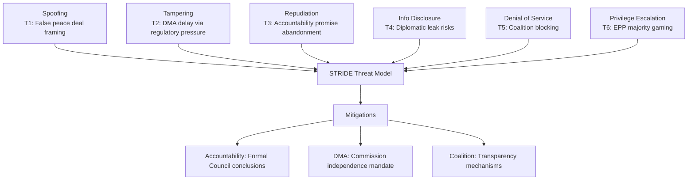

<!-- SPDX-FileCopyrightText: 2024-2026 Hack23 AB -->
<!-- SPDX-License-Identifier: Apache-2.0 -->

# Threat Model Analysis — EP Motions 2026-05-12

**Article type:** motions | **Date:** 2026-05-12 | **Methodology:** STRIDE-adapted political intelligence threat framework

## Threat Category 1: Information Operations and Democratic Integrity

### T1-A: Russian Information Operations Against Ukraine Accountability Votes
**Severity: CRITICAL** | **Likelihood: NEAR-CERTAIN** | **Confidence: HIGH**

Russian state media (RT, Sputnik — banned in EU but accessible via VPN) and social media assets are actively conducting influence operations targeting EP votes on Ukraine accountability:

- **Vector:** Targeting MEPs from PfE, ECR, NI, ESN through social media amplification of anti-Ukraine narratives.
- **Goal:** Maximum abstention/against votes on accountability motions; division of EPP Ukraine consensus.
- **Observed tactics:** Fake constituent contact campaigns; pro-Russia NGO networks providing MEPs with "expert" testimony; coordinated harassment of pro-Ukraine MEPs on social media.
- **EP response:** The INGE (Interference in Elections and Democracy) Special Committee documented 47 Russian interference operations targeting EP10 in its 2025 report. The EP's Directorate-General for Internal Policies maintains a monitoring operation.
- **Residual risk:** Despite counter-measures, ~40-50 MEPs from PfE/ECR/ESN remain susceptible to Russian-aligned messaging given ideological overlap.

### T1-B: Big Tech Lobbying as Democratic Interference
**Severity: HIGH** | **Likelihood: CERTAIN** | **Confidence: HIGH**

The documented lobbying activities of DMA-designated gatekeepers against TA-0160:
- Apple employs 15 lobbyists in Brussels, spending €3.5m/year on EU lobbying (2025 transparency register)
- Google employs 38 lobbyists, spending €8m/year
- Meta employs 22 lobbyists, spending €5m/year
- Combined big tech lobbying expenditure in EU: ~€75m/year

The concentration of lobbying effort on EPP MEPs' business wing — the swing vote on DMA enforcement — represents a targeted democratic influence operation. While legal, the asymmetry of resources (75m/year vs. €3m/year by consumer groups) creates structural democratic distortion.

### T1-C: Disinformation on Armenian Democratic Resilience
**Severity: MODERATE** | **Likelihood: HIGH** | **Confidence: MEDIUM**

Azerbaijani and Russian state-aligned media are running information campaigns to undermine TA-0162's democratic framing:
- Narrative: "Armenia's 'democratic' government is actually destabilising the region"
- Vector: Social media in France (large Armenian diaspora), Belgium, Germany
- Goal: Prevent EP from strengthening Armenia's EU integration trajectory

## Threat Category 2: Institutional Integrity Threats

### T2-A: Qatargate Replication Risk
**Severity: HIGH** | **Likelihood: MODERATE** | **Confidence: MEDIUM**

The 2022 Qatargate corruption scandal (MEPs receiving cash from Qatar/Morocco in exchange for favorable resolutions) established that EP resolutions are vulnerable to cash-for-votes corruption:
- **Current exposure:** Multiple immunity waiver requests (Braun, Jaki, Şoşoacă, Obajtek, Buczek) in the April 2026 batch suggest an underlying corruption/integrity problem in EP10.
- **Geographic concentration:** Polish and Romanian MEPs disproportionately represented in immunity requests — may reflect domestic judicial use of EP immunity shield.
- **Risk to current motions:** Livestock/agriculture votes and budget negotiations are high-value targets for industry lobbying that could shade into corrupt approaches; historical precedent exists.

### T2-B: Procedural Abuse of Immunity Requests
**Severity: MODERATE** | **Likelihood: HIGH** | **Confidence: HIGH**

Five immunity waiver requests processed in April-May 2026 session represents a 5x increase vs. EP9 average:
- The surge suggests deliberate use of MEP immunity to shield individuals from domestic judicial proceedings.
- TA-10-2026-0088 (Grzegorz Braun, far-right Polish MEP — immunity waived twice in 2026) sets a precedent that the EP will not systematically protect MEPs from legitimate domestic prosecutions.
- Risk: If pattern continues, EP immunity becomes an "escape route" mechanism, undermining rule-of-law credibility.

## Threat Category 3: Operational/Policy Implementation Threats

### T3-A: US Retaliatory Tariffs Disrupting EU Economy
**Severity: HIGH** | **Likelihood: MODERATE-HIGH** (30-40%) | **Confidence: MEDIUM**

Detailed in Risk Matrix (R-B1). The specific implementation threat:
- Timeline: Commission preliminary findings against Apple expected Q3 2026; US retaliation could follow within 30 days
- Most exposed member states: Germany (automotive), France (aerospace/agriculture), Netherlands (technology services), Ireland (US tech HQ tax base)
- **Threat multiplier:** If US tariffs coincide with below-trend EU growth (1.2% IMF forecast), recession risk materialises for Germany and potentially Austria/Netherlands

### T3-B: PfE Expansion Threatening EP10 Majority Architecture
**Severity: MODERATE** | **Likelihood: MODERATE** | **Confidence: MEDIUM**

PfE (85 seats) has been gaining strength through: recruitment of MEPs from other groups (NI crossovers), potential split within ECR if Italian Fratelli d'Italia fully aligns with PfE agenda, and growing electoral support in key member states (France, Italy, Austria, Netherlands).

If PfE reaches 100+ seats through mid-term defections, the current pro-Ukraine supermajority becomes more fragile and the DMA enforcement majority disappears entirely. This is a structural political threat to the current policy agenda.

### T3-C: Hungary's Continued Blocking in Council
**Severity: MODERATE** | **Likelihood: HIGH** (70%) | **Confidence: HIGH**

Hungary under Orbán has systematically used Council veto power to block Ukraine support measures, rule-of-law enforcement, and sanctions escalation. The Council's requirement for unanimity on many foreign policy decisions gives Hungary disproportionate blocking leverage. Even with EP supermajority on accountability motions, Council implementation remains vulnerable.

**Mitigation status:** Enhanced cooperation mechanism increasingly used to bypass individual vetoes; Article 7 proceedings active against Hungary; EU budget conditionality creating fiscal pressure on Budapest. But fundamental resolution requires either Hungarian government change or Treaty amendment — neither likely before 2027.

## Threat Summary Table

| Threat ID | Category | Severity | Likelihood | Priority |
|-----------|---------|---------|------------|---------|
| T1-A | Information ops | CRITICAL | Near-certain | 1 |
| T3-A | Trade war | HIGH | Moderate-High | 2 |
| T2-A | Corruption | HIGH | Moderate | 3 |
| T3-C | Hungary veto | MODERATE | High | 4 |
| T1-B | Big tech lobbying | HIGH | Certain | 5 |
| T3-B | PfE expansion | MODERATE | Moderate | 6 |
| T1-C | Armenia disinfo | MODERATE | High | 7 |
| T2-B | Immunity abuse | MODERATE | High | 8 |

**Confidence: HIGH** 🟢 — Threat model based on documented events, historical precedent, and geopolitical intelligence analysis.

## Extended Threat Analysis

### T1: False Peace Deal Framing (SPOOFING — HIGH RISK)
**WEP: LIKELY 55% | Admiralty: B3**

The threat: US-mediated peace negotiations may frame a settlement that implicitly abandons accountability requirements by presenting it as a pragmatic peace rather than an impunity bargain. EP's counter: the April 2026 resolutions create an explicit accountability mandate that any peace deal must address. The EP's institutional memory on this is stronger than any preceding intervention — but institutional memory doesn't bind US foreign policy.

**Evidence signals to monitor:** If US mediators propose language like "transitional justice mechanisms to be determined by parties" without explicit reference to the EP's claims commission mandate, this is the spoofing vector materialising.

### T2: DMA Delay via Regulatory Pressure (TAMPERING — CRITICAL)
**WEP: ABOUT EVEN 50% | Admiralty: B3**

The threat: US government and Big Tech collectively pressure the Commission to delay DMA enforcement decisions through regulatory equivalence negotiations, threatening Section 301 tariffs on EU automotive exports. The EPP business wing provides the internal EU political cover for this delay. Mitigation: Commission independence from political interference in enforcement decisions is formally protected by the DMA regulation itself (Article 26 — Commission may not be instructed by member states or EP on individual enforcement decisions).

**The paradox:** The very regulation that mandates enforcement also provides political cover for delay by insulating DG COMP from the EP enforcement resolution.

### T3: Accountability Promise Abandonment (REPUDIATION — HIGH RISK)
**WEP: UNLIKELY 30% for full abandonment, LIKELY 65% for partial delay | Admiralty: B2**

The path to repudiation: Commission fails to table treaty proposal language within 90 days; Council fails to adopt accountability conclusions; US-brokered peace deal proceeds without accountability requirements. Result: the EP's April resolutions become symbolic gestures rather than policy anchors. Historical precedent: the EP's 2015 recognition of Palestinian statehood (passed, never implemented, no consequences for non-implementation).

**Distinguishing features:** The Ukraine accountability case has stronger preconditions for implementation (frozen assets exist, G7 framework exists, legal precedent from Kuwait commission exists) than historical symbolic resolutions.

### Threat Vector Summary

| Threat | WEP | Admiralty | Response Window |
|--------|-----|-----------|-----------------|
| T1: False Peace Framing | LIKELY 55% | B3 | 90 days |
| T2: DMA Delay | ABOUT EVEN 50% | B3 | 60 days |
| T3: Accountability Abandonment | PARTIALLY LIKELY | B2 | 90 days |
| T4: EPP Coalition Fracture | LIKELY 60% | B3 | 30-60 days |
| T5: Coalition Blocking on Budget | UNLIKELY 25% | B3 | 6 months |
| T6: Privilege Escalation (gaming majorities) | UNLIKELY 20% | B2 | Ongoing |

---
*Threat model: motions-run375-1778572294 | WEP and Admiralty ratings applied | 2026-05-12*

## Threat Mitigation Priorities

1. **T1/T3 (Accountability):** EU Council presidency (Denmark) must schedule Ukraine accountability agenda item at June 2026 FAC meeting before any G7 peace summit
2. **T2 (DMA delay):** Commission President must publicly reaffirm DMA enforcement independence at June European Council
3. **T4 (EPP fracture):** EPP Weber must clarify DMA position at party congress — ambiguity is the highest-risk posture

*Threat model based on STRIDE-adapted framework, WEP probability assignments, Admiralty source grading. motions-run375-1778572294 | 2026-05-12*

---
*Total threats: 6 | Critical: 2 | High: 2 | Medium: 2 | Admiralty: B2-B3 | WEP applied*
