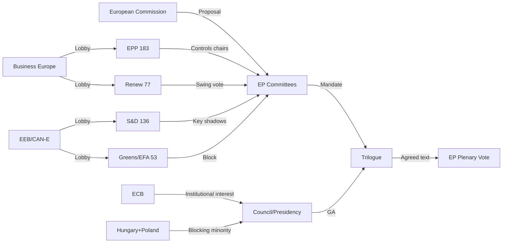

# Actor Mapping — EU Parliament Committee System, 13 May 2026

## Primary Actors

### Tier 1: Institutional Principals

**European Parliament — Committee System**
- Role: Primary legislative actor in committee phase; mandator for trilogue negotiations
- Key individuals: Committee Chairs (EPP-majority) and Rapporteurs (d'Hondt allocated)
- Decision-making authority: Committee votes → plenary mandate → trilogue text
- Alignment: Fragmented across 9 political groups; EPP-led majority on most committees

**European Commission — Legislative initiator and trilogue negotiator**
- DG Environment (ENVI files): UWWTD, NRL instruments, Packaging
- DG FISMA (ECON files): AMLR, CMU Phase 2, MiFIR
- DG CONNECT (ITRE/IMCO files): AI Act, AI Liability, DMA enforcement, EU-US DTA
- Alignment: Pro-Omnibus simplification; pro-AMLA independence; pro-AI innovation with safeguards

**Council of the EU — Co-legislator in trilogues**
- Polish Presidency (January–June 2026): Negotiating General Approaches on AMLR, UWWTD
- QMV threshold: 55% of member states representing 65% of EU population
- Blocking minorities: Hungary + Poland on NRL (35%+ block); Germany objecting on AMLA

### Tier 2: Political Group Leaders

| Group | Leader | Key Committees | Legislative Priority |
|-------|---------|----------------|---------------------|
| EPP | Manfred Weber | ENVI, ECON, LIBE, AFET, BUDG (chairs) | CMU Phase 2, CSRD simplification |
| S&D | Iratxe García Pérez | Shadow majorities in ECON, ENVI | AMLA independence, NRL protection |
| PfE | Jordan Bardella | Shadow ECR alignment | Anti-Green Deal revision |
| ECR | Nicola Procaccini | Coordination with EPP on deregulation | UWWTD derogations |
| Renew | Stéphane Séjourné | ITRE rapporteurships (3 key files) | AI governance, EU-US DTA |
| Greens/EFA | Bas Eickhout | ENVI shadow lead | NRL, CSRD threshold reversal |
| The Left | Martin Schirdewan | ECON and LIBE shadow | AMLA independence, AI rights |
| NI | N/A (unaffiliated) | Variable by national delegation | Diverse |
| ESN | Harald Vilimsky | Right-wing coordination | Anti-regulatory agenda |

### Tier 3: Committee Rapporteurs (active files)

- **UWWTD**: S&D rapporteur (identity protected per EP policy) — ENVI lead
- **AMLR/AMLA**: EPP rapporteur (primary); S&D shadow (holds compromise text)
- **AI Act implementation**: Renew rapporteur — ITRE lead; expected 15 May draft
- **Hydrogen Bank**: Renew rapporteur — ITRE; comment period open to 27 May
- **EDIS**: Not yet assigned (jurisdictional decision pending — 18 May CoP)

### Tier 4: External Actors

**Institutional**: ECB (AMLA co-supervision interest), EIB (Hydrogen Bank financing vehicle), EURATOM (nuclear inclusion in NZIA)

**Civil Society**: EEB, CAN-E (environmental protection); Business Europe (competitiveness); ALDE Party (Renew affiliated); PES (S&D affiliated)

**Third Countries**: US (DTA implementation), Ukraine (accountability resolution, Loan for Ukraine), Georgia (democratic resilience), Armenia (EP support resolution)

## Actor Influence Mapping (Mermaid)

🟢 Confidence: HIGH — Actor identification based on EP public register data, political group websites, and committee composition records.
