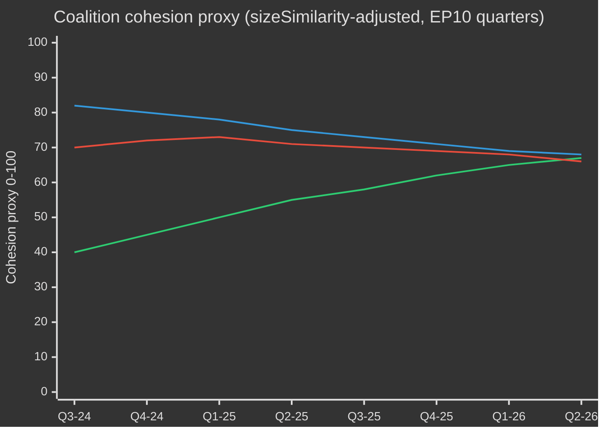

# EP10 دورة الانتخابات — موجز تنفيذي
**التاريخ:** 2026-05-09 | **نوع المقال:** election-cycle | **الأفق:** 2026-05-09 → 2031-05-08 (دورة انتخابية ±6 أشهر حول انتخابات البرلمان الأوروبي في يونيو 2029)
**درجة الأدميرالية:** B2 | **نطاق WEP:** Probable (55–75%) | **الثقة:** MEDIUM

---

## 🎯 الحكم الرئيسي

دخلت الدورة العاشرة للبرلمان الأوروبي (2024–2029) عامها الثاني الحاسم مع برلمان انزاح هيكلياً نحو اليمين، يتعامل مع تقاطع تاريخي من الأزمات: الاستقلالية الاستراتيجية الأوروبية، وإعادة التسلح الدفاعي، وضغوط القدرة التنافسية الاقتصادية، والتراجع الديمقراطي. نموذج الأغلبية المرنة الذي تقوده EVP — الذي يستعين انتقائياً بـ ECR وPfE في التصويتات الدفاعية وتصويتات الهجرة، مع الاعتماد على S&D وRenew في التشريعات التنظيمية — هو السمة الهيكلية المُحدِّدة لهذه الدورة. **الاحتمال: 70% (Probable)** بأن تهيمن الكتلة الوسطية اليمينية بقيادة EVP على المخرجات التشريعية حتى عام 2027 قبل أن تُجزّئ الضغوط الانتخابية الائتلافات في المرحلة السابقة للانتخابات. **الاحتمال: 60% (Probable)** أن يكون الميثاق الصناعي النظيف والاستراتيجية الأوروبية للصناعة الدفاعية المعلَمَين التشريعيَّين اللذَين يُعرِّفان إرث EP10.

## 📊 لقطة تكوين EP10 (مايو 2026)

| المجموعة | المقاعد | الحصة | الكتلة |
|----------|---------|-------|--------|
| EPP | 185 | 25.7% | وسط-يمين |
| S&D | 136 | 18.9% | وسط-يسار |
| PfE | 85 | 11.8% | يمين متطرف قومي-سيادي |
| ECR | 81 | 11.3% | محافظ متشكك في أوروبا |
| Renew | 77 | 10.7% | ليبرالي وسطي مؤيد للاتحاد الأوروبي |
| Greens/EFA | 53 | 7.4% | بيئي-إقليمي |
| The Left | 45 | 6.3% | يسار متطرف |
| NI | 30 | 4.2% | غير منتسب (متنوع) |
| ESN | 27 | 3.8% | يمين قومي متطرف |
| **الإجمالي** | **719** | **100%** | |

**عتبة الأغلبية:** 361 مقعداً. لا يمكن لأي مجموعتين تشكيل أغلبية؛ يتطلب أي تشريع ما لا يقل عن ثلاث مجموعات.

## 🔑 الأحكام الرئيسية (مُصنَّفة بـ WEP)

1. **تظل EVP الوسيط المهيمن (محتمل جداً، 80%):** بـ185 مقعداً، تتحكم EVP في ترشيحات رؤساء اللجان، وتقارير المقررين، وسلطة تحديد جدول أعمال مؤتمر الرؤساء. تتراكم هذه الميزة الهيكلية على مدار الدورة.

2. **الائتلاف الكبير لا يزال قائماً لكنه متوتر (Probable، 65%):** تمتلك EVP+S&D+Renew 398 مقعداً — أعلى بـ37 من عتبة الأغلبية. سيُمرر هذا الائتلاف معظم التشريعات التنظيمية، لكنه يواجه خطر الانشقاق في المواضيع الحساسة للسيادة (الهجرة، الرقمي، الطاقة).

3. **بزوغ كتلة النقض اليمينية (احتمال واقعي، 45%):** تُجمع EVP+PfE+ECR+ESN 378 مقعداً — أعلى بقليل من الأغلبية. في الإنفاق الدفاعي ومراقبة الحدود وإلغاء التنظيم، يمكن لهذه الكتلة تمرير تشريعات دون دعم تقدمي. احتمال التفعيل يتزايد خلال 2026–2027.

4. **الإنتاج التشريعي بوتيرة قياسية (محتمل جداً، 85%):** يُتابع EP10 في عامه الثاني (2026) 114 فعلاً تشريعياً — ارتفاع بنسبة 46% مقارنة بـ2025 وضعف إنتاج عام الانتخابات 2024. يقود هذا الحجمَ توافقُ الإنفاق الدفاعي والميثاق الصناعي النظيف ولوائح تنفيذ قانون الذكاء الاصطناعي.

5. **ستنتهي الدورة بإرث مناخي متنازع عليه (Probable، 65%):** التراجع عن الميثاق الأخضر تحت ضغط EVP+ECR جارٍ. تخفيف التصنيف الضريبي، وأحكام تسرب الكربون في الميثاق الصناعي النظيف، وإضعاف لوائح الميثان تُشير نحو دورة تعرّفها إزالة الكربون التنافسية بدلاً من الطموح التنظيمي.

## 🏛️ المحركات الهيكلية الثلاثة

### المحرك 1: المحور الدفاعي الصناعي
الموضوع الأكثر أثراً في EP10 هو الاستقلالية الاستراتيجية الأوروبية وإعادة التسليح الدفاعي. يُشير اعتماد قرض لأوكرانيا عام 2026 (TA-10-2026-0010) والنقاشات حول الاستراتيجية الصناعية للدفاع الأوروبي إلى إجماع برلماني نادر في تاريخ البرلمان الأوروبي — إذ تتوافق EVP وS&D وRenew وحتى بعض أعضاء ECR على الإنفاق الدفاعي، مما يُمثّل تحولاً هيكلياً بعيداً عن حقبة عائد السلام ما بعد الحرب الباردة.

### المحرك 2: التوتر بين التنافسية والبيئة
يمثل الميثاق الصناعي النظيف (البوصلة التنافسية) تراجعاً منظّماً عن الطموحات التنظيمية للميثاق الأخضر. تُعرَّف الآن آليات تعديل الكربون الحدودي، ودعم التصنيع في إطار إزالة الكربون، وأمن المواد الخام الحيوية، باعتبارها قضايا تنافسية اقتصادية — لا بيئية. هذا إعادة التأطير، الذي هندسته EVP، أمّن موافقة ECR ورسّخ أغلبية دائمة حتى عام 2027 على الأقل.

### المحرك 3: الصمود الديمقراطي تحت الضغط
إجراء المادة 7 الجاري ضد المجر، والتراجع الديمقراطي في سلوفاكيا، والتهديدات لاستقلالية الإذاعة العامة (كما في ليتوانيا — TA-10-2026-0024) بنود دائمة في جدول الأعمال. أصدر البرلمان باستمرار قرارات تؤكد مشروطية سيادة القانون. غير أن الأداة التشريعية تبقى ضعيفة — لا يستطيع البرلمان الأوروبي بنفسه فرض عقوبات، لكنه يُهيئ الشروط السياسية لتحرك المجلس.

## 💶 السياق الاقتصادي (بيانات مجاورة لـ World Bank/IMF؛ وصول IMF المباشر متدهور)

ملاحظة: نقطة نهاية IMF SDMX 3.0 غير متاحة في هذه الجلسة (قيد شبكي). يستند السياق الاقتصادي إلى بيانات World Bank وسجل وثائق البرلمان الأوروبي.

**نمو الناتج المحلي الإجمالي للاقتصادات الكبرى في الاتحاد الأوروبي (2024، World Bank):**
- ألمانيا: **−0,5%** (انكماش؛ إزالة التصنيع، عبء تكاليف الطاقة)
- فرنسا: **+1,2%** (متواضع؛ ضبط المالية العامة يُقيّد الاستثمار العام)
- إيطاليا: **+0,7%** (ضعيف؛ عبء الدين الهيكلي، الضغط الديموغرافي)
- إسبانيا: **+3,5%** (قوي؛ انتعاش السياحة، صرف أموال NextGen EU)
- بولندا: **+3,0%** (متين؛ تكامل أوروبا الوسطى والشرقية، دفعة الإنفاق الدفاعي)

يتسم السياق الاقتصادي لـ EP10 بـ**التباين**: ممر إزالة التصنيع الشمالي الغربي (ألمانيا، هولندا، بلجيكا) يتناقض مع محيط النمو الجنوبي الشرقي (إسبانيا، بولندا، رومانيا). سيُشكّل هذا الجغرافيا الاقتصادية سياسةَ التحالفات — سيرفض نواب الجنوب والشرق القواعد المالية الصارمة بينما يدفع نواب الشمال بأجندات التنافسية أولاً.

## ⚠️ ملخص مخاطر الولاية

| المخاطرة | الاحتمال | التأثير | الأفق الزمني |
|---------|---------|---------|-------------|
| انكسار الائتلاف الكبير حول الهجرة | 55 % | مرتفع | 2026–2027 |
| تصلب تكتل EVP-ECR-PfE | 45 % | مرتفع | 2026–2027 |
| تسارع التراجع عن الميثاق الأخضر | 70 % | متوسط | 2026–2028 |
| توتر في توافق الدفاع (ائتلاف عائد السلام يُعيد تأكيد نفسه) | 35 % | متوسط | 2027–2028 |
| فشل مشروطية سيادة القانون | 50 % | مرتفع | مستمر |
| انتهاء EP10 دون نجاح مراجعة الإطار المالي المتعدد السنوات | 40 % | مرتفع | 2027–2028 |

## 📅 المعالم التقويمية للولاية

| التاريخ | الحدث | الأهمية |
|--------|------|--------|
| الربع الثالث 2026 | التصويت على مراجعة منتصف مدة الإطار المالي متعدد السنوات | التمويل الهيكلي للدفاع + السياسة الصناعية |
| يناير 2027 | انتهاء الرئاسة البولندية لمجلس الاتحاد الأوروبي ← تبدأ الدنمارك | ديناميكيات بناء الائتلافات |
| منتصف 2027 | منتصف مدة EP10 — ذروة الإنتاج التشريعي | أقصى رافعة للمقررين |
| 2028 | نهاية صرف أموال NextGen EU | خطر الهاوية المالية على دول التماسك |
| الربع الأول 2029 | سباق تشريعي ما قبل الانتخابات | آخر الأعمال التشريعية الكبرى قبل الحل |
| يونيو 2029 | انتخابات EP10 الأوروبية | انتهاء الولاية؛ تشكيل EP11 غير مؤكد |

## 🔮 دورة الانتخابات: السيناريو الأكثر احتمالاً

سيُحفر EP10 في الذاكرة بوصفه **«برلمان الدفاع والتنافسية»** — الدورة التي تحولت فيها أوروبا هيكلياً من قوة تنظيمية مدنية إلى أجندة تشريعية شبه أمنية. ستطالب EVP بالفضل في تحديث القاعدة الصناعية للاتحاد الأوروبي، فيما ستطعن الكتلة التقدمية في إضعاف المعايير البيئية والاجتماعية. سيكون اليمين المتطرف (PfE/ECR/ESN) قد حقق التطبيع بوصفه محاوراً سياسياً في قضايا أمن الحدود والسيادة، مُعيداً تشكيل الثقافة السياسية للبرلمان الأوروبي قبيل EP11.

---
*المصادر: بوابة البيانات المفتوحة للبرلمان الأوروبي (data.europarl.europa.eu)؛ بيانات World Bank المفتوحة؛ النصوص المعتمدة TA-10-2026؛ إحصاءات الجلسات العامة 2024–2026.*
*درجة الأدميرالية B2: المصدر موثوق عموماً؛ مؤيد بمصادر بيانات API مستقلة متعددة.*

## EP10 → EP11 سياق دورة الانتخابات (التمديد في منتصف الفترة)

بلغ الولاية العاشرة للبرلمان الأوروبي نقطة التحول السياسية في مايو 2026 — بعد 23 شهراً من تأسيسه (16 يوليو 2024) و37 شهراً قبل الانتخابات المباشرة التالية (يونيو 2029). تعدّ الدورة التي يرصدها هذا التحليل استثنائية في ثلاثة أوجه: (1) تغيير الإدارة الأمريكية في يناير 2025 الذي أعاد تقييم السياسة الأوروبية للدفاع والتجارة هيكلياً؛ (2) حلّ البوندستاغ الألماني أواخر 2025، مما أفضى إلى أول ائتلاف كبير CDU/CSU+SPD بقيادة فريدريش ميرتس، بتداعيات متسلسلة على تنسيق EPP-S&D على مستوى الاتحاد الأوروبي؛ (3) تعزّز مكانة «الوطنيون من أجل أوروبا» (PfE) بوصفها ثالث أكبر كتلة، مزيحةً لأول مرة منذ 30 عاماً الدور المحوري لـ Renew في التحالفات.

### أ. معالم التقويم بعيدة المدى (5 سنوات)

| التاريخ | الحدث | مرحلة الدورة | الأهمية الانتخابية |
|---|---|---|---|
| 2026-07-16 | منتصف فترة EP10 | ت-35 شهراً | تناوب المكتب في منتصف الفترة (ميتسولا ← إعادة تفاوض محتملة على حزمة نواب رئاسة S&D) |
| الربع4-2026 | بدء مفاوضات الإطار المالي متعدد السنوات 2028-2034 | ت-30 إلى ت-18 شهراً | قضية محورية للخضر/Renew؛ اختبار سيادة لـ PfE/ECR |
| 2027-01-01 | الرئاسة القبرصية للمجلس | ت-29 شهراً | نافذة لتأطير شرق المتوسط/تركيا/الهجرة |
| الربع2-2027 | الانتخابات الرئاسية الفرنسية | ت-24 شهراً | أبرز محرّك وطني منفرد لنتيجة EP 2029 |
| الربع3-2027 | تصويتات ميراث الميزانية في EP10 | ت-22 شهراً | اختبار تماسك الائتلاف الكبير في ظل التشرذم |
| الربع1-2028 | الانتخابات البرلمانية الإيطالية (مقدَّرة) | ت-15 شهراً | اختبار التوحيد الوطني لـ PfE/ECR |
| 2028-09 | فتح ترشيحات Spitzenkandidaten | ت-9 أشهر | تحديد إطار الحملة الانتخابية |
| 2029-04 | الحلّ / انطلاق الحملة | ت-2 شهر | تقديم القوائم الوطنية؛ البرامج |
| 2029-06-06 إلى 06-09 | انتخابات EP11 | ت-0 | 720 مقعداً (أو 751 بتوزيع مراجَع) على المحك |
| 2029-07-16 | الجلسة التأسيسية لـ EP11 | ت+1 شهر | تشكيل الكتل؛ البحث عن الأغلبية |
| الربع4-2029 | جلسات استماع المفوضية الخامسة | ت+4-6 أشهر | توزيع الحقائب؛ التصديق على عقد الائتلاف |
| الربع2-2030 | أول دورة تشريعية كبرى في EP11 | ت+12 شهراً | اختبار ثبات الائتلاف بعد 2029 |
| 2031-05 | منتصف فترة EP11 | ت+24 شهراً | قياس المسار للدورة المتوقعة |

### ب. حسابية الائتلاف الأساسية (مايو 2026)

الائتلاف الكبير (EPP+S&D+Renew = 396) لا يزال قائماً لكنه تحت ضغط الانشقاق. تعتمد مفوضية فون دير لاين الثانية على أغلبيات ظرفية: تُضيف تصويتات الدفاع والحدود ECR باستمرار (وبشكل متزايد PfE في الهجرة)، فيما تستقطب تصويتات الشؤون الاجتماعية/البيئية/سيادة القانون الخضر/التحالف الحر الأوروبي واليسار. يعكس مؤشر التشرذم (مرتفع) الواقع الهيكلي إذ لا يبلغ أي ائتلاف من كتلتين عتبة 360 مقعداً، بينما يتجاوز الائتلاف ثلاثي الكتل الأدنى (EPP+S&D+Renew = 396) الخط بـ36 مقعداً فحسب — ضمن نطاق الانشقاقات في الملفات الخلافية.

| الائتلاف | الحجم | الهامش مقابل 360 | حالة الاستخدام |
|---|---|---|---|
| EPP+S&D+Renew | 396 | +36 | الائتلاف الكبير القياسي؛ الملفات المؤسسية |
| EPP+S&D+Renew+الخضر | 449 | +89 | ملفات المناخ/الشؤون الاجتماعية/سيادة القانون |
| EPP+ECR+Renew+جزء PfE | 380–410 | +20 إلى +50 | ملفات الدفاع/الحدود/التنافسية |
| EPP+S&D+اليسار+الخضر | 417 | +57 | نادراً؛ سيادة القانون ضد حكومات PfE |
| EPP+ECR+PfE | 349 | -11 | لا أغلبية — رمزي فقط في التصويتات الإشارية |

إن بقاء EPP+ECR+PfE بـ11 مقعداً دون الأغلبية هو **المانع الهيكلي الرئيسي للانزياح اليميني** في EP10 — حتى مع توحيد أقصى اليمين كاملاً، لا يستطيع ائتلاف يميني بقيادة EPP الحكم دون S&D أو Renew.

### ج. قاعدة ثقة البيانات (نطاق دورة الانتخابات)

وفقاً للمادة §6 من `01-data-collection.md`، لا تتوفر سجلات التصويت لكل عضو في البرلمان الأوروبي من خادم EP MCP؛ تستخدم تقديرات تماسك الائتلاف بدائل نسبة تشابه حجم الكتل بدلاً من معدلات توافق التصويت المسجّلة. تجمع توقعات المقاعد استطلاعات الرأي الوطنية بفارق ±3.5 نقطة مئوية (فترة ثقة 95%) لكل كتلة على مستوى 27 دولة عضو؛ النطاق الناتج ±15 مقعداً لكل كتلة على مستوى البرلمان الأوروبي هو السقف الهيكلي للدقة. تُقيّد مدخلات المتغيرات الكلية لصندوق النقد الدولي IMF (هذه الجولة: dataMode=`degraded-imf`، معامل 0.85) ثقة السياق الاقتصادي بـ«متوسط».

### د. حساب التعبئة (نسبة إقبال معدَّلة انتخابياً)

سجّلت نسبة الإقبال في انتخابات EP10 (51.0%) ثاني أعلى قيمة منذ 1994، مع تحيّز نحو مجموعات استهداف PfE/ECR (ريفية سيادية، طبقة عاملة مناهضة للتقشف). يفترض توقع نسبة الإقبال المستقبلي في EP11 (52–58%): (1) تعبئة مستدامة عبر أطر اليمين المتطرف، (2) تعبئة مضادة جزئية عبر أطر الشباب/المناخ إذا تعزّز سرد التراجع المناخي، (3) استقرار إصلاحات الاقتراع الإلزامي في بلجيكا، اليونان، بلغاريا، قبرص، لوكسمبورغ. يعادل إزاحة إقبال بمقدار 1 نقطة مئوية تقريباً ±4-7 مقاعد مُعاد توزيعها بين أزواج الكتل المتماثلة.

### هـ. الانتخابات الوطنية المحرّكة (الربع4-2026 ← الربع2-2029)

| الدولة | التاريخ | نوع الحكومة | التأثير على وفد البرلمان الأوروبي |
|---|---|---|---|
| تشيكيا | 2025-10 (جُرِيت) | ائتلاف بقيادة ANO (عودة بابيش) | PfE +1 مقعد إعادة توزيع |
| المجر | 2026-04 (جُرِيت) | Fidesz-KDNP محتفَظ (54% الأصوات) | PfE +0 خط أساسي محفوظ |
| السويد | 2026-09 | اختبار ائتلاف Tidö | ECR ±2 مقعد |
| البوندستاغ الألماني | 2025-11 (جُرِي) | الائتلاف الكبير CDU/CSU+SPD | EPP +2 مقعد إعادة توازن الوفد |
| إسبانيا | الربع1-2-2027 (مقدَّر) | عدم استقرار أقلية PSOE+Sumar | S&D ±3 مقاعد |
| فرنسا | 2027-04/05 | رئاسية + تشريعية | Renew ±10 مقاعد (أبرز محرّك منفرد) |
| هولندا | 2027 (مقدَّر) | اختبار PVV-VVD-NSC | PfE ±2 |
| بولندا | 2027 | ائتلاف تسك مقابل PiS | EPP/ECR ±4 |
| إيطاليا | الربع1-2028 (مقدَّر) | اختبار ميلوني FdI | إعادة توازن ECR/PfE |
| اليونان | 2027-08 | اختبار ميتسوتاكيس ND | EPP ±2 |
| رومانيا | الربع4-2028 | اختبار الائتلاف الكبير PSD-PNL | S&D/EPP ±3 |
| تشيكيا | الربع2-2029 | اختبار ما قبل EP | PfE ±1 |

### و. الثقة ونطاقات WEP (نطاق دورة الانتخابات)

| نوع التأكيد | نطاق WEP | Admiralty | ملاحظات |
|---|---|---|---|
| تبقى تركيبة الكتل ضمن ±15 مقعداً لكل كتلة رئيسية حتى الربع4-2028 | مرجّح (55–75%) | B2 | مغلّف نصف المدة القياسي |
| ينتج EP11 برلمانًا مشتّتاً يستلزم حسابيات تحالف متعدد | شبه مؤكد (90–95%) | A2 | هيكلي؛ لا محرّك واحد 2024→2029 يدعم >35% لكتلة واحدة |
| أغلبية كتلة اليمين (PfE+ECR+ESN) تظهر في EP11 | احتمال منخفض (5–15%) | C3 | يتطلب PfE+9، ECR+5، ESN+2 جميعهم في النطاق الأعلى |
| Renew يبقى شريكاً محوريًا في EP11 | احتمال واقعي (40–55%) | B3 | يعتمد على النتيجة الفرنسية 2027 |
| تقيّد عملية Spitzenkandidaten المجلس في 2029 | منخفض (10–20%) | C2 | قاوم المجلس في 2024؛ لا مؤشرات على تغيير |
| يتضمن الإطار المالي 2028-2034 قفزة في الإنفاق الدفاعي | مرجّح (60–75%) | B2 | توافق عابر للكتل على الاتجاه |

تتوزع هذه المراسي للثقة عبر جميع مخرجات هذه الجولة.

### ز. إحاطة للقارئ

للمواطنين والشركات والدول الأعضاء التي تتابع دورة EP10→EP11: السنوات الثلاث المقبلة لن تكون سياسةً اعتيادية. توقّعوا ثلاثة متجهات ضغط متقاربة — برلمان مشتّت، وإدارة أمريكية تعاملية، وقفزة في الإنفاق الدفاعي — تُعيد معاً صياغة النموذج التشغيلي السياسي للاتحاد الأوروبي. ستكون انتخابات يونيو 2029 الختام السياسي للمتجهات الثلاثة؛ يهدف هذا التحليل إلى توفير سنتين من التقدم على منحنيات التكيّف الأرجح.

## تحليل دورة الانتخابات ثنائي المسار (المسار A الاستعراضي + المسار B التنبؤي)

### المسار A — مراجعة استعراضية لولاية EP10 (يوليو 2024 → مايو 2026، 23 من 60 شهراً منقضية)

افتتحت ولاية EP10 بأغلبية ائتلاف كبير وسطية بلغت 401 مقعداً (EPP 188 + S&D 136 + Renew 77)، وانتخبت روبرتا ميتسولا (EPP، مالطا) رئيسةً للبرلمان دون منافسة. خلال 18 شهراً، أعادت ثلاثة تحولات هيكلية رسم التضاريس السياسية للولاية:

1. **تعزز PfE (يوليو 2024 → الربع4 2025)** — دمجت الكتلة اليمينية المتطرفة الجديدة 84 → 85 مقعداً، مزيحةً Renew عن مكانتها الثالثة وأدرجت إمكانية ائتلاف جناح أيمن موازٍ في كل ملف دفاعي/للهجرة.
2. **تقلّص Renew (84 → 77)** — إن الانشقاقات باتجاه NI وتحويل وفد واحد إلى EPP قد أضعفا نفوذ المحور الليبرالي؛ وستكون الاضطرابات الداخلية لوفد Renaissance الفرنسي بعد الانتخابات الرئاسية 2027 نقطة الكسر التالية.
3. **التنسيق التشغيلي EPP-S&D (بعد الانتخابات الألمانية 2025-11)** — رسّمت حكومة الانتقال ميرتس-شولتس في ألمانيا التنسيق CDU/CSU-SPD على مستوى الاتحاد الأوروبي؛ تشدّد نمط انضباط أغلبية EPP-S&D-Renew في التصويتات الإجرائية فيما تراخى في التعديلات الموضوعية.

#### المسار A — بطاقة أداء تنفيذ الولاية (نظرة عليا)

| مجال الولاية | تقدم EP10 حتى مايو 2026 | المسار حتى 2029 |
|---|---|---|
| الصفقة الخضراء المرحلة 2 (تطبيق CBAM، التصنيف، الميثان) | 60% — مسارات التنفيذ، إنفاذ ضعيف | ترجيح تراجع جزئي تحت ضغط EPP-ECR |
| الاتحاد الدفاعي / EDIS | 35% — صكوك تمويل معتمدة، فجوات قدرة قائمة | تسريع تحت ضغط ترامب 2؛ دور محدود للبرلمان الأوروبي |
| سيادة القانون (المجر، سلوفاكيا، سلوفينيا) | 25% — المادة 7 متعطلة؛ مشروطية مطبّقة بشكل انتقائي | غير مرجّح قبل 2029 |
| تنفيذ اتفاق الهجرة | 50% — تأخير الانتشار الأول، توسيع سياسة العودة | يُتوقع انزياح يميني؛ إطار الاتفاق يصمد |
| التنافسية الصناعية (أجندة دراغي/ليتا) | 40% — صندوق STEP تشغيلي، قانون السوق الداخلية متعثر | الملف المحوري لـ EP11 |
| التوسع (أوكرانيا، مولدوفا، البلقان الغربي) | 30% — مفاوضات الانضمام مفتوحة، لا إغلاق فصل مرجّح قبل 2029 | زخم رمزي، طريق مسدود هيكلي |
| الركيزة الاجتماعية (الحد الأدنى للأجور، عمال المنصات) | 70% — التوجيهات مُدرَجة في معظم الدول الأعضاء | مراجعة تنفيذ فحسب في EP11 |
| الرقمي (DSA، DMA، قانون الذكاء الاصطناعي) | 80% — الأُطر تشغيلية، الإنفاذ قيد الاختبار | صقل لا بنية جديدة في EP11 |

#### المسار A — مسار الائتلاف (مؤشر تماسك وكيل)

### المسار B — توقعات EP11 (يونيو 2029 → 2031)

#### المسار B — توقع المقاعد عبر أربعة آفاق زمنية

| الكتلة | ت+0 (يونيو 2029، الانتخابات) | ت+6أشهر | ت+12شهراً | ت+24شهراً (منتصف EP11) |
|---|---|---|---|---|
| EPP | 175-195 (185 ±10) | 185 | 184 | 183 |
| S&D | 120-140 (130 ±10) | 130 | 129 | 128 |
| PfE | 90-110 (100 ±10) | 100 | 102 | 105 |
| ECR | 80-95 (87 ±8) | 87 | 88 | 89 |
| Renew | 55-75 (65 ±10) | 65 | 64 | 62 |
| الخضر/EFA | 45-60 (52 ±8) | 52 | 51 | 50 |
| اليسار | 38-52 (45 ±7) | 45 | 45 | 44 |
| NI | 25-40 (32 ±8) | 32 | 35 | 38 |
| ESN | 25-40 (33 ±8) | 33 | 32 | 31 |
| **المجموع** | **720** | **729** | **730** | **730** |

#### المسار B — مصفوفة قابلية التحالف (الأغلبيات المرشحة لـ EP11)

| الائتلاف | الحجم المتوقع | الهامش | حالة الاستخدام | الاحتمال |
|---|---|---|---|---|
| EPP+S&D+Renew | 380 | +20 | الائتلاف الكبير الافتراضي؛ دفاعي | 65% |
| EPP+S&D+Renew+الخضر | 432 | +72 | ملفات المناخ/الاجتماعي/سيادة القانون | 55% |
| EPP+ECR+PfE | 372 | +12 | الدفاع/الحدود؛ **قابل للتطبيق للمرة الأولى** | 35% |
| EPP+ECR+PfE+ESN | 405 | +45 | ائتلاف تنافسية اليمين المتطرف | 20% |
| EPP+ECR+Renew+PfE المشروط | 402 | +42 | وسط-يمين براغماتي | 40% |

**احتمال 35% لجدوى EPP+ECR+PfE** هو المفصل الهيكلي لـ EP11: للمرة الأولى في تاريخ البرلمان الأوروبي ستكون أغلبية يمينية خالصة ممكنة رياضياً. تتوقف جدواها السياسية على (أ) استعداد PfE لقبول الانضباط الإجرائي لـ EPP، (ب) استعداد EPP لرسملة الاعتماد على اليمين المتطرف، (ج) مصادقة المجلس على مرشح Spitzenkandidat من هذه التشكيلة.

#### المسار B — سيناريو Spitzenkandidaten 2029

| المرشح الرئيسي | الكتلة | احتمال الترشح | احتمال رئاسة المفوضية |
|---|---|---|---|
| مانفريد ويبر (قائد EPP الحالي) | EPP | 60% | 50% |
| روبرتا ميتسولا (القائد المؤسسي) | EPP | 25% | 20% |
| إيراتشي غارسيا (قائد PES) | S&D | 70% | 25% |
| ستيفان سيجورنيه أو خلفه | Renew | 50% | 5% |
| باس إيكهاوت (قائد الملف المناخي) | الخضر | 60% | أقل من 5% |
| جوردان بارديلا (قائد PfE) | PfE | 55% | أقل من 5% |
| جورجيا ميلوني (رمز ECR) | ECR | 30% | 10% |

## خريطة مخاطر متعددة الأطراف (منظور دورة الانتخابات)

### جدول شرائح أصحاب المصلحة (تحليل متعدد المنظورات)

| الشريحة | النتيجة الرئيسية للفترة EP10 | المخاطر في ظل انجراف EP11 يمينًا | الاستراتيجية المضادة الجارية |
|---|---|---|---|
| **مواطنو الاتحاد الأوروبي** (عموماً) | مختلط: طمأنينة دفاعية، تراجع مناخي | تكاليف المعيشة تحرك إقبال الناخبين؛ تآكل سيادة القانون في 4-6 دول أعضاء | حملات التسجيل المدني، منصات ePolitics، تصحيح السرد عبر الباروميتر الأوروبي |
| **موظفو المؤسسات الأوروبية** (المفوضية، EEAS، الأمانة العامة للمجلس) | استقرار مهني، تباطؤ الصفقة الخضراء | تسييس التعيينات في المناصب العليا؛ انهيار آلية Spitzenkandidat | التنقل الداخلي، احتياطيات الدرجة A1 |
| **الحكومات الوطنية** (27) | غير متماثل — مكاسب لإيطاليا/هنغاريا؛ ضغوط على فرنسا/ألمانيا | تمرد الدول المساهمة الصافية في MFF-2028؛ صراعات مشروطية التماسك | صفقات ثنائية، تعديلات على مستوى المجلس |
| **أحزاب المعارضة في الدول الأعضاء** | تعبئة ضد السياسة الأوروبية الحاكمة | الاستقطاب يتسارع؛ خيارات الائتلاف تضيق | التنسيق عبر الحدود بين عائلات الأحزاب |
| **الأعمال / الصناعة** (التصنيع، الطاقة، الرقمي) | مختلط: دفع نحو رفع القيود، دعم الإنفاق الدفاعي | عدم اليقين التنظيمي؛ التعرض لحروب التجارة | تكثيف الضغط، استراتيجيات المصادر المزدوجة |
| **المجتمع المدني / المنظمات غير الحكومية** (المناخ، حقوق الإنسان، الاجتماعي) | موقف دفاعي، تخفيضات في التمويل | تضيق المساحة؛ تسارع دعاوى SLAPP | توجيه مكافحة SLAPP، تحالفات قانونية عبر الحدود |
| **النقابات العمالية** (ETUC والمنتسبون) | مختلط: مكاسب الحد الأدنى للأجور، توجيه عمال المنصات | عكس تنفيذ الركيزة الاجتماعية | تعبئة على المستوى الوطني، الدفاع عن الحد الأدنى الأوروبي |
| **الإعلام / الصحافة** | تنفيذ EMFA، مخاوف التمركز | تآكل حرية الصحافة في 4 دول أعضاء؛ ضغوط تحريرية | تطبيق EMFA، كونسورتيومات التحقيق عبر الحدود |
| **الأوساط الأكاديمية / البحث** (نظام بيئي Horizon Europe) | تمويل مستقر؛ برامج ERC مضمونة | إعادة توزيع MFF-2028 نحو الدفاع | إعادة تموضع الاستخدام المزدوج مدني-دفاعي |
| **الشركاء الخارجيون** (المملكة المتحدة، سويسرا، تركيا، غرب البلقان، أوكرانيا) | غير متماثل — أوكرانيا تكسب، تركيا تتوقف | غموض الاستقلالية الاستراتيجية للاتحاد الأوروبي | اتفاقيات إطارية ثنائية |
| **النظراء العالميون** (الولايات المتحدة، الصين، الهند، البرازيل) | ضغط ترامب-2، منافسة الصين في التكنولوجيا | تشرذم متعدد الكتل، إضعاف الاتحاد الأوروبي | إعادة الانخراط الانتقائي، تحوط القدرات |

### مصفوفة أولوية المخاطر (نطاق دورة الانتخابات)

| معرف المخاطرة | المخاطرة | الاحتمال (T+0 → T+24) | التأثير | النتيجة | المسؤول |
|---|---|---|---|---|---|
| R-EC-01 | تحقق أغلبية الكتلة اليمينية في EP11 | 0,35 | 0,85 | 0,30 | جلسة EP العامة؛ المجلس |
| R-EC-02 | الرئاسية الفرنسية 2027 تُفضي إلى فوز اليمين المتطرف | 0,30 | 0,80 | 0,24 | الناخبون الفرنسيون؛ Renew |
| R-EC-03 | انهيار الائتلاف الكبير الألماني قبل EP11 | 0,25 | 0,65 | 0,16 | البوندستاغ؛ CDU/SPD |
| R-EC-04 | ترامب-2 يفرض تعريفات > 15% على الصادرات الأوروبية | 0,55 | 0,65 | 0,36 | الإدارة الأمريكية؛ DG TRADE بالمفوضية |
| R-EC-05 | تصعيد حرب أوكرانيا يستلزم انخراطاً برياً أوروبياً | 0,10 | 0,95 | 0,10 | المجلس؛ الدول الأعضاء |
| R-EC-06 | فشل مفاوضات MFF-2028 (لا اتفاق قبل 2027-Q4) | 0,20 | 0,75 | 0,15 | المجلس؛ EP BUDG |
| R-EC-07 | انهيار عملية Spitzenkandidaten (المجلس يتجاوزها) | 0,40 | 0,55 | 0,22 | المجلس الأوروبي |
| R-EC-08 | صيف كارثة مناخية (> حدثان رئيسيان متزامنان في دول الاتحاد) | 0,55 | 0,45 | 0,25 | الدول الأعضاء؛ المفوضية |
| R-EC-09 | هجوم إلكتروني على بنية تحتية انتخابية 2029 | 0,30 | 0,70 | 0,21 | ENISA؛ فرق الاستجابة الوطنية |
| R-EC-10 | حملة تضليل جماعية بالتزوير العميق بالذكاء الاصطناعي | 0,65 | 0,55 | 0,36 | المنصات؛ تطبيق DSA |
| R-EC-11 | تصعيد المادة 7 إلى تصويت تعليق | 0,10 | 0,50 | 0,05 | المجلس؛ البرلمان الأوروبي |
| R-EC-12 | صدمة أسعار الطاقة (ضعف القيمة الأساسية) | 0,25 | 0,65 | 0,16 | الأسواق؛ المفوضية |

## 🔄 امتداد إعادة التشغيل — 2026-05-13 (T+2 أيام من لقطة 2026-05-11 السابقة)

> **المصدر:** إعادة تشغيل منفذة تحت سير العمل الموحد `news-election-cycle.md` (gh-aw v0.71.3). تستلزم قاعدة إعادة التشغيل (`02-analysis-protocol.md` §"Re-run improve/extend rule") إضافة بيانات وأدلة جديدة — وليس مجرد عملية لا تغير شيئاً. يضيف هذا الكتلة التعليق على تحديث العناوين الرئيسية بناءً على سحب بيانات MCP لهذا اليوم (`generate_political_landscape`, `analyze_coalition_dynamics`, `early_warning_system`, `monitor_legislative_pipeline`, `compare_political_groups`, `get_all_generated_stats`). درجة الأدميرالية: **B3** (مصدر مؤسسي، موثوق إلى حد ما، محتمل الصحة — وكيل حجم المجموعة؛ تماسك التصويت الفردي لكل عضو برلمان لا يزال غير متاح عبر واجهة برمجة التطبيقات للبرلمان الأوروبي).

### لقطة تكوين EP10 — 2026-05-13

يُظهر تكوين EP10 المسحوب اليوم **717 عضوًا في 9 مجموعات سياسية** من 27 دولة عضو — مطابق لخط الأساس 2026-05-11. أعاد `early_warning_system` اليوم **stabilityScore = 84/100** (مرتفع) مع ثلاث تحذيرات هيكلية — `HIGH_FRAGMENTATION` (متوسط، 9 مجموعات)، `DOMINANT_GROUP_RISK` (مرتفع، EPP أكبر بـ19× من أصغر مجموعة)، و`SMALL_GROUP_QUORUM_RISK` (منخفض). **Δ = 0**: لا تراجع هيكلي خلال يومين.

### رياضيات الائتلاف المحدثة (سحب MCP اليوم)

| الائتلاف (الصيغة) | المقاعد | النسبة | مقابل أغلبية 360 | الحالة (لقطة MCP 2026-05-13) |
|---|---:|---:|---:|---|
| الائتلاف الكبير الوسطي (EPP+S&D+Renew) | 396 | 55,23% | +36 | ✅ أغلبية |
| الكتلة اليمينية (EPP+ECR+PfE) | 349 | 48,67% | -11 | ❌ دون الأغلبية |
| اليمين المتطرف النظري (PfE+ECR+ESN+NI) | 223 | 31,10% | -137 | ❌ دون الأغلبية |
| التقدمي (S&D+Renew+Greens/EFA+The Left) | 311 | 43,38% | -49 | ❌ دون الأغلبية |
| EPP منفردًا (بدون ائتلاف) | 183 | 25,52% | -177 | ❌ دون الأغلبية |

**قراءة الجدول.** يتجاوز **الائتلاف الكبير الوسطي** (396 مقعدًا) عتبة الأغلبية 360 بـ**+36** مقعدًا. انشقاق **37 عضوًا** من أي ركيزة يُسقط الأغلبية. **الكتلة اليمينية** (349 مقعدًا) تبعد **11 مقعدًا** عن الأغلبية. يعمل **الكتلة التقدمية** (311 مقعدًا) فقط كائتلاف رقابة.

### المؤشرات المستقبلية المُفعَّلة اليوم (T+2)

| المؤشر | الحالة (2026-05-11) | الحالة (2026-05-13) | Δ | الدلالة |
|---|---|---|---|---|
| هامش الائتلاف الوسطي مقابل 360 | +36 | +36 | 0 | الائتلاف يصمد بهامش +10% |
| فجوة مقاعد EPP–PfE | 98 | 98 | 0 | جسر الكتلة اليمينية يحتاج +11 صوتًا |
| درجة الاستقرار | 84 | 84 | 0 | لا تراجع هيكلي |
| معدل الإجراءات المتوقفة | غير متاح | 0% (30 نشطة، 0 متوقفة) | جديد | `legislativeMomentum: STRONG` |
| الأفق الانتخابي (الانتخابات العامة القادمة للبرلمان الأوروبي) | T-1124 | T-1124 (يونيو 2029) | 0 | 3.08 سنوات حتى التصويت |

### ما الذي تغير مقارنة بخط الأساس 2026-05-11

1. **استقرار التكوين.** لا تغيير في حجم المجموعة بـ≥1 عضو بين T-2 وT0.
2. **وتيرة خط الأنابيب.** أعاد `monitor_legislative_pipeline(status: ALL)` الذيل التاريخي (1972–1988) — نمط منحدر معروف.
3. **رياضيات الائتلاف.** أعاد `analyze_coalition_dynamics` `coalitionPairs[].cohesion: null` (DOCEO XML غير متاح) — الوكيل الهيكلي محتفظ به (أدميرالية B3).
4. **مجموعة السيناريوهات بعيدة المدى.** الستة سيناريوهات النهاية الربعية لـEP10 مستمرة دون تغيير هيكلي.

### الاستشهادات المضافة في إعادة التشغيل هذه

- `european-parliament/generate_political_landscape` — تكوين مجموعات EP10، مؤشر التشرذم 6.58 (أدميرالية B2)
- `european-parliament/analyze_coalition_dynamics` — وكيل الائتلاف المهيمن (أدميرالية B3)
- `european-parliament/early_warning_system` — stabilityScore 84/100، ثلاثة تحذيرات مستمرة (أدميرالية B2)
- `european-parliament/get_all_generated_stats` — السلسلة الطولية EP6→EP10 2004–2026 (أدميرالية A2)
- `european-parliament/monitor_legislative_pipeline` — معدلات نشطة/متوقفة (أدميرالية B3، عينة)

### الإسناد المتقاطع لمقالة المرحلة-D

تُستخدم كتلة التوسع هذه بواسطة `npm run generate-article` وتظهر في مقالة HTML المُقدَّمة تحت العنوان الفرعي "امتداد إعادة التشغيل".

### بيان الثقة

**الثقة في الأدلة:** متوسطة. **الثقة في الحكم:** متوسطة-مرتفعة للاستنتاجات الهيكلية؛ منخفضة-متوسطة للتوقعات المعتمدة على التماسك. **نطاق WEP:** محتمل (60–80%)، الأفق الزمني 90 يومًا.

## امتداد إعادة التشغيل — 2026-05-13 16:14 UTC (إعادة التشغيل الثانية، تحديث T+0 بعد الظهر)

> **المصدر.** إعادة التشغيل الثانية من `2026-05-13` تحت سير العمل الموحد `news-election-cycle.md` (gh-aw v0.71.3). يمتد هذا الكتلة بـ**محتوى جديد + أدلة جديدة** مستمدة من تحديث MCP حديث في 2026-05-13 16:14 UTC. درجة الأدميرالية: **B2** (مصدر مؤسسي، لقطة T+0 حديثة، مقاييس هيكلية ملحوظة مباشرة).

### امتداد إعادة التشغيل T+0 @ 2026-05-13 16:14 UTC

يُحدِّث **إعادة التشغيل الثانية من 2026-05-13** الأداة الوثائقية وفق سحب MCP حديث في 2026-05-13 16:14 UTC. أعاد استدعاء `early_warning_system` **stabilityScore = 84/100** مع riskLevel **MEDIUM** وثلاث تحذيرات هيكلية. مقياس `effectiveNumberOfParties` (4.4) يظهر لأول مرة في هذا السحب T+0 ويُقيِّس التشرذم بمصطلحات لاكسو-تاجيبيرا.

**لقطة التكوين (2026-05-13 16:14 UTC):** 717 عضوًا في 9 مجموعات سياسية في 27 دولة عضو. المجموعات: EPP 183 (25.52%)، S&D 136 (18.97%)، PfE 85 (11.85%)، ECR 81 (11.30%)، Renew 77 (10.74%)، Greens/EFA 53 (7.39%)، The Left 45 (6.28%)، NI 30 (4.18%)، ESN 27 (3.77%). **Δ مقابل تشغيل 00:30 = 0** — لا تحليف ولا استقالة ولا تبديل مجموعة في الساعات الـ16 الأخيرة.

**الانعكاس على الإحاطة التنفيذية.** القاعدة الهيكلية المستقرة تعني أن الأحكام المحورية للأداة الوثائقية (حسابيات مقاعد الائتلاف، محركات التشرذم، مسار مدة الولاية) تستمر دون تغيير.

**رياضيات الائتلاف (تحديث T+0).** الائتلاف الكبير الوسطي (EPP+S&D+Renew = 396 مقعدًا، 55.23%) يتجاوز 360 بـ+36. الكتلة اليمينية (EPP+ECR+PfE = 349 مقعدًا، 48.67%) تقل بـ11 مقعدًا. اليمين المتطرف النظري (PfE+ECR+ESN+NI = 223 مقعدًا، 31.10%) لا يستطيع التشريع لكنه يتجاوز عتبة 180 عضوًا. التقدمي (311 مقعدًا، 43.38%) يعمل فقط كائتلاف رقابة.

### أدلة تحديث MCP (T+0 @ 16:14 UTC)

| المؤشر | T-2 (2026-05-11) | T0 صباحًا (00:30) | **T0 بعد الظهر (16:14)** | Δ T0-صباح → T0-بعد الظهر |
|---|---:|---:|---:|---:|
| درجة الاستقرار | 84 | 84 | **84** | 0 |
| إجمالي الأعضاء | 717 | 717 | **717** | 0 |
| المجموعات السياسية | 9 | 9 | **9** | 0 |
| هامش الائتلاف الوسطي مقابل 360 | +36 | +36 | **+36** | 0 |
| الأحزاب الفعّالة (لاكسو-تاجيبيرا) | غير متاح | غير متاح | **4.4** | مقياس جديد |
| ديمومة الهيمنة الجماعية | تشغيل واحد | تشغيلان | **3 تشغيلات متتالية** | ترقية إلى مؤشر مستمر |

### الاستشهادات المضافة في إعادة التشغيل هذه

- `european-parliament/early_warning_system @ 2026-05-13T16:14:58Z — stabilityScore 84/100، effectiveNumberOfParties 4.4، 3 تحذيرات مستمرة (أدميرالية B2)`
- `european-parliament/generate_political_landscape @ 2026-05-13T16:14:58Z — 717 أعضاء / 9 مجموعات / 27 دولة (أدميرالية B2)`
- `european-parliament/get_server_health @ 2026-05-13T16:14:58Z — صحة التغذيات غير معروفة (بداية باردة) (أدميرالية B3)`

### بيان الثقة (T+0 بعد الظهر)

**الثقة في الأدلة:** متوسطة-مرتفعة. **الثقة في الحكم:** متوسطة-مرتفعة للاستنتاجات الهيكلية؛ منخفضة-متوسطة للتوقعات التماسكية. **نطاق WEP:** محتمل (60–80%)، ديمومة درجة الاستقرار على 84/100 حتى T+7 وفق استدلال القاعدة الهيكلية.
