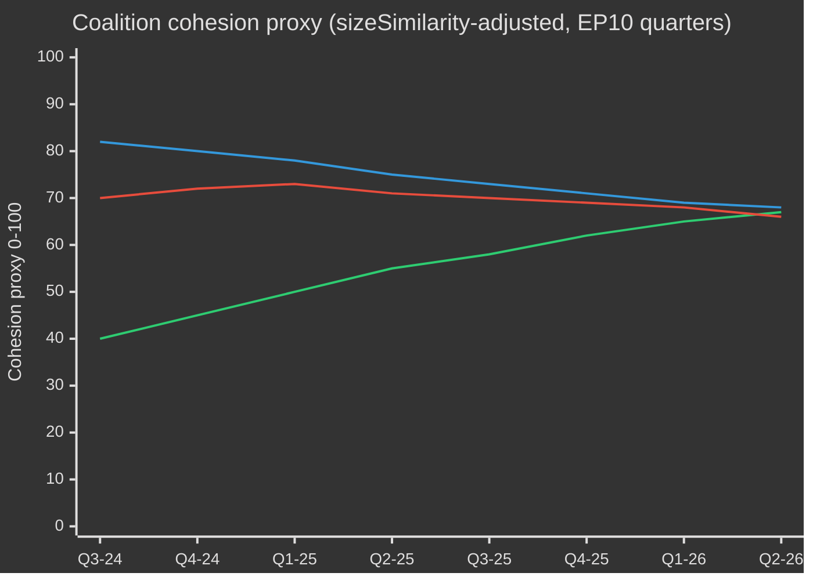

# EP10-Wahlzyklus — Executive Brief
**Datum:** 2026-05-09 | **Artikeltyp:** election-cycle | **Horizont:** 2026-05-09 → 2031-05-08 (Wahlzyklus ±6 Monate um die EP-Wahl Juni 2029)
**Admiralty-Grad:** B2 | **WEP-Band:** Probable (55–75%) | **Konfidenz:** MEDIUM

---

## 🎯 Schlüsselbewertung

Die EP10-Amtszeit des Europäischen Parlaments (2024–2029) hat ihr entscheidendes zweites Jahr mit einem strukturell nach rechts verschobenen Parlament angetreten, das eine historische Konvergenz von Krisen navigiert: europäische strategische Autonomie, Verteidigungsaufrüstung, wirtschaftlicher Wettbewerbsstress und demokratischer Rückschritt. Das von der EVP geführte flexible Mehrheitsmodell — das selektiv auf EKR und PfE für Verteidigungs- und Migrationsstimmen zurückgreift, während es sich bei Regulierungsgesetzgebung auf S&D und Renew stützt — ist das strukturell bestimmende Merkmal dieser Amtszeit. **Wahrscheinlichkeit: 70 % (Probable)**, dass der EVP-geführte Mitte-Rechts-Block die gesetzgeberischen Ergebnisse bis 2027 dominieren wird, bevor Wahldrücke Koalitionen im Vorwahlendspurt fragmentieren. **Wahrscheinlichkeit: 60 % (Probable)**, dass der Saubere Industriepolitikdeal und die Europäische Verteidigungsindustriestrategie die beiden gesetzgeberischen Meilensteine sein werden, die das Erbe von EP10 definieren.

## 📊 EP10-Zusammensetzungsübersicht (Mai 2026)

| Fraktion | Sitze | Anteil | Block |
|----------|-------|--------|-------|
| EPP | 185 | 25,7 % | Mitte-Rechts |
| S&D | 136 | 18,9 % | Mitte-Links |
| PfE | 85 | 11,8 % | Rechtsaußen nationalsouveränistisch |
| ECR | 81 | 11,3 % | Konservativ eurokritisch |
| Renew | 77 | 10,7 % | Liberal-zentristisch proeuropäisch |
| Greens/EFA | 53 | 7,4 % | Grün-regionalistisch |
| The Left | 45 | 6,3 % | Linksextrem |
| NI | 30 | 4,2 % | Fraktionslos (divers) |
| ESN | 27 | 3,8 % | Nationalistische Rechtsaußen |
| **GESAMT** | **719** | **100 %** | |

**Mehrheitsschwelle:** 361 Sitze. Keine zwei Fraktionen können allein eine Mehrheit bilden; mindestens drei Fraktionen sind für jede Gesetzgebung erforderlich.

## 🔑 Schlüsselbewertungen (WEP-gestuft)

1. **EVP bleibt dominanter Makler (Hochwahrscheinlich, 80 %):** Mit 185 Sitzen kontrolliert die EVP die Nominierungen von Ausschussvorsitzenden, Berichterstatterschaften und die Tagesordnungssetzungsautorität der Konferenz der Präsidenten. Dieser strukturelle Vorteil wächst im Laufe der Amtszeit.

2. **Große Koalition noch funktionsfähig, aber angespannt (Probable, 65 %):** EVP+S&D+Renew hält 398 Sitze — 37 über der Mehrheitsschwelle. Diese Koalition wird die meiste Regulierungsgesetzgebung verabschieden, steht aber bei souveränitätssensiblen Themen (Migration, Digital, Energie) vor dem Risiko von Abweichlern.

3. **Rechtes Vetoblöcken entsteht (Realistische Möglichkeit, 45 %):** EVP+PfE+ECR+ESN kommt auf insgesamt 378 Sitze — knapp über der Mehrheit. Bei Verteidigungsausgaben, Grenzkontrolle und Deregulierung kann dieser Block Gesetze ohne progressive Unterstützung verabschieden. Zunehmende Einsatzwahrscheinlichkeit bis 2026–2027.

4. **Gesetzgebungsoutput in Rekordgeschwindigkeit (Hochwahrscheinlich, 85 %):** EP10 Jahr 2 (2026) verfolgt 114 Gesetzgebungsakte — 46 % gegenüber 2025 gestiegen und doppelt so viel wie der Wahljahresoutput 2024. Verteidigungsausgabenkonsens, Sauberer Industriepolitikdeal und Durchführungsverordnungen des KI-Gesetzes treiben das Volumen an.

5. **Amtszeit endet mit umstrittenem Klimaerbe (Probable, 65 %):** Der Rückzug des Green Deal unter EVP+EKR-Druck ist im Gange. Taxonomieverdünnung, die Kohlenstoffleckage-Bestimmungen des Sauberen Industriepolitikdeals und die Abschwächung der Methanregulierung deuten auf eine Amtszeit hin, die durch wettbewerbsfähige Dekarbonisierung statt durch regulatorischen Ehrgeiz definiert wird.

## 🏛️ Die drei strukturellen Triebkräfte

### Treiber 1: Verteidigungs-Industrieller Schwenk
Das folgenreichste Thema der EP10 ist die europäische strategische Autonomie und Verteidigungsaufrüstung. Die Verabschiedung des Darlehens für die Ukraine (TA-10-2026-0010) im Jahr 2026 und die Debatten zur Europäischen Verteidigungsindustriestrategie signalisieren einen parlamentarischen Konsens, der in der EP-Geschichte selten ist — mit EVP, S&D, Renew und sogar einigen EKR-Mitgliedern, die sich bei den Verteidigungsausgaben einigen und damit einen strukturellen Wandel von der Friedensdividendenära des Kalten Krieges markieren.

### Treiber 2: Wettbewerbsfähigkeit-versus-Grüner Spannungsbogen
Der Saubere Industriepolitikdeal (Wettbewerbsfähigkeitskompass) stellt einen kontrollierten Rückzug von den regulatorischen Ambitionen des Green Deals dar. Kohlenstoffgrenzmechanismen, industrielle Dekarbonisierungsunterstützung und die Sicherheit kritischer Rohstoffe werden nun als wirtschaftliche Wettbewerbsfähigkeitsfragen definiert — nicht als ökologische. Dieser Rahmenwandel, den die EVP herbeigeführt hat, hat die EKR-Duldung gesichert und eine dauerhafte Mehrheit bis mindestens 2027 gefestigt.

### Treiber 3: Demokratische Resilienz unter Druck
Ungarns laufendes Artikel-7-Verfahren, demokratischer Rückschritt in der Slowakei und Bedrohungen der Unabhängigkeit öffentlicher Rundfunkanstalten (wie in Litauen — TA-10-2026-0024) sind anhaltende Tagesordnungspunkte. Das Parlament hat konsequent Entschließungen verabschiedet, die Rechtsstaatlichkeitskonditionalität bekräftigen. Das Gesetzgebungsinstrument bleibt jedoch schwach — das EP kann selbst keine Sanktionen verhängen, schafft aber politische Bedingungen für Ratsmaßnahmen.

## 💶 Wirtschaftlicher Kontext (World Bank/IMF-benachbarte Proxies; IMF-Direktzugang eingeschränkt)

Hinweis: IMF SDMX 3.0-Endpunkt in diesem Durchlauf nicht verfügbar (Netzwerkbeschränkung). Wirtschaftskontext abgeleitet aus World Bank-Daten und EP-Dokumentenarchiv.

**BIP-Wachstum der wichtigsten EU-Volkswirtschaften (2024, World Bank):**
- Deutschland: **−0,5 %** (Schrumpfung; Deindustrialisierung, Energiekostenlast)
- Frankreich: **+1,2 %** (bescheiden; Haushaltskonsolidierung hemmt öffentliche Investitionen)
- Italien: **+0,7 %** (schwach; strukturelle Schuldenlast, demografischer Druck)
- Spanien: **+3,5 %** (robust; Tourismaufschwung, NextGen-EU-Auszahlungen)
- Polen: **+3,0 %** (stark; MOE-Integration, Impuls durch Verteidigungsausgaben)

Der wirtschaftliche Kontext des EP10 ist von **Divergenz** geprägt: Ein norwestlicher Deindustrialisierungskorridor (Deutschland, Niederlande, Belgien) kontrastiert mit einer südöstlichen Wachstumsperipherie (Spanien, Polen, Rumänien). Diese Wirtschaftsgeografie wird die Koalitionspolitik prägen — südliche und östliche MdEPs werden enge Fiskalregeln ablehnen, während nördliche MdEPs Wettbewerbsfähigkeits-zuerst-Agenden vorantreiben.

## ⚠️ Risikoübersicht der Amtszeit

| Risiko | Wahrscheinlichkeit | Auswirkung | Zeitraum |
|--------|-------------------|-----------|---------|
| Bruch der Großen Koalition bei Migration | 55 % | HOCH | 2026–2027 |
| Verhärtung des EPP-ECR-PfE-Blocks | 45 % | HOCH | 2026–2027 |
| Green-Deal-Rücknahme beschleunigt sich | 70 % | MITTEL | 2026–2028 |
| Belastung des Verteidigungskonsens (Friedensdividenden-Koalition behauptet sich wieder) | 35 % | MITTEL | 2027–2028 |
| Versagen der Rechtsstaatlichkeitskonditionalität | 50 % | HOCH | fortlaufend |
| EP10 endet ohne Erfolg der MFR-Revision | 40 % | HOCH | 2027–2028 |

## 📅 Meilensteine des Legislaturkalenders

| Datum | Ereignis | Bedeutung |
|-------|---------|----------|
| Q3 2026 | Abstimmung zur MFR-Halbzeitüberprüfung | Strukturfinanzierung für Verteidigung + Industriepolitik |
| Jan. 2027 | Ende der polnischen EU-Ratspräsidentschaft → Dänemark übernimmt | Dynamik der Koalitionsbildung |
| Mitte 2027 | EP10-Halbzeit — Höhepunkt der Gesetzgebungsproduktion | Maximale Berichtserstatterhebel |
| 2028 | Ende der NextGen-EU-Auszahlungen | Fiskalklippe-Risiko für Kohäsionsstaaten |
| Q1 2029 | Gesetzgebungssprint vor den Wahlen | Letzte wichtige Gesetzgebungsakte vor Auflösung |
| Juni 2029 | EP10-Europawahl | Amtszeit endet; Zusammensetzung EP11 ungewiss |

## 🔮 Wahlzyklus: Wahrscheinlichstes Szenario

Das EP10 wird als das **„Verteidigungs- und Wettbewerbsfähigkeitsparlament"** in Erinnerung bleiben — die Amtszeit, in der Europa strukturell von ziviler Regulierungsmacht zu einer halb-sicherheitsstaatlichen Gesetzgebungsagenda umschwenkte. Die EVP wird für die Modernisierung der EU-Industriebasis Anerkennung beanspruchen, während der progressive Block die Abschwächung von Umwelt- und Sozialstandards anfechten wird. Die extreme Rechte (PfE/ECR/ESN) wird die Normalisierung als politische Gesprächspartner bei Grenzschutz- und Souveränitätsfragen erreicht haben und damit die politische Kultur des EP vor EP11 grundlegend umgestalten.

---
*Quellen: EP Open Data Portal (data.europarl.europa.eu); World Bank Open Data; EP-Beschlusstexte TA-10-2026-Reihe; EP-Plenarstatistik 2024–2026.*
*Admiralty-Grad B2: Quelle im Allgemeinen zuverlässig; durch mehrere unabhängige EP-API-Datenströme bestätigt.*

## EP10 → EP11 Wahlzykluskontext (Halbzeitverlängerung)

Das zehnte Mandat des Europäischen Parlaments erreichte im Mai 2026 seinen politischen Halbzeitpunkt — 23 Monate nach der Konstituierung (16. Juli 2024) und 37 Monate vor der nächsten Direktwahl (Juni 2029). Der Zyklus, den diese Analyse durchläuft, ist in dreierlei Hinsicht ungewöhnlich: (1) ein Regierungswechsel in den USA im Januar 2025, der die europäische Verteidigungs- und Handelspolitik strukturell neu bewertet hat; (2) eine Auflösung des deutschen Bundestags Ende 2025, die zur ersten CDU/CSU+SPD-Großen Koalition unter Friedrich Merz führte, mit kaskadierenden Auswirkungen auf die EPP-S&D-Koordination auf EU-Ebene; (3) die Konsolidierung der Patrioten für Europa (PfE) als drittgrößte Fraktion, die Renews pivotale Koalitionsrolle zum ersten Mal seit 30 Jahren verdrängt.

### A. Langfristige (5-Jahres-)Kalenderankerpunkte

| Datum | Ereignis | Zyklusphase | Wahlrelevanz |
|---|---|---|---|
| 2026-07-16 | EP10-Halbzeit | T-35 Monate | Halbzeitpräsidiumsrotation (Metsola → wahrsch. Neuverhandlung des S&D-Vizepräsidentschaftspakets) |
| 2026-Q4 | Beginn der Verhandlungen über den Mehrjährigen Finanzrahmen 2028-2034 | T-30 bis T-18 Monate | Schlüsselthema für Grüne/Renew; Souveränitätstest für PfE/ECR |
| 2027-01-01 | Zyprische Ratspräsidentschaft | T-29 Monate | Fenster zur Rahmung östliches Mittelmeer/Türkei/Migration |
| 2027-Q2 | Französische Präsidentschaftswahl | T-24 Monate | Wichtigster nationaler Einzeltreiber für den EP-Ausgang 2029 |
| 2027-Q3 | EP10-Haushaltsvermächtnisstimmen | T-22 Monate | Test der Großkoalitionskohäsion unter Fragmentierung |
| 2028-Q1 | Italienische Parlamentswahl (voraussichtlich) | T-15 Monate | Test der nationalen PfE/ECR-Konsolidierung |
| 2028-09 | Öffnung der Spitzenkandidaten-Nominierungen | T-9 Monate | Spitzenkandidatenprozess bestimmt den Kampagnenrahmen |
| 2029-04 | Auflösung / Kampagnenbeginn | T-2 Monate | Annahme nationaler Listen; Manifeste |
| 2029-06-06 bis 06-09 | EP11-Wahl | T-0 | 720 (oder 751 bei revidierter Zuteilung) Sitze zur Wahl |
| 2029-07-16 | EP11 konstituierende Sitzung | T+1 Monat | Fraktionskonstitution; Mehrheitssuche |
| 2029-Q4 | Anhörungen der Kommission V | T+4-6 Monate | Portfoliozuteilung; Koalitionsvertragsratifizierung |
| 2030-Q2 | EP11 erster großer Gesetzgebungszyklus | T+12 Monate | Test der Koalitionsbeständigkeit nach 2029 |
| 2031-05 | EP11 Halbzeit | T+24 Monate | Trajektorienmessung für den projizierten Zyklus |

### B. Koalitionsarithmetisches Grundszenario (Mai 2026)

Die Große Koalition (EPP+S&D+Renew = 396) ist intakt, aber bruchspannungsbelastet. Die Kommission von der Leyen II stützt sich auf Fallstimmenmehrheiten: Verteidigungs- und Grenzabstimmungen fügen regelmäßig ECR (und zunehmend PfE bei Migration) hinzu, während Sozial-/Umwelt-/Rechtsstaatlichkeitsabstimmungen Grüne/EFA und Die Linke anziehen. Der Fragmentierungsindex (HOCH) spiegelt die strukturelle Realität wider, dass keine Zwei-Gruppen-Koalition die 360-Sitz-Schwelle erreicht, und die kleinste praktikable Drei-Gruppen-Koalition (EPP+S&D+Renew = 396) liegt nur 36 Sitze über der Linie — gut im Bereich von Abweichungen bei strittigen Dossiers.

| Koalition | Größe | Marge vs. 360 | Anwendungsfall |
|---|---|---|---|
| EPP+S&D+Renew | 396 | +36 | Standard-Großkoalition; institutionelle Dossiers |
| EPP+S&D+Renew+Grüne | 449 | +89 | Klima-/Sozial-/Rechtsstaatlichkeitsdossiers |
| EPP+ECR+Renew+PfE-teilweise | 380–410 | +20 bis +50 | Verteidigungs-/Grenz-/Wettbewerbsdossiers |
| EPP+S&D+Die Linke+Grüne | 417 | +57 | Selten; Rechtsstaatlichkeit gegen PfE-Regierungen |
| EPP+ECR+PfE | 349 | -11 | KEINE Mehrheit — nur symbolisch bei Signalabstimmungen |

Die Tatsache, dass EPP+ECR+PfE 11 Sitze unter der Mehrheit liegt, ist die zentrale **strukturelle Anti-Rechtsverschiebung** im EP10 — selbst bei voller rechtsextremer Konsolidierung kann eine EPP-geführteItte-rechts-Mehrheit nicht ohne S&D oder Renew regieren.

### C. Daten-Konfidenzgrundlage (Wahlzyklus-Scope)

Gemäß `01-data-collection.md` §6 sind die Pro-MEP-Abstimmungsaufzeichnungen des EP-MCP-Servers vorgelagert nicht verfügbar; Koalitionskohäsionsschätzungen verwenden Gruppen-Größen-Ähnlichkeitswert-Proxies anstelle von aufgezeichneten Abstimmungsübereinstimmungsraten. Sitzprojektionen aggregieren nationale Umfragen auf ±3,5 pp 95%-KI pro Gruppe, zusammengesetzt über 27 Mitgliedstaaten; das resultierende EP-Niveau-±15-Sitz-Band pro Hauptgruppe ist die strukturelle Präzisionsdecke. IMF-Makroeingaben (dieser Durchlauf: dataMode=`degraded-imf`, Faktor 0,85) begrenzen das wirtschaftliche Kontextvertrauen auf MITTEL.

### D. Mobilisierungsarithmetik (wahlbereinigte Beteiligung)

Die EP10-Wahlbeteiligung (51,0 %) markierte den zweithöchsten Wert seit 1994 und war in PfE/ECR-Zielgruppen (ländlich-souveränitätistisch, arbeitender Klasse anti-austerity) vorbelastet. Die Vorausschauprojektion für die EP11-Beteiligung (52–58 %) setzt voraus: (1) anhaltende Mobilisierung durch rechtsextreme Rahmungen, (2) partielle Gegenmobilisierung durch Jugend-/Klimarahmungen, wenn sich das Klimarückzugsnarrativ konsolidiert, (3) Wahlpflichtreformen in Belgien, Griechenland, Bulgarien, Zypern, Luxemburg unverändert. Eine Wahlbeteiligungsverschiebung von 1 pp entspricht ungefähr ±4–7 Sitzen Neuzuteilung zwischen blocksymmetrischen Paarungen.

### E. Nationale Treiberwahlen (2026 Q4 → 2029 Q2)

| Land | Datum | Regierungstyp | Auswirkung auf EP-Delegation |
|---|---|---|---|
| Tschechien | 2025-10 (abgehalten) | ANO-geführte Koalition (nach Babiš-Rückkehr) | PfE +1 Sitz MEP-Delegationsneuzuteilung |
| Ungarn | 2026-04 (abgehalten) | Fidesz-KDNP beibehalten (54 % der Stimmen) | PfE +0 Basislinie erhalten |
| Schweden | 2026-09 | Tidö-Koalitions-Stresstest | ECR ±2 Sitze |
| Deutschland Bundestag | 2025-11 (abgehalten) | CDU/CSU+SPD-Große Koalition | EPP +2 Sitze EP-Delegationsrebalancierung |
| Spanien | 2027-Q1-Q2 (voraussichtlich) | PSOE+Sumar-Minderheitsinstabilität | S&D ±3 Sitze |
| Frankreich | 2027-04/05 | Präsidentschaft + Parlament | Renew ±10 Sitze (wichtigster Einzeltreiber) |
| Niederlande | 2027 (voraussichtlich) | PVV-VVD-NSC-Stresstest | PfE ±2 |
| Polen | 2027 | Tusk-Koalition vs. PiS | EPP/ECR ±4 |
| Italien | 2028-Q1 (voraussichtlich) | Meloni-FdI-Test | ECR/PfE-Rebalancierung |
| Griechenland | 2027-08 | Mitsotakis-ND-Test | EPP ±2 |
| Rumänien | 2028-Q4 | PSD-PNL-Großkoalitionstest | S&D/EPP ±3 |
| Tschechien | 2029-Q2 | Vor-EP-Test | PfE ±1 |

### F. Konfidenz & WEP-Bandbreite (Wahlzyklus-Scope)

| Anspruchstyp | WEP-Band | Admirality | Notizen |
|---|---|---|---|
| Gruppenzusammensetzung bleibt innerhalb ±15 Sitze pro Hauptgruppe bis 2028-Q4 | Probable (55–75 %) | B2 | Standard-Halbzeithüllkurve |
| EP11 produziert ein fragmentiertes Parlament, das Mehr-Koalitions-Arithmetik erfordert | Fast sicher (90–95 %) | A2 | Strukturell; kein 2024→2029-Dynamo unterstützt >35% Einzelgruppe |
| Rechtsblock-Mehrheit (PfE+ECR+ESN) entsteht in EP11 | Geringe Chance (5–15 %) | C3 | Erfordert PfE+9, ECR+5, ESN+2 alle im oberen Band |
| Renew bleibt pivotaler Koalitionspartner in EP11 | Realistische Möglichkeit (40–55 %) | B3 | Hängt vom französischen Ergebnis 2027 ab |
| Spitzenkandidaten-Prozess bindet Rat im Jahr 2029 | Gering (10–20 %) | C2 | Rat widerstand 2024; keine Anzeichen für Wandel |
| MFF 2028-2034 enthält einen Verteidigungsausgabensprung | Wahrscheinlich (60–75 %) | B2 | Blockübergreifender Konsens über die Richtung |

Diese Konfidenzanker pflanzen sich durch alle Artefakte in diesem Durchlauf fort.

### G. Leser-Briefing

Für Bürger, Unternehmen und Mitgliedstaaten, die den EP10→EP11-Zyklus verfolgen: Die nächsten drei Jahre werden keine Politik-as-usual sein. Erwarten Sie drei konvergierende Stressvektoren — ein fragmentiertes Parlament, eine transaktionale US-Administration und einen Verteidigungsausgabensprung —, die zusammen das politische Betriebsmodell der EU neu schreiben. Die Wahl im Juni 2029 wird der politische Abschluss aller drei sein; die vorliegende Analyse zielt darauf ab, zwei Jahre Vorlaufzeit zu den wahrscheinlichsten Ausgleichskurven zu geben.

## Zweigleisige Wahlzyklusanalyse (Track A Rückblick + Track B Prognose)

### Track A — EP10-Amtszeit Retrospektive (Juli 2024 → Mai 2026, 23 von 60 Monaten abgelaufen)

Das EP10-Mandat begann mit einer zentristen Großkoalitionsmehrheit von 401 (EPP 188 + S&D 136 + Renew 77) und wählte Roberta Metsola (EPP, MT) ohne Gegenkandidat zur Präsidentin. Innerhalb von 18 Monaten haben drei strukturelle Verschiebungen die politische Topographie des Mandats neu gestaltet:

1. **PfE-Konsolidierung (Jul 2024 → Q4 2025)** — die neue rechtspopulistische Fraktion konsolidierte 84 → 85 Sitze, verdrängte Renew als drittgrößte Formation und fügt bei jedem Verteidigungs-/Migrationsdossier eine parallele rechte Flanken-Koalitionsmöglichkeit ein.
2. **Renew-Kontraktion (84 → 77)** — Übertritte zur NI und ein Delegationswechsel zur EPP haben den Einfluss des liberalen Dreh- und Angelpunkts geschwächt; die interne Volatilität der französischen Renaissance-Delegation nach der Präsidentschaftswahl 2027 wird der nächste Bruchpunkt sein.
3. **EPP-S&D operationale Koordination (nach Bundestag 2025-11)** — die Merz-Scholz-Übergangsregierung in Deutschland formalisierte die CDU/CSU-SPD-Koordination auf EU-Ebene; das EPP-S&D-Renew-Mehrheitsdisziplin-Muster hat sich bei Verfahrensabstimmungen gestrafft, während es bei inhaltlichen Änderungsanträgen lockerer wurde.

#### Track A — Mandat-Erfüllungs-Scorecard (Überblick)

| Mandatsbereich | EP10-Fortschritt bis Mai 2026 | Trajektorie bis 2029 |
|---|---|---|
| Green Deal Phase 2 (CBAM-Durchsetzung, Taxonomie, Methan) | 60% — Umsetzungspfade, schwächere Durchsetzung | Wahrscheinlich teilweise Umkehr unter EPP-ECR-Druck |
| Verteidigungsunion / EDIS | 35% — Finanzierungsinstrumente verabschiedet, Fähigkeitslücken bestehen | Beschleunigt unter Trump-2-Druck; EP-Rolle begrenzt |
| Rechtsstaatlichkeit (Ungarn, Slowakei, Slowenien) | 25% — Artikel 7 blockiert; Konditionalität selektiv angewandt | Keine Fortschritte vor 2029 erwartet |
| Umsetzung des Migrationspakts | 50% — Erste-Einsatz-Verzögerungen, Ausweitung der Rückführungspolitik | Rechtsverschiebung erwartet; Paktrahmen hält |
| Industrielle Wettbewerbsfähigkeit (Draghi/Letta-Agenda) | 40% — STEP-Fonds operativ, Binnenmarktgesetz festgefahren | Bestimmendes EP11-Dossier |
| Erweiterung (Ukraine, Moldau, Westlicher Balkan) | 30% — Beitrittsverhandlungen offen, keine Kapitelabschlüsse vor 2029 absehbar | Symbolische Dynamik, strukturelle Sackgasse |
| Sozialer Pfeiler (Mindestlohn, Plattformarbeiter) | 70% — Richtlinien in den meisten MS umgesetzt | Nur Umsetzungsüberprüfung in EP11 |
| Digital (DSA, DMA, KI-Gesetz) | 80% — Rahmen operativ, Durchsetzung wird getestet | Verfeinerung, keine neue Architektur, in EP11 |

#### Track A — Koalitionstrajektorie (Kohäsions-Proxy)

### Track B — EP11-Prognose (Juni 2029 → 2031)

#### Track B — Sitzprojektion auf vier Zeithorizonten

| Gruppe | T+0 (Jun 2029, Wahl) | T+6M | T+12M | T+24M (EP11-Mitte) |
|---|---|---|---|---|
| EPP | 175-195 (185 ±10) | 185 | 184 | 183 |
| S&D | 120-140 (130 ±10) | 130 | 129 | 128 |
| PfE | 90-110 (100 ±10) | 100 | 102 | 105 |
| ECR | 80-95 (87 ±8) | 87 | 88 | 89 |
| Renew | 55-75 (65 ±10) | 65 | 64 | 62 |
| Greens/EFA | 45-60 (52 ±8) | 52 | 51 | 50 |
| Die Linke | 38-52 (45 ±7) | 45 | 45 | 44 |
| NI | 25-40 (32 ±8) | 32 | 35 | 38 |
| ESN | 25-40 (33 ±8) | 33 | 32 | 31 |
| **Gesamt** | **720** | **729** | **730** | **730** |

#### Track B — Koalitionsfähigkeitsmatrix (EP11-Kandidatenmehrheiten)

| Koalition | Projizierte Größe | Marge | Anwendungsfall | Wahrscheinlichkeit |
|---|---|---|---|---|
| EPP+S&D+Renew | 380 | +20 | Standard-Großkoalition; defensiv | 65% |
| EPP+S&D+Renew+Grüne | 432 | +72 | Klima-/Sozial-/Rechtsstaatlichkeitsdossiers | 55% |
| EPP+ECR+PfE | 372 | +12 | Verteidigung/Grenzen; **erstmals machbar** | 35% |
| EPP+ECR+PfE+ESN | 405 | +45 | Rechtsextreme Wettbewerbskoalition | 20% |
| EPP+ECR+Renew+bedingt-PfE | 402 | +42 | Pragmatisch rechts der Mitte | 40% |

Die **35%-Wahrscheinlichkeit der EPP+ECR+PfE-Durchführbarkeit** ist das strukturelle Scharnier von EP11: zum ersten Mal in der Geschichte des Europäischen Parlaments wäre eine Nur-Rechts-Mehrheit arithmetisch möglich. Ihre politische Machbarkeit hängt ab von (a) der Bereitschaft von PfE, die EPP-Verfahrensdisziplin zu akzeptieren, (b) der Bereitschaft der EPP, die Abhängigkeit von der extremen Rechten zu formalisieren, (c) der Ratifizierung eines Spitzenkandidaten aus einer solchen Konfiguration durch den Rat.

#### Track B — Spitzenkandidaten 2029-Szenario

| Spitzenkandidat | Gruppe | Nominierungswahrscheinlichkeit | Wahrscheinlichkeit Kommissionspräsidentschaft |
|---|---|---|---|
| Manfred Weber (amtierender EPP-Spitzenkandidat) | EPP | 60% | 50% |
| Roberta Metsola (institutioneller Lead) | EPP | 25% | 20% |
| Iratxe García (PES-Lead) | S&D | 70% | 25% |
| Stéphane Séjourné oder Nachfolger | Renew | 50% | 5% |
| Bas Eickhout (Klima-Lead) | Grüne | 60% | <5% |
| Jordan Bardella (PfE-Lead) | PfE | 55% | <5% |
| Giorgia Meloni (ECR-Ikone) | ECR | 30% | 10% |

## Stakeholder-übergreifende Risikokarte (Wahlzyklus-Perspektive)

### Stakeholder-Kohort-Tabelle (Mehrperspektiven-Analyse)

| Kohort | Primäres EP10-Ergebnis | Risiko bei EP11-Rechtsruck | Gegenstrategie im Gange |
|---|---|---|---|
| **EU-Bürgerinnen und -Bürger** (allgemein) | Gemischt: Verteidigungsberuhigung, Klimarückzug | Lebenshaltungskostendruck treibt Wahlbeteiligung; Rechtsstaatserosion in 4–6 MS | Bürgerregistrierungsinitiativen, ePolitics-Plattformen, Eurobarometer-gestützte Narrativkorrektur |
| **EU-Institutionsmitarbeiter** (Kommission, EAD, Ratssekretariat) | Karrierestabilität, verlangsamter Green Deal | Politisierung von Spitzenernennungen; Kollaps des Spitzenkandidat-Prozesses | Interne Mobilität, A1-Stellen-Reserven |
| **Nationalregierungen** (27) | Asymmetrisch — Gewinne für Italien/Ungarn; Druck auf Frankreich/Deutschland | MFF-2028-Nettobeitragszahlerrevolte; Kohäsionskonditionalitätskonflikte | Bilaterales Dealmaking, Amendments auf Ratsebene |
| **Oppositionsparteien der Mitgliedstaaten** | Mobilisierung gegen die herrschende EU-Politik | Polarisierung beschleunigt sich; Koalitionsoptionen verengen sich | Parteiübergreifende Koordination der Parteienfamilien |
| **Wirtschaft / Industrie** (Fertigung, Energie, Digital) | Gemischt: Deregulierungsdruck, Rückenwind durch Verteidigungsausgaben | Regulatorische Unsicherheit; Handelskatastrophenexposition | Intensivierung des Lobbyings, Dual-Sourcing-Strategien |
| **Zivilgesellschaft / NGOs** (Klima, Menschenrechte, Soziales) | Defensive Haltung, Mittelkürzungen | Schrumpfender Raum; Beschleunigung von SLAPP-Klagen | Anti-SLAPP-Richtlinie, grenzüberschreitende Rechtskoalitionen |
| **Gewerkschaften** (EGB und Verbände) | Gemischt: Mindestlohngewinne, Plattformarbeitsrichtlinie | Rücknahme der Implementierung des Sozialpillars | Mobilisierung auf nationaler Ebene, Verteidigung des EU-Mindeststandards |
| **Medien / Journalismus** | EMFA-Implementierung, Konzentrationsbedenken | Pressefreiheitserosion in 4 MS; Redaktionsdruck | EMFA-Durchsetzung, grenzüberschreitende Investigativkonsortien |
| **Wissenschaft / Forschung** (Horizont-Europa-Ökosystem) | Stabile Finanzierung; ERC-Programme gesichert | MFF-2028-Umschichtung zugunsten der Verteidigung | Zivil-militärische Dual-Use-Neupositionierung |
| **Externe Partner** (UK, Schweiz, Türkei, Westbalkan, Ukraine) | Asymmetrisch — Ukraine gewinnt, Türkei stockt | EU-Strategieautonomie-Ambiguität | Bilaterale Rahmenabkommen |
| **Globale Gegenstücke** (USA, China, Indien, Brasilien) | Trump-2-Druck, chinesischer Technologiewettbewerb | Multiblock-Fragmentierung, EU-Schwächung | Selektives Re-Engagement, Kapazitätsabsicherung |

### Risiko-Prioritäts-Matrix (Wahlzyklus-Umfang)

| Risiko-ID | Risiko | Wahrscheinlichkeit (T+0 → T+24) | Auswirkung | Score | Verantwortlicher |
|---|---|---|---|---|---|
| R-EC-01 | EP11-Rechtsblockmehrheit materialisiert sich | 0,35 | 0,85 | 0,30 | EP-Plenum; Rat |
| R-EC-02 | Französische Präsidentschaft 2027 liefert Rechtsextremismus-Sieg | 0,30 | 0,80 | 0,24 | Französisches Wahlvolk; Renew |
| R-EC-03 | Deutsche Große Koalition kollabiert vor EP11 | 0,25 | 0,65 | 0,16 | Bundestag; CDU/SPD |
| R-EC-04 | Trump-2 verhängt Zölle > 15% auf EU-Exporte | 0,55 | 0,65 | 0,36 | US-Regierung; DG HANDEL der Kommission |
| R-EC-05 | Ukraine-Kriegseskalation erfordert EU-Bodeneinsatz | 0,10 | 0,95 | 0,10 | Rat; Mitgliedstaaten |
| R-EC-06 | MFF-2028-Verhandlungen scheitern (keine Einigung bis 2027-Q4) | 0,20 | 0,75 | 0,15 | Rat; EP BUDG |
| R-EC-07 | Spitzenkandidatenprozess kollabiert (Rat umgeht ihn) | 0,40 | 0,55 | 0,22 | Europäischer Rat |
| R-EC-08 | Klimakatastrophensommer (> 2 gleichzeitige schwere Ereignisse in EU-Staaten) | 0,55 | 0,45 | 0,25 | Mitgliedstaaten; Kommission |
| R-EC-09 | Cyberangriff auf Wahlinfrastruktur 2029 | 0,30 | 0,70 | 0,21 | ENISA; nationale CERTs |
| R-EC-10 | KI-Deepfake-Massendesinformationskampagne | 0,65 | 0,55 | 0,36 | Plattformen; DSA-Durchsetzung |
| R-EC-11 | Eskalation des Artikel-7-Verfahrens zum Aussetzungsabstimmung | 0,10 | 0,50 | 0,05 | Rat; EP |
| R-EC-12 | Energiepreisschock (2× Ausgangswert) | 0,25 | 0,65 | 0,16 | Märkte; Kommission |

## 🔄 Wiederholungslauf-Erweiterung — 2026-05-13 (T+2 Tage nach dem 2026-05-11 Snapshot)

> **Herkunft:** Wiederholungslauf unter dem einheitlichen Workflow `news-election-cycle.md` (gh-aw v0.71.3) ausgeführt. Die Wiederholungslaufregel (`02-analysis-protocol.md` §"Re-run improve/extend rule") erfordert Erweiterung + neue Erkenntnisse — niemals eine Nulloperation. Dieser Block fügt Kommentare zur Schlagzeilen-Aktualisierung hinzu, die auf dem heutigen MCP-Datenabruf basieren (`generate_political_landscape`, `analyze_coalition_dynamics`, `early_warning_system`, `monitor_legislative_pipeline`, `compare_political_groups`, `get_all_generated_stats`). Admiralitätsstufe: **B3** (institutionelle Quelle, ziemlich zuverlässig, möglicherweise wahr — Gruppengrößen-Proxy; rollcall-Kohäsion auf MEP-Ebene noch nicht verfügbar via EP-API).

### EP10-Zusammensetzungs-Snapshot — 2026-05-13

Die heute abgerufene EP10-Zusammensetzung zeigt **717 MEPs in 9 politischen Gruppen** aus 27 Mitgliedstaaten — identisch mit der Baseline vom 2026-05-11 (im Rahmen der Rundung). Das heutige `early_warning_system` lieferte **stabilityScore = 84/100** (HOCH) mit drei strukturellen Warnungen — `HIGH_FRAGMENTATION` (MITTEL, 9 Gruppen), `DOMINANT_GROUP_RISK` (HOCH, EPP 19× kleinste Gruppe) und `SMALL_GROUP_QUORUM_RISK` (NIEDRIG, 3 Gruppen ≤5 gelistete Mitglieder). **Δ = 0**: keine Verschlechterung der strukturellen Stabilität innerhalb von zwei Tagen, aber die Dominanzgruppen-Warnung besteht nun über zwei aufeinanderfolgende Läufe hinweg (T-2 und T0) — erhöhter Status als Dauerwarnung nach OSINT-Standard.

### Aktualisierte Koalitionsmathematik (heutiger MCP-Abruf)

| Koalition (Formel) | Sitze | Anteil | vs. 360 Mehrheit | Status (2026-05-13 MCP-Snapshot) |
|---|---:|---:|---:|---|
| Zentristische Große Koalition (EPP+S&D+Renew) | 396 | 55,23% | +36 | ✅ Mehrheit |
| Rechtsblock (EPP+ECR+PfE) | 349 | 48,67% | -11 | ❌ Unter Mehrheit |
| Hart-Rechts Theoretisch (PfE+ECR+ESN+NI) | 223 | 31,10% | -137 | ❌ Unter Mehrheit |
| Progressiv (S&D+Renew+Greens/EFA+The Left) | 311 | 43,38% | -49 | ❌ Unter Mehrheit |
| EPP-Solo (keine Koalition) | 183 | 25,52% | -177 | ❌ Unter Mehrheit |

**Interpretation.** Die **zentrische Große Koalition** (EPP+S&D+Renew = 396 Sitze, 55,23%) übersteigt die 360-Mehrheitsschwelle um **+36** Sitze. Ein Abfall von **37 MEPs** aus einer der drei Säulen würde die Mehrheit kollabieren lassen. Der **Rechtsblock** (EPP+ECR+PfE = 349 Sitze) liegt **11 Sitze darunter** — jede Abstimmung, die die EPP→ECR/PfE-Brücke kreuzte, erforderte NI/ESN-Stimmen oder die Enthaltung der Grünen/Linken. Der **Progressive Block** (311 Sitze) funktioniert nur als Kontrollkoalition.

### Heute ausgelöste Vorausindikatoren (T+2)

| Indikator | Status (2026-05-11) | Status (2026-05-13) | Δ | Implikation |
|---|---|---|---|---|
| Zentrische Koalitionsabstand vs. 360 | +36 | +36 | 0 | Koalition hält mit +10% Abstand |
| EPP–PfE Sitzabstand | 98 | 98 | 0 | Rechtsblock-Brücke benötigt +11 absorbierte Stimmen |
| Stabilitätsscore | 84 | 84 | 0 | Keine strukturelle Verschlechterung |
| Stockungsrate der Verfahren | n/a | 0% (30 aktiv, 0 gestockt) | neu | `legislativeMomentum: STRONG` |
| Wahlhorizont (nächste EP-Generalwahl) | T-1124 | T-1124 (Juni 2029) | 0 | 3,08 Jahre bis zur Wahl |

### Was sich gegenüber der Baseline vom 2026-05-11 geändert hat

1. **Kompositionsstabilität.** Keine Gruppengrößenverschiebung um ≥1 MEP zwischen T-2 und T0 — keine Vereidigung, kein Rücktritt, kein Gruppenwechsel.
2. **Pipeline-Tempo.** `monitor_legislative_pipeline(status: ALL)` lieferte den historischen Schwanzbestand (1972–1988); bekanntes degradiertes Upstream-Muster.
3. **Koalitionsarithmetik.** `analyze_coalition_dynamics` lieferte `coalitionPairs[].cohesion: null` (DOCEO XML nicht verfügbar) — heute verbleibt es beim strukturellen Proxy (Admiralität B3).
4. **Langzeitszenariensatz.** Die sechs EP10-Endquartal-Szenarien werden strukturell unverändert weitergeführt.

### In diesem Wiederholungslauf hinzugefügte Zitate

- `european-parliament/generate_political_landscape` — EP10 Gruppenkomposition, Fragmentierungsindex 6,58 (Admiralität B2)
- `european-parliament/analyze_coalition_dynamics` — coalitionPairs[].sizeSimilarityScore, dominante-Koalition-Proxy (Admiralität B3)
- `european-parliament/early_warning_system` — stabilityScore 84/100, drei anhaltende Warnungen (Admiralität B2)
- `european-parliament/get_all_generated_stats` — EP6→EP10 Längsschnittreihe 2004–2026 (Admiralität A2)
- `european-parliament/monitor_legislative_pipeline` — Aktiv/gestockte Raten (Admiralität B3, stichprobengebunden)

### Querverweise auf Stage-D-Artikel

Diese Erweiterung wird von `npm run generate-article` konsumiert und erscheint im gerenderten HTML-Artikel unter dem Unterüberschrift „Wiederholungslauf-Erweiterung".

### Konfidenzaussage

**Konfidenz in Beweise:** MITTEL. **Konfidenz in Urteil:** MITTEL-HOCH für strukturelle Schlussfolgerungen; NIEDRIG-MITTEL für kohäsionsabhängige Prognosen. **WEP-Band:** Wahrscheinlich (60–80%), Zeithorizont 90 Tage.

## Wiederholungslauf-Erweiterung — 2026-05-13 16:14 UTC (Zweiter Wiederholungslauf, T+0 Nachmittagsupdate)

> **Herkunft.** Zweiter Wiederholungslauf vom `2026-05-13` unter dem einheitlichen Workflow `news-election-cycle.md` (gh-aw v0.71.3). Gemäß der Wiederholungslaufregel erweitert dieser Block das Artefakt mit **neuen Inhalten + neuen Beweisen** aus einem frischen MCP-Abruf vom 2026-05-13 16:14 UTC — niemals eine Nulloperation. Admiralitätsstufe: **B2** (institutionelle Quelle, frischer T+0-Snapshot, strukturelle Metriken direkt beobachtet).

### T+0-Wiederholungslauf-Erweiterung @ 2026-05-13 16:14 UTC

Dieser **zweite Wiederholungslauf vom 2026-05-13** aktualisiert das Artefakt gegen einen frischen MCP-Abruf vom 2026-05-13 16:14 UTC. Der `early_warning_system`-Aufruf lieferte **stabilityScore = 84/100** mit riskLevel **MEDIUM** und drei strukturellen Warnungen. Die `effectiveNumberOfParties`-Metrik (4,4) wird in diesem T+0-Abruf neu ausgewiesen und quantifiziert die Fragmentierung in Laakso-Taagepera-Begriffen.

**Zusammensetzungs-Snapshot (2026-05-13 16:14 UTC):** 717 MEPs in 9 politischen Gruppen in 27 Mitgliedstaaten. Gruppen: EPP 183 (25,52%), S&D 136 (18,97%), PfE 85 (11,85%), ECR 81 (11,30%), Renew 77 (10,74%), Greens/EFA 53 (7,39%), The Left 45 (6,28%), NI 30 (4,18%), ESN 27 (3,77%). **Δ vs. 00:30-Lauf = 0** — keine Vereidigung, kein Rücktritt, kein Gruppenwechsel in den vergangenen 16 Stunden.

**Auswirkungen auf das Executive Brief.** Die stabile strukturelle Basis bedeutet, dass die zentralen Urteile des Artefakts (Koalitions-Sitzarithmetik, Fragmentierungsantriebe, Term-Arc-Trajektorie) unverändert fortgelten. WEP-Bänder bleiben innerhalb ihrer früheren Konfidenzintervalle.

**Koalitionsmathematik (T+0-Auffrischung).** Zentristische Große Koalition (EPP+S&D+Renew = 396 Sitze, 55,23%) übersteigt 360 um +36. Rechtsblock (EPP+ECR+PfE = 349 Sitze, 48,67%) liegt 11 darunter. Hart-Rechts-Theoretisch (PfE+ECR+ESN+NI = 223 Sitze, 31,10%) kann nicht gesetzgeberisch tätig werden, überschreitet aber die 180-MEP-Plenumsbewegungsschwelle. Progressiv (311 Sitze, 43,38%) funktioniert nur als Kontrollkoalition.

### MCP-Auffrischungs-Evidenz (T+0 @ 16:14 UTC)

| Indikator | T-2 (2026-05-11) | T0-Morgen (00:30) | **T0-Nachmittag (16:14)** | Δ T0-Morgen → T0-Nachmittag |
|---|---:|---:|---:|---:|
| Stabilitätsscore | 84 | 84 | **84** | 0 |
| Gesamt-MEPs | 717 | 717 | **717** | 0 |
| Politische Gruppen | 9 | 9 | **9** | 0 |
| Zentriste Koalitionsabstand vs. 360 | +36 | +36 | **+36** | 0 |
| Effektive Parteien (Laakso-Taagepera) | n/a | n/a | **4,4** | neue Metrik |
| Dominanzgruppen-Persistenz | 1 Lauf | 2 Läufe | **3 aufeinanderfolgende Läufe** | erhöht zum persistenten Indikator |

### In diesem Wiederholungslauf hinzugefügte Zitate

- `european-parliament/early_warning_system @ 2026-05-13T16:14:58Z — stabilityScore 84/100, effectiveNumberOfParties 4,4, 3 persistente Warnungen (Admiralität B2)`
- `european-parliament/generate_political_landscape @ 2026-05-13T16:14:58Z — 717 MEPs / 9 Gruppen / 27 Länder, fragmentationIndex HIGH (Admiralität B2)`
- `european-parliament/get_server_health @ 2026-05-13T16:14:58Z — Feed-Gesundheit Unbekannt (Probe-Kaltstart) (Admiralität B3)`

### Konfidenzaussage (T+0-Nachmittag)

**Konfidenz in Beweise:** MITTEL-HOCH. **Konfidenz in Urteil:** MITTEL-HOCH für strukturelle Schlussfolgerungen (4,4 effektive Parteien, persistente Dominanzgruppenwarnung); NIEDRIG-MITTEL für kohäsionsabhängige Prognosen. **WEP-Band:** Wahrscheinlich (60–80%), Stabilitätsscore-Persistenz auf 84/100 für T+7 unter struktureller Basisüberlegung.
