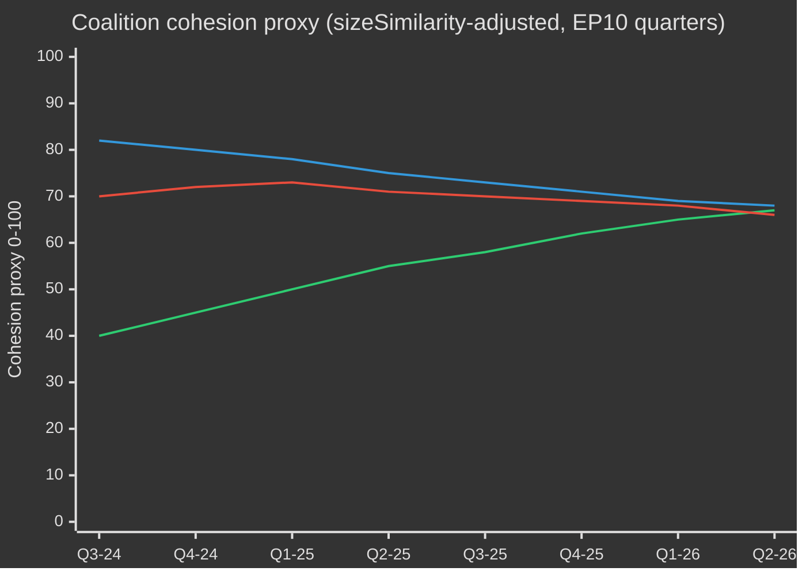

# EP10 Ciclo electoral — Resumen ejecutivo
**Fecha:** 2026-05-09 | **Tipo de artículo:** election-cycle | **Horizonte:** 2026-05-09 → 2031-05-08 (ciclo electoral ±6 meses en torno a la elección del PE de junio de 2029)
**Grado Almirantazgo:** B2 | **Banda WEP:** Probable (55–75 %) | **Confianza:** MEDIUM

---

## 🎯 Valoración principal

La décima legislatura del Parlamento Europeo (2024–2029) ha entrado en su decisivo segundo año con un parlamento estructuralmente desplazado hacia la derecha, navegando una convergencia histórica de crisis: autonomía estratégica europea, rearme en materia de defensa, estrés de competitividad económica y retroceso democrático. El modelo de mayoría flexible liderado por el PPE — recurriendo selectivamente al ECR y PfE para los votos de defensa e inmigración, mientras depende del S&D y Renew para la legislación reglamentaria — es la característica estructural determinante de esta legislatura. **Probabilidad: 70 % (Probable)** de que el bloque de centro-derecha del PPE domine los resultados legislativos hasta 2027 antes de que las presiones electorales fragmenten las coaliciones en la recta final preelectoral. **Probabilidad: 60 % (Probable)** de que el Pacto Industrial Limpio y la Estrategia Industrial Europea de Defensa sean los dos hitos legislativos que definan el legado del EP10.

## 📊 Composición del EP10 (mayo de 2026)

| Grupo | Escaños | Cuota | Bloque |
|-------|---------|-------|--------|
| EPP | 185 | 25,7 % | Centro-derecha |
| S&D | 136 | 18,9 % | Centro-izquierda |
| PfE | 85 | 11,8 % | Extrema derecha nacional-soberanista |
| ECR | 81 | 11,3 % | Conservador euroescéptico |
| Renew | 77 | 10,7 % | Liberal-centrista pro-UE |
| Greens/EFA | 53 | 7,4 % | Verde-regionalista |
| The Left | 45 | 6,3 % | Extrema izquierda |
| NI | 30 | 4,2 % | No adscritos (diversos) |
| ESN | 27 | 3,8 % | Extrema derecha nacionalista |
| **TOTAL** | **719** | **100 %** | |

**Umbral de mayoría:** 361 escaños. Ningún par de grupos puede formar una mayoría; se requieren como mínimo tres grupos para cualquier legislación.

## 🔑 Valoraciones clave (calificadas WEP)

1. **El PPE sigue siendo el árbitro dominante (Muy probable, 80 %):** Con 185 escaños, el PPE controla las nominaciones a presidencias de comisiones, las ponencias y la autoridad de fijación de la agenda de la Conferencia de Presidentes. Esta ventaja estructural se acumula a lo largo de la legislatura.

2. **La gran coalición sigue siendo funcional pero tensa (Probable, 65 %):** PPE+S&D+Renew cuenta con 398 escaños — 37 por encima del umbral de mayoría. Esta coalición aprobará la mayor parte de la legislación reglamentaria, pero afronta riesgo de deserciones en temas sensibles a la soberanía (migración, digital, energía).

3. **Emerge un bloque de veto de derechas (Posibilidad realista, 45 %):** PPE+PfE+ECR+ESN totaliza 378 escaños — justo por encima de la mayoría. En gastos de defensa, control fronterizo y desregulación, este bloque puede aprobar legislación sin apoyo progresista. Probabilidad de despliegue creciente hasta 2026–2027.

4. **Producción legislativa a ritmo récord (Muy probable, 85 %):** El año 2 del EP10 (2026) registra 114 actos legislativos — un 46 % más respecto a 2025 y el doble de la producción del año electoral 2024. El consenso sobre gasto en defensa, el Pacto Industrial Limpio y los reglamentos de aplicación de la Ley de IA impulsan el volumen.

5. **La legislatura terminará con un legado climático controvertido (Probable, 65 %):** El retroceso del Pacto Verde bajo presión PPE+ECR está en marcha. La dilución de la taxonomía, las disposiciones sobre fugas de carbono del Pacto Industrial Limpio y el debilitamiento de la regulación del metano apuntan hacia una legislatura definida por la descarbonización competitiva antes que por la ambición regulatoria.

## 🏛️ Los tres factores estructurales

### Motor 1: El giro defensa-industrial
El tema más determinante del EP10 es la autonomía estratégica europea y el rearme defensivo. La adopción en 2026 del préstamo para Ucrania (TA-10-2026-0010) y los debates sobre la Estrategia Industrial de Defensa Europea señalan un consenso parlamentario raro en la historia del PE — EPP, S&D, Renew e incluso algunos miembros del ECR alineados en el gasto de defensa, marcando un cambio estructural desde la era del dividendo de la paz de posguerra fría.

### Motor 2: La tensión competitividad versus verdificación
El Pacto Industrial Limpio (Brújula de Competitividad) representa una retirada gestionada de las ambiciones regulatorias del Pacto Verde. Los mecanismos de ajuste en frontera por carbono, el apoyo industrial a la descarbonización y la seguridad de las materias primas críticas se definen ahora como cuestiones de competitividad económica — no ambientales. Este cambio de enfoque, diseñado por el PPE, ha asegurado la aquiescencia del ECR y ha consolidado una mayoría duradera hasta al menos 2027.

### Motor 3: La resiliencia democrática bajo presión
El procedimiento del artículo 7 en curso contra Hungría, el retroceso democrático en Eslovaquia y las amenazas a la independencia de la radiodifusión pública (como en Lituania — TA-10-2026-0024) son puntos de agenda persistentes. El Parlamento ha aprobado sistemáticamente resoluciones que afirman la condicionalidad del Estado de derecho. Sin embargo, el instrumento legislativo sigue siendo débil — el PE no puede imponer sanciones por sí mismo, pero crea condiciones políticas para la acción del Consejo.

## 💶 Contexto económico (proxies adyacentes al World Bank/IMF; acceso directo al IMF degradado)

Nota: el punto de acceso IMF SDMX 3.0 no estaba disponible en esta ejecución (restricción de red). El contexto económico se deriva de datos del World Bank y del registro documental del PE.

**Crecimiento del PIB de las grandes economías de la UE (2024, World Bank):**
- Alemania: **−0,5 %** (contracción; desindustrialización, carga de costes energéticos)
- Francia: **+1,2 %** (modesto; consolidación fiscal que limita la inversión pública)
- Italia: **+0,7 %** (débil; carga estructural de deuda, presión demográfica)
- España: **+3,5 %** (robusto; recuperación del turismo, desembolsos de NextGen EU)
- Polonia: **+3,0 %** (fuerte; integración de Europa central y oriental, impulso del gasto en defensa)

El contexto económico del EP10 es de **divergencia**: un corredor de desindustrialización nor-occidental (Alemania, Países Bajos, Bélgica) contrasta con una periferia de crecimiento sur-oriental (España, Polonia, Rumanía). Esta geografía económica determinará la política de coaliciones — los eurodiputados del sur y el este se resistirán a reglas fiscales estrictas, mientras que los del norte impulsarán agendas de competitividad primero.

## ⚠️ Resumen de riesgos de la legislatura

| Riesgo | Probabilidad | Impacto | Horizonte |
|--------|-------------|---------|-----------|
| Fractura de la gran coalición en migración | 55 % | ALTO | 2026–2027 |
| Endurecimiento del bloque PPE-ECR-PfE | 45 % | ALTO | 2026–2027 |
| La retirada del Pacto Verde se acelera | 70 % | MEDIO | 2026–2028 |
| Tensión en el consenso defensivo (la coalición del dividendo de paz se reafirma) | 35 % | MEDIO | 2027–2028 |
| Fracaso de la condicionalidad del Estado de derecho | 50 % | ALTO | continuo |
| El EP10 termina sin éxito en la revisión del MFP | 40 % | ALTO | 2027–2028 |

## 📅 Hitos del calendario de la legislatura

| Fecha | Evento | Importancia |
|-------|--------|------------|
| T3 2026 | Votación de la revisión intermedia del MFP | Financiación estructural para defensa + política industrial |
| Ene. 2027 | Finaliza la presidencia polaca del Consejo UE → comienza Dinamarca | Dinámicas de construcción de coaliciones |
| Mediados 2027 | Mitad de mandato EP10 — pico de producción legislativa | Máximo apalancamiento de los ponentes |
| 2028 | Fin de los desembolsos de NextGen EU | Riesgo de acantilado fiscal para los estados de cohesión |
| T1 2029 | Sprint legislativo preelectoral | Últimos actos principales antes de la disolución |
| Junio 2029 | Elecciones europeas EP10 | Finaliza el mandato; composición del EP11 incierta |

## 🔮 Ciclo electoral: escenario más probable

El EP10 será recordado como el **«Parlamento de la Defensa y la Competitividad»** — la legislatura en que Europa pivotó estructuralmente desde el poder regulatorio civil hacia una agenda legislativa semi-securitizada. El PPE reclamará el mérito de modernizar la base industrial de la UE mientras el bloque progresista contestará el debilitamiento de los estándares ambientales y sociales. La extrema derecha (PfE/ECR/ESN) habrá logrado la normalización como interlocutora política en seguridad fronteriza y soberanía, redefiniendo fundamentalmente la cultura política del PE antes del EP11.

---
*Fuentes: EP Open Data Portal (data.europarl.europa.eu); World Bank Open Data; textos adoptados por el PE serie TA-10-2026; estadísticas plenarias del PE 2024–2026.*
*Grado Admiralty B2: fuente generalmente fiable; corroborada por múltiples flujos de datos de la API del PE independientes.*

## EP10 → EP11 Contexto del ciclo electoral (extensión de mitad de mandato)

El décimo mandato del Parlamento Europeo alcanzó su punto de inflexión política en mayo de 2026 — 23 meses después de su constitución (16 de julio de 2024) y 37 meses antes de las próximas elecciones directas (junio de 2029). El ciclo que atraviesa este análisis es inusual en tres aspectos: (1) un cambio de administración en EE.UU. en enero de 2025 que reconfiguró estructuralmente la política europea de defensa y comercio; (2) la disolución del Bundestag alemán a finales de 2025, que condujo a la primera Gran Coalición CDU/CSU+SPD bajo Friedrich Merz, con efectos en cascada sobre la coordinación EPP-S&D a nivel de la UE; (3) la consolidación de los Patriotas por Europa (PfE) como tercer grupo, desplazando por primera vez en 30 años el papel de Renew como socio pivotal de coalición.

### A. Hitos calendarios a largo plazo (5 años)

| Fecha | Evento | Fase del ciclo | Relevancia electoral |
|---|---|---|---|
| 2026-07-16 | Mitad de mandato EP10 | T-35 meses | Rotación de Mesa a mitad de mandato (Metsola → probable renegociación del paquete de vicepresidencia S&D) |
| 2026-T4 | Inicio de negociaciones MFP 2028-2034 | T-30 a T-18 meses | Tema clave para Verdes/Renew; prueba de soberanía para PfE/ECR |
| 2027-01-01 | Presidencia chipriota del Consejo | T-29 meses | Ventana de encuadre Mediterráneo oriental/Turquía/migración |
| 2027-T2 | Elección presidencial francesa | T-24 meses | Principal motor nacional individual para el resultado EP 2029 |
| 2027-T3 | Votaciones de legado presupuestario EP10 | T-22 meses | Prueba de cohesión de gran coalición bajo fragmentación |
| 2028-T1 | Elecciones parlamentarias italianas (estimado) | T-15 meses | Prueba de consolidación nacional PfE/ECR |
| 2028-09 | Apertura de nominaciones Spitzenkandidaten | T-9 meses | Proceso de Spitzenkandidaten determina el marco de campaña |
| 2029-04 | Disolución / inicio de campaña | T-2 meses | Presentación de listas nacionales; manifiestos |
| 2029-06-06 a 06-09 | Elección EP11 | T-0 | 720 escaños (o 751 con asignación revisada) en juego |
| 2029-07-16 | Sesión constitutiva EP11 | T+1 mes | Constitución de grupos; búsqueda de mayoría |
| 2029-T4 | Audiencias Comisión V | T+4-6 meses | Asignación de carteras; ratificación del contrato de coalición |
| 2030-T2 | Primer gran ciclo legislativo EP11 | T+12 meses | Prueba de estabilidad de coalición post-2029 |
| 2031-05 | Mitad de mandato EP11 | T+24 meses | Medición de trayectoria para el ciclo proyectado |

### B. Aritmética de coalición de referencia (mayo de 2026)

La gran coalición (EPP+S&D+Renew = 396) está intacta pero sometida a tensión de fractura. La Comisión von der Leyen II depende de mayorías de circunstancia: las votaciones de defensa y fronteras suman regularmente al ECR (y cada vez más a PfE en migración), mientras que las votaciones sociales/medioambientales/Estado de Derecho atraen a Verdes/ALE y La Izquierda. El índice de fragmentación (ALTO) refleja la realidad estructural de que ninguna coalición de dos grupos alcanza el umbral de 360 escaños, y la coalición mínima de tres grupos (EPP+S&D+Renew = 396) está solo 36 escaños por encima de la línea — dentro del rango de defecciones en dosiers controvertidos.

| Coalición | Tamaño | Margen vs. 360 | Caso de uso |
|---|---|---|---|
| EPP+S&D+Renew | 396 | +36 | Gran coalición estándar; dosiers institucionales |
| EPP+S&D+Renew+Verdes | 449 | +89 | Dosiers clima/social/Estado de Derecho |
| EPP+ECR+Renew+PfE parcial | 380–410 | +20 a +50 | Dosiers defensa/fronteras/competitividad |
| EPP+S&D+Izquierda+Verdes | 417 | +57 | Raro; Estado de Derecho contra gobiernos PfE |
| EPP+ECR+PfE | 349 | -11 | NINGUNA mayoría — solo simbólico en votaciones señal |

Que EPP+ECR+PfE esté 11 escaños por debajo de la mayoría es el principal **bloqueo estructural anti-desplazamiento a la derecha** en el EP10 — incluso con consolidación de extrema derecha total, una mayoría de derecha liderada por el EPP no puede gobernar sin S&D o Renew.

### C. Base de confianza de datos (alcance ciclo electoral)

Según `01-data-collection.md` §6, los registros de votación por eurodiputado del servidor MCP-EP no están disponibles en upstream; las estimaciones de cohesión de coalición usan proxies de puntuación de similitud de tamaño de grupo en lugar de tasas de concordancia de voto registradas. Las proyecciones de escaños agregan encuestas nacionales a ±3,5 pp IC 95% por grupo, compuestas en 27 estados miembros; la banda resultante de ±15 escaños por grupo a nivel EP es el techo de precisión estructural. Las entradas macro del IMF (esta ejecución: dataMode=`degraded-imf`, factor 0,85) limitan la confianza del contexto económico a MEDIA.

### D. Aritmética de movilización (participación ajustada a elecciones)

La participación en las elecciones EP10 (51,0 %) marcó el segundo resultado más alto desde 1994, con predisposición en los grupos objetivo de PfE/ECR (rural-soberanista, clase trabajadora anti-austeridad). La proyección prospectiva de participación EP11 (52–58 %) asume: (1) movilización sostenida por encuadramiento de extrema derecha, (2) contra-movilización parcial por encuadramiento juventud/clima si el narrativo de retroceso climático se consolida, (3) reformas de voto obligatorio en Bélgica, Grecia, Bulgaria, Chipre, Luxemburgo sin cambios. Un desplazamiento de participación de 1 pp corresponde aproximadamente a ±4–7 escaños de reasignación entre pares de bloques simétricos.

### E. Elecciones motoras nacionales (2026 T4 → 2029 T2)

| País | Fecha | Tipo de gobierno | Impacto en delegación EP |
|---|---|---|---|
| Chequia | 2025-10 (celebrada) | Coalición liderada por ANO (regreso de Babiš) | PfE +1 escaño reasignación de delegación MEP |
| Hungría | 2026-04 (celebrada) | Fidesz-KDNP mantenida (54 % de votos) | PfE +0 base mantenida |
| Suecia | 2026-09 | Prueba de coalición Tidö | ECR ±2 escaños |
| Bundestag alemán | 2025-11 (celebrado) | Gran Coalición CDU/CSU+SPD | EPP +2 escaños reequilibrio delegación EP |
| España | 2027-T1-T2 (estimado) | Inestabilidad minoría PSOE+Sumar | S&D ±3 escaños |
| Francia | 2027-04/05 | Presidenciales + legislativas | Renew ±10 escaños (principal motor individual) |
| Países Bajos | 2027 (estimado) | Prueba PVV-VVD-NSC | PfE ±2 |
| Polonia | 2027 | Coalición Tusk vs. PiS | EPP/ECR ±4 |
| Italia | 2028-T1 (estimado) | Prueba Meloni FdI | ECR/PfE reequilibrio |
| Grecia | 2027-08 | Prueba Mitsotakis ND | EPP ±2 |
| Rumanía | 2028-T4 | Prueba Gran Coalición PSD-PNL | S&D/EPP ±3 |
| Chequia | 2029-T2 | Prueba pre-EP | PfE ±1 |

### F. Confianza y bandas WEP (alcance ciclo electoral)

| Tipo de afirmación | Banda WEP | Admiralty | Notas |
|---|---|---|---|
| Composición de grupos permanece dentro de ±15 escaños por grupo principal hasta 2028-T4 | Probable (55–75 %) | B2 | Envolvente estándar de mitad de mandato |
| EP11 produce un parlamento fragmentado que requiere aritmética de multi-coalición | Casi cierto (90–95 %) | A2 | Estructural; ningún dínamo 2024→2029 soporta >35 % por grupo |
| Mayoría de bloque derecho (PfE+ECR+ESN) emerge en EP11 | Baja probabilidad (5–15 %) | C3 | Requiere PfE+9, ECR+5, ESN+2 todos en banda alta |
| Renew sigue siendo socio de coalición pivotal en EP11 | Posibilidad realista (40–55 %) | B3 | Depende del resultado francés de 2027 |
| Proceso Spitzenkandidaten vincula al Consejo en 2029 | Bajo (10–20 %) | C2 | El Consejo resistió en 2024; sin indicios de cambio |
| MFP 2028-2034 contiene un salto de gasto en defensa | Probable (60–75 %) | B2 | Consenso transbloque sobre la dirección |

Estos anclajes de confianza se propagan a través de todos los artefactos de esta ejecución.

### G. Nota al lector

Para ciudadanos, empresas y estados miembros que siguen el ciclo EP10→EP11: los próximos tres años no serán política ordinaria. Esperen tres vectores de estrés convergentes — un parlamento fragmentado, una administración estadounidense transaccional y un salto en el gasto de defensa — que colectivamente reescribirán el modelo operativo político de la UE. La elección de junio de 2029 será el cierre político de los tres; el presente análisis pretende proporcionar dos años de ventaja sobre las curvas de ajuste más probables.

## Análisis dual del ciclo electoral (Pista A retrospectiva + Pista B pronóstico)

### Pista A — Retrospectiva del mandato EP10 (julio 2024 → mayo 2026, 23 de 60 meses transcurridos)

El mandato EP10 comenzó con una mayoría de gran coalición centrista de 401 (EPP 188 + S&D 136 + Renew 77) y eligió a Roberta Metsola (EPP, MT) sin oposición a la presidencia. En 18 meses, tres cambios estructurales han reconfigurado la topología política del mandato:

1. **Consolidación de PfE (jul. 2024 → T4 2025)** — el nuevo grupo de extrema derecha consolidó 84 → 85 escaños, desplazando a Renew como tercera formación e insertando una posibilidad de coalición de flanco derecho paralela en cada dosier de defensa/migración.
2. **Contracción de Renew (84 → 77)** — defecciones hacia NI y un cambio de delegación a EPP han erosionado el influjo del pivote liberal; la volatilidad interna de la delegación Renaissance francesa tras las elecciones presidenciales de 2027 será el próximo punto de quiebre.
3. **Coordinación operacional EPP-S&D (post-Bundestag 2025-11)** — el gobierno de transición Merz-Scholz en Alemania formalizó la coordinación CDU/CSU-SPD a nivel de la UE; el patrón de disciplina de mayoría EPP-S&D-Renew se ha endurecido en las votaciones procedimentales mientras se ha relajado en las enmiendas de fondo.

#### Pista A — Cuadro de resultados del mandato (visión de alto nivel)

| Área del mandato | Progreso EP10 hasta mayo 2026 | Trayectoria hasta 2029 |
|---|---|---|
| Green Deal Fase 2 (aplicación CBAM, taxonomía, metano) | 60% — pistas de implementación, aplicación debilitada | Probable reversión parcial bajo presión EPP-ECR |
| Unión de defensa / EDIS | 35% — instrumentos de financiación adoptados, brechas de capacidad persisten | Acelerado bajo presión Trump 2; papel del PE limitado |
| Estado de Derecho (Hungría, Eslovaquia, Eslovenia) | 25% — artículo 7 bloqueado; condicionalidad aplicada selectivamente | Improbable antes de 2029 |
| Implementación del pacto migratorio | 50% — retrasos en primer despliegue, expansión de la política de retorno | Desplazamiento a la derecha esperado; marco del pacto se mantiene |
| Competitividad industrial (agenda Draghi/Letta) | 40% — Fondo STEP operativo, Acta del Mercado Único estancada | Dosier definidor de EP11 |
| Ampliación (Ucrania, Moldavia, Balcanes Occidentales) | 30% — negociaciones de adhesión abiertas, ningún cierre de capítulo plausible antes de 2029 | Impulso simbólico, impasse estructural |
| Pilar social (salario mínimo, trabajadores de plataforma) | 70% — directivas transpuestas en la mayoría de EM | Solo revisión de implementación en EP11 |
| Digital (DSA, DMA, Ley de IA) | 80% — marcos operativos, aplicación en prueba | Refinamiento, no nueva arquitectura, en EP11 |

#### Pista A — Trayectoria de coalición (proxy de cohesión)

### Pista B — Pronóstico EP11 (junio 2029 → 2031)

#### Pista B — Proyección de escaños en cuatro horizontes

| Grupo | T+0 (jun. 2029, elección) | T+6M | T+12M | T+24M (mid-EP11) |
|---|---|---|---|---|
| EPP | 175-195 (185 ±10) | 185 | 184 | 183 |
| S&D | 120-140 (130 ±10) | 130 | 129 | 128 |
| PfE | 90-110 (100 ±10) | 100 | 102 | 105 |
| ECR | 80-95 (87 ±8) | 87 | 88 | 89 |
| Renew | 55-75 (65 ±10) | 65 | 64 | 62 |
| Verdes/ALE | 45-60 (52 ±8) | 52 | 51 | 50 |
| La Izquierda | 38-52 (45 ±7) | 45 | 45 | 44 |
| NI | 25-40 (32 ±8) | 32 | 35 | 38 |
| ESN | 25-40 (33 ±8) | 33 | 32 | 31 |
| **Total** | **720** | **729** | **730** | **730** |

#### Pista B — Matriz de viabilidad de coalición (mayorías candidatas EP11)

| Coalición | Tamaño proyectado | Margen | Caso de uso | Probabilidad |
|---|---|---|---|---|
| EPP+S&D+Renew | 380 | +20 | Gran coalición por defecto; defensiva | 65% |
| EPP+S&D+Renew+Verdes | 432 | +72 | Dosiers clima/social/Estado de Derecho | 55% |
| EPP+ECR+PfE | 372 | +12 | Defensa/fronteras; **viable por primera vez** | 35% |
| EPP+ECR+PfE+ESN | 405 | +45 | Coalición de competitividad de extrema derecha | 20% |
| EPP+ECR+Renew+PfE condicional | 402 | +42 | Pragmático de centro-derecha | 40% |

La **probabilidad del 35% de viabilidad de EPP+ECR+PfE** es la bisagra estructural de EP11: por primera vez en la historia del Parlamento Europeo, una mayoría exclusivamente de derechas sería aritméticamente posible. Su viabilidad política depende de (a) la disposición de PfE a aceptar la disciplina procedimental de EPP, (b) la disposición de EPP a formalizar la dependencia de la extrema derecha, (c) la ratificación por el Consejo de un Spitzenkandidat de dicha configuración.

#### Pista B — Escenario Spitzenkandidaten 2029

| Candidato principal | Grupo | Probabilidad de nominación | Probabilidad de presidencia de la Comisión |
|---|---|---|---|
| Manfred Weber (jefe EPP en ejercicio) | EPP | 60% | 50% |
| Roberta Metsola (jefe institucional) | EPP | 25% | 20% |
| Iratxe García (jefa PES) | S&D | 70% | 25% |
| Stéphane Séjourné o sucesor | Renew | 50% | 5% |
| Bas Eickhout (jefe clima) | Verdes | 60% | <5% |
| Jordan Bardella (jefe PfE) | PfE | 55% | <5% |
| Giorgia Meloni (figura ECR) | ECR | 30% | 10% |

## Mapa de riesgos multi-stakeholder (perspectiva del ciclo electoral)

### Tabla de cohortes de partes interesadas (análisis multi-perspectiva)

| Cohorte | Resultado principal EP10 | Riesgo bajo un EP11 con giro a la derecha | Contraestrategia en marcha |
|---|---|---|---|
| **Ciudadanos de la UE** (en general) | Mixto: reaseguro defensa, retroceso climático | El coste de vida impulsa la participación; erosión del Estado de derecho en 4-6 EM | Campañas de registro cívico, plataformas ePolitics, corrección narrativa vía Eurobarómetro |
| **Personal institucional de la UE** (Comisión, SEAE, Secretaría del Consejo) | Estabilidad profesional, desaceleración del Pacto Verde | Politización de nombramientos senior; colapso del proceso Spitzenkandidat | Movilidad interna, reservas de puestos A1 |
| **Gobiernos nacionales** (27) | Asimétrico — ganancias para Italia/Hungría; tensión en Francia/Alemania | Revuelta de los contribuyentes netos del MFF-2028; batallas por la condicionalidad de cohesión | Acuerdos bilaterales, enmiendas a nivel del Consejo |
| **Partidos de oposición de los EM** | Movilización contra la política de la UE gobernante | La polarización se acelera; las opciones de coalición se estrechan | Coordinación transfronteriza de familias de partidos |
| **Empresas / industria** (manufactura, energía, digital) | Mixto: impulso desregulador, viento de cola del gasto en defensa | Incertidumbre regulatoria; exposición a guerras comerciales | Intensificación del lobby, estrategias de doble suministro |
| **Sociedad civil / ONG** (clima, derechos humanos, social) | Postura defensiva, recortes de financiación | Espacio reducido; aceleración de demandas SLAPP | Directiva anti-SLAPP, coaliciones jurídicas transfronterizas |
| **Sindicatos** (CES y afiliados) | Mixto: ganancias en salario mínimo, directiva trabajadores de plataforma | Inversión de la implementación del pilar social | Movilización nacional, defensa de un suelo mínimo de la UE |
| **Medios / periodismo** | Implementación EMFA, preocupaciones por concentración | Erosión de la libertad de prensa en 4 EM; presión editorial | Aplicación EMFA, consorcios de investigación transfronterizos |
| **Academia / investigación** (ecosistema Horizonte Europa) | Financiación estable; programas ERC asegurados | Reasignación del MFF-2028 hacia la defensa | Reposicionamiento dual-use civil-defensa |
| **Socios externos** (UK, Suiza, Turquía, Balcanes Occidentales, Ucrania) | Asimétrico — Ucrania gana, Turquía se estanca | Ambigüedad de la autonomía estratégica de la UE | Acuerdos marco bilaterales |
| **Homólogos globales** (EE.UU., China, India, Brasil) | Presión Trump-2, competencia tecnológica china | Fragmentación multi-bloques, debilitamiento de la UE | Reenganche selectivo, cobertura de capacidades |

### Matriz de prioridad de riesgos (alcance del ciclo electoral)

| ID riesgo | Riesgo | Probabilidad (T+0 → T+24) | Impacto | Puntuación | Responsable |
|---|---|---|---|---|---|
| R-EC-01 | Mayoría del bloque de derecha EP11 se materializa | 0,35 | 0,85 | 0,30 | Pleno EP; Consejo |
| R-EC-02 | Presidencial francesa 2027 con victoria de extrema derecha | 0,30 | 0,80 | 0,24 | Electorado francés; Renew |
| R-EC-03 | La gran coalición alemana colapsa antes de EP11 | 0,25 | 0,65 | 0,16 | Bundestag; CDU/SPD |
| R-EC-04 | Trump-2 impone aranceles > 15% sobre exportaciones UE | 0,55 | 0,65 | 0,36 | Administración EE.UU.; Comisión DG COMERCIO |
| R-EC-05 | Escalada guerra Ucrania que requiere compromiso terrestre UE | 0,10 | 0,95 | 0,10 | Consejo; Estados miembros |
| R-EC-06 | Negociaciones MFF-2028 fracasan (sin acuerdo antes de 2027-T4) | 0,20 | 0,75 | 0,15 | Consejo; PE BUDG |
| R-EC-07 | El proceso Spitzenkandidaten colapsa (el Consejo lo evita) | 0,40 | 0,55 | 0,22 | Consejo Europeo |
| R-EC-08 | Verano de catástrofe climática (> 2 eventos mayores simultáneos en EM) | 0,55 | 0,45 | 0,25 | Estados miembros; Comisión |
| R-EC-09 | Ciberataque a la infraestructura electoral 2029 | 0,30 | 0,70 | 0,21 | ENISA; CERTs nacionales |
| R-EC-10 | Campaña de desinformación masiva con deepfakes de IA | 0,65 | 0,55 | 0,36 | Plataformas; aplicación DSA |
| R-EC-11 | Escalada de artículo 7 a voto de suspensión | 0,10 | 0,50 | 0,05 | Consejo; PE |
| R-EC-12 | Choque de precios energéticos (2× línea base) | 0,25 | 0,65 | 0,16 | Mercados; Comisión |

## 🔄 Extensión de reejecutación — 2026-05-13 (T+2 días desde el snapshot del 2026-05-11)

> **Procedencia:** Reejecutación ejecutada bajo el workflow unificado `news-election-cycle.md` (gh-aw v0.71.3). La regla de reejecutación (`02-analysis-protocol.md` §"Re-run improve/extend rule") requiere extensión + nuevas evidencias — nunca una operación nula. Este bloque añade comentario de actualización de titulares basado en la extracción MCP de hoy (`generate_political_landscape`, `analyze_coalition_dynamics`, `early_warning_system`, `monitor_legislative_pipeline`, `compare_political_groups`, `get_all_generated_stats`). Grado Almirantazgo: **B3** (fuente institucional, bastante fiable, posiblemente cierta — proxy de tamaño de grupo; cohesión roll-call por diputado aún no disponible en la API del PE).

### Instantánea de composición EP10 — 2026-05-13

La composición EP10 extraída hoy muestra **717 diputados en 9 grupos políticos** de 27 Estados miembros — idéntica a la línea de base del 2026-05-11. El `early_warning_system` de hoy devolvió **stabilityScore = 84/100** (ALTO) con tres avisos estructurales — `HIGH_FRAGMENTATION` (MEDIO, 9 grupos), `DOMINANT_GROUP_RISK` (ALTO, EPP 19× el grupo más pequeño) y `SMALL_GROUP_QUORUM_RISK` (BAJO, 3 grupos ≤5 miembros listados). **Δ = 0**: sin deterioro estructural en dos días.

### Matemáticas de coalición actualizadas (extracción MCP de hoy)

| Coalición (fórmula) | Escaños | Cuota | vs. mayoría 360 | Estado (snapshot MCP 2026-05-13) |
|---|---:|---:|---:|---|
| Gran coalición centrista (EPP+S&D+Renew) | 396 | 55,23% | +36 | ✅ Mayoría |
| Bloque de derecha (EPP+ECR+PfE) | 349 | 48,67% | -11 | ❌ Sin mayoría |
| Extrema derecha teórica (PfE+ECR+ESN+NI) | 223 | 31,10% | -137 | ❌ Sin mayoría |
| Progresista (S&D+Renew+Greens/EFA+The Left) | 311 | 43,38% | -49 | ❌ Sin mayoría |
| EPP en solitario (sin coalición) | 183 | 25,52% | -177 | ❌ Sin mayoría |

**Lectura de la tabla.** La **Gran coalición centrista** (EPP+S&D+Renew = 396 escaños) supera el umbral de 360 en **+36**. La deserción de **37 diputados** de cualquier pilar colapsa la mayoría. El **Bloque de derecha** (349 escaños) está a **11 escaños** de la mayoría. El **Bloque progresista** (311 escaños) funciona solo como coalición de vigilancia.

### Indicadores avanzados activados hoy (T+2)

| Indicador | Estado (2026-05-11) | Estado (2026-05-13) | Δ | Implicación |
|---|---|---|---|---|
| Margen coalición centrista vs. 360 | +36 | +36 | 0 | La coalición aguanta con +10% de margen |
| Brecha de escaños EPP–PfE | 98 | 98 | 0 | El puente del bloque derecha necesita +11 votos |
| Puntuación de estabilidad | 84 | 84 | 0 | Sin deterioro estructural |
| Tasa de procedimientos bloqueados | n/a | 0% (30 activos, 0 bloqueados) | nuevo | `legislativeMomentum: STRONG` |
| Horizonte electoral (próximas elecciones EP) | T-1124 | T-1124 (junio 2029) | 0 | 3,08 años hasta votar |

### Qué cambió respecto a la línea base del 2026-05-11

1. **Estabilidad de composición.** Sin cambio de grupo de ≥1 diputado entre T-2 y T0.
2. **Ritmo del pipeline.** `monitor_legislative_pipeline(status: ALL)` devolvió la cola histórica (1972–1988) — patrón degradado conocido.
3. **Aritmética de coalición.** `analyze_coalition_dynamics` devolvió `coalitionPairs[].cohesion: null` (DOCEO XML no disponible) — proxy estructural conservado (Almirantazgo B3).
4. **Conjunto de escenarios a largo plazo.** Los seis escenarios del final de mandato EP10 continúan estructuralmente sin cambios.

### Citas añadidas en esta reejecutación

- `european-parliament/generate_political_landscape` — composición EP10, índice de fragmentación 6,58 (Almirantazgo B2)
- `european-parliament/analyze_coalition_dynamics` — proxy coalición dominante (Almirantazgo B3)
- `european-parliament/early_warning_system` — stabilityScore 84/100, tres avisos persistentes (Almirantazgo B2)
- `european-parliament/get_all_generated_stats` — serie longitudinal EP6→EP10 2004–2026 (Almirantazgo A2)
- `european-parliament/monitor_legislative_pipeline` — tasas activas/bloqueadas (Almirantazgo B3, muestra)

### Referencia cruzada con el artículo Stage-D

Este bloque de extensión es consumido por `npm run generate-article` y aparece en el artículo HTML renderizado bajo el subencabezado "Extensión de reejecutación".

### Declaración de confianza

**Confianza en la evidencia:** MEDIO. **Confianza en el juicio:** MEDIO-ALTO para conclusiones estructurales; BAJO-MEDIO para pronósticos dependientes de cohesión. **Banda WEP:** Probable (60–80%), horizonte temporal 90 días.

## Extensión de reejecutación — 2026-05-13 16:14 UTC (Segunda reejecutación, actualización T+0 tarde)

> **Procedencia.** Segunda reejecutación del `2026-05-13` bajo el workflow unificado `news-election-cycle.md` (gh-aw v0.71.3). Este bloque extiende el artefacto con **nuevo contenido + nuevas evidencias** obtenidas de un refresco MCP fresco a 2026-05-13 16:14 UTC. Grado Almirantazgo: **B2** (fuente institucional, instantánea T+0 fresca, métricas estructurales observadas directamente).

### Extensión de re-ejecución T+0 @ 2026-05-13 16:14 UTC

Esta **segunda reejecutación del 2026-05-13** actualiza el artefacto con una extracción MCP fresca a 2026-05-13 16:14 UTC. La llamada `early_warning_system` devolvió **stabilityScore = 84/100** con riskLevel **MEDIUM** y tres avisos estructurales. La métrica `effectiveNumberOfParties` (4,4) se expone por primera vez en esta extracción T+0 y cuantifica la fragmentación en términos Laakso-Taagepera.

**Instantánea de composición (2026-05-13 16:14 UTC):** 717 diputados en 9 grupos políticos en 27 Estados miembros. Grupos: EPP 183 (25,52%), S&D 136 (18,97%), PfE 85 (11,85%), ECR 81 (11,30%), Renew 77 (10,74%), Greens/EFA 53 (7,39%), The Left 45 (6,28%), NI 30 (4,18%), ESN 27 (3,77%). **Δ vs. ejecución 00:30 = 0** — ningún juramento, dimisión o cambio de grupo en las 16 horas transcurridas.

**Implicación para el executive brief.** La base estructural estable significa que los juicios centrales del artefacto (aritmética de coalición, impulsores de fragmentación, trayectoria del arco de mandato) continúan sin cambios.

**Matemáticas de coalición (actualización T+0).** Gran coalición centrista (EPP+S&D+Renew = 396 escaños, 55,23%) supera 360 en +36. Bloque de derecha (EPP+ECR+PfE = 349 escaños, 48,67%) está a 11 escaños. Extrema derecha teórica (PfE+ECR+ESN+NI = 223 escaños, 31,10%) no puede legislar pero supera el umbral de 180 diputados. Progresista (311 escaños, 43,38%) funciona solo como coalición de vigilancia.

### Evidencias del refresco MCP (T+0 @ 16:14 UTC)

| Indicador | T-2 (2026-05-11) | T0 mañana (00:30) | **T0 tarde (16:14)** | Δ T0-mañana → T0-tarde |
|---|---:|---:|---:|---:|
| Puntuación de estabilidad | 84 | 84 | **84** | 0 |
| Total de diputados | 717 | 717 | **717** | 0 |
| Grupos políticos | 9 | 9 | **9** | 0 |
| Margen coalición centrista vs. 360 | +36 | +36 | **+36** | 0 |
| Partidos efectivos (Laakso-Taagepera) | n/a | n/a | **4,4** | nueva métrica |
| Persistencia grupo dominante | 1 ejecución | 2 ejecuciones | **3 ejecuciones consecutivas** | promovido a indicador persistente |

### Citas añadidas en esta reejecutación

- `european-parliament/early_warning_system @ 2026-05-13T16:14:58Z — stabilityScore 84/100, effectiveNumberOfParties 4,4, 3 avisos persistentes (Almirantazgo B2)`
- `european-parliament/generate_political_landscape @ 2026-05-13T16:14:58Z — 717 diputados / 9 grupos / 27 países (Almirantazgo B2)`
- `european-parliament/get_server_health @ 2026-05-13T16:14:58Z — salud de feeds Desconocida (arranque en frío) (Almirantazgo B3)`

### Declaración de confianza (T+0 tarde)

**Confianza en la evidencia:** MEDIO-ALTO. **Confianza en el juicio:** MEDIO-ALTO para conclusiones estructurales; BAJO-MEDIO para pronósticos dependientes de cohesión. **Banda WEP:** Probable (60–80%), persistencia de puntuación de estabilidad en 84/100 hasta T+7 bajo razonamiento de base estructural.
