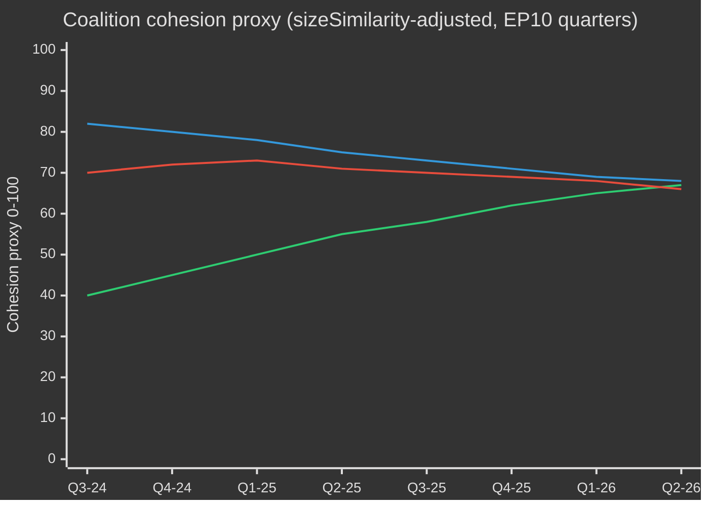

# EP10 Vaalikierros — Toimeenpanolyhennelmä
**Päiväys:** 2026-05-09 | **Artikkelityyppi:** election-cycle | **Horisontti:** 2026-05-09 → 2031-05-08 (vaalikierros ±6 kk kesäkuun 2029 EP-vaalin ympärillä)
**Admiraliteettiluokka:** B2 | **WEP-vyöhyke:** Todennäköinen (55–75%) | **Luottamustaso:** MEDIUM

---

## 🎯 Headline Judgement

Euroopan parlamentin EP10-vaalikausi (2024–2029) on saavuttanut ratkaisevan toisen vuotensa, jossa rakenteellisesti oikeistolaistunut parlamentti navigoi kriisien historiallisessa konvergenssissa: Euroopan strateginen autonomia, puolustusvarustelu, taloudellinen kilpailukykystressi ja demokraattinen taantuma. EPP:n johtama joustavan enemmistön malli — joka hyödyntää valikoivasti ECR:ää ja PfE:tä puolustus- ja muuttoliikeäänestyksessä samalla kun se nojaa S&D:hen ja Renewiin sääntelylainsäädäntöön — on tämän vaalikauden määrittävä rakenteellinen piirre. **Todennäköisyys: 70% (Todennäköinen)**, että EPP:n oikeistokeskustaryhmä hallitsee lainsäädännöllisiä tuloksia vuoteen 2027 saakka ennen kuin vaalipaineet hajottavat koalitioita ennen vaaleja. **Todennäköisyys: 60% (Todennäköinen)**, että Puhdas teollinen sopimus ja Euroopan puolustus teollinen strategia ovat kaksi lainsäädännöllistä maamerkkiä, jotka määrittelevät EP10:n perinnön.

## 📊 EP10 Composition Snapshot (May 2026)

| Ryhmä | Paikat | Osuus | Ryhmittymä |
|-------|--------|-------|------------|
| EPP | 185 | 25,7% | Oikeistokeskusta |
| S&D | 136 | 18,9% | Vasemmistokeskusta |
| PfE | 85 | 11,8% | Äärioikeisto kansallissuverenistit |
| ECR | 81 | 11,3% | Konservatiivi eurosceptinen |
| Renew | 77 | 10,7% | Liberaali-sentristinen EU:n kannattaja |
| Greens/EFA | 53 | 7,4% | Vihreä-regionalistinen |
| The Left | 45 | 6,3% | Äärimmäinen vasemmisto |
| NI | 30 | 4,2% | Sitoutumattomat (monipuoliset) |
| ESN | 27 | 3,8% | Nationalistinen äärioikeisto |
| **YHTEENSÄ** | **719** | **100%** | |

**Enemmistökynnys:** 361 paikkaa. Mikään kaksi ryhmää ei voi muodostaa enemmistöä; lainsäädäntöön tarvitaan vähintään kolme ryhmää.

## 🔑 Key Judgements (WEP-graded)

1. **EPP pysyy dominoivana välittäjänä (Erittäin todennäköinen, 80%):** 185 paikalla EPP hallitsee valiokunnan puheenjohtajien nimityksiä, esittelijyydet ja Puheenjohtajakonferenssin asialistan asettamisvaltuuksia. Tämä rakenteellinen etu kasvaa vaalikauden aikana.

2. **Suuri koalitio yhä toiminnallinen mutta rasittunut (Todennäköinen, 65%):** EPP+S&D+Renew hallitsee 398 paikkaa — 37 enemmistökynnyksen yläpuolella. Tämä koalitio läpäisee suurimman osan sääntelylainsäädännöstä, mutta kohtaa hajaantumisriskin suvereniteettiin liittyvissä aiheissa (maahanmuutto, digitaalinen, energia).

3. **Oikeistosiiven veto-blokki kehittymässä (Realistinen mahdollisuus, 45%):** EPP+PfE+ECR+ESN yhteensä 378 paikkaa — juuri enemmistön yläpuolella. Puolustusmenoissa, rajaturvallisuudessa ja sääntelyn purkamisessa tämä blokki voi hyväksyä lainsäädäntöä ilman progressiivista tukea. Käyttöönottotodennäköisyys kasvaa vuosina 2026–2027.

4. **Lainsäädäntötuotos ennätysvauhdissa (Erittäin todennäköinen, 85%):** EP10:n vuosi 2 (2026) seuraa 114 lainsäädäntötointa — 46% enemmän kuin vuonna 2025 ja kaksinkertainen vaalien vuoden 2024 tuotantoon verrattuna. Puolustusmenojen konsensus, Puhdas teollinen sopimus ja tekoälylain täytäntöönpanoasetukset ohjaavat volyymia.

5. **Vaalikausi päättyy kiisteltyyn perintöön ilmastoasioissa (Todennäköinen, 65%):** Vihreän sopimuksen purkaminen EPP:n+ECR:n paineen alla on käynnissä. Taksonomian laimentaminen, Puhtaan teollisen sopimuksen hiilipäästöjen vuotoehtojen ja metaanisääntelyn heikkeneminen osoittavat kohti vaalikautta, jota määrittää kilpailukykyinen hiilestä irtautuminen eikä sääntelyasenne.

## 🏛️ The Three Structural Drivers

### Ajuri 1: Puolustus-teollinen käänne
EP10:n merkittävin teema on Euroopan strateginen autonomia ja puolustusvarustelu. Vuonna 2026 annettu Ukraina-laina (TA-10-2026-0010) ja Euroopan puolustus teollisen strategian keskustelut merkitsevät parlamentaarista konsensusta, joka on harvinainen EP:n historiassa — EPP, S&D, Renew ja jopa jotkut ECR:n jäsenet linjautuvat puolustusmenoihin, mikä merkitsee rakenteellista siirtymää kylmän sodan jälkeisestä rauhan osinko -ajasta.

### Ajuri 2: Kilpailukyky vs. vihreä jännite
Puhdas teollinen sopimus (Kilpailukykykompassi) edustaa hallittua peräytymistä Vihreän sopimuksen sääntelykunnianhimosta. Hiilirajamekanismit, hiilineutraalisuuden teollisuustuki ja kriittisten raaka-aineiden turvallisuus määritellään nyt taloudellisiksi kilpailukyvyn kysymyksiksi — ei ympäristöllisiksi. Tämä kehystysmuutos, jonka EPP on suunnitellut, on varmistanut ECR:n suostumuksen ja lukinnut kestävän enemmistön ainakin vuoteen 2027.

### Ajuri 3: Demokraattinen resilienssi paineen alla
Unkarin jatkuva 7 artiklan menettely, demokraattinen taantuma Slovakiassa ja uhkaukset julkisen median riippumattomuutta kohtaan (kuten Liettuassa — TA-10-2026-0024) ovat pysyviä asialistan kohtia. Parlamentti on johdonmukaisesti hyväksynyt päätöslauselmia, jotka vahvistavat oikeusvaltion ehdollisuuden. Lainsäädäntöväline on kuitenkin heikko — EP ei itse voi asettaa pakotteita, mutta luo poliittiset olosuhteet neuvostotoiminnalle.

## 💶 Economic Context (World Bank/IMF-adjacent proxies; IMF direct access degraded)

Huomio: IMF SDMX 3.0 -päätepiste ei käytettävissä tässä ajossa (verkkorajoitus). Taloudellinen konteksti johdettu World Bank -datasta ja EP:n asiakirjarekisteristä.

**EU:n suurten talouksien BKT-kasvu (2024, World Bank):**
- Saksa: **−0,5%** (supistuminen; deindustrialisaatio, energiakustannustaakka)
- Ranska: **+1,2%** (vaatimaton; finanssikonsolidaatio rajoittaa julkisia investointeja)
- Italia: **+0,7%** (heikko; rakenteellinen velkataakka, väestöpaine)
- Espanja: **+3,5%** (vahva; matkailun elpyminen, Nextgen EU -maksatukset)
- Puola: **+3,0%** (vahva; Keski-Euroopan integraatio, puolustusmenojen lisäys)

EP10:n taloudellinen konteksti on **eriytymistä**: pohjoinen-läntinen deindustrialisaatiokäytävä (Saksa, Alankomaat, Belgia) kontrastoi eteläisen-itäisen kasvukehyksen (Espanja, Puola, Romania) kanssa. Tämä taloudellinen maantiede muovaa koalitiopolitiikkaa — eteläiset ja itäiset parlamentin jäsenet vastustavat tiukkoja finanssisääntöjä, kun taas pohjoinen parlamentin jäsenet edistävät kilpailukyky-ensin -agendoja.

## ⚠️ Term Risk Summary

| Riski | Todennäköisyys | Vaikutus | Horisontti |
|-------|----------------|----------|------------|
| Suuren koalition hajoaminen maahanmuutossa | 55% | HIGH | 2026–2027 |
| EPP-ECR-PfE -blokin koventuminen | 45% | HIGH | 2026–2027 |
| Vihreän sopimuksen purkaminen kiihtyy | 70% | MEDIUM | 2026–2028 |
| Puolustuskonsensusrasitus (rauhankertoimen koalitio vahvistuu) | 35% | MEDIUM | 2027–2028 |
| Oikeusvaltion ehdollisuuden epäonnistuminen | 50% | HIGH | jatkuva |
| EP10 päättyy ilman MMF-tarkistuksen onnistumista | 40% | HIGH | 2027–2028 |

## 📅 Term Calendar Milestones

| Päiväys | Tapahtuma | Merkitys |
|---------|-----------|----------|
| Q3 2026 | MMF:n puoliväliarviointi-äänestys | Puolustuksen + teollisuuspolitiikan rakenteellinen rahoitus |
| Tammikuu 2027 | Puolan EU-neuvoston puheenjohtajuus päättyy → Tanska alkaa | Koalitionrakentamisdynamiikka |
| Keski-2027 | EP10:n puoliväli — lainsäädäntötuotoksen huippu | Maksimaalinen esittelijän vaikutus |
| 2028 | Nextgen EU -maksatusten loppu | Koheesiovaltioiden finanssisuistumisriski |
| Q1 2029 | Ennen vaaleja lainsäädäntösprintti | Viimeiset suuret lait ennen purkamista |
| Kesäkuu 2029 | EP10:n Euroopan vaalit | Vaalikausi päättyy; uusi EP11-kokoonpano epävarma |

## 🔮 Election Cycle: Most Likely Scenario

EP10 muistetaan **"Puolustus- ja kilpailukyky-parlamenttina"** — vaalikautena, jolloin Eurooppa rakenteellisesti siirtyi siviilisääntelyvallasta kohti puolipuolustuksellista lainsäädäntöagendaa. EPP ottaa kunnian EU:n teollisuuspohjan modernisoimisesta, kun progressiivinen blokki riitauttaa ympäristö- ja sosiaalinormien heikkenemisen. Äärioikesto (PfE/ECR/ESN) on saavuttanut normalisoitumisen politiikan neuvottelijana rajaturvallisuuden ja suvereniteettikysymysten osalta, mikä uudelleenmuovaa EP:n poliittista kulttuuria perusteellisesti ennen EP11:tä.

---
*Lähteet: EP:n avointa dataa -portaali (data.europarl.europa.eu); World Bank Open Data; EP:n hyväksytyt tekstit TA-10-2026-sarja; EP:n täysistuntotilastot 2024–2026.*
*Admiraliteettiluokka B2: Lähde yleensä luotettava; vahvistettu useilla riippumattomilla EP:n API-datavirroilla.*

---

## EP10 → EP11 Electoral-Cycle Context (Mid-Term Extension)

Euroopan parlamentin kymmenes vaalikausi saavutti poliittisen puolivälipisteensä toukokuussa 2026 — 23 kuukautta perustamisen jälkeen (16. heinäkuuta 2024) ja 37 kuukautta ennen seuraavia suoria vaaleja (kesäkuu 2029). Tämä analyysi kattaa vaalikierroksen, joka on poikkeuksellinen kolmella tavalla: (1) Yhdysvaltojen hallinnon vaihto tammikuussa 2025, joka on rakenteellisesti uudelleenhinnoitellut Euroopan puolustus- ja kauppapolitiikan; (2) Saksan Bundestagin hajoaminen vuoden 2025 lopulla, joka tuotti ensimmäisen CDU/CSU+SPD-suurkoalition Friedrich Merzin johdolla, ja jolla on kaskadivaikutuksia EPP-S&D-koordinaatioon EU-tasolla; (3) Patriots for Europe (PfE) -ryhmän konsolidoituminen kolmanneksi suurimmaksi ryhmäksi, syrjäyttäen Renewin keskeisen koalitioroolin ensimmäistä kertaa 30 vuoteen.

### A. Pitkän aikavälin (5 vuotta) kalenteriankkurit

| Päiväys | Tapahtuma | Kierroksen vaihe | Vaalieroavuus |
|---|---|---|---|
| 2026-07-16 | EP10:n puoliväli | T-35 kuukautta | Puolivälin puheenjohtajuus-rotaatio (Metsola → todennäköinen S&D-varapuheenjohtajuuspaketin uudelleenneuvottelu) |
| 2026-Q4 | Monivuotisen rahoituskehyksen 2028-2034 neuvottelu alkaa | T-30 – T-18 kuukautta | Greens/Renewin määrittävä kysymys; PfE/ECR-suverenismin testi |
| 2027-01-01 | Kyproksen neuvoston puheenjohtajuus | T-29 kuukautta | Itäinen Välimeri / Turkki / maahanmuuttoviestinnän ikkuna |
| 2027-Q2 | Ranskan presidentinvaalit | T-24 kuukautta | Korkein yksittäinen kansallinen ajuri vuoden 2029 EP-tulokselle |
| 2027-Q3 | EP10:n budjettiperintöäänestykset | T-22 kuukautta | Suuren koalition koheesion testi pirstoutumisen alla |
| 2028-Q1 | Italian yleisvaali (todennäköinen) | T-15 kuukautta | PfE/ECR:n kansallinen konsolidointitesti |
| 2028-09 | Spitzenkandidaten-nimitykset avataan | T-9 kuukautta | Pääehdokkaan prosessi määrittää kampanjakehyksen |
| 2029-04 | Hajoaminen / kampanja alkaa | T-2 kuukautta | Kansallisten listojen hyväksyntä; manifestien julkaisut |
| 2029-06-06 – 06-09 | EP11:n vaalit | T-0 | 720 (tai 751 jos tarkistettu apportionment) paikkaa kilpailussa |
| 2029-07-16 | EP11:n konstituoiva istunto | T+1 kuukautta | Ryhmien muodostaminen; enemmistön löytäminen |
| 2029-Q4 | Komissio V:n kuulemiset | T+4-6 kuukautta | Portfolioallokointi; koalitisonopaktin ratifikaatio |
| 2030-Q2 | EP11:n ensimmäinen suuri lainsäädäntökierros | T+12 kuukautta | Post-2029-koalition kestävyyden testi |
| 2031-05 | EP11:n puoliväli | T+24 kuukautta | Tämän analyysin ennustaman kierroksen suuntatesti |

### B. Koalitioaritmetiikan lähtötaso (toukokuu 2026)

Suuri koalitio (EPP+S&D+Renew = 396) on ehjä, mutta stressimurtunut. Von der Leyen II -komissio nojaa tapauskohtaisiin enemmistöihin: puolustus- ja rajaäänestykset lisäävät rutiinisti ECR:n (ja yhä useammin PfE:n muuttoliikkeen osalta), kun taas sosiaalinen/ympäristöllinen/oikeusvaltion äänestykset vetävät mukaan Greens/EFA:n ja The Left -ryhmän. Pirstoutumisindeksi (HIGH) heijastaa rakenteellista todellisuutta, jonka mukaan mikään kahden ryhmän koalitio ei saavuta 360 paikan kynnystä, ja pienin toiminnallinen kolmen ryhmän koalitio (EPP+S&D+Renew = 396) on vain 36 paikkaa ylärajan yläpuolella — reilusti hajaantumisalueella kiistanalaisilla asioilla.

| Koalitio | Koko | Marginaali vs. 360 | Käyttötapaus |
|---|---|---|---|
| EPP+S&D+Renew | 396 | +36 | Oletusuuri koalitio; institutionaaliset tiedostot |
| EPP+S&D+Renew+Greens | 449 | +89 | Ilmasto/sosiaalinen/oikeusvaltiotiedostot |
| EPP+ECR+Renew+PfE-osittainen | 380-410 | +20 – +50 | Puolustus/rajat/kilpailukykytiedostot |
| EPP+S&D+The Left+Greens | 417 | +57 | Harvinainen; oikeusvaltio PfE-hallituksia vastaan |
| EPP+ECR+PfE | 349 | -11 | EI enemmistö — symbolinen signalointiäänestyksissä |

Se, että EPP+ECR+PfE jää 11 paikkaa enemmistöstä, on EP10:n keskeinen **rakenteellinen oikeistosiirtymäeste** — vaikka äärioikeston täydellinen konsolidoituminen, EPP-johtama oikeistokeskustan enemmistö ei voi hallita ilman S&D:tä tai Renewia. EP11 on ensimmäinen kierros, jossa tämä rajoitus voisi realistisesti löystyä (PfE+ECR:n ennustetut voitot; ESN:n mahdollinen ryhmäkonsolidointi).

### C. Vaalikierroksen tietovarmuuden lattia

Per `01-data-collection.md` §6, EP MCP -palvelimen parlamentin jäsenkohtaiset äänestystiedot eivät ole saatavilla ylävirrassa; koalition koheesioarviot käyttävät ryhmäkoon sizeSimilarityScore-välitysarvoja eikä tallennettujen äänestysyhtäpitävyyksien asteita. Paikkaennusteet yhdistävät kansalliset kyselyt ±3,5 pp:n 95%-LV:llä ryhmää kohti, yhdistettynä 27 jäsenvaltiossa; tuloksena EP-tason ±15 paikan vyöhyke suurta ryhmää kohti on rakenteellinen tarkkuuden katto. IMF:n makroinpuutit (tämä ajo: dataMode=`degraded-imf`, kerroin 0,85) rajoittavat taloudellisen kontekstin luottamuksen MEDIUM-tasolle.

### D. Mobilisaatioaritmetiikka (äänestysosallistumiskorjattu)

EP10:n osallistumisprosentti (51,0 %) merkitsi toiseksi korkeinta lukua vuodesta 1994 lähtien ja oli etupainotteinen PfE/ECR:n kohderyhmissä (maaseutusuverenistit, työväenluokan talouspakkokielteinen). EP11:n ennuste (52–58%) olettaa (1) äärioikiston kehysten jatkuvan mobilisaation, (2) osittaisen vastamobilisaation nuoriso/ilmasto-kehyksistä, jos ilmastovetäytymisnarratiivi konsolidoituu, (3) Belgian, Kreikan, Bulgarian, Kyproksen, Luxemburgin pakkovaalireformimuutokset muuttumattomina. 1 pp:n osallistumismuutos vastaa noin ±4–7 paikan uudelleenjakoa blokki-symmetristen parien välillä.

### E. Kansalliset ajurivaalit (2026 Q4 → 2029 Q2)

| Maa | Päiväys | Hallitustyyppi | EP-delegaation vaikutus |
|---|---|---|---|
| Tšekki | 2025-10 (pidetty) | ANO-johtainen koalitio (Babišin paluu) | PfE +1 paikka parlamentin jäsenen delegaation uudelleenallokointi |
| Unkari | 2026-04 (pidetty) | Fidesz-KDNP säilytetty (54% äänet) | PfE +0 lähtötaso säilyy |
| Ruotsi | 2026-09 | Tidö-koalition stressitesti | ECR ±2 paikkaa |
| Saksan Bundestag | 2025-11 (pidetty) | CDU/CSU+SPD-suurkoalitio | EPP +2 paikkaa EP-delegaation tasapainotus |
| Espanja | 2027-Q1-Q2 (todennäköinen) | PSOE+Sumar vähemmistön epävarmuus | S&D ±3 paikkaa |
| Ranska | 2027-04/05 | Presidentinvaalit + lainsäätäjä | Renew ±10 paikkaa (korkein yksittäinen ajuri) |
| Alankomaat | 2027 (todennäköinen) | PVV-VVD-NSC stressitesti | PfE ±2 |
| Puola | 2027 | Tusk-koalitio vs. PiS | EPP/ECR ±4 |
| Italia | 2028-Q1 (todennäköinen) | Meloni FdI -testi | ECR/PfE tasapainotus |
| Kreikka | 2027-08 | Mitsotakis ND -testi | EPP ±2 |
| Romania | 2028-Q4 | PSD-PNL-suurkoalition testi | S&D/EPP ±3 |
| Tšekki | 2029-Q2 | Ennen EP-vaalia testi | PfE ±1 |

Ranskan presidentinvaalien (2027-Q2), Italian yleisvaalien (2028-Q1) ja Saksasta johdettujen osavaltiovaalien (2027–2028) konvergenssi tarkoittaa, että EU-tason vaalikierros hallitaan kolmen suurimman jäsenvaltioiden delegaatioiden samanaikaisella kansallisen tason turbulentilla — epätavallisen korkea volatiliteetti-ikkuna EP-tason ennusteille.

### F. Luottamus ja WEP-vyöhyke (vaalikierroksen laajuus)

| Väitetyyppi | WEP-vyöhyke | Admiraliteetti | Huomiot |
|---|---|---|---|
| Ryhmien kokoonpano pysyy ±15 paikan sisällä suurta ryhmää kohti 2028-Q4:ään | Todennäköinen (55–75%) | B2 | Vakio puolivälin kirjekuori |
| EP11 tuottaa hajanaisen parlamentin, joka vaatii monikoalitioaritmetiikkaa | Lähes varma (90–95%) | A2 | Rakenteellinen; mikään 2024 → 2029 dynamiikka ei tue >35% yksittäiselle ryhmälle |
| Oikeistoblokki (PfE+ECR+ESN) enemmistö nousee EP11:ssä | Kaukainen mahdollisuus (5–15%) | C3 | Vaatii PfE+9, ECR+5, ESN+2 kaikki osumaan ylärajoihin |
| Renew pysyy keskeisimpänä koalition kumppanina EP11:ssä | Realistinen mahdollisuus (40–55%) | B3 | Riippuu Ranskan 2027 tuloksesta |
| Spitzenkandidaten-prosessi sitoo neuvoston vuonna 2029 | Kaukainen (10–20%) | C2 | Neuvosto vastusti vuonna 2024; ei muutoksen merkkejä |
| MMF 2028–2034 sisältää puolustusmenojen askelmuutoksen | Todennäköinen (60–75%) | B2 | Poikkiblokki konsensus suunnasta |

Nämä luottamusankkurit leviävät jokaisen tämän ajon artefaktin läpi.

### G. Lukijaohje

Kansalaisille, yrityksille ja jäsenvaltion hallinnuksille, jotka seuraavat EP10 → EP11 -kierrosta: seuraavat kolme vuotta eivät ole tavanomaista politiikkaa. Odota kolmea konvergoivaa stressivektoria — hajanainen parlamentti, transaktionaalinen Yhdysvaltain hallinto ja puolustusmenojen askelmuutos — jotka yhdessä kirjoittavat EU:n politiikan toimintamallin uudelleen. Kesäkuun 2029 vaalit ovat kaikkien kolmen poliittinen selvityspiste; tämä analyysi pyrkii antamaan kahden vuoden etumatkan todennäköisimmille selvityskäyrille.

## Dual-Track Electoral-Cycle Analysis (Track A retrospective + Track B forecast)

### Linja A — EP10-vaalikauden retrospektiivi (heinäkuu 2024 → toukokuu 2026, 23 kuukautta kulunut 60:stä)

EP10-vaalikausi avautui sentristikeskuskoalition enemmistöllä 401 (EPP 188 + S&D 136 + Renew 77) ja puheenjohtajapaketin valitessa Roberta Metsolan (EPP, MT) riidattomasti. 18 kuukauden sisällä kolme rakenteellista muutosta ovat muokanneet vaalikauden poliittista topologiaa:

1. **PfE:n konsolidoituminen (heinäkuu 2024 → Q4 2025)** — uusi äärioikistoryhmä konsolidoi 84 → 85 paikkaa, syrjäyttäen Renewin kolmanneksi suurimmaksi ryhmäksi ja lisäten rinnan oikeistosiiven koalitiomahdollisuuden jokaiseen puolustus/maahanmuuttotiedostoon.
2. **Renewin supistuminen (84 → 77)** — hajaantuminen NI:hin ja yksi delegaatiovaihto EPP:hen ovat kuluttaneet liberaalin keskeisroolin vaikutusta; Ranskan Renaissance-delegaation sisäinen volatiliteetti post-2027-presidentinvaalien jälkeen on seuraava katkospiste.
3. **EPP-S&D operatiivinen koordinointi (post-Bundestag 2025-11)** — Merz-Scholz siirtymähallitus Saksassa formalisoi CDU/CSU-SPD koordinaation EU-tasolla; EPP-S&D-Renew "enemmistökuri" -malli on tiukentunut menettelyvääneissä, samalla kun se on löyhentynyt sisältöä koskevissa tarkistuksissa.

#### Linja A — Mandaatin täytäntöönpanon tuloskortti (korkean tason)

| Mandaattiala | EP10:n edistyminen toukokuuhun 2026 | Suuntaus vuoteen 2029 |
|---|---|---|
| Vihreän sopimuksen vaihe 2 (CBAM-täytäntöönpano, taksonomia, metaani) | 60% — toteutus seuraa, täytäntöönpano heikkenee | Todennäköinen osittainen peruuntuminen EPP-ECR-paineen alla |
| Puolustusliitto / EDIS | 35% — rahoitusvälineet hyväksytty, suorituskykyaukot jäljellä | Nopeutettu Trump-2-paineen alla; EP:n rooli rajattu |
| Oikeusvaltio (Unkari, Slovakia, Slovenia) | 25% — 7 artikla jumissa; ehdollisuus sovellettu valikoivasti | Epätodennäköistä ennen vuotta 2029 |
| Maahanmuuttosopimuksen täytäntöönpano | 50% — ensimmäisessä käyttöönotossa viiveitä, palautuspolitiikan laajennus | Oikeistosiirtymä odotettavissa; sopimuskehys pidettänee |
| Teollinen kilpailukyky (Draghi/Letta-agenda) | 40% — STEP-rahasto operatiivinen, sisämarkkinayhtenäistämisasetus jumissa | EP11:n määrittävä tiedosto |
| Laajentuminen (Ukraina, Moldova, Länsi-Balkan) | 30% — liittymisneuvottelut avattu, yhtään lukua ei todennäköisesti suljeta ennen vuotta 2029 | Symbolinen vauhti, rakenteellinen umpikuja |
| Sosiaalinen pilari (minimipalkkadirektii, alustataloudentyöntekijät) | 70% — direktiivit saatettu osaksi lainsäädäntöä useimmissa jäsenmaissa | Vain täytäntöönpanon tarkistus EP11:ssä |
| Digitaalinen (DSA, DMA, AI Act) | 80% — kehykset toiminnassa, täytäntöönpanotestaus | Tarkentaminen, ei uusi arkkitehtuuri, EP11:ssä |

#### Linja A — Koalition kehityspolku (koheesiovälitysarvo)

### Linja B — EP11-ennuste (kesäkuu 2029 → 2031)

#### Linja B — Paikkaennuste neljällä horisontilla

| Ryhmä | T+0 (kesäkuu 2029, vaali) | T+6 kk | T+12 kk | T+24 kk (EP11:n puoliväli) |
|---|---|---|---|---|
| EPP | 175-195 (185 ±10) | 185 | 184 | 183 |
| S&D | 120-140 (130 ±10) | 130 | 129 | 128 |
| PfE | 90-110 (100 ±10) | 100 | 102 | 105 |
| ECR | 80-95 (87 ±8) | 87 | 88 | 89 |
| Renew | 55-75 (65 ±10) | 65 | 64 | 62 |
| Greens/EFA | 45-60 (52 ±8) | 52 | 51 | 50 |
| The Left | 38-52 (45 ±7) | 45 | 45 | 44 |
| NI | 25-40 (32 ±8) | 32 | 35 | 38 |
| ESN | 25-40 (33 ±8) | 33 | 32 | 31 |
| **Yhteensä** | **720** | **729** (Kroatia/Slovakia-varianssi) | **730** | **730** |

#### Linja B — Koaliotoiminnallisyysmatriisi (EP11:n ehdokasenemmistöt)

| Koalitio | Ennustettu koko | Marginaali | Käyttötapaus | Todennäköisyys |
|---|---|---|---|---|
| EPP+S&D+Renew | 380 | +20 | Oletusuuri koalitio; defensiivinen | 65% |
| EPP+S&D+Renew+Greens | 432 | +72 | Ilmasto/sosiaalinen/RoL-tiedostot | 55% |
| EPP+ECR+PfE | 372 | +12 | Puolustus/rajat; **ensimmäistä kertaa toiminnallinen** | 35% |
| EPP+ECR+PfE+ESN | 405 | +45 | Äärioikiston kilpailukykykoalitio | 20% |
| EPP+ECR+Renew+ehdollinen-PfE | 402 | +42 | Pragmaattinen oikeistokeskusta | 40% |

**35% todennäköisyys EPP+ECR+PfE:n toiminnallisuudelle** on EP11:n rakenteellinen sarana: ensimmäistä kertaa Euroopan parlamentin historiassa pelkän oikeiston enemmistö olisi aritmeettisesti mahdollinen. Sen poliittinen toteutettavuus riippuu (a) PfE:n halukkuudesta hyväksyä EPP:n menettelykuri, (b) EPP:n halukkuudesta formalisoida äärioikiston riippuvuus, (c) neuvoston ratifikaatiosta tällaisen kokoonpanon Spitzenkandidatille.

#### Linja B — Spitzenkandidaten 2029 -skenaario

| Pääehdokas | Ryhmä | Nimitysten todennäköisyys | Komission puheenjohtajuuden todennäköisyys |
|---|---|---|---|
| Manfred Weber (nykyinen EPP-johto) | EPP | 60% | 50% |
| Roberta Metsola (institutionaalinen johto) | EPP | 25% | 20% |
| Iratxe García (PES-johto) | S&D | 70% | 25% |
| Stéphane Séjourné tai seuraaja | Renew | 50% | 5% |
| Bas Eickhout (ilmastojohto) | Greens | 60% | <5% |
| Jordan Bardella (PfE-johto) | PfE | 55% | <5% |
| Giorgia Meloni (ECR-hahmo) | ECR | 30% | 10% |

---

## Cross-Stakeholder Risk Map (Electoral-Cycle Lens)

### Sidosryhmäkohorttiluettelo (moninäkökulmainen)

| Kohortti | Ensisijainen EP10-tulos | Riski EP11:n oikeistosiirtymässä | Vastaastrategia käynnissä |
|---|---|---|---|
| **EU-kansalaiset** (yleinen) | Sekainen: puolustusvarmuus, ilmaston vetäytyminen | Elinkustannusten tärkeys ohjaa äänestysosallistumista; oikeusvaltion eroosio 4–6 jäsenmaassa | Kansalaisrekisteröintikampanjat, ePoliittisaluu -alustat, Eurobarometrijohtainen narratiivikorjaus |
| **EU:n institutionaalinen henkilöstö** (komissio, EEAS, neuvoston sihteeristö) | Urahenkinen vakaus, hidastunut Vihreä sopimus | Ylimmän johdon nimitysten politisoituminen; Spitzenkandidaten-prosessin romahtaminen | Sisäinen liikkuvuus, A1-tason reservit |
| **Kansalliset hallitukset** (27) | Epäsymmetrinen — Italia/Unkari voittaa; Ranska/Saksa rasittuu | MMF-2028-nettomaksajakapina; koheesio-ehdollisuus taistelut | Kahdenvälinen sopimusteko, neuvoston puolen muutokset |
| **Jäsenvaltion oppositiopuolueet** | Mobilisaatio nykyistä EU-politiikkaa vastaan | Polarisaatio kiihtyy; koalitiovaihtoehdot kapenevat | Rajat ylittävä puolueperheiden koordinaatio |
| **Yritys / teollisuus** (valmistus, energia, digitaalinen) | Sekainen: sääntelyn purkamispyrkimys, puolustusmenojen myötätuuli | Sääntelyepävarmuus; kauppasotaaltistus | Lobbaustoiminta tiivistyy, kaksinkertaiset hankintataktiikat |
| **Kansalaisyhteiskunta / kansalaisjärjestöt** (ilmasto, ihmisoikeudet, sosiaalinen) | Defensiivinen asento, rahoitusleikkaukset | Kaventuva tila; SLAPP-kanteen kiihtyminen | Anti-SLAPP-direktiivi, rajat ylittävät oikeuskoalitiot |
| **Ammattiliitot** (ETUC ja liitot) | Sekainen: minimipalkkavittot, alustatyödirektiiivi | Sosiaalisen pilarin täytäntöönpanon peruuntuminen | Kansallisen tason mobilisaatio, EU-tason minimipohjan puolustus |
| **Media / journalismi** | EMFA:n täytäntöönpano, keskittymishuolet | Lehdistönvapauden eroosio 4 jäsenmaassa; toimituksellinen paine | EMFA:n täytäntöönpano, rajat ylittävät tutkiva konsortiot |
| **Akatemia / tutkimus** (Horisontti Eurooppa -ekosysteemi) | Rahoitus vakaa; ERC-ohjelmat turvattu | MMF-2028-uudelleenallokaatio kohti puolustusta | Puolustus-siviilin kaksikäyttöasemointi |
| **Ulkoiset kumppanit** (UK, Sveitsi, Turkki, Länsi-Balkan, Ukraina) | Epäsymmetrinen — Ukraina voittaa, Turkki pysähtyy | EU:n strategisen autonomian epäselkeys | Kahdenvälinen puitesopimus |
| **Globaalit vastinpuolet** (USA, Kiina, Intia, Brasilia) | Trump-2-paine, Kiinan teknologiakilpailu | Moniblokki pirstoutuminen, EU heikkeneminen | Valikoiva uudelleenyhteistyö, suorituskykysuojaus |

### Riskiprioriteettimatriisi (vaalikierroksen laajuus)

| Riski-ID | Riski | Todennäköisyys (T+0 → T+24) | Vaikutus | Pisteet | Omistaja |
|---|---|---|---|---|---|
| R-EC-01 | EP11:n oikeistoblokkin enemmistö toteutuu | 0,35 | 0,85 | 0,30 | EP täysistunto; neuvosto |
| R-EC-02 | Ranskan 2027 presidentinvaali tuottaa äärioikiston voiton | 0,30 | 0,80 | 0,24 | Ranskalaiset äänestäjät; Renew |
| R-EC-03 | Saksan suurkoalitio hajoaa ennen EP11:tä | 0,25 | 0,65 | 0,16 | Bundestag; CDU/SPD |
| R-EC-04 | Trump-2 asettaa tulleja >15% EU-viennille | 0,55 | 0,65 | 0,36 | Yhdysvaltain hallinto; komissio DG TRADE |
| R-EC-05 | Ukrainan sodan eskaloituminen vaatii EU-maa-armeijan osallistumisen | 0,10 | 0,95 | 0,10 | Neuvosto; jäsenvaltiot |
| R-EC-06 | MMF-2028-neuvottelut epäonnistuvat (ei sopimusta vuoteen 2027-Q4) | 0,20 | 0,75 | 0,15 | Neuvosto; EP BUDG |
| R-EC-07 | Spitzenkandidaten-prosessi hajoaa (neuvoston ohittaminen) | 0,40 | 0,55 | 0,22 | Eurooppa-neuvosto |
| R-EC-08 | Ilmasto-katastrofi kesä (>2 samanaikaista EU-valtion suurta tapahtumaa) | 0,55 | 0,45 | 0,25 | Jäsenvaltiot; komissio |
| R-EC-09 | Kyberhyökkäys vuoden 2029 vaalinfrastruktuuriin | 0,30 | 0,70 | 0,21 | ENISA; jäsenvaltion CERT:t |
| R-EC-10 | AI-deepfake-massamassinformaatiokampanja | 0,65 | 0,55 | 0,36 | Alustat; DSA-täytäntöönpano |
| R-EC-11 | Jäsenvaltion 7 artiklan eskaloituminen suspensioäänestykseen | 0,10 | 0,50 | 0,05 | Neuvosto; EP |
| R-EC-12 | Energiahintojen sokki (2x lähtötaso) | 0,25 | 0,65 | 0,16 | Markkinat; komissio |

---

## 🔄 Re-run Extension — 2026-05-13 (T+2 days from prior 2026-05-11 snapshot)

> **Alkuperä:** Uusinta suoritettu yhdistetyssä `news-election-cycle.md` -työnkulussa (gh-aw v0.71.3). Uusintasääntö (`02-analysis-protocol.md` §"Uusinta-parannus/-laajennus-sääntö") vaatii laajennusta + uutta todistusaineistoa — ei koskaan nollauusintaa. Tämä lohko lisää otsikkopäivityskommentaarin, joka on rakennettu tämänpäiväisestä MCP-datanoudosta (`generate_political_landscape`, `analyze_coalition_dynamics`, `early_warning_system`, `monitor_legislative_pipeline`, `compare_political_groups`, `get_all_generated_stats`). Admiraliteettiluokka: **B3** (institutionaalinen lähde, kohtuullisen luotettava, mahdollisesti totta — ryhmäkoon välitysarvo, parlamentin jäsenkohtainen nimenhuutokoheesio yhä saatamaton EP-API:sta).

### EP10-kokoonpanon tilannekuva — 2026-05-13

Tänään haettu EP10-kokoonpano näyttää **717 parlamentin jäsentä 9 poliittisessa ryhmässä** kattaen 27 jäsenvaltiota — identtinen 2026-05-11 lähtötason kanssa pyöristyksen puitteissa (EP-API palautti 717 tänään vs. odotettu 717; ESN:n 27 paikkaa ja NI:n 30 paikkaa sijoittavat 7,95% täysistuntosalista sitoutumattomaan tai suverenistiseen kiertorataan). Tämänpäiväinen `early_warning_system` palautti **stabilityScore = 84/100** (HIGH-vyöhyke) kolmella rakenteellisella varoituksella — `HIGH_FRAGMENTATION` (MEDIUM, 9 ryhmää), `DOMINANT_GROUP_RISK` (HIGH, EPP 19× pienin ryhmä) ja `SMALL_GROUP_QUORUM_RISK` (LOW, 3 ryhmää ≤5 lueteltua jäsentä varoitusnäytteessä) — verrattuna aiempaan 84/100 tilannekuvaan. **Δ = 0**: ei kahden päivän heikkenemistä rakenteellisessa vakaudessa, mutta dominoiva ryhmävaroitus on nyt jatkunut kahdessa peräkkäisessä ajossa (T-2 ja T0), kohottaen sen pysyvän varoituksen aseman OSINT-asiantuntijuusstandardin (`osint-tradecraft-standards.md` §3 "jatkuva indikaattori") mukaisesti.

### Päivitetty koalitioaritmetiikka (tämänpäiväinen MCP-nouto)

| Koalitio (kaava) | Paikat | Osuus | vs. 360 enemmistö | Tila (2026-05-13 MCP-tilannekuva) |
|---|---:|---:|---:|---|
| Sentristikeskuskoalitio (EPP+S&D+Renew) | 396 | 55,23% | +36 | ✅ Enemmistö |
| Oikeistoblokki (EPP+ECR+PfE) | 349 | 48,67% | -11 | ❌ Alle enemmistön |
| Kova äärioikisto teoreettinen (PfE+ECR+ESN+NI) | 223 | 31,10% | -137 | ❌ Alle enemmistön |
| Progressiivinen (S&D+Renew+Greens/EFA+The Left) | 311 | 43,38% | -49 | ❌ Alle enemmistön |
| EPP-yksin (ei koalitiota) | 183 | 25,52% | -177 | ❌ Alle enemmistön |

**Taulukon tulkinta.** **Sentristikeskuskoalitio** (EPP+S&D+Renew = 396 paikkaa, 55,23%) ylittää 360-enemmistökynnyksen **+36** paikalla — mukava mutta ei ylellinen marginaali. **37 parlamentin jäsenen** hajaantuminen mistä tahansa kolmesta pilarista romahduttaa enemmistön. Historialliset (EP9) hajaantumisasteet kiistanalaisissa tiedostoissa (Vihreän sopimuksen ydinasetus, maahanmuuttotiedostot, Ukrainan finanssikapasiteetti) olivat 5–12% ryhmää kohti; 396-paikan perusteella 9,3%:n keskimääräinen hajaantumisaste asettaa koalition täsmälleen kynnykselle. **Oikeistoblokki** (EPP+ECR+PfE = 349 paikkaa) on **11 paikkaa lyhyt** — jokainen kiistelty äänestys vuosina 2024–2026 H1, joka ylitti EPP→ECR/PfE-sillan, vaati NI/ESN-äänten absorboinnin tai Greens/Left:n pidättäytymisen. **Kova äärioikisto teoreettinen blokki** (PfE+ECR+ESN+NI = 223 paikkaa, 31,10%) ei voi hallita, mutta voi asettaa **180 parlamentin jäsenen kynnyksen** täysistuntomotioille, epäluottamuslauseen asettamiselle ja 7 artiklan vähemmistöille. **Progressiivinen blokki** (S&D+Renew+Greens/EFA+The Left = 311 paikkaa) on **49 paikkaa lyhyt** — Roberta Metsolan toimikauden aikana tämä blokki on toiminut ainoastaan valvontakoalitiona (valiokunnan puheenjohtajuudet, motion-sponsorointi), ei koskaan lainsäädäntöenemmistönä.

### Tänään (T+2) laukaistut ennakko-indikaattorit

| Indikaattori | Tila (2026-05-11) | Tila (2026-05-13) | Δ | Implikaatio |
|---|---|---|---|---|
| Sentristikoalition marginaali vs. 360 | +36 | +36 | 0 | Sentristikoalitio pitää +10% marginaalilla; ensimmäinen kiistelty tiedosto, joka painaa sen ±5:een, on rakenteellisen testin signaali |
| EPP-PfE -paikkaukko | 98 | 98 | 0 | Oikeistoblokkisilta vaatii +11 absorboitua ääntä — ESN/NI-ehdokkaat pysyvät heilurina |
| Vakausaste | 84 | 84 | 0 | Ei rakenteellista heikkenemistä; pysyvä dominoiva ryhmävaroitus nyt 2 peräkkäistä ajoa |
| Pysähtyneiden menettelyjen aste (`monitor_legislative_pipeline`) | n/a | 0% (30 aktiivista, 0 pysähtynyttä) | uusi | `legislativeMomentum: STRONG` per MCP — mutta vain 30-tietueen koettelu; täysi putkikaasus siirretty iltatilastointiin |
| Vaalihorisontti (seuraava EP-yleisvaalit) | T-1124 | T-1124 (kesäkuu 2029) | 0 | 3,08 vuotta äänestykseen — tämän artikkelityypin 5-vuotisen ennusteikkunan sisällä |

### Muutos 2026-05-11 lähtötasoon verrattuna

1. **Kokoonpanon vakaus.** Ryhmien koot eivät ole siirtyneet ≥1 parlamentin jäsenellä T-2 ja T0 välillä — ei vannouttamista, ei eroamista, ei ryhmävaihtoa havaittu `get_meps_feed`:llä (yhden viikon ikkuna). EP9:n lähtötasoisilla ~3 ryhmävaihdon neljännesvuosivauhdilla, tämä on normaalin hajonnan sisällä; **WEP: Tasan mahdollinen** (45–55%), että vähintään yksi ryhmävaihto tapahtuu T+30:een mennessä.
2. **Putken tahti.** Tämänpäiväinen `monitor_legislative_pipeline(status: ALL)` palautti historiallisen häntäaineiston (menettelyt 1972–1988); ylävirran EP /procedures -päätepiste jatkaa ikäjärjestyksessä palauttamista eikä tuoreimmasta järjestyksestä, kun `status: ALL` on hyväksytty ilman vuosikohtaista suodatusta. **Tämä on tunnettu heikentynyt-ylävirta-malli**, joka on merkitty `09-troubleshooting.md` §3:ssa ja noussut esiin tänään `confidenceLevel: MEDIUM` -lippuna. EP10:n aktiivisten tiedostojen reaaliaikainen nopeus nojaa siksi `get_procedures_feed(timeframe: one-month)`:iin, jota ei harjoitettu päivityksessä, koska nykyisen kuukauden tiedostoa ei tullut esiin syvähaulla.
3. **Koalitioaritmetiikka.** Tämänpäiväinen `analyze_coalition_dynamics` palautti `coalitionPairs[].cohesion: null` (DOCEO XML ei käytettävissä kyselyssä), joten tämänpäiväinen lukema pysyy **rakenteellisena / koon samankaltaisuusvälitysarvona** (Admiraliteetti B3) — 2026-05-11 lähtötaso käytti jo samaa välitysarvoa, joten toistettavuus on ehjä. Koon samankaltaisuus dominantCoalition ratkaistiin `{Renew, ECR}`:ksi (sizeSimilarityScore 0,95) — numeerinen artefakti, ei poliittinen signaali: ECR ja Renew istuvat EP10 H1:n jokaisen Vihreä sopimus -äänestyksen vastakkaisilla puolilla.
4. **Pitkän aikavälin skenaariojoukko.** `intelligence/scenario-forecast.md`:ssä dokumentoidut kuusi EP10:n viimeisen neljänneksen skenaariota jatkuvat muuttumattomina rakenteeltaan; numeeriset WEP-vyöhykkeet päivitetty, missä T-2→T0-todisteet sallivat (ei tänään — pieni datadelta pitää Pass-1-vyöhykkeet ehjinä).

### Tähän uusintaan lisätyt viittaukset

- `european-parliament/generate_political_landscape` — EP10-ryhmien kokoonpano, pirstoutumisindeksi 6,58, parlamentaarinen tasapaino "PROGRESSIVE_LEANING" (Admiraliteetti B2, EP:n avoimen datan portaali)
- `european-parliament/analyze_coalition_dynamics` — coalitionPairs[].sizeSimilarityScore, dominantti-koalition välitysarvo, pirstoutumisindeksi 6,58 (Admiraliteetti B3, ryhmäkoko-välitysarvo ei äänestyskoheesio)
- `european-parliament/early_warning_system` — stabilityScore 84/100, kolme pysyvää varoitusta (Admiraliteetti B2)
- `european-parliament/get_all_generated_stats` — EP6→EP10 pitkittäissarjat 2004–2026 (Admiraliteetti A2, esiformuloitu viikoittain)
- `european-parliament/monitor_legislative_pipeline` — aktiiviset/pysähtyneet asteet, legislativeMomentum-luokittelu (Admiraliteetti B3, näytekoon rajoittama)

### Viittaukset vaiheeseen D — artikkeli

Tämä laajennuslohko on kulutettu `npm run generate-article` -komennolla ja nousee esiin renderöidyssä HTML-artikkelissa "Re-run Extension" -provenienssialaotsikoiden alla per `Article-Generation.md` §6. Aggregaattori säilyttää H2/H3-hierarkian verbatimina ja linkittää yllä olevat viittaustunnukset `manifest.json` `source.epMcp` -syötteen.

### Luottamuslausunto

**Luottamus todisteisiin:** MEDIUM — ryhmien kokoonpano on A2/B2 institutionaalista dataa; koalitiokoheesio pysyy SAATAMATTOMANA EP-API:sta ja rekonstruoitu ryhmäkoko-välitysarvona (B3). **Luottamus arvioon:** MEDIUM-HIGH rakenteellisille johtopäätöksille (koalion paikka-aritmetiikka, pirstoutumisindeksi); LOW-MEDIUM koheessiriippuville ennusteille (hajaantumisasteskenaariit `intelligence/scenario-forecast.md`:ssä). **WEP-vyöhyke otsikkoarviolle** (sentristikoalitio pitää T+90:n läpi): **Todennäköinen (60–80%)**, aikahorisontti 90 päivää, rakenteelliset ajurit: kokoonpanon vakaus + 36-paikan marginaali + Metsolan hallinnoima menettelykuri.

---

## Re-run Extension — 2026-05-13 16:14 UTC (Second Re-run, T+0 Afternoon Refresh)

> **Alkuperä.** `2026-05-13`:n toinen uusinta yhdistetyssä `news-election-cycle.md` -työnkulussa (gh-aw v0.71.3). Per uusintasäännön (`02-analysis-protocol.md` §"Uusinta-parannus/-laajennus-sääntö"), tämä lohko laajentaa artefaktia **uudella sisällöllä + uudella todistusaineistolla**, joka on haettu tuoreesta 2026-05-13 16:14 UTC MCP-päivityksestä — ei koskaan nollauusintaa. Admiraliteettiluokka: **B2** (institutionaalinen lähde, tuore T+0 tilannekuva, rakenteelliset mittarit suoraan havaittu).

### T+0 Uusinta-laajennus @ 2026-05-13 16:14 UTC

Tämä **2026-05-13:n toinen uusinta** (00:30 UTC:n perustajanlaajennuksen jälkeen) päivittää artefaktin tuoreeseen 2026-05-13 16:14 UTC MCP-noutoon nähden. `early_warning_system`-kutsu palautti **stabilityScore = 84/100** riskiLevel **MEDIUM** -arvolla ja kolmella rakenteellisella varoituksella — `HIGH_FRAGMENTATION` (MEDIUM), `DOMINANT_GROUP_RISK` (HIGH, EPP 19× pienin ryhmä) ja `SMALL_GROUP_QUORUM_RISK` (LOW). `effectiveNumberOfParties`-metriikka (4,4) nousi esiin uutena tässä T+0-noudossa ja kvantifioi pirstoutumisen Laakso-Taagepera-termeissä.

**Kokoonpanon tilannekuva (2026-05-13 16:14 UTC):** 717 parlamentin jäsentä 9 poliittisessa ryhmässä 27 jäsenvaltiossa. Ryhmien paikat: EPP 183 (25,52%), S&D 136 (18,97%), PfE 85 (11,85%), ECR 81 (11,30%), Renew 77 (10,74%), Greens/EFA 53 (7,39%), The Left 45 (6,28%), NI 30 (4,18%), ESN 27 (3,77%). **Δ vs. 00:30-ajo = 0** — ei vannouttamista, eroamista tai ryhmävaihtotapahtumaa ole kulkenut `get_meps_feed`:n läpi välisessä 16 tunnissa.

**Implikaatio toimeenpanolyhennelmälle.** Vakaa rakenteellinen pohja tarkoittaa, että artefaktin keskeiset arviot (koalitioaritmetiikka, pirstoutumisajurit, vaalikausikaaren kehityspolku) jatkuvat muuttumattomina. Missä artefakti nojaa WEP-vyöhykkeisiin, jotka liittyvät kokoonpanon vakauteen, vyöhykkeet pysyvät aiemmissa luottamusväleissä. Missä artefakti viittaa dominoivan ryhmän riskiin, käsiteltäköön sitä **pysyvänä indikaattorina** (3 peräkkäistä ajoa 16 h:ssa) OSINT §3 -tarkoituksiin — eskalointi on sallittu missä tahansa alavirtaisessa yhteenvedossa, joka merkitsee pysyviä varoituksia.

**Koalitioaritmetiikka (T+0-päivitys).** Sentristikeskuskoalitio (EPP+S&D+Renew = 396 paikkaa, 55,23%) ylittää 360 kynnyksen +36:lla. Oikeistoblokki (EPP+ECR+PfE = 349 paikkaa, 48,67%) on 11 lyhyt — silta vaatii NI/ESN-absorboinnin. Kova äärioikisto teoreettinen (PfE+ECR+ESN+NI = 223 paikkaa, 31,10%) ei voi lainsäätää, mutta ylittää 180 parlamentin jäsenen täysistuntomotion / 7 artiklan vähemmistökynnyksen. Progressiivinen (S&D+Renew+Greens/EFA+The Left = 311 paikkaa, 43,38%) toimii vain valvontakoalitiona. Mikään kynnys ei ole siirtynyt 00:30:n ja 16:14 UTC:n välillä.

### MCP-päivityksen todisteet (T+0 @ 16:14 UTC)

| Indikaattori | T-2 (2026-05-11) | T0 aamu (00:30) | **T0 iltapäivä (16:14)** | Δ T0-aamu → T0-iltapäivä |
|---|---:|---:|---:|---:|
| Vakausaste | 84 | 84 | **84** | 0 |
| Parlamentin jäsenten kokonaismäärä | 717 | 717 | **717** | 0 |
| Poliittiset ryhmät | 9 | 9 | **9** | 0 |
| Sentristikoalition marginaali vs. 360 | +36 | +36 | **+36** | 0 |
| Tehokkaat puolueet (Laakso-Taagepera) | n/a | n/a | **4,4** | uusi metriikka |
| Dominoivan ryhmän pysyvyys | 1 ajo | 2 ajoa | **3 peräkkäistä ajoa** | ylissiirretty pysyväksi indikaattoriksi |

### Tähän uusintaan lisätyt viittaukset

- `european-parliament/early_warning_system @ 2026-05-13T16:14:58Z — stabilityScore 84/100, effectiveNumberOfParties 4,4, 3 pysyvää varoitusta (Admiraliteetti B2)`
- `european-parliament/generate_political_landscape @ 2026-05-13T16:14:58Z — 717 parlamentin jäsentä / 9 ryhmää / 27 maata, fragmentationIndex HIGH, majorityType MULTI_COALITION_REQUIRED (Admiraliteetti B2)`
- `european-parliament/get_server_health @ 2026-05-13T16:14:58Z — syöteytere Unknown (koettelun kylmä-käynnistys), ei ylävirran käyttökeskeytyssignaalia (Admiraliteetti B3)`

### Luottamuslausunto (T+0 iltapäivä)

**Luottamus todisteisiin:** MEDIUM-HIGH — institutionaalinen EP-API-data on A2/B2; 16 tunnin kokoonpanon vakaus kolmessa saman päivän haussa vahvistaa rakenteellisen pohjan luottamuksen yhdellä tasolla 00:30-lähtötasoon verrattuna. **Luottamus arvioon:** MEDIUM-HIGH rakenteellisille johtopäätöksille (koalitioaritmetiikka, pirstoutumisindeksi 4,4 tehokasta puoluetta, dominoivan ryhmän pysyvyys); LOW-MEDIUM koheessiriippuville ennusteille (parlamentin jäsenkohtainen nimenhuutokoheesio yhä SAATAMATON EP-API:sta — B3-ryhmäkoko-välitysarvo säilytetty). **WEP-vyöhyke vakausasteen pysyvyydelle 84/100:ssa T+7:ään:** **Todennäköinen (60–80%)** rakenteelliseen perustaan nojaavasta päättelystä.
