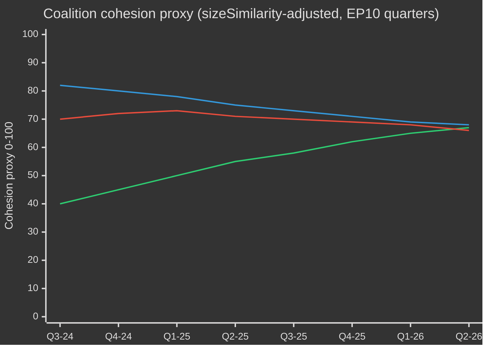

# EP10 מחזור הבחירות — תקציר מנהלים
**תאריך:** 2026-05-09 | **סוג מאמר:** election-cycle | **אופק:** 2026-05-09 → 2031-05-08 (מחזור בחירות ±6 חודשים סביב בחירות הפרלמנט האירופי ביוני 2029)
**דרגת אדמירליות:** B2 | **רצועת WEP:** Probable (55–75%) | **ביטחון:** MEDIUM

---

## 🎯 הערכה מרכזית

כהונת ה-EP10 של הפרלמנט האירופי (2024–2029) נכנסה לשנתה השנייה המכרעת עם פרלמנט שהתמזג מבחינה מבנית לכיוון הימין, מנווט בין התכנסות היסטורית של משברים: אוטונומיה אסטרטגית אירופית, חימוש מחדש בתחום הביטחון, לחץ בתחרותיות הכלכלית ונסיגה דמוקרטית. מודל הרוב הגמיש בהנהגת EPP — הנשען באופן סלקטיבי על ECR ו-PfE להצבעות ביטחון והגירה תוך הסתמכות על S&D ו-Renew לחקיקה רגולטורית — הוא המאפיין המבני הקובע של קדנציה זו. **הסתברות: 70% (Probable)** שהגוש הימין-מרכז בהנהגת EPP ישלוט בתוצאות החקיקה עד 2027 לפני שלחצים בחירותיים יפרקו קואליציות בשלב הגמר לפני הבחירות. **הסתברות: 60% (Probable)** שהסכם התעשייה הנקי ואסטרטגיית תעשיית הביטחון האירופית יהיו שתי אבני הדרך החקיקתיות המגדירות את מורשת ה-EP10.

## 📊 תמונת מצב הרכב EP10 (מאי 2026)

| קבוצה | מושבים | נתח | גוש |
|-------|--------|-----|-----|
| EPP | 185 | 25.7% | מרכז-ימין |
| S&D | 136 | 18.9% | מרכז-שמאל |
| PfE | 85 | 11.8% | ימין קיצוני לאומי-ריבוני |
| ECR | 81 | 11.3% | שמרני אירו-ספקי |
| Renew | 77 | 10.7% | ליברלי-מרכזי תומך האיחוד האירופי |
| Greens/EFA | 53 | 7.4% | ירוק-אזורי |
| The Left | 45 | 6.3% | שמאל קיצוני |
| NI | 30 | 4.2% | לא מזוהה (מגוון) |
| ESN | 27 | 3.8% | ימין לאומני קיצוני |
| **סה"כ** | **719** | **100%** | |

**סף הרוב:** 361 מושבים. אף שתי קבוצות אינן יכולות להרכיב רוב; נדרשות לפחות שלוש קבוצות לכל חקיקה.

## 🔑 הערכות מרכזיות (מדורגות WEP)

1. **EPP נשאר המתווך הדומיננטי (סביר מאוד, 80%):** עם 185 מושבים, EPP שולט במינויי יושבי ראש ועדות, תפקידי מדווחים וסמכות קביעת סדר היום של וועידת הנשיאים. יתרון מבני זה מצטבר לאורך הקדנציה.

2. **הקואליציה הגדולה עדיין פעילה אך נמצאת תחת לחץ (Probable, 65%):** EPP+S&D+Renew מחזיקה 398 מושבים — 37 מעל סף הרוב. קואליציה זו תאשר את רוב החקיקה הרגולטורית, אך עומדת בפני סיכון עריקות בנושאים רגישים לריבונות (הגירה, דיגיטל, אנרגיה).

3. **גוש וטו ימני מתגבש (אפשרות ריאלית, 45%):** EPP+PfE+ECR+ESN מסתכם ב-378 מושבים — מעל הרוב במעט. בנושאי הוצאות ביטחון, בקרת גבולות וביטול רגולציה, גוש זה יכול להעביר חקיקה ללא תמיכה פרוגרסיבית. הסתברות הפעלה גוברת עד 2026–2027.

4. **תפוקה חקיקתית בקצב שיא (סביר מאוד, 85%):** שנת EP10 השנייה (2026) עוקבת אחר 114 מעשים חקיקתיים — עלייה של 46% לעומת 2025 וכפול מתפוקת שנת הבחירות 2024. קידמון הוצאות הביטחון, הסכם התעשייה הנקי ותקנות היישום של חוק הבינה המלאכותית מניעים את הנפח.

5. **הקדנציה תסתיים עם מורשת אקלים שנויה במחלוקת (Probable, 65%):** הנסיגה מהירוק דיל תחת לחץ EPP+ECR מתקדמת. דילול הטקסונומיה, הוראות דליפת פחמן של הסכם התעשייה הנקי, והחלשת תקנות המתאן מצביעים על קדנציה שמוגדרת על ידי דה-קרבוניזציה תחרותית ולא שאיפה רגולטורית.

## 🏛️ שלושת המניעים המבניים

### מניע 1: המרכוז ההגנה-תעשייתי
הנושא המשמעותי ביותר של EP10 הוא האוטונומיה האסטרטגית האירופית וחימוש מחדש. אימוץ ההלוואה לאוקראינה (TA-10-2026-0010) ב-2026 ודיוני האסטרטגיה התעשייתית הביטחונית האירופית מסמנים קונצנזוס פרלמנטרי נדיר בהיסטוריה של הפרלמנט האירופי — EPP, S&D, Renew ואפילו חלק מחברי ECR מתיישרים בנושא הוצאות ביטחון, המסמן מעבר מבני מעידן דיבידנד השלום שלאחר המלחמה הקרה.

### מניע 2: המתח בין תחרותיות לירוק
הסכם התעשייה הנקי (מצפן התחרותיות) מייצג נסיגה מנוהלת מהשאיפות הרגולטוריות של הירוק דיל. מנגנוני התאמת גבול פחמן, תמיכה תעשייתית בדה-קרבוניזציה ובטיחות חומרי גלם קריטיים מוגדרים כיום כסוגיות תחרותיות כלכליות — לא סביבתיות. שינוי מסגרת זה, שהונדס על-ידי EPP, הבטיח הסכמת ECR ורסס רוב בר-קיימא עד לפחות 2027.

### מניע 3: חוסן דמוקרטי תחת לחץ
הליך סעיף 7 הפתוח נגד הונגריה, נסיגה דמוקרטית בסלובקיה ואיומים על עצמאות השידור הציבורי (כמו בליטא — TA-10-2026-0024) הם פריטי סדר יום מתמשכים. הפרלמנט אישר עקביות החלטות המאשרות את מותנות שלטון החוק. עם זאת, הכלי החקיקתי נשאר חלש — הפרלמנט האירופי אינו יכול להטיל סנקציות בעצמו, אך יוצר תנאים פוליטיים לפעולת המועצה.

## 💶 הקשר כלכלי (פרוקסי סמוכים לـ World Bank/IMF; גישה ישירה ל-IMF פגומה)

הערה: נקודת הקצה IMF SDMX 3.0 לא הייתה זמינה בריצה זו (מגבלת רשת). ההקשר הכלכלי נגזר מנתוני World Bank ומהתיעוד הפרלמנטרי.

**צמיחת תמ"ג של כלכלות גדולות באיחוד האירופי (2024, World Bank):**
- גרמניה: **−0.5%** (צמצום; דה-אינדוסטריאליזציה, נטל עלויות אנרגיה)
- צרפת: **+1.2%** (צנוע; איחוד פיסקלי מעכב השקעה ציבורית)
- איטליה: **+0.7%** (חלש; נטל חוב מבני, לחץ דמוגרפי)
- ספרד: **+3.5%** (חזק; התאוששות תיירות, חלוקות NextGen EU)
- פולין: **+3.0%** (חזק; אינטגרציה ב-CEE, דחיפה מהוצאות ביטחון)

ההקשר הכלכלי של EP10 הוא של **התבדלות**: מסדרון דה-אינדוסטריאליזציה צפון-מערבי (גרמניה, הולנד, בלגיה) מנוגד לפריפריית צמיחה דרום-מזרחית (ספרד, פולין, רומניה). גיאוגרפיה כלכלית זו תעצב את פוליטיקת הקואליציות — חברי פרלמנט דרומיים ומזרחיים יתנגדו לכללים פיסקליים נוקשים בעוד חברי פרלמנט צפוניים ידחפו אג'נדות של תחרותיות ראשית.

## ⚠️ סיכום סיכוני הקדנציה

| סיכון | הסתברות | השפעה | אופק זמן |
|-------|---------|-------|---------|
| שבירת הקואליציה הגדולה בנושא הגירה | 55% | גבוה | 2026–2027 |
| התקשחות בלוק EPP-ECR-PfE | 45% | גבוה | 2026–2027 |
| נסיגת הירוק דיל מתאצת | 70% | בינוני | 2026–2028 |
| מתח בקונצנזוס הביטחוני (קואליציית דיבידנד השלום מחדשת נוכחותה) | 35% | בינוני | 2027–2028 |
| כישלון מותנות שלטון החוק | 50% | גבוה | מתמשך |
| EP10 מסתיים ללא הצלחת תיקון המסגרת הפיננסית רב-שנתית | 40% | גבוה | 2027–2028 |

## 📅 אבני דרך בלוח השנה של הקדנציה

| תאריך | אירוע | חשיבות |
|-------|------|-------|
| רבעון 3 2026 | הצבעה על סקירת אמצע תקופת המסגרת הפיננסית רב-שנתית | מימון מבני לביטחון + מדיניות תעשייה |
| ינואר 2027 | סיום נשיאות פולין במועצת האיחוד האירופי ← דנמרק מתחילה | דינמיקות בניית קואליציות |
| אמצע 2027 | אמצע תקופת EP10 — שיא הפקת חקיקה | ממנף מדווחים מקסימלי |
| 2028 | סיום חלוקות NextGen EU | סיכון תלולית פיסקלית למדינות לכידות |
| רבעון 1 2029 | ספרינט חקיקתי לפני הבחירות | מעשי חקיקה עיקריים אחרונים לפני פירוק |
| יוני 2029 | בחירות EP10 לפרלמנט האירופי | הקדנציה מסתיימת; הרכב EP11 לא ידוע |

## 🔮 מחזור הבחירות: התרחיש הסביר ביותר

EP10 ייזכר כ**«פרלמנט הביטחון והתחרותיות»** — הקדנציה שבה אירופה עברה מהפך מבני מכוח רגולטורי אזרחי לאג'נדה חקיקתית חצי-ביטחונית. EPP יתבע קרדיט על מודרניזציה של הבסיס התעשייתי של האיחוד, בעוד הבלוק הפרוגרסיבי יחלוק על החלשת הסטנדרטים הסביבתיים והחברתיים. הימין הקיצוני (PfE/ECR/ESN) יגיע לנורמליזציה כשותפי שיח מדיניים בסוגיות ביטחון גבולות וריבונות, ויעצב מחדש את התרבות הפוליטית של הפרלמנט הטרום EP11.

---
*מקורות: פורטל הנתונים הפתוחים של הפרלמנט האירופי (data.europarl.europa.eu); World Bank Open Data; טקסטים שאומצו TA-10-2026; סטטיסטיקות מליאה 2024–2026.*
*דרגת אדמירלטי B2: מקור אמין בדרך כלל; מאוכת על ידי מספר זרמי נתוני API עצמאיים של הפרלמנט.*

## EP10 → EP11 הקשר מחזור הבחירות (הרחבת אמצע כהונה)

המנדט העשירי של הפרלמנט האירופי הגיע לנקודת מפנה פוליטית במאי 2026 — 23 חודשים לאחר הקמתו (16 ביולי 2024) ו-37 חודשים לפני הבחירות הישירות הבאות (יוני 2029). המחזור שניתוח זה עובר דרכו חריג בשלושה אופנים: (1) החלפת ממשל בארה"ב בינואר 2025 שהעריכה מחדש באופן מבני את מדיניות ההגנה והסחר האירופית; (2) פירוק הבונדסטאג הגרמני בסוף 2025, שהוביל לקואליציה הגדולה הראשונה CDU/CSU+SPD תחת פרידריך מרץ, עם השלכות מדורגות על תיאום EPP-S&D ברמת האיחוד האירופי; (3) התגבשות "הפטריוטים לאירופה" (PfE) כסיעה השלישית בגודלה, מה שהדיח לראשונה ב-30 שנה את תפקידו המרכזי של Renew בקואליציות.

### א. עוגני לוח שנה לטווח ארוך (5 שנים)

| תאריך | אירוע | שלב המחזור | רלוונטיות בחירות |
|---|---|---|---|
| 2026-07-16 | אמצע כהונה EP10 | ת-35 חודשים | רוטציית נשיאות אמצע כהונה (מצולה ← משא ומתן מחדש על חבילת סגן-נשיאות S&D) |
| 2026-ר4 | תחילת מו"מ MFF 2028-2034 | ת-30 עד ת-18 חודשים | נושא מרכזי לירוקים/Renew; מבחן ריבונות PfE/ECR |
| 2027-01-01 | נשיאות קפריסין במועצה | ת-29 חודשים | חלון לניסוח מזרח הים התיכון/טורקיה/הגירה |
| 2027-ר2 | הבחירות הנשיאותיות בצרפת | ת-24 חודשים | הגורם הלאומי הבודד החשוב ביותר לתוצאת EP 2029 |
| 2027-ר3 | הצבעות מורשת תקציב EP10 | ת-22 חודשים | מבחן לכידות הקואליציה הגדולה תחת פיצול |
| 2028-ר1 | בחירות פרלמנט איטלקי (מוערך) | ת-15 חודשים | מבחן איחוד לאומי PfE/ECR |
| 2028-09 | פתיחת מינויי Spitzenkandidaten | ת-9 חודשים | תהליך Spitzenkandidaten קובע את מסגרת הקמפיין |
| 2029-04 | פירוק / תחילת קמפיין | ת-2 חודשים | הגשת רשימות לאומיות; מצעים |
| 2029-06-06 עד 06-09 | בחירות EP11 | ת-0 | 720 מושבים (או 751 בהקצאה מתוקנת) על הכף |
| 2029-07-16 | מושב מכונן EP11 | ת+1 חודש | הקמת סיעות; חיפוש רוב |
| 2029-ר4 | שימועי נציבות V | ת+4-6 חודשים | חלוקת תיקים; אשרור חוזה קואליציה |
| 2030-ר2 | מחזור חקיקה ראשי ראשון EP11 | ת+12 חודשים | מבחן יציבות הקואליציה לאחר 2029 |
| 2031-05 | אמצע כהונה EP11 | ת+24 חודשים | מדידת מסלול למחזור המוקרן |

### ב. חשבון בסיס קואליציה (מאי 2026)

הקואליציה הגדולה (EPP+S&D+Renew = 396) שלמה אך תחת מתח שבר. נציבות פון דר לאיין II מסתמכת על רוב נסיבתי: הצבעות הגנה וגבולות מוסיפות ECR באופן קבוע (וגם PfE על הגירה באופן גובר), בעוד הצבעות חברתי/סביבתי/שלטון חוק מושכות ירוקים/EFA ושמאל. מדד הפיצול (גבוה) משקף את המציאות המבנית שאין קואליציה בת שתי סיעות מגיעה לרף 360 המושבים, והקואליציה המינימלית בת שלוש סיעות (EPP+S&D+Renew = 396) עולה על הקו ב-36 מושבים בלבד — היטב בטווח של חריגות בתיקים שנויים במחלוקת.

| קואליציה | גודל | שוליים מול 360 | מקרה שימוש |
|---|---|---|---|
| EPP+S&D+Renew | 396 | +36 | קואליציה גדולה סטנדרטית; תיקים מוסדיים |
| EPP+S&D+Renew+ירוקים | 449 | +89 | תיקי אקלים/חברתי/שלטון חוק |
| EPP+ECR+Renew+חלק PfE | 380–410 | +20 עד +50 | תיקי הגנה/גבולות/תחרותיות |
| EPP+S&D+שמאל+ירוקים | 417 | +57 | נדיר; שלטון חוק נגד ממשלות PfE |
| EPP+ECR+PfE | 349 | -11 | אין רוב — סמלי בלבד בהצבעות איתות |

העובדה ש-EPP+ECR+PfE נשאר 11 מושבים מתחת לרוב היא **המחסום המבני העיקרי נגד היסט ימני** ב-EP10 — גם בגיבוש קיצוני-ימני מלא, רוב ימני בהובלת EPP אינו יכול לשלוט ללא S&D או Renew.

### ג. רף אמינות נתונים (היקף מחזור בחירות)

לפי `01-data-collection.md` §6, רשומות ההצבעה לפי חבר בפרלמנט של שרת EP MCP אינן זמינות; הערכות לכידות קואליציה משתמשות בפרוקסי ציון דמיון גודל סיעה במקום שיעורי הסכמת הצבעה מתועדים. תחזיות המושבים מצרפות סקרים לאומיים ב-±3.5 נ"א רווח בר-סמך 95% לסיעה, מורכב על פני 27 מדינות חבר; הפס ±15 מושבים לסיעה ברמת הפרלמנט האירופי הנגזר הוא תקרת הדיוק המבנית. תשומות מאקרו IMF (ריצה זו: dataMode=`degraded-imf`, מקדם 0.85) מגבילות את אמון ההקשר הכלכלי לבינוני.

### ד. חשבון גיוס (שיעור השתתפות מותאם בחירות)

שיעור ההשתתפות בבחירות EP10 (51.0%) סימן את התוצאה השנייה בגובהה מאז 1994, עם הטיה בקבוצות יעד PfE/ECR (כפרי-ריבוני, מעמד עובדים אנטי-צנע). תחזית ההשתתפות לעתיד של EP11 (52–58%) מניחה: (1) גיוס מתמשך על ידי מסגור ימני-קיצוני, (2) נגד-גיוס חלקי על ידי מסגור נוער/אקלים אם נרטיב נסיגת האקלים מתגבש, (3) רפורמות הצבעה חובה בבלגיה, יוון, בולגריה, קפריסין, לוקסמבורג ללא שינוי. היסט השתתפות של 1 נ"א מקביל לכ-±4-7 מושבים המוקצים מחדש בין זוגות קוטבים סימטריים.

### ה. בחירות לאומיות מניעות (2026 ר4 → 2029 ר2)

| מדינה | תאריך | סוג ממשל | השפעה על משלחת הפרלמנט האירופי |
|---|---|---|---|
| צ'כיה | 2025-10 (נערכו) | קואליציה בהובלת ANO (חזרת באביש) | PfE +1 מושב הקצאה מחדש |
| הונגריה | 2026-04 (נערכו) | Fidesz-KDNP נשמר (54% קולות) | PfE +0 קו בסיס נשמר |
| שוודיה | 2026-09 | מבחן קואליציית Tidö | ECR ±2 מושבים |
| בונדסטאג גרמני | 2025-11 (נערכו) | קואליציה גדולה CDU/CSU+SPD | EPP +2 מושבים איזון מחדש |
| ספרד | 2027-ר1-ר2 (מוערך) | חוסר יציבות מיעוט PSOE+Sumar | S&D ±3 מושבים |
| צרפת | 2027-04/05 | נשיאות + פרלמנט | Renew ±10 מושבים (הגורם המניע הבודד המרכזי) |
| הולנד | 2027 (מוערך) | מבחן PVV-VVD-NSC | PfE ±2 |
| פולין | 2027 | קואליציית טוסק מול PiS | EPP/ECR ±4 |
| איטליה | 2028-ר1 (מוערך) | מבחן מלוני FdI | איזון מחדש ECR/PfE |
| יוון | 2027-08 | מבחן מיצוטקיס ND | EPP ±2 |
| רומניה | 2028-ר4 | מבחן קואליציה גדולה PSD-PNL | S&D/EPP ±3 |
| צ'כיה | 2029-ר2 | מבחן טרום-EP | PfE ±1 |

### ו. אמינות ופסי WEP (היקף מחזור בחירות)

| סוג טענה | פס WEP | Admiralty | הערות |
|---|---|---|---|
| הרכב סיעות נשאר בטווח ±15 מושבים לסיעה עיקרית עד 2028-ר4 | סביר (55–75%) | B2 | מעטפת אמצע כהונה סטנדרטית |
| EP11 מייצר פרלמנט מפוצל הדורש חשבון רב-קואליציוני | כמעט ודאי (90–95%) | A2 | מבני; אין דינמו 2024→2029 שתומך ב->35% לסיעה אחת |
| רוב גוש ימני (PfE+ECR+ESN) מתהווה ב-EP11 | סיכוי נמוך (5–15%) | C3 | דורש PfE+9, ECR+5, ESN+2 כולם בפס עליון |
| Renew נשאר שותף קואליציה מרכזי ב-EP11 | אפשרות ריאלית (40–55%) | B3 | תלוי בתוצאה הצרפתית 2027 |
| תהליך Spitzenkandidaten מחייב את המועצה ב-2029 | נמוך (10–20%) | C2 | המועצה התנגדה ב-2024; אין סימנים לשינוי |
| MFF 2028-2034 כולל קפיצה בהוצאות ביטחון | סביר (60–75%) | B2 | קונצנזוס בין-גוש על הכיוון |

עוגני אמינות אלה מתפשטים דרך כל המוצרים בריצה זו.

### ז. הנחיה לקורא

לאזרחים, עסקים ומדינות חבר העוקבים אחר מחזור EP10→EP11: שלוש השנים הבאות לא יהיו עסקים כרגיל. צפו לשלושה וקטורי לחץ מתכנסים — פרלמנט מפוצל, ממשל אמריקני טרנסאקציוני, וקפיצה בהוצאות ביטחון — שיחד כותבים מחדש את המודל התפעולי הפוליטי של האיחוד האירופי. בחירות יוני 2029 יהיו הסגירה הפוליטית של שלושתם; ניתוח זה מכוון לספק שנתיים של מקדמה על עקומות ההתאמה הסבירות ביותר.

## ניתוח דו-מסלולי של מחזור הבחירות (מסלול A רטרוספקטיבי + מסלול B תחזית)

### מסלול A — סקירה רטרוספקטיבית של כהונת EP10 (יולי 2024 → מאי 2026, 23 מתוך 60 חודשים חלפו)

כהונת EP10 נפתחה עם רוב קואליציה גדולה מרכזי של 401 (EPP 188 + S&D 136 + Renew 77) ובחרה ברוברטה מצולה (EPP, MT) לנשיאות ללא מתמודד. בתוך 18 חודשים, שלוש תזוזות מבניות עיצבו מחדש את הטופולוגיה הפוליטית של הכהונה:

1. **התגבשות PfE (יוליו 2024 → ר4 2025)** — הסיעה הקיצונית-ימנית החדשה גיבשה 84 → 85 מושבים, העבירה את Renew מהמקום השלישי ומידי כל הצבעות הגנה/הגירה הכניסה אפשרות קואליציה מקבילה בכנף ימין.
2. **התכווצות Renew (84 → 77)** — עריקות ל-NI והחלפת משלחת אחת ל-EPP איכלו את המינוף של ציר הליברלי; האי-יציבות הפנימית של משלחת Renaissance הצרפתית לאחר הבחירות הנשיאותיות 2027 תהיה נקודת השבר הבאה.
3. **תיאום תפעולי EPP-S&D (לאחר בונדסטאג 2025-11)** — ממשלת המעבר מרץ-שולץ בגרמניה פורמלה את התיאום CDU/CSU-SPD ברמת האיחוד האירופי; דפוס משמעת הרוב EPP-S&D-Renew התהדק בהצבעות פרוצדורליות תוך התרופפות בתיקונים מהותיים.

#### מסלול A — לוח ניקוד מילוי מנדט (רמה גבוהה)

| תחום מנדט | התקדמות EP10 עד מאי 2026 | מסלול לשנת 2029 |
|---|---|---|
| Green Deal שלב 2 (אכיפת CBAM, טקסונומיה, מתאן) | 60% — מסלולי יישום, אכיפה מוחלשת | סביר היפוך חלקי תחת לחץ EPP-ECR |
| איחוד הגנה / EDIS | 35% — מכשירי מימון אומצו, פערי יכולת נשארים | מואץ תחת לחץ טראמפ 2; תפקיד מוגבל לפרלמנט |
| שלטון חוק (הונגריה, סלובקיה, סלובניה) | 25% — סעיף 7 תקוע; תנאיות מיושמת בסלקטיביות | לא צפוי לפני 2029 |
| יישום הסכם ההגירה | 50% — עיכובי פריסה ראשונה, הרחבת מדיניות החזרה | משמאל ימינה צפוי; מסגרת ההסכם מחזיקה |
| תחרותיות תעשייתית (אג'נדה דראגי/לטה) | 40% — קרן STEP תפעולית, חוק השוק הפנימי תקוע | תיק מכונן של EP11 |
| הרחבה (אוקראינה, מולדובה, בלקן מערבי) | 30% — משא ומתן הצטרפות פתוח, אין סגירת פרק אפשרית לפני 2029 | מומנטום סמלי, קיפאון מבני |
| עמוד חברתי (שכר מינימום, עובדי פלטפורמה) | 70% — הוראות הוטמעו ברוב מדינות חברות | סקירת יישום בלבד ב-EP11 |
| דיגיטל (DSA, DMA, חוק AI) | 80% — מסגרות תפעוליות, אכיפה נבדקת | שכלול, לא ארכיטקטורה חדשה, ב-EP11 |

#### מסלול A — מסלול קואליציה (פרוקסי לכידות)

### מסלול B — תחזית EP11 (יוני 2029 → 2031)

#### מסלול B — תחזית מושבים בארבעה אופקים

| קבוצה | ת+0 (יוני 2029, בחירות) | ת+6ח | ת+12ח | ת+24ח (אמצע EP11) |
|---|---|---|---|---|
| EPP | 175-195 (185 ±10) | 185 | 184 | 183 |
| S&D | 120-140 (130 ±10) | 130 | 129 | 128 |
| PfE | 90-110 (100 ±10) | 100 | 102 | 105 |
| ECR | 80-95 (87 ±8) | 87 | 88 | 89 |
| Renew | 55-75 (65 ±10) | 65 | 64 | 62 |
| ירוקים/EFA | 45-60 (52 ±8) | 52 | 51 | 50 |
| השמאל | 38-52 (45 ±7) | 45 | 45 | 44 |
| NI | 25-40 (32 ±8) | 32 | 35 | 38 |
| ESN | 25-40 (33 ±8) | 33 | 32 | 31 |
| **סה"כ** | **720** | **729** | **730** | **730** |

#### מסלול B — מטריצת כדאיות קואליציה (רוב מועמד ל-EP11)

| קואליציה | גודל מוקרן | שוליים | מקרה שימוש | הסתברות |
|---|---|---|---|---|
| EPP+S&D+Renew | 380 | +20 | קואליציה גדולה כברירת מחדל; הגנתי | 65% |
| EPP+S&D+Renew+ירוקים | 432 | +72 | תיקי אקלים/חברתי/שלטון חוק | 55% |
| EPP+ECR+PfE | 372 | +12 | הגנה/גבולות; **בר-יישום לראשונה** | 35% |
| EPP+ECR+PfE+ESN | 405 | +45 | קואליציית תחרותיות קיצונית-ימנית | 20% |
| EPP+ECR+Renew+PfE מותנה | 402 | +42 | ימין-מרכז פרגמטי | 40% |

**ה-35% הסתברות לכדאיות EPP+ECR+PfE** הוא הציר המבני של EP11: לראשונה בתולדות הפרלמנט האירופי, רוב ימני בלבד יהיה אפשרי חשבונאית. הכדאיות הפוליטית שלו תלויה ב-(א) נכונות PfE לקבל משמעת פרוצדורלית של EPP, (ב) נכונות EPP לפורמל תלות בקיצוניות ימין, (ג) אשרור המועצה של Spitzenkandidat מתצורה זו.

#### מסלול B — תרחיש Spitzenkandidaten 2029

| מועמד ראשי | קבוצה | הסתברות מינוי | הסתברות נשיאות הנציבות |
|---|---|---|---|
| מנפרד ובר (ראש EPP מכהן) | EPP | 60% | 50% |
| רוברטה מצולה (ראש מוסדי) | EPP | 25% | 20% |
| אירצ'ה גארסיה (ראשת PES) | S&D | 70% | 25% |
| סטפן סז'ורנה או יורשו | Renew | 50% | 5% |
| באס אייקהאוט (ראש אקלים) | ירוקים | 60% | פחות מ-5% |
| ז'ורדן בארדלה (ראש PfE) | PfE | 55% | פחות מ-5% |
| ג'ורג'יה מלוני (אייקון ECR) | ECR | 30% | 10% |

## מפת סיכונים רב-בעלי עניין (עדשת מחזור הבחירות)

### טבלת קבוצות בעלי עניין (ניתוח רב-פרספקטיבי)

| קבוצה | תוצאה עיקרית EP10 | סיכון תחת EP11 ימני | אסטרטגיית נגד בפעולה |
|---|---|---|---|
| **אזרחי האיחוד האירופי** (כללי) | מעורב: ביטחון ביטחוני, נסיגה אקלימית | יוקר המחיה מניע השתתפות; שחיקת שלטון החוק ב-4-6 מדינות חברות | קמפיינים לרישום אזרחי, פלטפורמות ePolitics, תיקון נרטיב באמצעות יורובארומטר |
| **עובדי מוסדות האיחוד** (נציבות, EEAS, מזכירות המועצה) | יציבות קריירה, האטת עסקת הירוק | פוליטיזציה של מינויים בכירים; קריסת תהליך Spitzenkandidat | ניידות פנימית, רזרבות דרגה A1 |
| **ממשלות לאומיות** (27) | אסימטרי — רווחים לאיטליה/הונגריה; לחץ על צרפת/גרמניה | מרד מנשמי נטו של MFF-2028; קרבות על תנאיות לכידות | עסקאות דו-צדדיות, תיקונים ברמת המועצה |
| **מפלגות אופוזיציה במדינות החברות** | גיוס נגד מדיניות האיחוד הקיימת | קיטוב מואץ; אפשרויות קואליציה מצטמצמות | תיאום חוצה-גבולות של משפחות מפלגות |
| **עסקים / תעשייה** (ייצור, אנרגיה, דיגיטל) | מעורב: דחף לרגולציה מקלה, רוח גב מהוצאות ביטחוניות | אי-ודאות רגולטורית; חשיפה למלחמות סחר | התעצמות לוביינג, אסטרטגיות אספקה כפולה |
| **חברה אזרחית / ארגוני NGO** (אקלים, זכויות אדם, סוציאלי) | עמדה הגנתית, קיצוצים במימון | מרחב מצטמצם; האצת תביעות SLAPP | הוראה נגד SLAPP, קואליציות משפטיות חוצות-גבולות |
| **איגודי עובדים** (ETUC ושותפים) | מעורב: הישגי שכר מינימום, הוראת עובדי פלטפורמות | ביטול יישום הפיליר החברתי | גיוס ברמה הלאומית, הגנה על רצפה מינימלית אירופאית |
| **תקשורת / עיתונאות** | יישום EMFA, חששות מריכוז | שחיקת חופש העיתונות ב-4 מדינות חברות; לחץ מערכתי | אכיפת EMFA, קונסורציומים חקירתיים חוצי-גבולות |
| **אקדמיה / מחקר** (מערכת Horizon Europe) | מימון יציב; תוכניות ERC מובטחות | הסטת MFF-2028 לעבר ביטחון | מיקום מחדש לשימוש כפול אזרחי-ביטחוני |
| **שותפים חיצוניים** (UK, שוויץ, טורקיה, בלקן המערבי, אוקראינה) | אסימטרי — אוקראינה מרוויחה, טורקיה תקועה | עמימות האוטונומיה האסטרטגית של האיחוד | הסכמי מסגרת דו-צדדיים |
| **עמיתים גלובליים** (ארה"ב, סין, הודו, ברזיל) | לחץ טראמפ-2, תחרות טכנולוגית סינית | פיצול רב-גושי, היחלשות האיחוד | התקשרות מחודשת סלקטיבית, גידור יכולות |

### מטריצת עדיפות סיכונים (היקף מחזור הבחירות)

| מזהה סיכון | סיכון | הסתברות (T+0 → T+24) | השפעה | ציון | בעלים |
|---|---|---|---|---|---|
| R-EC-01 | רוב גוש ימין EP11 מתממש | 0.35 | 0.85 | 0.30 | מליאת EP; מועצה |
| R-EC-02 | נשיאות צרפת 2027 מביאה לניצחון קיצוני-ימין | 0.30 | 0.80 | 0.24 | בוחרים צרפתים; Renew |
| R-EC-03 | הקואליציה הגדולה הגרמנית קורסת לפני EP11 | 0.25 | 0.65 | 0.16 | בונדסטאג; CDU/SPD |
| R-EC-04 | טראמפ-2 מטיל מכסים > 15% על יצוא האיחוד | 0.55 | 0.65 | 0.36 | ממשל ארה"ב; נציבות DG TRADE |
| R-EC-05 | הסלמת מלחמת אוקראינה עם צורך בהתקשרות קרקעית של האיחוד | 0.10 | 0.95 | 0.10 | מועצה; מדינות חברות |
| R-EC-06 | משא ומתן MFF-2028 נכשל (אין הסכם לפני 2027-Q4) | 0.20 | 0.75 | 0.15 | מועצה; EP BUDG |
| R-EC-07 | תהליך Spitzenkandidaten קורס (המועצה עוקפת) | 0.40 | 0.55 | 0.22 | המועצה האירופית |
| R-EC-08 | קיץ אסון אקלימי (> 2 אירועים מרכזיים בו-זמניים במדינות האיחוד) | 0.55 | 0.45 | 0.25 | מדינות חברות; נציבות |
| R-EC-09 | מתקפת סייבר על תשתית בחירות 2029 | 0.30 | 0.70 | 0.21 | ENISA; CERTs לאומיים |
| R-EC-10 | קמפיין דיסאינפורמציה המוני בדיפ-פייק AI | 0.65 | 0.55 | 0.36 | פלטפורמות; אכיפת DSA |
| R-EC-11 | הסלמת סעיף 7 להצבעת השעיה | 0.10 | 0.50 | 0.05 | מועצה; EP |
| R-EC-12 | זעזוע מחירי אנרגיה (פי 2 מהבסיס) | 0.25 | 0.65 | 0.16 | שווקים; נציבות |

## 🔄 הרחבת הרצה חוזרת — 2026-05-13 (T+2 ימים מלקיחת מצב 2026-05-11 הקודמת)

> **מקור:** הרצה חוזרת בוצעה תחת הוורקפלו המאוחד `news-election-cycle.md` (gh-aw v0.71.3). כלל ההרצה החוזרת (`02-analysis-protocol.md` §"Re-run improve/extend rule") דורש הרחבה + ראיות חדשות — לא אי-פעולה. בלוק זה מוסיף פרשנות עדכון כותרות המבוססת על משיכת נתוני MCP של היום. דרגת אדמירליות: **B3** (מקור מוסדי, אמין באופן סביר, אפשרי — פרוקסי גודל קבוצה; נאמנות הצבעה פר-ח"כ עדיין לא זמינה דרך API של הפרלמנט האירופי).

### תמונת מצב הרכב EP10 — 2026-05-13

הרכב EP10 שנמשך היום מראה **717 חברי פרלמנט ב-9 קבוצות פוליטיות** מ-27 מדינות חברות — זהה לבסיס של 2026-05-11. `early_warning_system` של היום החזיר **stabilityScore = 84/100** (גבוה) עם שלושה אזהרות מבניות. **Δ = 0**: אין הרעה מבנית תוך יומיים.

### מתמטיקת קואליציה מעודכנת (משיכת MCP של היום)

| קואליציה (נוסחה) | מושבים | נתח | מול רוב 360 | סטטוס (תמונת MCP 2026-05-13) |
|---|---:|---:|---:|---|
| קואליציה גדולה מרכזית (EPP+S&D+Renew) | 396 | 55.23% | +36 | ✅ רוב |
| גוש ימני (EPP+ECR+PfE) | 349 | 48.67% | -11 | ❌ מתחת לרוב |
| ימין קיצוני תיאורטי (PfE+ECR+ESN+NI) | 223 | 31.10% | -137 | ❌ מתחת לרוב |
| פרוגרסיבי (S&D+Renew+Greens/EFA+The Left) | 311 | 43.38% | -49 | ❌ מתחת לרוב |
| EPP לבד (ללא קואליציה) | 183 | 25.52% | -177 | ❌ מתחת לרוב |

**קריאת הטבלה.** הקואליציה הגדולה המרכזית (396 מושבים) עוברת את סף ה-360 ב-**+36**. עריקת **37 ח"כים** מכל עמוד תוביל לקריסת הרוב. הגוש הימני (349 מושבים) נמצא **11 מושבות** מתחת לרוב. הגוש הפרוגרסיבי (311 מושבים) פועל רק כקואליציית פיקוח.

### מדדים עתידיים שהופעלו היום (T+2)

| מדד | סטטוס (2026-05-11) | סטטוס (2026-05-13) | Δ | משמעות |
|---|---|---|---|---|
| שולי קואליציה מרכזית מול 360 | +36 | +36 | 0 | הקואליציה מחזיקה עם שולי +10% |
| פערי מושבים EPP–PfE | 98 | 98 | 0 | גשר הגוש הימני דורש +11 קולות |
| ציון יציבות | 84 | 84 | 0 | אין הרעה מבנית |
| שיעור הליכים תקועים | n/a | 0% (30 פעיל, 0 תקוע) | חדש | `legislativeMomentum: STRONG` |
| אופק בחירות (הבחירות הכלליות הבאות לפרלמנט האירופי) | T-1124 | T-1124 (יוני 2029) | 0 | 3.08 שנים עד להצבעה |

### מה השתנה לעומת הבסיס של 2026-05-11

1. **יציבות הרכב.** אין שינוי קבוצה של ≥1 ח"כ בין T-2 ל-T0.
2. **קצב הצינור.** `monitor_legislative_pipeline(status: ALL)` החזיר זנב היסטורי (1972–1988) — דפוס upstream ידוע.
3. **מתמטיקת קואליציה.** `analyze_coalition_dynamics` החזיר `coalitionPairs[].cohesion: null` (DOCEO XML לא זמין) — פרוקסי מבני נשמר (אדמירליות B3).
4. **סט תרחישים לטווח ארוך.** ששת תרחישי הרבעון האחרון של EP10 נמשכים ללא שינוי מבני.

### ציטוטים שנוספו בהרצה חוזרת זו

- `european-parliament/generate_political_landscape` — הרכב קבוצות EP10, מדד פיצול 6.58 (אדמירליות B2)
- `european-parliament/analyze_coalition_dynamics` — פרוקסי קואליציה דומיננטית (אדמירליות B3)
- `european-parliament/early_warning_system` — stabilityScore 84/100, שלוש אזהרות מתמשכות (אדמירליות B2)
- `european-parliament/get_all_generated_stats` — סדרה אורכית EP6→EP10 2004–2026 (אדמירליות A2)
- `european-parliament/monitor_legislative_pipeline` — שיעורי פעיל/תקוע (אדמירליות B3, מדגם)

### הפניה צולבת למאמר Stage-D

בלוק הרחבה זה נצרך על ידי `npm run generate-article` ומופיע במאמר ה-HTML המעובד תחת כותרת המשנה "הרחבת הרצה חוזרת".

### הצהרת אמון

**אמון בראיות:** בינוני. **אמון בשיפוט:** בינוני-גבוה עבור מסקנות מבניות; נמוך-בינוני עבור תחזיות תלויות-תיאום. **רצועת WEP:** סביר (60–80%), אופק זמן 90 יום.

## הרחבת הרצה חוזרת — 2026-05-13 16:14 UTC (הרצה חוזרת שנייה, רענון T+0 אחר הצהריים)

> **מקור.** הרצה חוזרת שנייה מ-`2026-05-13` תחת הוורקפלו המאוחד `news-election-cycle.md` (gh-aw v0.71.3). בלוק זה מרחיב את הארטיפקט עם **תוכן חדש + ראיות חדשות** ממשיכה טרייה של MCP ב-2026-05-13 16:14 UTC. דרגת אדמירליות: **B2** (מקור מוסדי, snapshot טרי T+0, מדדים מבניים נצפים ישירות).

### הרחבת T+0 @ 2026-05-13 16:14 UTC

**הרצה חוזרת שנייה זו מ-2026-05-13** מעדכנת את הארטיפקט מול משיכת MCP טרייה ב-2026-05-13 16:14 UTC. קריאת `early_warning_system` החזירה **stabilityScore = 84/100** עם riskLevel **MEDIUM** ושלושה אזהרות מבניות. מדד `effectiveNumberOfParties` (4.4) מוצג לראשונה במשיכה T+0 זו ומכמת פיצול במונחי לאקסו-תאגפרה.

**לקיחת מצב הרכב (2026-05-13 16:14 UTC):** 717 ח"כים ב-9 קבוצות פוליטיות ב-27 מדינות חברות. קבוצות: EPP 183 (25.52%), S&D 136 (18.97%), PfE 85 (11.85%), ECR 81 (11.30%), Renew 77 (10.74%), Greens/EFA 53 (7.39%), The Left 45 (6.28%), NI 30 (4.18%), ESN 27 (3.77%). **Δ מול הרצת 00:30 = 0** — אין שבועת אמונים, התפטרות או מעבר קבוצה ב-16 השעות שחלפו.

**השלכה על ה-executive brief.** הבסיס המבני היציב משמעו שהשיפוטים המרכזיים של הארטיפקט (חישוב מושבי הקואליציה, גורמי פיצול, מסלול ה-term-arc) נמשכים ללא שינוי.

**מתמטיקת קואליציה (עדכון T+0).** קואליציה גדולה מרכזית (EPP+S&D+Renew = 396 מושבים, 55.23%) עוברת את 360 ב-+36. גוש ימני (EPP+ECR+PfE = 349 מושבים, 48.67%) חסרים 11. ימין קיצוני תיאורטי (PfE+ECR+ESN+NI = 223 מושבים, 31.10%) לא יכול לחוקק אך עובר את הסף של 180. פרוגרסיבי (311 מושבים, 43.38%) פועל רק כקואליציית פיקוח.

### MCP-עדכון ראיות (T+0 @ 16:14 UTC)

| מדד | T-2 (2026-05-11) | T0 בוקר (00:30) | **T0 אחר הצהריים (16:14)** | Δ T0-בוקר → T0-אחה"צ |
|---|---:|---:|---:|---:|
| ציון יציבות | 84 | 84 | **84** | 0 |
| סה"כ ח"כים | 717 | 717 | **717** | 0 |
| קבוצות פוליטיות | 9 | 9 | **9** | 0 |
| שולי קואליציה מרכזית vs. 360 | +36 | +36 | **+36** | 0 |
| מפלגות אפקטיביות (לאקסו-תאגפרה) | n/a | n/a | **4.4** | מדד חדש |
| עקביות קבוצה דומיננטית | 1 הרצה | 2 הרצות | **3 הרצות רצופות** | מוגדר כמדד מתמשך |

### ציטוטים שנוספו בהרצה חוזרת זו

- `european-parliament/early_warning_system @ 2026-05-13T16:14:58Z — stabilityScore 84/100, effectiveNumberOfParties 4.4, שלוש אזהרות מתמשכות (אדמירליות B2)`
- `european-parliament/generate_political_landscape @ 2026-05-13T16:14:58Z — 717 ח"כים / 9 קבוצות / 27 מדינות (אדמירליות B2)`
- `european-parliament/get_server_health @ 2026-05-13T16:14:58Z — בריאות פידים לא ידועה (הפעלה קרה) (אדמירליות B3)`

### הצהרת אמון (T+0 אחר הצהריים)

**אמון בראיות:** בינוני-גבוה. **אמון בשיפוט:** בינוני-גבוה לסיכומים מבניים; נמוך-בינוני לתחזיות תלויות-תיאום. **רצועת WEP:** סביר (60–80%), עקביות ציון יציבות על 84/100 עד T+7 תחת הנמקת בסיס מבנית.
