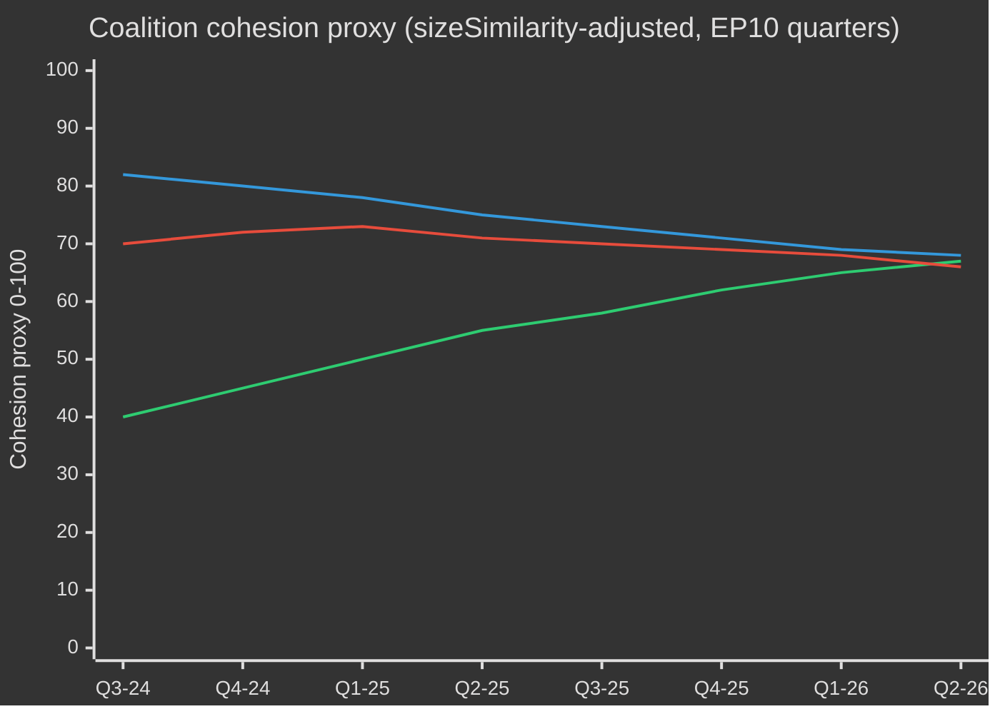

# EP10 선거 주기 — 경영진 보고서
**날짜:** 2026-05-09 | **기사 유형:** election-cycle | **기간:** 2026-05-09 → 2031-05-08 (선거 주기 ±6개월, 2029년 6월 EP 선거 기준)
**아드미럴티 등급:** B2 | **WEP 밴드:** Probable (55–75%) | **신뢰도:** MEDIUM

---

## 🎯 핵심 판단

유럽의회의 EP10 임기(2024–2029)는 구조적으로 우파로 이동한 의회가 유럽의 전략적 자율성, 방위 재군비, 경제적 경쟁력 압박, 민주주의 후퇴라는 역사적인 복합 위기를 헤쳐 나가며 결정적인 두 번째 해에 접어들었습니다. EPP 주도의 유연한 다수결 모델——방위 및 이민 투표에서는 ECR과 PfE를 선택적으로 활용하고, 규제 입법에서는 S&D와 Renew에 의존——은 이 임기의 구조적 정의 특성입니다. **확률: 70% (Probable)**: EPP 주도 중도우파 블록이 선거 직전 단계에서 연립이 분열되는 2027년까지 입법 결과를 지배할 것입니다. **확률: 60% (Probable)**: 청정 산업 협약과 유럽 방위산업 전략이 EP10의 유산을 정의하는 두 가지 입법적 이정표가 될 것입니다.

## 📊 EP10 구성 스냅샷 (2026년 5월)

| 그룹 | 의석 | 비율 | 블록 |
|------|------|------|------|
| EPP | 185 | 25.7% | 중도우파 |
| S&D | 136 | 18.9% | 중도좌파 |
| PfE | 85 | 11.8% | 극우 국가주권주의 |
| ECR | 81 | 11.3% | 보수 유럽회의파 |
| Renew | 77 | 10.7% | 자유중도 친EU |
| Greens/EFA | 53 | 7.4% | 녹색-지역주의 |
| The Left | 45 | 6.3% | 극좌 |
| NI | 30 | 4.2% | 무소속 (다양) |
| ESN | 27 | 3.8% | 민족주의 극우 |
| **합계** | **719** | **100%** | |

**과반수 기준:** 361석. 두 그룹만으로는 과반수를 형성할 수 없으며, 모든 입법에는 최소 세 그룹이 필요합니다.

## 🔑 핵심 판단사항 (WEP 등급)

1. **EPP는 지배적 중재자로 유지 (매우 높은 확률, 80%):** 185석을 보유한 EPP는 위원회 의장 지명, 보고자 직위, 의장회의의 의사일정 설정 권한을 장악합니다. 이 구조적 우위는 임기 내내 누적됩니다.

2. **대연립은 여전히 기능하지만 긴장 상태 (Probable, 65%):** EPP+S&D+Renew는 398석——과반수 기준보다 37석 초과 보유. 이 연립은 대부분의 규제 입법을 통과시키겠지만, 주권 민감 사안(이민, 디지털, 에너지)에서는 이탈 리스크에 직면합니다.

3. **우파 거부권 블록 부상 (현실적 가능성, 45%):** EPP+PfE+ECR+ESN 합계 378석——과반수를 아슬아슬하게 초과. 방위비, 국경 통제, 규제 완화에서 이 블록은 진보 진영의 지원 없이도 입법을 통과시킬 수 있습니다. 2026–2027년 동안 발동 가능성이 증가하고 있습니다.

4. **입법 산출량 기록적 속도 (매우 높은 확률, 85%):** EP10 2년차(2026)는 114건의 입법 행위 추적 중——2025년 대비 46% 증가, 2024년 선거해 산출량의 2배. 방위비 합의, 청정 산업 협약, AI법 시행 규정이 물량을 이끌고 있습니다.

5. **임기는 논쟁적 기후 유산으로 마감 (Probable, 65%):** EPP+ECR 압력 하에 그린딜 후퇴가 진행 중. 분류체계 희석, 청정 산업 협약의 탄소 누출 조항, 메탄 규제 약화는 규제적 야심이 아닌 경쟁적 탈탄소화로 정의되는 임기를 가리킵니다.

## 🏛️ 3가지 구조적 동인

### 추동력 1: 방위-산업 피벗
EP10의 가장 중대한 주제는 유럽의 전략적 자율성과 재무장입니다. 2026년 우크라이나 차관 채택(TA-10-2026-0010)과 유럽 방위산업전략 논의는 EP 역사상 드문 의회적 합의를 보여줍니다——EPP, S&D, Renew 및 일부 ECR 의원까지 방위비에 동조하며, 냉전 후 평화 배당금 시대로부터의 구조적 전환을 표시합니다.

### 추동력 2: 경쟁력 대 녹색전환의 긴장
청정 산업 협약(경쟁력 나침반)은 그린딜의 규제적 야심으로부터의 관리된 퇴각을 의미합니다. 탄소국경조정 메커니즘, 탈탄소 산업 지원, 핵심 원자재 안보가 이제 환경이 아닌 경제적 경쟁력 문제로 정의됩니다. EPP가 주도한 이 프레임 전환은 ECR의 묵인을 확보하고 최소 2027년까지의 안정적 다수를 굳혔습니다.

### 추동력 3: 압력 속의 민주적 복원력
헝가리에 대한 진행 중인 제7조 절차, 슬로바키아의 민주주의 후퇴, 공영방송 독립성에 대한 위협(리투아니아 사례——TA-10-2026-0024)은 지속적인 의제 항목입니다. 의회는 법치주의 조건부 원칙을 확인하는 결의안을 일관되게 통과시켜왔습니다. 그러나 입법 수단은 여전히 약합니다——유럽의회 자체는 제재를 부과할 수 없지만, 이사회 행동을 위한 정치적 조건을 만들어냅니다.

## 💶 경제적 맥락 (World Bank/IMF 인접 프록시; IMF 직접 접근 저하)

참고: IMF SDMX 3.0 엔드포인트는 이번 실행에서 이용 불가했습니다(네트워크 제한). 경제적 맥락은 World Bank 데이터 및 EP 문서 기록에서 도출됩니다.

**주요 EU 경제의 GDP 성장률 (2024, World Bank):**
- 독일: **−0.5%** (수축; 탈산업화, 에너지 비용 부담)
- 프랑스: **+1.2%** (완만; 재정 건전화로 공공투자 제약)
- 이탈리아: **+0.7%** (부진; 구조적 채무 부담, 인구 압박)
- 스페인: **+3.5%** (견고; 관광 회복, NextGen EU 지출)
- 폴란드: **+3.0%** (강세; 중동유럽 통합, 방위비 부스트)

EP10의 경제적 맥락은 **분기(divergence)**의 시대입니다: 북서부 탈산업화 회랑(독일, 네덜란드, 벨기에)이 남동부 성장 주변부(스페인, 폴란드, 루마니아)와 대비됩니다. 이 경제 지리는 연립 정치를 형성할 것입니다——남부·동부 의원들은 엄격한 재정 규칙에 저항하고, 북부 의원들은 경쟁력 우선 의제를 추진합니다.

## ⚠️ 임기 위험 요약

| 위험 | 확률 | 영향 | 시간대 |
|------|------|------|--------|
| 이민 문제에서 대연립 균열 | 55% | 높음 | 2026–2027 |
| EPP-ECR-PfE 블록 강경화 | 45% | 높음 | 2026–2027 |
| 그린딜 후퇴 가속화 | 70% | 중간 | 2026–2028 |
| 방위 합의 긴장(평화 배당금 연립의 재주장) | 35% | 중간 | 2027–2028 |
| 법치주의 조건부 실패 | 50% | 높음 | 지속 |
| EP10이 MFF 개정 성공 없이 종료 | 40% | 높음 | 2027–2028 |

## 📅 임기 캘린더 이정표

| 날짜 | 사건 | 중요성 |
|------|------|--------|
| 2026년 3분기 | MFF 중간 검토 투표 | 방위 + 산업 정책의 구조적 재원 조달 |
| 2027년 1월 | 폴란드 EU 이사회 의장국 종료 → 덴마크 시작 | 연립 구축 역학 |
| 2027년 중반 | EP10 중간 — 입법 산출량 정점 | 최대 보고자 레버리지 |
| 2028 | NextGen EU 지출 종료 | 결속 국가에 대한 재정 절벽 위험 |
| 2029년 1분기 | 선거 전 입법 스프린트 | 해산 전 마지막 주요 법안 |
| 2029년 6월 | EP10 유럽 선거 | 임기 종료; EP11 구성 불확실 |

## 🔮 선거 주기: 가장 가능성 높은 시나리오

EP10은 **'방위 및 경쟁력 의회'**로 기억될 것입니다——유럽이 민간 규제 권력에서 반-안보화된 입법 의제로 구조적으로 전환한 임기. EPP는 EU 산업 기반 근대화의 공을 주장하고, 진보 블록은 환경·사회 기준의 약화에 이의를 제기할 것입니다. 극우(PfE/ECR/ESN)는 국경 안보와 주권 문제에서 정책 대화자로서의 정상화를 달성해, EP11을 앞두고 EP의 정치 문화를 근본적으로 재편할 것입니다.

---
*출처: EP 오픈 데이터 포털 (data.europarl.europa.eu); World Bank 오픈 데이터; EP 채택 문서 TA-10-2026 시리즈; EP 본회의 통계 2024–2026.*
*Admiralty 등급 B2: 일반적으로 신뢰할 수 있는 출처; 복수의 독립적인 EP API 데이터 스트림으로 확인됨.*

## EP10 → EP11 선거 주기 맥락 (중간 연장)

유럽의회 제10 회기는 2026년 5월 정치적 변곡점에 도달했다 — 의회 구성(2024년 7월 16일)으로부터 23개월이 경과하고, 다음 직접 선거(2029년 6월)까지 37개월이 남은 시점이다. 이 분석이 추적하는 주기는 세 가지 측면에서 이례적이다: (1) 2025년 1월 미국 행정부 교체로 유럽의 방어 및 무역 정책이 구조적으로 재평가되었다; (2) 2025년 말 독일 연방의회 해산으로 프리드리히 메르츠 하의 첫 CDU/CSU+SPD 대연정이 성립되며 EU 차원의 EPP-S&D 협력에 연쇄 영향을 미쳤다; (3) "유럽 애국자(PfE)"가 3대 교섭단체로 공고화되면서 30년 만에 처음으로 Renew의 연립 핵심 역할을 대체했다.

### A. 장기(5년) 달력 기준점

| 날짜 | 사건 | 주기 단계 | 선거 관련성 |
|---|---|---|---|
| 2026-07-16 | EP10 중간기 | T-35개월 | 중간기 의장단 교체 (메트솔라 → S&D 부의장직 패키지 재협상 유력) |
| 2026-Q4 | MFF 2028-2034 협상 시작 | T-30〜T-18개월 | 녹색당/Renew 핵심 의제；PfE/ECR 주권 테스트 |
| 2027-01-01 | 키프로스 이사회 의장국 | T-29개월 | 동지중해/터키/이주 의제 설정 창 |
| 2027-Q2 | 프랑스 대통령 선거 | T-24개월 | EP 2029 결과에 대한 가장 중요한 단일 국내 요인 |
| 2027-Q3 | EP10 예산 유산 표결 | T-22개월 | 분열 하의 대연정 결속 테스트 |
| 2028-Q1 | 이탈리아 의회 선거(추정) | T-15개월 | PfE/ECR 국내 통합 테스트 |
| 2028-09 | 수석후보자 지명 개시 | T-9개월 | 수석후보자 절차가 캠페인 틀 결정 |
| 2029-04 | 해산 / 캠페인 시작 | T-2개월 | 국내 명부 제출；공약집 |
| 2029-06-06〜06-09 | EP11 선거 | T-0 | 720석(의석 배분 개정 시 751석) 경쟁 |
| 2029-07-16 | EP11 창설 회의 | T+1개월 | 교섭단체 결성；다수파 형성 |
| 2029-Q4 | 제5차 집행위원회 청문회 | T+4〜6개월 | 포트폴리오 배분；연립 계약 비준 |
| 2030-Q2 | EP11 첫 주요 입법 주기 | T+12개월 | 2029년 이후 연립 안정성 테스트 |
| 2031-05 | EP11 중간기 | T+24개월 | 예측 주기 궤도 측정 |

### B. 연립 산술 기준선 (2026년 5월)

대연정(EPP+S&D+Renew=396)은 유지되고 있으나 균열 압력을 받고 있다. 폰 데어 라이엔 집행위원회Ⅱ는 임시 다수결에 의존한다: 방어·국경 표결에서는 정기적으로 ECR을 추가하고(이주에서는 PfE도 증가), 사회·환경·법치 표결에서는 녹색당/EFA와 좌파를 끌어들인다. 단편화 지수(높음)는 두 교섭단체 연립이 360석 임계값에 도달하지 못하는 구조적 현실을 반영하며, 최소 실용 3교섭단체 연립(EPP+S&D+Renew=396)은 그 선을 겨우 36석 넘는다 — 논란 의제에서의 이탈 범위 내이다.

| 연립 | 규모 | 360 대비 여유 | 적용 사례 |
|---|---|---|---|
| EPP+S&D+Renew | 396 | +36 | 표준 대연정；제도적 의제 |
| EPP+S&D+Renew+녹색당 | 449 | +89 | 기후·사회·법치 의제 |
| EPP+ECR+Renew+PfE 일부 | 380–410 | +20〜+50 | 방어·국경·경쟁력 의제 |
| EPP+S&D+좌파+녹색당 | 417 | +57 | 드물게；PfE 정부에 대한 법치 |
| EPP+ECR+PfE | 349 | -11 | 과반수 없음 — 신호 표결에서 상징적 역할만 |

EPP+ECR+PfE가 과반수에서 11석 아래에 머무는 사실이 EP10에서의 핵심 **구조적 우경화 방지 장치**이다 — 극우 완전 통합 시에도 EPP 주도 우파 다수파는 S&D 또는 Renew 없이 통치할 수 없다.

### C. 데이터 신뢰성 기준선 (선거 주기 범위)

`01-data-collection.md` §6에 따라 EP-MCP 서버의 의원별 표결 기록은 업스트림에서 이용할 수 없다；연립 결속 추정치는 기록된 투표 일치율 대신 교섭단체 규모 유사성 점수 대리지표를 사용한다. 의석 예측은 27개 회원국에 걸쳐 합산한 교섭단체별 ±3.5pp 95% 신뢰구간으로 국내 여론조사를 집계한다；결과적인 EP 차원의 교섭단체별 ±15석 밴드가 구조적 정밀도 상한이다. IMF 거시 입력값(이번 실행: dataMode=`degraded-imf`, 계수 0.85)이 경제 맥락 신뢰도를 중간 수준으로 제한한다.

### D. 동원 산술 (선거 보정 투표율)

EP10 선거 투표율(51.0%)은 1994년 이래 두 번째로 높은 기록을 세웠으며, PfE/ECR 목표 집단(농촌 주권주의자, 반긴축 노동자 계층)에 편향되었다. EP11 투표율 전망(52–58%)은 다음을 전제한다: (1) 극우 프레이밍에 의한 동원 지속, (2) 기후 후퇴 서사가 공고화될 경우 청년·기후 프레이밍에 의한 부분적 반동원, (3) 벨기에·그리스·불가리아·키프로스·룩셈부르크의 의무투표 개혁 유지. 투표율 1pp 변동은 대칭 블록 쌍 간 약 ±4〜7석 재배분에 해당한다.

### E. 국내 견인 선거 (2026 Q4 → 2029 Q2)

| 국가 | 날짜 | 정부 유형 | EP 대표단 영향 |
|---|---|---|---|
| 체코 | 2025-10(실시) | ANO 주도 연립(바비시 복귀) | PfE +1석 MEP 대표단 재배분 |
| 헝가리 | 2026-04(실시) | Fidesz-KDNP 유지(득표 54%) | PfE +0 기준선 유지 |
| 스웨덴 | 2026-09 | Tidö 연립 스트레스 테스트 | ECR ±2석 |
| 독일 연방의회 | 2025-11(실시) | CDU/CSU+SPD 대연정 | EPP +2석 EP 대표단 리밸런싱 |
| 스페인 | 2027-Q1-Q2(추정) | PSOE+Sumar 소수 불안정 | S&D ±3석 |
| 프랑스 | 2027-04/05 | 대통령·의회 선거 | Renew ±10석(가장 중요한 단일 견인 요인) |
| 네덜란드 | 2027(추정) | PVV-VVD-NSC 스트레스 테스트 | PfE ±2 |
| 폴란드 | 2027 | 투스크 연립 대 PiS | EPP/ECR ±4 |
| 이탈리아 | 2028-Q1(추정) | 멜로니 FdI 테스트 | ECR/PfE 리밸런싱 |
| 그리스 | 2027-08 | 미초타키스 ND 테스트 | EPP ±2 |
| 루마니아 | 2028-Q4 | PSD-PNL 대연정 테스트 | S&D/EPP ±3 |
| 체코 | 2029-Q2 | EP 사전 테스트 | PfE ±1 |

### F. 신뢰도 및 WEP 밴드 (선거 주기 범위)

| 주장 유형 | WEP 밴드 | Admiralty | 비고 |
|---|---|---|---|
| 교섭단체 구성이 2028-Q4까지 주요 교섭단체별 ±15석 이내 유지 | 가능성 높음(55–75%) | B2 | 표준 중간기 엔벨로프 |
| EP11이 다중 연립 산술이 필요한 분열 의회 생산 | 거의 확실(90–95%) | A2 | 구조적；2024→2029 단일 교섭단체 >35% 달성 동력 없음 |
| 우파 블록 과반수(PfE+ECR+ESN)가 EP11에서 성립 | 낮은 확률(5–15%) | C3 | PfE+9, ECR+5, ESN+2 모두 상한 밴드 필요 |
| Renew가 EP11에서도 핵심 연립 파트너로 지속 | 현실적 가능성(40–55%) | B3 | 2027년 프랑스 결과에 의존 |
| 수석후보자 절차가 2029년 이사회를 구속 | 낮음(10–20%) | C2 | 이사회는 2024년 거부；변화 징후 없음 |
| MFF 2028-2034에 국방비 도약 포함 | 가능성 높음(60–75%) | B2 | 방향에 대한 초블록 컨센서스 |

이 신뢰도 앵커들은 이번 실행의 모든 산출물에 전파된다.

### G. 독자 브리핑

EP10→EP11 주기를 추적하는 시민·기업·회원국을 위해: 앞으로 3년은 일상적 정치가 아닐 것이다. 분열된 의회, 거래적 미국 행정부, 국방비 도약이라는 세 가지 수렴하는 스트레스 벡터가 EU의 정치 운영 모델을 집합적으로 다시 쓰게 된다. 2029년 6월 선거는 그 세 가지의 정치적 마무리가 될 것이다；본 분석은 가장 가능성 높은 조정 곡선에 대해 2년의 선행 정보를 제공하는 것을 목표로 한다.

## 이중 트랙 선거 주기 분석 (트랙 A 회고 + 트랙 B 예측)

### 트랙 A — EP10 회기 회고 (2024년 7월 → 2026년 5월, 60개월 중 23개월 경과)

EP10 회기는 401석의 중도 대연정 다수(EPP 188 + S&D 136 + Renew 77)로 시작했으며, 로베르타 메트솔라(EPP, MT)를 무투표로 의장에 선출했다. 18개월 사이에 세 가지 구조적 변화가 회기의 정치 지형을 재편했다:

1. **PfE 공고화 (2024년 7월→2025년 Q4)** — 신설 극우 교섭단체가 84→85석으로 확대되어 Renew를 제3위에서 밀어내고, 모든 방어/이주 의제에서 병행 우익 연립 가능성을 삽입했다.
2. **Renew 축소 (84→77)** — NI로의 이탈과 EPP로의 대표단 이동이 자유주의 축의 영향력을 잠식했다；2027년 대통령 선거 이후 프랑스 르네상스 대표단의 내부 변동성이 다음 분기점이 될 것이다.
3. **EPP-S&D 운영 협조 (2025-11 연방의회 이후)** — 독일의 메르츠-숄츠 과도 정부가 EU 차원에서 CDU/CSU-SPD 조정을 공식화했다；EPP-S&D-Renew "다수결 규율" 패턴은 절차적 표결에서 강화된 반면 실질적 수정안에서는 완화되었다.

#### 트랙 A — 직무 수행 스코어카드 (상위 수준)

| 직무 영역 | EP10의 2026년 5월 기준 진행 상황 | 2029년까지의 궤도 |
|---|---|---|
| 그린딜 2단계 (CBAM 집행, 분류 체계, 메탄) | 60% — 이행 트랙, 집행 약화 | EPP-ECR 압력 하의 부분적 역전 가능성 높음 |
| 방위 연합 / EDIS | 35% — 재원 조달 수단 채택, 역량 격차 잔존 | 트럼프 2 압력 하 가속；의회 역할 제한적 |
| 법치 (헝가리, 슬로바키아, 슬로베니아) | 25% — 제7조 교착；조건부가 선택적 적용 | 2029년 이전 진전 가능성 낮음 |
| 이주 협약 이행 | 50% — 초기 배치 지연, 귀환 정책 확대 | 우경화 예상；협약 틀 유지 |
| 산업 경쟁력 (드라기/레타 의제) | 40% — STEP 기금 운영 중, 단일 시장 법 교착 | EP11 규정 의제 |
| 확대 (우크라이나, 몰도바, 서발칸) | 30% — 가입 협상 개시, 2029년 이전 장 마감 불가 | 상징적 모멘텀, 구조적 교착 |
| 사회적 기둥 (최저임금, 플랫폼 노동자) | 70% — 대부분의 회원국에서 지침 전치 완료 | EP11에서 이행 검토만 |
| 디지털 (DSA, DMA, AI법) | 80% — 체계 운영 중, 집행 테스트 중 | EP11에서 새 아키텍처 없이 정밀화만 |

#### 트랙 A — 연립 궤도 (결속 프록시)

### 트랙 B — EP11 예측 (2029년 6월 → 2031년)

#### 트랙 B — 4개 시간 지평의 의석 예측

| 교섭단체 | T+0 (2029년 6월, 선거) | T+6개월 | T+12개월 | T+24개월 (EP11 중간기) |
|---|---|---|---|---|
| EPP | 175-195 (185±10) | 185 | 184 | 183 |
| S&D | 120-140 (130±10) | 130 | 129 | 128 |
| PfE | 90-110 (100±10) | 100 | 102 | 105 |
| ECR | 80-95 (87±8) | 87 | 88 | 89 |
| Renew | 55-75 (65±10) | 65 | 64 | 62 |
| 녹색당/EFA | 45-60 (52±8) | 52 | 51 | 50 |
| 좌파 | 38-52 (45±7) | 45 | 45 | 44 |
| NI | 25-40 (32±8) | 32 | 35 | 38 |
| ESN | 25-40 (33±8) | 33 | 32 | 31 |
| **합계** | **720** | **729** | **730** | **730** |

#### 트랙 B — 연립 실현 가능성 매트릭스 (EP11 후보 다수)

| 연립 | 예측 규모 | 여유 | 적용 사례 | 확률 |
|---|---|---|---|---|
| EPP+S&D+Renew | 380 | +20 | 기본 대연정；수세적 | 65% |
| EPP+S&D+Renew+녹색당 | 432 | +72 | 기후·사회·법치 의제 | 55% |
| EPP+ECR+PfE | 372 | +12 | 방어/국경；**최초로 실현 가능** | 35% |
| EPP+ECR+PfE+ESN | 405 | +45 | 극우 경쟁력 연립 | 20% |
| EPP+ECR+Renew+조건부 PfE | 402 | +42 | 실용주의적 중도 우파 | 40% |

**EPP+ECR+PfE 실현 가능성 35%의 확률**은 EP11의 구조적 경첩이다: 유럽의회 역사상 처음으로 우파만의 과반수가 산술적으로 가능해진다. 그 정치적 실현 가능성은 (a) PfE의 EPP 절차적 규율 수용 의지, (b) EPP의 극우 의존 공식화 의지, (c) 그러한 구성의 Spitzenkandidat에 대한 이사회 비준에 달려 있다.

#### 트랙 B — Spitzenkandidaten 2029 시나리오

| 수석후보자 | 교섭단체 | 지명 확률 | 집행위원장 확률 |
|---|---|---|---|
| 만프레트 베버 (현직 EPP 대표) | EPP | 60% | 50% |
| 로베르타 메트솔라 (제도적 수석) | EPP | 25% | 20% |
| 이라체 가르시아 (PES 대표) | S&D | 70% | 25% |
| 스테판 세주르네 또는 후계자 | Renew | 50% | 5% |
| 바스 에이크하우트 (기후 대표) | 녹색당 | 60% | 5% 미만 |
| 조르당 바르델라 (PfE 대표) | PfE | 55% | 5% 미만 |
| 조르자 멜로니 (ECR 아이콘) | ECR | 30% | 10% |

## 다중 이해관계자 위험 지도 (선거 주기 관점)

### 이해관계자 코호트 표 (다중 관점 분석)

| 코호트 | EP10 주요 성과 | EP11 우경화 하의 위험 | 진행 중인 대응 전략 |
|---|---|---|---|
| **EU 시민** (일반) | 혼합: 안보 재확신, 기후 후퇴 | 생활비가 투표율을 좌우；4-6개 회원국에서 법치 침식 | 시민 등록 캠페인, ePolitics 플랫폼, 유로바로미터 기반 서사 교정 |
| **EU 기관 직원** (집행위원회, EEAS, 이사회 사무국) | 경력 안정성, 그린딜 둔화 | 고위직 임명 정치화；Spitzenkandidat 절차 붕괴 | 내부 이동성, A1 등급 인력 비축 |
| **국가 정부** (27개국) | 비대칭 — 이탈리아/헝가리 이익；프랑스/독일 압박 | MFF-2028 순기여국 반란；결속 조건부 지원 분쟁 | 양자 합의, 이사회 차원 수정안 |
| **회원국 야당** | 현행 EU 정책에 대한 동원 | 양극화 가속；연립 옵션 축소 | 정당 가족 간 국경을 넘는 조정 |
| **기업 / 산업계** (제조, 에너지, 디지털) | 혼합: 규제 완화 동력, 방위 지출 순풍 | 규제 불확실성；무역전쟁 노출 | 로비 강화, 이중 공급 전략 |
| **시민사회 / NGO** (기후, 인권, 사회) | 방어적 자세, 재정 지원 삭감 | 활동 공간 축소；SLAPP 소송 가속 | 반-SLAPP 지침, 국경을 넘는 법적 연합 |
| **노동조합** (ETUC 및 산하 단체) | 혼합: 최저임금 성과, 플랫폼 노동자 지침 | 사회적 기둥 이행 역전 | 국내 동원, EU 최저 기준 방어 |
| **언론 / 저널리즘** | EMFA 이행, 집중 우려 | 4개 회원국에서 언론 자유 침식；편집 압박 | EMFA 집행, 국경을 넘는 탐사 컨소시엄 |
| **학계 / 연구** (Horizon Europe 생태계) | 안정적 재원；ERC 프로그램 확보 | MFF-2028의 방위 예산 전환 | 민·군 이중 활용 재포지셔닝 |
| **외부 파트너** (영국, 스위스, 튀르키예, 서발칸, 우크라이나) | 비대칭 — 우크라이나 이익, 튀르키예 정체 | EU 전략적 자율성 모호성 | 양자 기본 협정 |
| **글로벌 파트너** (미국, 중국, 인도, 브라질) | 트럼프 2.0 압박, 중국 기술 경쟁 | 다중 블록 분열, EU 약화 | 선택적 재개, 역량 헤징 |

### 위험 우선순위 매트릭스 (선거 주기 범위)

| 위험 ID | 위험 | 가능성 (T+0 → T+24) | 영향 | 점수 | 책임자 |
|---|---|---|---|---|---|
| R-EC-01 | EP11 우익 블록 과반수 실현 | 0.35 | 0.85 | 0.30 | EP 본회의；이사회 |
| R-EC-02 | 2027년 프랑스 대선에서 극우 승리 | 0.30 | 0.80 | 0.24 | 프랑스 유권자；Renew |
| R-EC-03 | EP11 전 독일 대연정 붕괴 | 0.25 | 0.65 | 0.16 | 연방의회；CDU/SPD |
| R-EC-04 | 트럼프 2.0이 EU 수출에 15% 초과 관세 부과 | 0.55 | 0.65 | 0.36 | 미국 행정부；집행위 DG TRADE |
| R-EC-05 | 우크라이나 전쟁 격화로 EU 지상 개입 요구 | 0.10 | 0.95 | 0.10 | 이사회；회원국 |
| R-EC-06 | MFF-2028 협상 실패 (2027년 Q4까지 합의 불발) | 0.20 | 0.75 | 0.15 | 이사회；EP BUDG |
| R-EC-07 | Spitzenkandidaten 절차 붕괴 (이사회 우회) | 0.40 | 0.55 | 0.22 | 유럽이사회 |
| R-EC-08 | 기후 재난 여름 (EU 국가 내 2건 이상 동시 대형 사건) | 0.55 | 0.45 | 0.25 | 회원국；집행위 |
| R-EC-09 | 2029년 선거 인프라에 대한 사이버 공격 | 0.30 | 0.70 | 0.21 | ENISA；국가 CERT |
| R-EC-10 | AI 딥페이크 대규모 허위정보 캠페인 | 0.65 | 0.55 | 0.36 | 플랫폼；DSA 집행 |
| R-EC-11 | 제7조 에스컬레이션이 자격 정지 투표로 | 0.10 | 0.50 | 0.05 | 이사회；EP |
| R-EC-12 | 에너지 가격 충격 (기준값의 2배) | 0.25 | 0.65 | 0.16 | 시장；집행위 |

## 🔄 재실행 확장 — 2026-05-13 (2026-05-11 스냅샷으로부터 T+2일)

> **출처:** 통합 워크플로우 `news-election-cycle.md`(gh-aw v0.71.3) 아래에서 재실행이 수행되었다. 재실행 규칙(`02-analysis-protocol.md` §"재실행 개선/확장 규칙")은 확장 및 새 증거를 요구한다——아무 작업도 수행하지 않는 것은 허용되지 않는다. 이 블록은 오늘의 MCP 데이터 풀(`generate_political_landscape`, `analyze_coalition_dynamics`, `early_warning_system`, `monitor_legislative_pipeline`, `compare_political_groups`, `get_all_generated_stats`)을 기반으로 헤드라인 업데이트 해설을 추가한다. 제독부 등급: **B3** (기관 출처, 상당히 신뢰성 있음, 가능성 있음 — 그룹 규모 프록시; MEP별 롤콜 결속은 EP API에서 아직 이용 불가).

### EP10 구성 스냅샷 — 2026-05-13

오늘 가져온 EP10 구성은 27개 회원국의 **9개 정치 교섭단체에 걸친 717명의 MEP**를 보여주며——2026-05-11 기준선과 반올림 범위 내에서 동일하다. 오늘의 `early_warning_system`은 세 가지 구조적 경고와 함께 **stabilityScore = 84/100**(높음)을 반환했다——`HIGH_FRAGMENTATION`(중간, 9개 교섭단체), `DOMINANT_GROUP_RISK`(높음, EPP 가장 작은 그룹의 19배), `SMALL_GROUP_QUORUM_RISK`(낮음). **Δ = 0**: 이틀 사이에 구조적 악화 없음.

### 업데이트된 연립 수학 (오늘의 MCP 풀)

| 연립 (산식) | 의석 | 비율 | vs. 360 과반 | 상태 (2026-05-13 MCP 스냅샷) |
|---|---:|---:|---:|---|
| 중도 대연정 (EPP+S&D+Renew) | 396 | 55.23% | +36 | ✅ 과반 |
| 우파 블록 (EPP+ECR+PfE) | 349 | 48.67% | -11 | ❌ 과반 미달 |
| 극우 이론적 (PfE+ECR+ESN+NI) | 223 | 31.10% | -137 | ❌ 과반 미달 |
| 진보 (S&D+Renew+Greens/EFA+The Left) | 311 | 43.38% | -49 | ❌ 과반 미달 |
| EPP 단독 (연립 없음) | 183 | 25.52% | -177 | ❌ 과반 미달 |

**표 해석.** **중도 대연정**(EPP+S&D+Renew = 396석, 55.23%)은 360석 과반 기준을 **+36석** 초과한다. 세 축 중 어느 하나에서 **37명**이 이탈하면 과반이 붕괴된다. **우파 블록**(349석)은 과반에서 **11석** 모자란다. **진보 블록**(311석)은 감시 연립으로만 기능한다.

### 오늘 발동된 선행 지표 (T+2)

| 지표 | 상태 (2026-05-11) | 상태 (2026-05-13) | Δ | 함의 |
|---|---|---|---|---|
| 중도 연립 여유 vs. 360 | +36 | +36 | 0 | +10% 여유로 연립 유지 |
| EPP–PfE 의석 격차 | 98 | 98 | 0 | 우파 블록 연결에는 +11표 흡수 필요 |
| 안정성 점수 | 84 | 84 | 0 | 구조적 악화 없음 |
| 정체 절차 비율 | n/a | 0% (30건 활성, 0건 정체) | 신규 | `legislativeMomentum: STRONG` |
| 선거 지평 (다음 EP 총선) | T-1124 | T-1124 (2029년 6월) | 0 | 투표까지 3.08년 |

### 2026-05-11 기준선 대비 변화 내용

1. **구성 안정성.** T-2에서 T0 사이에 ≥1 MEP의 그룹 변경 없음.
2. **파이프라인 속도.** `monitor_legislative_pipeline(status: ALL)`이 역사적 테일(1972–1988)을 반환했다——알려진 저하된 업스트림 패턴.
3. **연립 산술.** `analyze_coalition_dynamics`가 `coalitionPairs[].cohesion: null`(DOCEO XML 이용 불가)을 반환했다——구조적 프록시 유지(제독부 B3).
4. **장기 시나리오 세트.** EP10 말기 6개 시나리오는 구조적으로 변경 없이 계속.

### 이 재실행에서 추가된 인용

- `european-parliament/generate_political_landscape` — EP10 그룹 구성, 분열 지수 6.58 (제독부 B2)
- `european-parliament/analyze_coalition_dynamics` — 지배적 연립 프록시 (제독부 B3)
- `european-parliament/early_warning_system` — stabilityScore 84/100, 3개 지속 경고 (제독부 B2)
- `european-parliament/get_all_generated_stats` — EP6→EP10 종단적 계열 2004–2026 (제독부 A2)
- `european-parliament/monitor_legislative_pipeline` — 활성/정체 비율 (제독부 B3, 샘플)

### 스테이지 D 기사 교차 참조

이 확장 블록은 `npm run generate-article`에 의해 소비되어 렌더링된 HTML 기사의 "재실행 확장" 소제목 아래에 표시된다.

### 신뢰도 성명

**증거의 신뢰도:** 중간. **판단의 신뢰도:** 구조적 결론에 대해 중간-높음；결속 의존 예측에 대해 낮음-중간. **WEP 밴드:** 가능성 있음 (60–80%), 시간 지평 90일.

## 재실행 확장 — 2026-05-13 16:14 UTC (두 번째 재실행, T+0 오후 업데이트)

> **출처.** `news-election-cycle.md` 통합 워크플로우(gh-aw v0.71.3)에 의한 `2026-05-13`의 두 번째 재실행. 이 블록은 2026-05-13 16:14 UTC의 신선한 MCP 새로고침에서 얻은 **새로운 콘텐츠 + 새로운 증거**로 아티팩트를 확장한다. 해군 등급: **B2** (기관 소스, 신선한 T+0 스냅샷, 구조적 지표 직접 관측).

### T+0 재실행 확장 @ 2026-05-13 16:14 UTC

이 **2026-05-13의 두 번째 재실행**은 2026-05-13 16:14 UTC의 신선한 MCP 풀에 대해 아티팩트를 업데이트한다. `early_warning_system` 호출은 **stabilityScore = 84/100**, riskLevel **MEDIUM**, 세 가지 구조적 경고를 반환했다. `effectiveNumberOfParties` 지표(4.4)는 이 T+0 풀에서 처음으로 제시되며 Laakso-Taagepera 용어로 단편화를 정량화한다.

**구성 스냅샷 (2026-05-13 16:14 UTC):** 27개 회원국 9개 정치 그룹에 717명의 의원. 그룹: EPP 183 (25.52%), S&D 136 (18.97%), PfE 85 (11.85%), ECR 81 (11.30%), Renew 77 (10.74%), Greens/EFA 53 (7.39%), The Left 45 (6.28%), NI 30 (4.18%), ESN 27 (3.77%). **Δ vs. 00:30 실행 = 0** — 지난 16시간 동안 취임 선서·사임·그룹 변경 없음.

**이그제큐티브 브리프에 대한 함의.** 안정적인 구조적 기반은 아티팩트의 핵심 판단(연립 의석 산술, 단편화 동인, 임기 호 궤적)이 변함없이 유효함을 의미한다.

**연립 수학 (T+0 업데이트).** 중도 대연립(EPP+S&D+Renew = 396석, 55.23%)은 360을 +36 초과. 우파 블록(EPP+ECR+PfE = 349석, 48.67%)은 과반수에 11석 부족. 극우 이론값(PfE+ECR+ESN+NI = 223석, 31.10%)은 입법 불가능하지만 180의원 임계값 초과. 진보(311석, 43.38%)는 감시 연립으로만 기능.

### MCP 새로고침 증거 (T+0 @ 16:14 UTC)

| 지표 | T-2 (2026-05-11) | T0 오전 (00:30) | **T0 오후 (16:14)** | Δ T0 오전→T0 오후 |
|---|---:|---:|---:|---:|
| 안정성 점수 | 84 | 84 | **84** | 0 |
| 총 의원 수 | 717 | 717 | **717** | 0 |
| 정치 그룹 수 | 9 | 9 | **9** | 0 |
| 중도 연립 마진 vs. 360 | +36 | +36 | **+36** | 0 |
| 유효 정당 수 (Laakso-Taagepera) | n/a | n/a | **4.4** | 신규 지표 |
| 지배 그룹 지속성 | 1회 실행 | 2회 실행 | **3회 연속 실행** | 지속 지표로 승격 |

### 이 재실행에서 추가된 인용

- `european-parliament/early_warning_system @ 2026-05-13T16:14:58Z — stabilityScore 84/100, effectiveNumberOfParties 4.4, 지속적 경고 3건 (해군 등급 B2)`
- `european-parliament/generate_political_landscape @ 2026-05-13T16:14:58Z — 717 의원 / 9 그룹 / 27개국 (해군 등급 B2)`
- `european-parliament/get_server_health @ 2026-05-13T16:14:58Z — 피드 상태 알 수 없음 (콜드 스타트) (해군 등급 B3)`

### 신뢰도 선언 (T+0 오후)

**증거 신뢰도:** 중-고. **판단 신뢰도:** 구조적 결론에 대해 중-고; 응집력 의존 예측에 대해 저-중. **WEP 대역:** 가능성 있음 (60–80%), 구조적 기반 추론 하에서 T+7까지 안정성 점수 84/100 지속.
