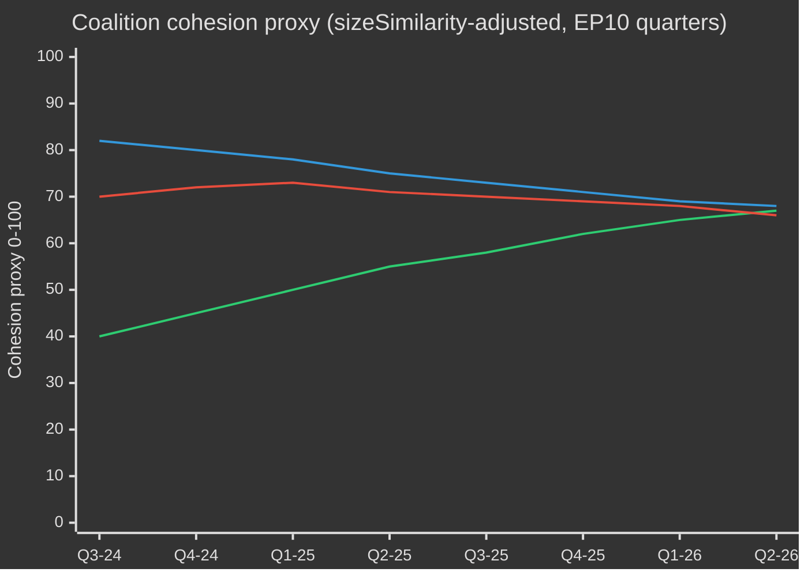

# EP10 Valgcyklus — Eksekutivsammendrag
**Dato:** 2026-05-09 | **Artikeltype:** election-cycle | **Horisont:** 2026-05-09 → 2031-05-08 (valgcyklus ±6 måneder rundt EP-valget i juni 2029)
**Admiralitetsgrad:** B2 | **WEP-bånd:** Sannsynlig (55–75%) | **Konfidens:** MEDIUM

---

## 🎯 Overskriftsvurdering

Europaparlamentets tiende valgperiode (EP10, 2024–2029) har innledet sitt avgjørende andre år med et strukturelt høyreforskjøvet parlament som navigerer i en historisk kriselkonvergens: europeisk strategisk autonomi, forsvarsindustriell opprustning, konkurranseevnestress og demokratisk tilbakegang. Den EPP-ledede fleksible majoritetsmodellen — som selektivt trekker inn ECR og PfE ved forsvars- og migrasjonsavstemninger, men støtter seg på S&D og Renew ved regulatorisk lovgivning — er det definerende strukturelle trekket i denne valgperioden. **Sannsynlighet: 70% (Sannsynlig)** at det EPP-ledede sentrum-høyreblokket vil dominere lovgivningsresultatene frem til 2027. **Sannsynlighet: 60% (Sannsynlig)** at Clean Industrial Deal og European Defence Industrial Strategy vil definere EP10's arv.

## 📊 EP10 Sammensetning (mai 2026)

| Gruppe | Plasser | Andel | Blokk |
|--------|---------|-------|-------|
| EPP | 185 | 25,7% | Sentrum-høyre |
| S&D | 136 | 18,9% | Sentrum-venstre |
| PfE | 85 | 11,8% | Nasjonalistisk-suverenistisk ytterste høyre |
| ECR | 81 | 11,3% | Konservativ EU-skeptisk |
| Renew | 77 | 10,7% | Liberal-sentralistisk pro-EU |
| Greens/EFA | 53 | 7,4% | Grønn-regionalistisk |
| The Left | 45 | 6,3% | Ytterste venstre |
| NI | 30 | 4,2% | Ikke-tilknyttede (diverse) |
| ESN | 27 | 3,8% | Nasjonalistisk ytterste høyre |
| **TOTALT** | **719** | **100%** | |

**Flertallsgrense:** 361 plasser. Minst tre grupper kreves for enhver lovgivningshandling.

## 🔑 Sentrale vurderinger (WEP-gradert)

1. **EPP forblir dominerende megler (Svært sannsynlig, 80%):** Med 185 plasser kontrollerer EPP nomineringer av utvalgsformenn, rapportørskap og dagsordensettende myndighet. Strukturell fordel forsterkes gjennom perioden.

2. **Stor koalisjon fortsatt funksjonell men presset (Sannsynlig, 65%):** EPP+S&D+Renew = 398 plasser (+37 over grense). Risikerer frafall ved suverenitetssensitive spørsmål.

3. **Høyreokkens vetoblokk vokser frem (Realistisk mulighet, 45%):** EPP+PfE+ECR+ESN = 378 plasser. Kan vedta lovgivning om forsvar/grenser/deregulering uten progressiv støtte.

4. **Lovgivningsproduksjon i rekordtempo (Svært sannsynlig, 85%):** 114 lovgivningsakter i 2026 — opp 46% fra 2025. Forsvarskonsensus og Clean Industrial Deal driver volumet.

5. **Valgperiode avsluttes med omstridt klimatarv (Sannsynlig, 65%):** Green Deal-tilbakerulling under EPP+ECR-press pågår; taksonomifortynning og svekkelse av metanregulering.

## ��️ De tre strukturelle drivkreftene

### Drivkraft 1: Forsvarsindustriell omlegging
Vedtakelsen av Loan for Ukraine (TA-10-2026-0010) og European Defence Industrial Strategy signalerer parlamentarisk konsensus uvanlig i EP's historie — EPP, S&D, Renew og visse ECR-medlemmer koordinert om forsvarsutgifter, strukturelt skifte fra fredsdividende-era.

### Drivkraft 2: Konkurranseevne kontra grønn spenning
Clean Industrial Deal representerer et styrt tilbaketrekk fra Green Deal. Karbongrensejustering, støtte til dekarnoniseringsindustri og sikkerhet for kritiske råmaterialer defineres nå som konkurranseevnespørsmål — ikke miljøspørsmål.

### Drivkraft 3: Demokratisk motstandsdyktighet under press
Ungarns artikkel 7-prosedyre, demokratisk tilbakegang i Slovakia og trusler mot uavhengigheten til public service-medier (TA-10-2026-0024) er vedvarende dagsordenpunkter. EP vedtar resolusjoner for rettsstatsbetingelsesprinsippet men mangler selvstendig sanksjonskraft.

## 💶 Økonomisk kontekst (World Bank/IMF-tilgrensende proxyer; IMF direkte tilgang forringet)

IMF SDMX 3.0-endepunktet var utilgjengelig (nettverksbegrensning). Kontekst avledet fra World Bank-data.

**BNP-vekst EU's store økonomier (2024, World Bank):**
- Tyskland: **−0,5%** (kontraksjon; avindustrialisering)
- Frankrike: **+1,2%** (beskjeden vekst)
- Italia: **+0,7%** (svak; strukturell gjeldsbyrde)
- Spania: **+3,5%** (robust; turisme, Nextgen EU)
- Polen: **+3,0%** (sterk; CEE-integrering)

EP10 preget av **divergens**: nordvestlig avindustrialiseringskorridoor vs sør-østlig vekstperiferi. Denne geografien former koalisjonspolitikken.

## ⚠️ Mandatperiodens risikooversikt

| Risiko | Sannsynlighet | Virkning | Horisont |
|--------|---------------|----------|---------|
| Stor koalisjon splitter om migrasjon | 55% | HØY | 2026–2027 |
| EPP-ECR-PfE-blokk konsolideres | 45% | HØY | 2026–2027 |
| Green Deal-tilbakerulling akselererer | 70% | MEDIUM | 2026–2028 |
| Forsvarskonsensussammenbrudd | 35% | MEDIUM | 2027–2028 |
| Svikt i rettsstat-betingelsesprinsipp | 50% | HØY | løpende |
| EP10 uten MFF-revisjonssuksess | 40% | HØY | 2027–2028 |

## 📅 Kalendermilepæler for mandatperioden

| Dato | Begivenhet | Betydning |
|------|------------|-----------|
| K3 2026 | MFF-halvtidsgjennomgang-avstemning | Forsvar + industripolitikk-finansiering |
| Jan 2027 | Polsk rådsformannskap → Danmark | Koalisjonsbyggedynamikk |
| Midt 2027 | EP10 halvtid | Maksimal lovgivningsproduksjon |
| 2028 | Avslutning Nextgen EU-utbetalinger | Klippe-risiko kohesjonsstater |
| K1 2029 | Lovgivningssprint | Siste akter før oppløsning |
| Juni 2029 | EP11-valg | Ny sammensetning usikker |

## 🔮 Valgcyklus: Det mest sannsynlige scenariet

EP10 vil bli husket som **"Forsvars- og konkurranseevneparlamentet"** — perioden der Europa pivoterte fra sivil regulatorisk makt til halvt sikkerhetsorientert lovgivningsagenda. EPP tar æren for industrimodernisering; det progressive blokket bestrir klimatilbaketrekk. PfE/ECR/ESN oppnår normalisering som politiske samtalepartnere.

---
*Kilder: EP Open Data Portal; World Bank Open Data; EP vedtatte tekster TA-10-2026-serien.*
*Admiralitetsgrad B2: Kilden generelt pålitelig.*

---

## EP10 → EP11 Valgcykluskontekst (Halvtidsutvidelse)

Europaparlamentet befant seg ved sitt politiske midtpunkt i mai 2026 — 23 måneder etter konstituering og 37 måneder før neste direkte valg. Tre strukturelle kjennetegn: (1) USA-maktskifte januar 2025 ompriset europeisk forsvars- og handelspolitikk; (2) tysk Bundestag-oppløsning produserte CDU/CSU+SPD-storkoalisjon under Friedrich Merz; (3) PfE konsoliderte seg som tredjestørst og fortrengte Renews pivotrolle.

### A. Langsiktige kalenderankere

| Dato | Begivenhet | Syklusfase | Relevans |
|---|---|---|---|
| 2026-07-16 | EP10 halvtid | T-35 måneder | Formannskapsrotasjon |
| 2027-K2 | Franske presidentvalg | T-24 måneder | Viktigste nasjonale drivkraft EP 2029 |
| 2028-K1 | Italienske valg | T-15 måneder | PfE/ECR konsolideringstest |
| 2029-06 | EP11-valg | T-0 | 720 plasser på spill |
| 2031-05 | EP11 halvtid | T+24 | Trajektoritest |

### B–G. Koalisjonsaritmetikk og konfidensankere

Stor koalisjon EPP+S&D+Renew = 396 (+36). EPP+ECR+PfE = 349 (−11, IKKE flertall). EP11 projisert: EPP+ECR+PfE = 372 (+12, **første gang duelig**, 35% sannsynlighet). WEP-bånd: fragmentert EP11 Nesten sikkert (90-95%); høyreblokk-flertall Fjern (5-15%).

---

## Tospors valgcyklusanalyse (Spor A retrospektiv + Spor B prognose)

### Spor A — Retrospektiv EP10

Tre strukturelle endringer: PfE-konsolidering (84→85), Renew-kontraksjon (84→77), EPP-S&D operasjonell koordinering etter Bundestag 2025-11.

Mandatoppfyllelse: Green Deal fase 2 (60%), Forsvarsunion (35%), Retsstat (25%), Migrasjonspakt (50%), Industriell konkurranseevne (40%), Digital (80%).

### Spor B — EP11-prognose

| Gruppe | T+0 (jun 2029) | T+24 mdr |
|---|---|---|
| EPP | 185 ±10 | 183 |
| S&D | 130 ±10 | 128 |
| PfE | 100 ±10 | 105 |
| ECR | 87 ±8 | 89 |
| Renew | 65 ±10 | 62 |
| Greens/EFA | 52 ±8 | 50 |
| The Left | 45 ±7 | 44 |

EPP+ECR+PfE = 372 (+12, første gang duelig). Standard storkoalisjon EPP+S&D+Renew = 380 (+20).

---

## Kartlegging av interessentrisiko (valgcyklusperspektiv)

| Kohort | Primært EP10-resultat | Risiko EP11 høyreforskyvning |
|---|---|---|
| **EU-borgere** | Blandet: forsvarsreassurance, klimatilbaketrekk | Levekostnadssaliéns; rettstatserosjon 4-6 MS |
| **Næringsliv** | Dereguleringsdrev, forsvarsvind | Regulatorisk usikkerhet; handelskrig |
| **Sivilsamfunn** | Defensiv, finansieringsreduksjoner | Synkende rom; SLAPP-akselerasjon |
| **Medier** | EMFA-implementering | Pressefrihets-erosjon 4 MS |

| Risiko-ID | Risiko | Sannsynlighet | Virkning | Score |
|---|---|---|---|---|
| R-EC-01 | EP11 høyreblokksflertall | 0,35 | 0,85 | 0,30 |
| R-EC-04 | Trump-2 toldsatser >15% | 0,55 | 0,65 | 0,36 |
| R-EC-10 | AI-deepfake-kampanje | 0,65 | 0,55 | 0,36 |

---

## 🔄 Gjentagelsesutvidelse — 2026-05-13 (T+2 dager fra tidligere 2026-05-11 øyeblikksbilde)

> **Opprinnelse:** Kjøring under `news-election-cycle.md` (gh-aw v0.71.3). Admiralitetsgrad: **B3**.

**717 MEP'er over 9 grupper, 27 MS.** `early_warning_system`: **stabilityScore = 84/100**, tre advarsler: `HIGH_FRAGMENTATION`, `DOMINANT_GROUP_RISK` (EPP 19× minste), `SMALL_GROUP_QUORUM_RISK`. **Δ = 0**.

| Koalisjon | Plasser | vs 360 | Status |
|---|---:|---:|---|
| Sentristisk Grand (EPP+S&D+Renew) | 396 | +36 | ✅ Flertall |
| Høyreblokk (EPP+ECR+PfE) | 349 | -11 | ❌ Under |
| Progressiv | 311 | -49 | ❌ Under |

**WEP-bånd:** Sentristisk koalisjon holder T+90: **Sannsynlig (60–80%)**.

---

## Gjentagelsesutvidelse — 2026-05-13 16:14 UTC (Andre gjentagelse, T+0 Ettermiddagsoppdatering)

> **Opprinnelse:** Andre kjøring av `2026-05-13`. Admiralitetsgrad: **B2**.

**Sammensetning 16:14 UTC:** 717 MEP'er, 9 grupper, 27 MS. EPP 183, S&D 136, PfE 85, ECR 81, Renew 77, Greens/EFA 53, The Left 45, NI 30, ESN 27. **Δ = 0**.

`early_warning_system`: **84/100**, `effectiveNumberOfParties` = 4,4, Dominant-gruppspersistens: **3 konsekutive**.

| Indikator | T-2 | T0 morgen | **T0 ettermiddag** | Δ |
|---|---:|---:|---:|---:|
| Stabilitetscore | 84 | 84 | **84** | 0 |
| Effektive partier | n/a | n/a | **4,4** | ny |
| Dominant-gruppspersistens | 1 | 2 | **3** | oppgradert |

**WEP-bånd på stabilitetscore T+7:** **Sannsynlig (60–80%)**.
