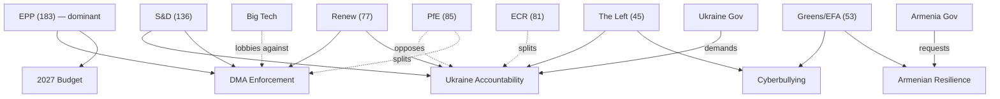

<!-- SPDX-FileCopyrightText: 2024-2026 Hack23 AB -->
<!-- SPDX-License-Identifier: Apache-2.0 -->

# Actor Mapping — EP Motions April–May 2026
**Methodology:** OSINT Actor Mapping, Stakeholder Network Analysis
**Analysis Date:** 2026-05-13 | **Confidence:** 🟡 Medium

---

## 1. Primary Actor Categories

### Category A: Institutional Actors (EP Internal)

#### EPP Group (183 MEPs, 25.5% seat share)
- **Role:** Dominant legislative group; steers on DMA enforcement, budgetary framework, CFSP
- **Key figures:**
  - Manfred Weber (EPP President, DE) — digital sovereignty champion; supports DMA enforcement against US Big Tech with pro-sovereignty framing
  - Roberta Metsola (EP President, MT) — institutional leadership; orchestrated unanimous Braun condemnation
  - Jeroen Lenaers (EPP, NL) — LIBE committee coordination on cyberbullying and platforms
- **Internal tension:** Pro-business EPP wing (France, Italy) vs. digital-sovereignty EPP wing (Germany, Austria) on DMA stringency; resolved in favour of enforcement for this cycle
- **Voting pattern:** Led budget resolution; co-signed DMA enforcement with Renew; delivered majority on Ukraine accountability

#### S&D Group (136 MEPs, 19.0%)
- **Role:** Social democratic force; essential for EP majority; drives Ukraine, anti-corruption, workers' rights
- **Key figures:**
  - Iratxe García Pérez (S&D President, ES) — Ukraine accountability architect
  - Bernd Lange (S&D, DE) — INTA chair; US tariff adjustment text
  - Maria Arena (S&D, BE) — human rights lead on Haiti trafficking
- **Coalition dynamics:** Forms the EPP-S&D "grand coalition" spine (319 votes combined); seeks social floors in budget exchange for broad support

#### Renew Europe (77 MEPs, 10.7%)
- **Role:** Liberal kingmaker; provides majority tipping-point on DMA, budget, CFSP
- **Key figures:**
  - Valérie Hayer (Renew President, FR) — DMA enforcement co-architect; tech governance specialist
  - Guy Verhofstadt (Renew, BE) — Ukraine tribunal lead; most vocal on accountability
  - Marie-Agnes Strack-Zimmermann (Renew, DE) — defence and Ukraine portfolio
- **Voting pattern:** Consistent majority partner; critical on DMA and Ukraine; occasionally diverges from EPP on regulatory scope

#### PfE — Patriotes pour l'Europe (85 MEPs, 11.9%)
- **Role:** Largest opposition bloc; nationalist-populist; systematically opposes geopolitical interventionism
- **Key figures:**
  - Jordan Bardella (PfE, FR) — Marine Le Pen's party floor leader; RN delegation
  - Viktor Orbán's Fidesz-adjacent MEPs — blocking Russia accountability texts
- **Voting pattern on April 2026 texts:**
  - DMA: SPLIT — French RN supports (economic nationalism); Hungarian MEPs oppose
  - Ukraine accountability: OPPOSED (majority of group)
  - Budget: OPPOSED (rejected EPP-S&D compromise)
  - Immunity waivers: SPLIT

#### ECR — European Conservatives and Reformists (81 MEPs, 11.3%)
- **Role:** Centre-right nationalist; increasingly fragmented between Polish pro-Ukraine and Italian governing-party pragmatists
- **Key figures:**
  - Nicola Procaccini (ECR co-chair, IT) — Fratelli d'Italia; pragmatic on EU institutions
  - Ryszard Legutko (ECR, PL) — PiS faction; Poland-specific concerns; pro-Ukraine but anti-Commission
  - Patryk Jaki (ECR, PL) — immunity waived March 2026
- **Internal fracture:** Polish ECR members (strongly pro-Ukraine) vs. Italian ECR (Meloni government; transactional) vs. Hungarian-adjacent ECR fringe

#### Greens/EFA (53 MEPs, 7.4%)
- **Role:** Climate-digital-rights nexus; reliable for DMA, cyberbullying, Armenia, Ukraine
- **Key figures:**
  - Terry Reintke (Greens co-chair, DE) — cyberbullying criminal provisions lead; online harms legislation
  - Ska Keller (Greens, DE) — migration and Armenia geopolitics
- **Voting pattern:** Supported all four major April 30 resolutions; abstained or opposed budget guidelines (insufficient climate floors)

#### The Left (45 MEPs, 6.3%)
- **Role:** Anti-war progressive; anti-corporate; supported cyberbullying, Armenia, Ukraine (anti-Russia), Haiti trafficking
- **Internal tension:** Anti-militarism faction (opposed to Ukraine military aid framing) vs. Ukraine solidarity faction
- **Notable:** The Left split on Ukraine accountability — majority supported tribunal demand; pacifist minority abstained

#### ESN — European Sovereigntists Network (27 MEPs, 3.8%)
- **Role:** Far-right sovereigntist; opposes EU foreign policy activism, immigration, digital regulation
- **Voting pattern:** Opposed DMA enforcement (regulatory overreach), Ukraine tribunal, Armenia resolution; supported immunity waiver for Braun (informal solidarity)

#### NI — Non-Attached (30 MEPs, 4.2%)
- **Notable:** Grzegorz Braun (PL) — immunity waived March 2026 for antisemitic incident; isolated within NI and across the House

---

### Category B: External Stakeholders

#### Big Tech Platforms (DMA Gatekeepers)
- **Interest:** Oppose aggressive DMA enforcement; preference for compliance over penalties
- **Key actors:** Apple, Meta, Google/Alphabet, Amazon, Microsoft, TikTok ByteDance
- **Tactic:** Engagement with Commission DSD (Digital Strategy Directorate); lobbying EPP pro-business MEPs; legal challenges to gatekeeper designation
- **EP resolution outcome:** Resolution calls for Commission to use full penalty toolkit (up to 10% global turnover); creates political accountability pressure

#### Ukraine Government (Zelenskyy administration)
- **Interest:** Maximum EU support for accountability tribunal, continued loan disbursement, weapons
- **Alignment:** TA-0161 directly endorsed Ukraine's demands; TA-0010 (Jan 2026) already ratified €50bn loan
- **Forward:** Tribunal treaty negotiations require Ukraine's co-authorship

#### Russian Federation
- **Interest:** Oppose accountability tribunal; undermine EU unity on Ukraine
- **Tactic:** Disinformation targeting PfE/ESN MEPs; engagement with Orbán via Fidesz channels
- **EP resolution:** Named directly in TA-0161 as responsible for crimes against civilian population

#### Armenian Government (Pashinyan)
- **Interest:** EP support accelerates EU-Armenia Partnership Agreement; provides diplomatic cover for CSTO exit
- **Alignment:** TA-0162 strongly aligned with Pashinyan government's EU pivot narrative

#### Digital Rights Organizations
- **Interest:** DMA enforcement without loopholes; cyberbullying legislation protecting victims
- **Key actors:** EFF European outpost; Access Now; BEUC; EDRi
- **Alignment:** Strongly backed TA-0160 and TA-0163

#### IMF / International Financial Institutions
- **Interest:** Eurozone fiscal consolidation; Ukraine financial support channels
- **Context:** US fiscal deficit at -7.5% GDP (WEO 2026) creates pressure for US to contribute to G7 Ukraine support package; EP's Ukraine tribunal text strengthens EU position in IMF governance discussions

---

## 2. Actor Influence Network

---

## 3. Actor Salience Matrix

| Actor | Power | Urgency | Legitimacy | Overall Salience |
|-------|-------|---------|------------|-----------------|
| EPP Group | 🔴 High | 🟡 Medium | 🟢 High | **Primary** |
| S&D Group | 🟡 Medium | 🔴 High | 🟢 High | **Primary** |
| Renew Europe | 🟡 Medium | 🟡 Medium | 🟢 High | **Primary** |
| Ukraine Govt | 🟡 Medium | 🔴 High | 🟢 High | **Primary** |
| Commission DG COMP/CNECT | 🔴 High | 🔴 High | 🟢 High | **Primary** |
| PfE Group | 🟡 Medium | 🔴 High | 🟡 Medium | **Secondary** |
| Greens/EFA | 🟡 Low-Med | 🟡 Medium | 🟢 High | **Secondary** |
| Big Tech (Apple/Meta/Google) | 🔴 High | 🟡 Medium | 🔴 Low | **Secondary** |
| Russian Federation | 🔴 High | 🔴 High | 🔴 Low | **Constraint** |
| ECR Group | 🟡 Medium | 🟡 Medium | 🟡 Medium | **Secondary** |
| IMF | 🟡 Medium | 🟡 Medium | 🟢 High | **Contextual** |
| Braun/Jaki (individuals) | 🔴 Low | 🔴 Low | 🔴 Low | **Peripheral** |

---

## 4. Coalition Formation Analysis

### Motions requiring cross-bloc majority (≥360 of 717):

**EPP + S&D + Renew = 396** (working majority)
- Sufficient for: DMA enforcement, budget guidelines, US tariff adjustment, Armenia
- Not mobilised for: Housing (Greens/Left driven), Cyberbullying (S&D/Greens led)

**EPP + S&D + Renew + Greens = 449** (super-majority)
- DMA enforcement likely passed at this level (Greens strongly pro-enforcement)
- Ukraine accountability at ~430-450 (Left mostly in, ESN/PfE mostly out)

**Cross-party consensus (~600+):**
- Immunity waivers (Braun: ~600+; near-unanimous condemnation of antisemitism)
- SRMR3 banking resolution (technical; EPP + S&D + Renew + some ECR)
- Anti-corruption directive (broad consensus with ECR defections)

### Defection risk zones:
- 🔴 **HIGH:** PfE on Ukraine, ECR on anti-corruption, EPP-PfE on DMA
- 🟡 **MEDIUM:** Left on Ukraine framing (tribunal = militarism?), Greens on budget (climate floors)
- 🟢 **LOW:** All groups on immunity waivers, SRMR3 banking

---

## 5. Named MEP Cross-Reference

| MEP | Group | Country | Role | Text |
|-----|-------|---------|------|------|
| Grzegorz Braun | NI | Poland | Subject of immunity waiver | TA-0088 |
| Patryk Jaki | ECR | Poland | Subject of immunity waiver | TA-0105 |
| Bernd Lange | S&D | Germany | INTA Chair; US tariffs | TA-0096 |
| Guy Verhofstadt | Renew | Belgium | Ukraine tribunal advocate | TA-0161 |
| Terry Reintke | Greens/EFA | Germany | Cyberbullying legislation | TA-0163 |
| Manfred Weber | EPP | Germany | Group President; DMA steering | TA-0160 |
| Iratxe García Pérez | S&D | Spain | Group President; Ukraine | TA-0161 |
| Valérie Hayer | Renew | France | DMA enforcement; digital | TA-0160 |

*Note: Rapporteur assignments for RSP texts not yet confirmed via EP API; named MEPs above represent group-role inference from institutional position and public statements. Confidence: 🟡 Medium.*
