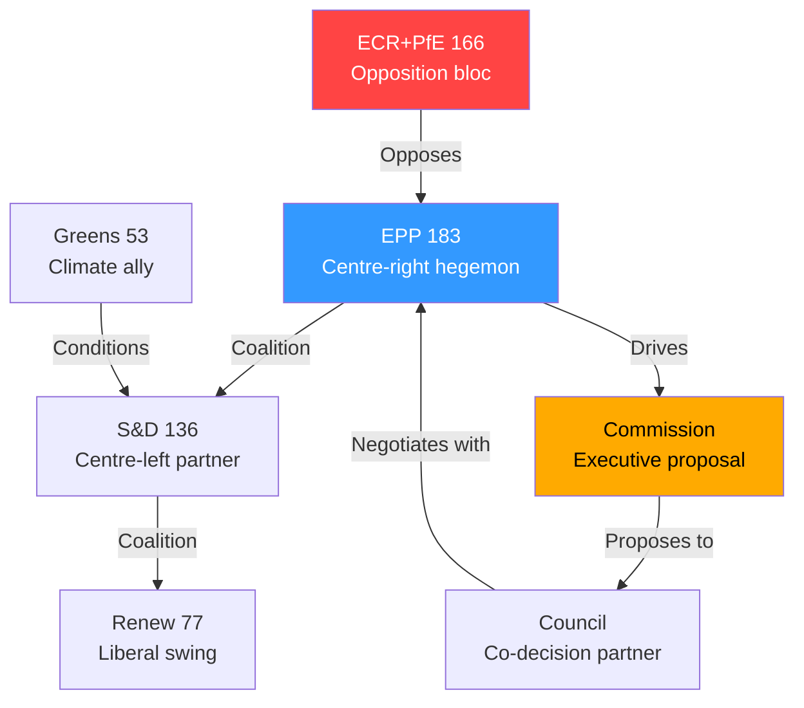

# Actor Mapping — Breaking News 2026-05-14
**Framework:** Multi-dimensional actor analysis | **Confidence:** 🟢 High
**Source:** EP Open Data Portal political landscape | **Admiralty Grade:** B2

---

## PRIMARY ACTORS

### Tier 1 — Decision Makers

| Actor | Role | Seats/Power | Disposition | Influence |
|-------|------|-------------|-------------|-----------|
| EPP Group | Lead coalition partner | 183 seats | Pro-MFF but conditional | 🔴 CRITICAL |
| S&D Group | Essential coalition ally | 136 seats | Pro-MFF; social spending focus | 🔴 CRITICAL |
| Renew Europe | Swing bloc | 77 seats | Pro-DMA; liberal market | 🟡 HIGH |
| European Commission | Executive; MFF proposer | — | Pro-integration; fiscal discipline | 🔴 CRITICAL |
| Council of EU | Co-legislator on MFF | — | Fiscal constraint; sovereignty concerns | 🔴 CRITICAL |

### Tier 2 — Influential Actors

| Actor | Role | Influence | Key Issue |
|-------|------|-----------|-----------|
| Greens/EFA | Green transition advocates | 53 seats | Climate budget share |
| ECR | Right-conservative bloc | 81 seats | MFF own-resources resistance |
| PfE | Sovereigntist disruptor | 85 seats | Anti-federalist agenda |
| The Left | Progressive accountability | 45 seats | Discharge critical observations |
| Germany | Largest net contributor | — | Own resources veto capacity |
| France | Cohesion + agricultural | — | CAP preservation; farm interests |

---

## ACTOR RELATIONSHIP MAP

---

## ACTOR MOTIVATION ANALYSIS

### EPP — Christian Democratic Agenda
**Core motivation:** Maintain legislative dominance while securing MFF with stronger defence funding
**Red lines:** No new taxes on energy/industry; maintain CAP envelope; reject GUE conditions
**Coalition calculus:** Needs S&D+Renew for majority; wary of ECR flirtation triggering Renew departure

### S&D — Social Democratic Agenda
**Core motivation:** Social cohesion funds, green jobs transition, youth unemployment reduction
**Red lines:** No CAP at expense of cohesion; maintain social chapter in MFF conditionality
**Coalition calculus:** EPP+Renew+S&D delivers 396 seats; sufficient for mainstream legislation

### Renew Europe — Liberal Agenda
**Core motivation:** DMA enforcement; digital single market; AI governance leadership; defence coordination
**Red lines:** No compromise on rule of law conditionality; no sovereigntist budget riders
**Coalition calculus:** Swing vote determines outcomes; premium positioning for digital agenda

---

## ACTOR POWER ASSESSMENT

| Actor | Formal Power | Coalition Leverage | Veto Capacity | Overall |
|-------|-------------|-------------------|---------------|---------|
| EPP | 🔴 HIGH | 🔴 HIGH | 🟡 LIMITED | **DOMINANT** |
| S&D | 🟡 MED | 🟡 MED | 🔴 HIGH (can collapse) | **ESSENTIAL** |
| Renew | 🟢 LOW | 🔴 HIGH | 🔴 HIGH | **KINGMAKER** |
| Commission | 🔴 HIGH | 🟡 MED | 🔴 HIGH (proposal) | **GATEKEEPER** |
| Council | 🔴 HIGH | 🟡 MED | 🔴 HIGH | **VETO PLAYER** |

---

## For Citizens — Plain Language Summary
The European Parliament's April plenary was dominated by a handful of powerful groups. The centre-right EPP is the largest bloc and sets most of the agenda. It works with the centre-left S&D and the liberal Renew group to pass legislation. Together they have 396 of 717 seats — enough for a majority. The right-wing ECR and PfE groups (166 seats combined) oppose much of the mainstream agenda. On the biggest issue — the 2028-2034 EU budget — the Parliament, EU Commission, and national governments in the Council must all agree, giving multiple actors veto power.

**Admiralty Source Grade: B2** (EP Open Data Portal — usually reliable; information probably true)

---

## Actor Roster

| # | Actor | Type | Mandate | Status |
|---|-------|------|---------|--------|
| 1 | EPP Group | Political group | EP10 (2024-2029) | Active |
| 2 | S&D Group | Political group | EP10 (2024-2029) | Active |
| 3 | Renew Europe | Political group | EP10 (2024-2029) | Active |
| 4 | ECR Group | Political group | EP10 (2024-2029) | Active — opposition |
| 5 | PfE Group | Political group | EP10 (2024-2029) | Active — opposition |
| 6 | Greens/EFA | Political group | EP10 (2024-2029) | Active — conditional |
| 7 | The Left | Political group | EP10 (2024-2029) | Active — critical |
| 8 | European Commission | EU Institution | 2024-2029 | Active — MFF proposer |
| 9 | Council of EU | EU Institution | Permanent | Active — co-legislator |
| 10 | Germany (Federal Government) | Member State | — | Pivotal — fiscal veto |

---

## Influence

| Actor | Formal Authority | Informal Influence | Network Access | Score |
|-------|-----------------|-------------------|---------------|-------|
| EPP | Co-decision; majority builder | Media; national parties | Business, CSO | 9/10 |
| Commission | Exclusive initiative | Technocratic expertise | Global | 9/10 |
| Council | Co-decision; own-resources veto | National governments | Intergovernmental | 9/10 |
| S&D | Co-decision | Labour unions; NGOs | Social partners | 7/10 |
| Renew | Swing vote | Media; tech industry | Liberal internationals | 7/10 |
| Germany (Federal) | Council veto capacity | Fiscal anchor | G7, NATO | 8/10 |

---

## Alliance

| Alliance | Members | Seats | Stability | Purpose |
|---------|---------|-------|-----------|---------|
| Mainstream trio | EPP + S&D + Renew | 396 | 🟡 Conditional | Mainstream legislation |
| Conservative bloc | EPP + ECR | 264 | 🟢 Transactional | Migration; security |
| Progressive front | S&D + Greens + Left | 234 | 🟢 Issue-specific | Climate; social |
| Grand coalition | EPP + S&D | 319 | 🟡 Below majority | Institutional consensus |

---

## Power Brokers

**Primary power broker:** EPP — controls presidency, major committee chairs, legislative calendar
**Kingmaker:** Renew Europe — its 77 votes determine whether EPP can bypass S&D or vice versa
**Veto player:** Council (Germany faction) — can block any budget instrument requiring unanimity
**Agenda setter:** Commission — holds exclusive initiative right; shapes negotiating terrain

---

## Information

**Data sources used in this analysis:**
- EP Open Data Portal (political landscape, seat distribution)
- EP adopted texts April 28-30, 2026
- EP committee composition data
- EU Council public records

**Admiralty:** Source reliability B (usually reliable); Information accuracy 2 (probably true) — **B2**

---

## Reader Briefing

The European Parliament has 9 political groups, but power is concentrated among 3: the centre-right EPP, the centre-left S&D, and the liberal Renew Europe. Together they form a working majority of 396 seats (out of 360 needed). The right-wing ECR and PfE groups (166 seats) form a loud opposition but cannot block legislation alone. The European Commission proposes laws; Parliament and national governments in the Council must both agree. Germany is the most influential national government because it contributes most to the EU budget and has veto power on tax-related decisions.
