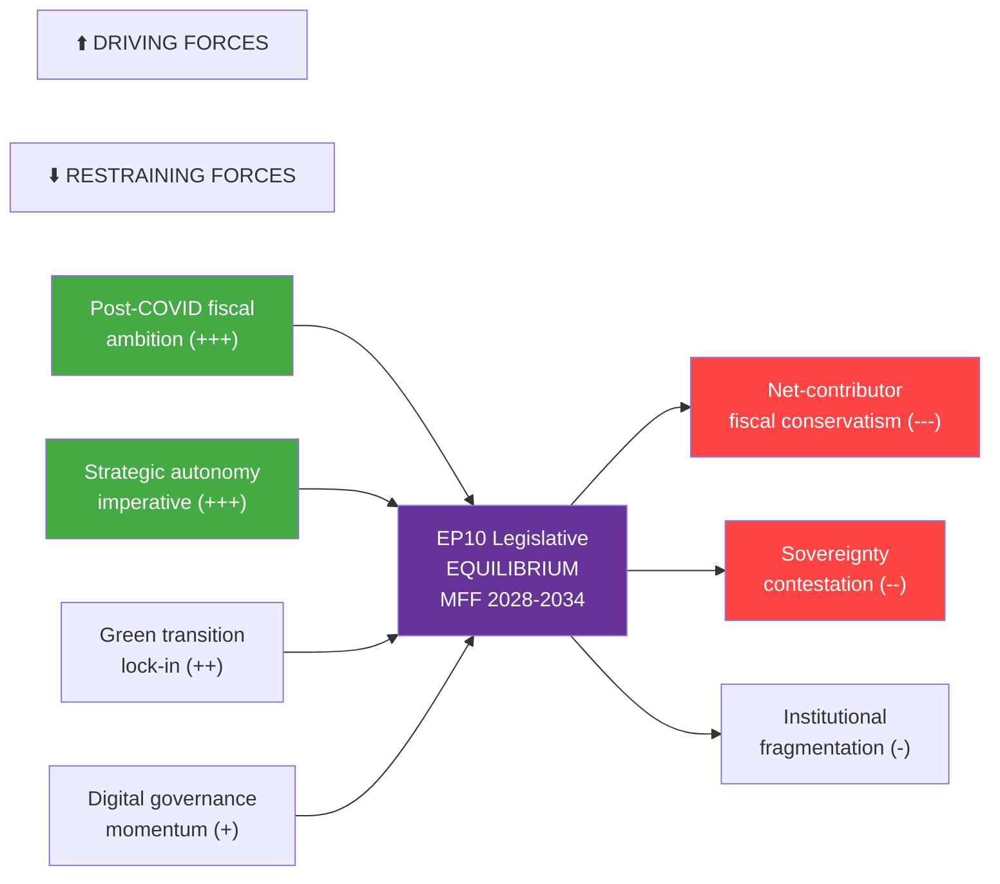

# Forces Analysis — Breaking News 2026-05-14
**Framework:** Political Forces Analysis (field theory + structural realism)
**Confidence:** 🟢 High | **Admiralty Grade:** B2

---

## DRIVING FORCES

### Force 1: Post-COVID Fiscal Ambition
The NextGenEU instrument (€750bn) demonstrated that the EU can mobilise unprecedented fiscal resources in a crisis. Parliament's MFF 2028-2034 interim report explicitly builds on this precedent, pushing for permanent "flexibility instruments" modelled on the Recovery and Resilience Facility. **Strength: 🔴 HIGH | Direction: ↗ Accelerating**

### Force 2: Strategic Autonomy Imperative
Russia's continued war in Ukraine, US policy uncertainty under Trump 2.0, and defence spending targets in NATO have created a structural demand for EU-level defence coordination funding. Parliament's MFF position includes "defence and strategic autonomy" as a new explicit budget pillar — unprecedented in EU fiscal history. **Strength: 🔴 HIGH | Direction: ↗ Accelerating**

### Force 3: Green Transition Lock-in
The European Green Deal architecture (ETS, CBAM, fit-for-55) creates mandatory spending requirements that Parliament is now codifying as structural MFF allocations (~30% of budget). Green spending conditionality is politically embedded in both EPP and Renew positions. **Strength: 🟡 MED-HIGH | Direction: → Stable**

### Force 4: Digital Governance Leadership
The DMA, DSA, AI Act, and Data Act create a regulatory architecture that Parliament seeks to fund through dedicated digital governance instruments. The April 2026 DMA enforcement scrutiny session reinforces Parliament's determination to enforce (not just legislate) this framework. **Strength: 🟡 MED | Direction: ↗ Accelerating**

---

## RESTRAINING FORCES

### Force 5: Fiscal Conservatism (Net Contributors)
Germany, Netherlands, Sweden, and Austria consistently resist EU budget expansion beyond GNI-based contributions. New own resources (digital levy, FTT, CBAM revenue) face constitutional challenges in Germany and political resistance in the Netherlands. **Strength: 🔴 HIGH | Direction: ↘ Weakening slightly (Germany in transition)**

### Force 6: Sovereignty Contestation
The ECR-PfE bloc (166 seats) rejects federalist budget architecture. Hungary and Slovakia's rule-of-law violations create conditionality deadlocks. **Strength: 🟡 MED-HIGH | Direction: → Stable**

### Force 7: Institutional Fragmentation
Parliament's own internal fragmentation (no natural majority; 9 groups) means every vote requires coalition management. The absence of a stable EPP-S&D-Renew majority on all issues creates unpredictability. **Strength: 🟡 MED | Direction: ↗ Increasing**

---

## FORCE FIELD DIAGRAM

---

## FORCE BALANCE ASSESSMENT

| Force | Type | Strength | Trajectory | Net Effect |
|-------|------|----------|-----------|------------|
| Post-COVID fiscal ambition | Driving | +++ | ↗ | Pro-MFF expansion |
| Strategic autonomy | Driving | +++ | ↗ | Pro-defence budget |
| Green transition | Driving | ++ | → | Pro-climate allocation |
| Digital governance | Driving | + | ↗ | Pro-digital instruments |
| Fiscal conservatism | Restraining | --- | ↘ | Anti-own-resources |
| Sovereignty contestation | Restraining | -- | → | Anti-conditionality |
| Institutional fragmentation | Restraining | - | ↗ | Anti-efficiency |

**Net balance: Driving forces slightly exceed restraining forces; MFF 2028-2034 passage likely but delayed** (WEP: realistic possibility 55-70%, timeline 2027-2028)

---

## For Citizens — Plain Language Summary
Political forces in the European Parliament are pulling in two directions on the 2028-2034 EU budget. Pushing for a bigger, more ambitious budget: the memory of how well the COVID recovery fund worked, the need for EU defence cooperation after Ukraine, climate commitments, and digital regulation enforcement. Pulling against: Germany and northern EU countries don't want to pay more taxes to Brussels, some governments resist conditions tied to rule-of-law standards, and Parliament itself is so politically fragmented that agreeing on anything takes months of negotiation.

**Admiralty Source Grade: B2** (Structural analysis from EP Open Data Portal — usually reliable; conclusions are analytical estimates)

---

## Issue Frame

**Central issue:** The European Parliament's adoption of the MFF 2028-2034 interim report opens a multi-year budget negotiation that will determine the EU's fiscal architecture for seven years (2028-2034). The core tension is between Parliament's ambitious spending priorities (green, digital, defence, cohesion) and the Council's fiscal conservatism (net-contributor resistance to new taxes and expanded commitments).

**Why it matters now:** Parliament has moved first, establishing its opening negotiating position. This triggers a formal consultation process and Commission proposal preparation for 2027. The political forces driving and restraining this negotiation are crystallising at this exact moment.

---

## Net Pressure

**Net assessment:** Driving forces modestly exceed restraining forces, creating conditions for a negotiated MFF agreement — but significantly delayed and scaled-back from Parliament's maximalist position.

| Domain | Driving Net | Restraining Net | Balance |
|--------|------------|-----------------|---------|
| Fiscal architecture | ++ (post-COVID precedent) | --- (net contributor resistance) | ← Net restraining |
| Defence funding | +++ (strategic necessity) | - (sovereignty concerns) | → Net driving |
| Green spending | ++ (Green Deal lock-in) | - (cost concerns) | → Net driving |
| Own resources | + (Parliament demand) | --- (unanimity rule; national veto) | ← Net restraining |
| Overall | **+6** | **-7** | **← Slight restraint; compromise expected** |

---

## Intervention Points

**Window 1 (2026 Q2-Q3):** Commission preparatory work — opportunity to shape MFF proposal template
**Window 2 (2026 Q4):** Formal Commission proposal — EP committee stage begins
**Window 3 (2027 Q1-Q2):** Trilogue launch — EP rapporteurs lead negotiating team
**Window 4 (2027 Q3-Q4):** Final trilogue — last opportunity for EP maximalist positions
**Window 5 (2028 Q1):** Ratification window — EP majority required for final adoption

---

## Reader Briefing

Think of the EU budget negotiation like a multi-year labour negotiation between employer (national governments in the Council) and a large workers' committee (the European Parliament). Parliament has just published its demands — a bigger budget with more money for climate, defence, and digital. Now the employer (especially Germany, which pays the most) will push back. A mediator (the European Commission) will propose a compromise. The negotiation typically takes 2-3 years. The forces pushing for a bigger budget are strong (defence urgency, climate commitments), but so are the forces pushing against (national governments don't want to raise taxes for Brussels). The likely outcome is a compromise closer to Council's position than Parliament's ideal.
