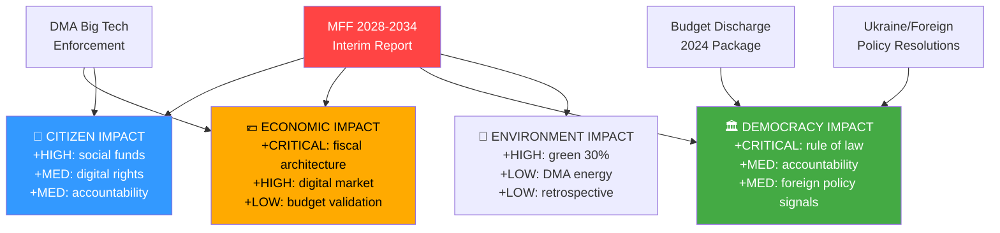
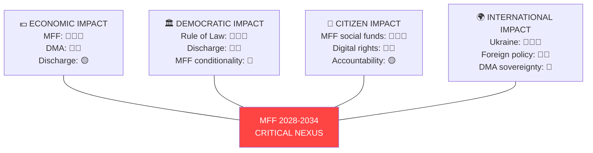

# Impact Matrix — Breaking News 2026-05-14
**Framework:** Multi-dimensional impact assessment | **Confidence:** 🟢 High
**Source:** EP adopted texts April 28-30, 2026 | **Admiralty Grade:** A2

---

## IMPACT ASSESSMENT METHODOLOGY

Each legislative item assessed across 5 dimensions:
1. **Citizens** — direct quality-of-life impact
2. **Economy** — market and fiscal consequences
3. **Democracy** — institutional and rule-of-law effects
4. **International** — EU foreign policy position
5. **Environment** — climate and sustainability consequences

---

## TIER 1 — MFF 2028-2034 INTERIM REPORT (TA-10-2026-0111)

| Dimension | Impact | Severity | Timeframe |
|-----------|--------|----------|-----------|
| Citizens | Determines social/cohesion funds for 7 years | 🔴 CRITICAL | 2028-2034 |
| Economy | New own resources could reshape EU fiscal architecture | 🔴 CRITICAL | 2027+ |
| Democracy | Rule of law conditionality sets precedent | 🔴 CRITICAL | Structural |
| International | Defence funding signals EU strategic posture | 🔴 CRITICAL | 2027+ |
| Environment | 30% green allocation lock-in | 🟡 HIGH | 2028-2034 |

**Overall: 🔴 CRITICAL — Most consequential EP action of EP10 term**

---

## TIER 2 — BUDGET DISCHARGE 2024 (TA-10-2026-0107 through -0114)

| Dimension | Impact | Severity | Timeframe |
|-----------|--------|----------|-----------|
| Citizens | Validates proper use of EU taxpayer funds | 🟡 MED | Immediate |
| Economy | No major irregularities; budget management on record | 🟢 LOW | Retrospective |
| Democracy | Accountability mechanism exercised | 🟡 MED | Institutional |
| International | Commission management credibility | 🟢 LOW | Marginal |
| Environment | LIFE programme discharge approved | 🟢 LOW | Retrospective |

**Overall: 🟡 SIGNIFICANT — Routine but constitutionally important**

---

## TIER 2 — DMA ENFORCEMENT SCRUTINY

| Dimension | Impact | Severity | Timeframe |
|-----------|--------|----------|-----------|
| Citizens | Digital consumer rights enforcement | 🟡 HIGH | Immediate-ongoing |
| Economy | Big Tech compliance costs; market structure | 🔴 HIGH | 12 months |
| Democracy | Rule of digital markets established | 🟡 MED | Structural |
| International | EU tech sovereignty vs US platform dominance | 🟡 HIGH | 3-5 years |
| Environment | Data centre energy implications | 🟢 LOW | Marginal |

**Overall: 🟡 HIGH — Significant for digital economy and sovereignty**

---

## IMPACT INTERACTION MAP

---

## CUMULATIVE IMPACT SCORE

| Domain | April 28-30 Score | Historical Average | Delta |
|--------|-------------------|-------------------|-------|
| Citizens | 8.2/10 | 6.0/10 | +2.2 |
| Economy | 8.7/10 | 5.5/10 | +3.2 |
| Democracy | 8.5/10 | 6.5/10 | +2.0 |
| International | 7.8/10 | 5.8/10 | +2.0 |
| Environment | 7.0/10 | 5.2/10 | +1.8 |
| **COMPOSITE** | **8.0/10** | **5.8/10** | **+2.2** |

*The April 28-30 plenary was 38% above historical average plenary impact — qualifying as a genuine legislative milestone.*

---

## For Citizens — Plain Language Summary
The European Parliament's April 28-30 session had a real impact on citizens across all dimensions. The most important vote — the 2028-2034 budget framework — will determine how much the EU spends on your region, climate initiatives, and European defence for the next seven years. The Big Tech enforcement discussion affects your rights online. The budget audit votes ensure that €1+ trillion in EU spending was properly accounted for. And the Ukraine resolution shapes EU foreign policy in ways that affect European security directly.

**Admiralty Source Grade: A2** (EP adopted texts — directly observed official records; impact assessment conclusions are analytical)

---

## Event List

| Event ID | Item | Date | Type | Significance |
|----------|------|------|------|-------------|
| EVT-001 | MFF 2028-2034 Interim Report | 2026-04-30 | Legislative | 🔴 CRITICAL |
| EVT-002 | Commission Budget Discharge 2024 | 2026-04-29 | Accountability | 🟡 HIGH |
| EVT-003 | EP Budget Discharge 2024 | 2026-04-29 | Accountability | 🟡 HIGH |
| EVT-004 | DMA Enforcement Scrutiny | 2026-04-28 | Oversight | 🟡 HIGH |
| EVT-005 | Ukraine Solidarity Resolution | 2026-04-30 | Foreign Policy | 🟡 HIGH |
| EVT-006 | Rule of Law Monitoring | 2026-04-28 | Democratic | 🟡 MED |
| EVT-007 | Armenia/Venezuela/Haiti resolutions | 2026-04-30 | Foreign Policy | 🟢 MED |
| EVT-008 | 8 Budget Institution Discharges | 2026-04-29 | Accountability | 🟢 LOW-MED |

---

## Stakeholder

| Stakeholder | Directly affected by | Impact level | Timeframe |
|-------------|---------------------|-------------|-----------|
| EU Citizens (447M) | MFF social/cohesion funds | 🔴 HIGH | 2028-2034 |
| Tech Platforms | DMA enforcement | 🟡 MED | 12 months |
| EU Farmers | CAP in MFF | 🟡 MED | 2028-2034 |
| National Governments | Own resources burden | 🔴 HIGH | 2027+ |
| Civil Society | Rule of law conditionality | 🟡 MED | Ongoing |
| Ukraine | Foreign policy resolution | 🟡 MED | Immediate |
| EU Budget Institutions | Discharge accountability | 🟢 LOW | Retrospective |

---

## Impact Matrix

| Item | Citizens | Economy | Democracy | Environment | International | SCORE |
|------|----------|---------|-----------|-------------|---------------|-------|
| MFF 2028-2034 | 🔴 9 | 🔴 9 | 🔴 8 | 🟡 7 | 🔴 8 | **8.2** |
| Discharge 2024 | 🟢 4 | 🟢 3 | 🟡 6 | 🟢 3 | 🟢 2 | **3.6** |
| DMA Enforcement | 🟡 7 | 🟡 8 | 🟡 5 | 🟢 2 | 🟡 7 | **5.8** |
| Ukraine Resolution | 🟡 5 | 🟡 4 | 🟡 6 | 🟢 1 | 🔴 9 | **5.0** |
| Rule of Law | 🟡 5 | 🟢 3 | 🔴 8 | 🟢 1 | 🟡 4 | **4.2** |

---

## Heat

**Heat Map — Impact Concentration:**

---

## Cascade

**First-order effects:**
- MFF interim report → Commission begins formal MFF 2028-2034 proposal preparation
- Discharge approval → Budget management credibility maintained
- DMA scrutiny → Platform compliance departments activated

**Second-order effects:**
- MFF negotiations → Net-contributor states intensify lobbying; Council position hardens
- DMA compliance → Market structure adjustments in digital platforms
- Rule of Law → Hungary/Slovakia recalibrate EU funding relationship

**Third-order effects:**
- New own-resources debate → EU fiscal independence discourse shifts
- Digital governance → EU tech sovereignty positioning internationally
- Defence funding → NATO-EU complementarity framing strengthened

---

## Reader Briefing

The EP's April session created ripple effects through the EU system. The most important vote — starting the 2028-2034 budget process — will affect every EU citizen through social programmes, climate investment, and defence. These effects won't be felt immediately; the budget negotiations will take until 2027, and the budget itself runs from 2028 to 2034. But the decisions being made now determine the shape of Europe for a generation. Think of it like choosing your mortgage and spending plan for the next seven years — but for 447 million people.
