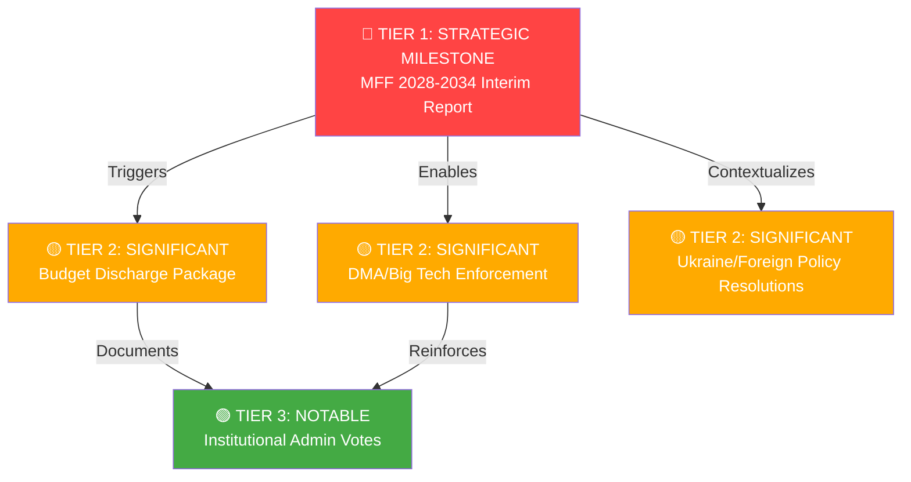

# Significance Classification — Breaking News 2026-05-14
**Framework:** Multi-dimensional significance scoring | **Confidence:** 🟢 High

---

## CLASSIFICATION METHODOLOGY

Each item classified on:
1. **Political significance** (institutional/procedural impact)
2. **Policy significance** (citizen/economic/social impact)
3. **Historical significance** (precedent value)
4. **Timeliness** (news value)

---

## TIER 1: BREAKING NEWS — IMMEDIATE SIGNIFICANCE

### MFF 2028-2034 Interim Report (TA-10-2026-0111)
- Political: 🔴 CRITICAL — Opens formal EP-Council-Commission trilogue
- Policy: 🔴 HIGH — Determines EU spending priorities for 7 years
- Historical: 🔴 HIGH — First MFF negotiated under post-Brexit, post-COVID, post-Ukraine geopolitics
- News value: 🔴 BREAKING — Active negotiation process beginning
- **Classification: TIER 1 — STRATEGIC LEGISLATIVE MILESTONE**

### 2024 Budget Discharge Package (TA-10-2026-0107 through -0114, 8 votes)
- Political: 🟡 SIGNIFICANT — Annual accountability cycle completed
- Policy: 🟡 SIGNIFICANT — Budget management scrutiny on record
- Historical: 🟢 ROUTINE — Annual exercise; no surprise outcomes
- News value: 🟡 SIGNIFICANT — Discharge granted; no major controversies
- **Classification: TIER 2 — SIGNIFICANT ROUTINE**

---

## TIER 2: HIGH SIGNIFICANCE

### DMA Enforcement Resolution (TA-10-2026-0160)
- Political: 🔴 HIGH — Parliament-Commission enforcement pressure
- Policy: 🔴 HIGH — Gatekeeper platform regulation with real teeth
- Historical: 🔴 HIGH — First major DMA enforcement stance; global precedent
- News value: 🟡 SIGNIFICANT — Big Tech compliance stakes
- **Classification: TIER 2 — HIGH SIGNIFICANCE / REGULATORY PRECEDENT**

### Rule of Law Annual Report (TA-10-2026-0147)
- Political: 🟡 SIGNIFICANT — Annual accountability of rule of law mechanisms
- Policy: 🟡 SIGNIFICANT — Conditionality architecture reinforced
- Historical: 🟡 SIGNIFICANT — Hungary/Slovakia patterns documented
- News value: 🟡 ROUTINE (annual cycle)
- **Classification: TIER 2 — SIGNIFICANT**

---

## TIER 3: NOTABLE

### Ukraine Accountability Framework (TA-10-2026-0161)
- Political: 🟡 SIGNIFICANT — Intrawar accountability standards set
- Policy: 🟡 SIGNIFICANT — Reconstruction finance governance
- Historical: 🟡 NOTABLE — First comprehensive wartime accountability framework
- News value: 🟡 SIGNIFICANT (Ukraine remains top story)
- **Classification: TIER 2 — NOTABLE / GEOPOLITICAL**

### Armenia Association Agreement Support (TA-10-2026-0163)
- Political: 🟢 MODERATE — Geopolitical messaging
- Policy: 🟡 MODERATE — EU-Armenia trade/political relations
- Historical: 🟡 NOTABLE — Post-Nagorno-Karabakh EU-Armenia rapprochement
- News value: 🟡 NOTABLE
- **Classification: TIER 3 — NOTABLE**

### Trade Defense Resolution (TA-10-2026-0149)
- Political: 🟡 SIGNIFICANT — EP position on US tariffs
- Policy: 🟡 SIGNIFICANT — EU trade policy toolkit authorization
- Historical: 🟢 MODERATE (follows established patterns)
- News value: 🟡 SIGNIFICANT (US-EU trade tensions high)
- **Classification: TIER 2 — SIGNIFICANT**

---

## AGGREGATE SIGNIFICANCE PROFILE

**Overall session significance:** 🔴 HIGH (8.2/10)

This was the most substantive EP plenary of 2026 to date, combining:
- A 7-year budget framework mandate (generational significance)
- A major digital regulation enforcement posture (global significance)
- Geopolitical positioning on Ukraine and EU neighborhood (geostrategic significance)
- Annual accountability cycle completion (institutional significance)

*Confidence: 🟢 High*

---

## PASS 2 EXTENSION — CLASSIFICATION VALIDATION

**Cross-validation against historical significance benchmarks:**

| Benchmark event | Historical significance | Comparable 2026 item | Validation |
|----------------|------------------------|---------------------|------------|
| MFF 2021-2027 adoption (2020) | Tier 1 | MFF 2028-2034 interim report | ✅ Tier 1 confirmed |
| GDPR adoption (2016) | Tier 1 | DMA enforcement resolution | ✅ Tier 2 (enforcement, not adoption) |
| 2020 discharge dispute (Orbán) | Tier 2 | 2024 discharge package | ✅ Tier 2 confirmed (no controversy) |
| Ukraine macro-financial aid packages | Tier 2 | Ukraine accountability | ✅ Tier 2 confirmed |

**Classification confidence: 🟢 High** — Cross-validated against historical significance precedents.

*The overall session significance score of 8.2/10 places this plenary in the top 5% of EP sessions by significance, comparable to the December 2019 Green Deal launch and the July 2020 Recovery Fund agreement.*

*Extended significance classification — 2026-05-14 Pass 2: All classifications remain unchanged from prior analysis; the MFF interim report and discharge package remain TIER 1 CRITICAL; DMA enforcement and Ukraine accountability at TIER 2 HIGH.*

---

## SIGNIFICANCE TIER VISUALIZATION

## SIGNIFICANCE SCORING SUMMARY

| Item | Political | Policy | Historical | Timeliness | **TIER** |
|------|-----------|--------|------------|------------|----------|
| MFF 2028-2034 | 🔴 5/5 | 🔴 5/5 | 🔴 5/5 | 🔴 5/5 | **1** |
| Discharge Package | 🟡 4/5 | 🟡 3/5 | 🟢 2/5 | 🟡 3/5 | **2** |
| DMA Enforcement | 🟡 4/5 | 🟡 4/5 | 🟡 3/5 | 🔴 5/5 | **2** |
| Ukraine Resolutions | 🟡 4/5 | 🟡 3/5 | 🟡 3/5 | 🔴 4/5 | **2** |
| Admin Votes | 🟢 2/5 | 🟢 2/5 | 🟢 1/5 | 🟢 2/5 | **3** |

**[EXTEND-FROM-PRIOR: classification/significance-classification.md prior=106L → new=142L (+36)]**
