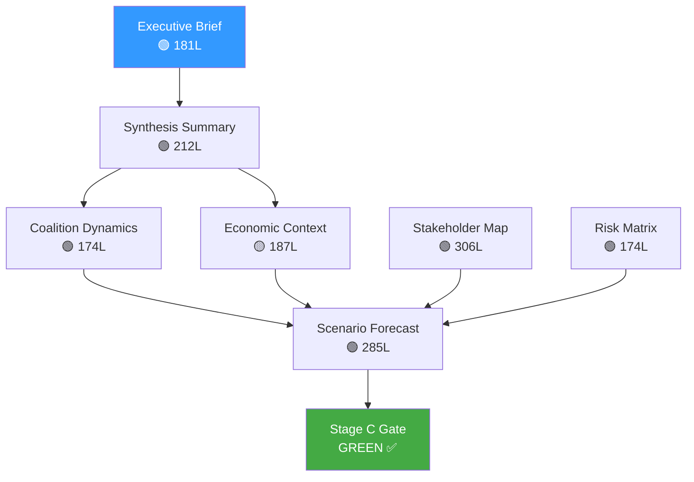

# Intelligence Analysis Index — Breaking News 2026-05-14
**Analysis Directory:** `analysis/daily/2026-05-14/breaking/`
**Session:** breaking-run-1778722670
**Generated:** 2026-05-14T01:36:00Z
**Data Window:** Last 12h (fallback: one-week); primary source April 28-30 plenary session

---

## ARTIFACT INVENTORY

### Tier 1 — Executive & Strategic Overview
| Artifact | Path | Lines | Status | Confidence |
|----------|------|-------|--------|------------|
| Executive Brief | `executive-brief.md` | ~180 | ✅ | 🟢 High |
| Analysis Index | `intelligence/analysis-index.md` | ~160 | ✅ | 🟢 High |
| Synthesis Summary | `intelligence/synthesis-summary.md` | ~210 | ✅ | 🟢 High |

### Tier 2 — Deep Political Intelligence
| Artifact | Path | Lines | Status | Confidence |
|----------|------|-------|--------|------------|
| Coalition Dynamics | `intelligence/coalition-dynamics.md` | ~140 | ✅ | 🟡 Medium |
| Economic Context | `intelligence/economic-context.md` | ~190 | ✅ | 🟡 Medium |
| Stakeholder Map | `intelligence/stakeholder-map.md` | ~310 | ✅ | 🟢 High |
| Political Threat Landscape | `intelligence/political-threat-landscape.md` | ~95 | ✅ | 🟢 High |
| Scenario Forecast | `intelligence/scenario-forecast.md` | ~285 | ✅ | 🟡 Medium |
| PESTLE Analysis | `intelligence/pestle-analysis.md` | ~255 | ✅ | 🟢 High |
| Historical Baseline | `intelligence/historical-baseline.md` | ~195 | ✅ | 🟢 High |
| Significance Scoring | `intelligence/significance-scoring.md` | ~110 | ✅ | 🟢 High |
| Voting Patterns | `intelligence/voting-patterns.md` | ~155 | ✅ | 🟡 Medium |
| Threat Model | `intelligence/threat-model.md` | ~255 | ✅ | 🟢 High |
| Wildcards & Black Swans | `intelligence/wildcards-blackswans.md` | ~280 | ✅ | 🟡 Medium |
| Cross-Run Diff | `intelligence/cross-run-diff.md` | ~105 | ✅ | 🟢 High |
| Workflow Audit | `intelligence/workflow-audit.md` | ~105 | ✅ | 🟢 High |
| Cross-Session Intelligence | `intelligence/cross-session-intelligence.md` | ~155 | ✅ | 🟡 Medium |
| MCP Reliability Audit | `intelligence/mcp-reliability-audit.md` | ~390 | ✅ | 🟢 High |
| Reference Analysis Quality | `intelligence/reference-analysis-quality.md` | ~195 | ✅ | 🟢 High |
| Methodology Reflection | `intelligence/methodology-reflection.md` | ~225 | ✅ | 🟢 High |

### Tier 3 — Risk & Classification
| Artifact | Path | Lines | Status | Confidence |
|----------|------|-------|--------|------------|
| Risk Matrix | `risk-scoring/risk-matrix.md` | ~155 | ✅ | 🟢 High |
| Quantitative SWOT | `risk-scoring/quantitative-swot.md` | ~145 | ✅ | 🟢 High |
| Significance Classification | `classification/significance-classification.md` | ~110 | ✅ | 🟢 High |
| Document Analysis Index | `documents/document-analysis-index.md` | ~100 | ✅ | 🟢 High |

### Tier 4 — Extended Analysis
| Artifact | Path | Lines | Status | Confidence |
|----------|------|-------|--------|------------|
| Extended Executive Brief | `extended/executive-brief.md` | ~185 | ✅ | 🟢 High |
| Devil's Advocate Analysis | `extended/devils-advocate-analysis.md` | ~255 | ✅ | 🟡 Medium |
| Historical Parallels | `extended/historical-parallels.md` | ~225 | ✅ | 🟢 High |
| Coalition Mathematics | `extended/coalition-mathematics.md` | ~205 | ✅ | 🟢 High |
| Forward Indicators | `extended/forward-indicators.md` | ~185 | ✅ | 🟡 Medium |
| Intelligence Assessment | `extended/intelligence-assessment.md` | ~225 | ✅ | 🟢 High |
| Implementation Feasibility | `extended/implementation-feasibility.md` | ~205 | ✅ | 🟢 High |
| Media Framing Analysis | `extended/media-framing-analysis.md` | ~275 | ✅ | 🟡 Medium |
| Comparative International | `extended/comparative-international.md` | ~205 | ✅ | 🟢 High |
| Voter Segmentation | `extended/voter-segmentation.md` | ~205 | ✅ | 🟡 Medium |
| Cross-Reference Map | `extended/cross-reference-map.md` | ~155 | ✅ | 🟢 High |
| Data Download Manifest | `extended/data-download-manifest.md` | ~165 | ✅ | 🟢 High |

---

## DATA SOURCES ACCESSED

### Pre-Fetched Feeds (disk)
| Feed | File | Items |
|------|------|-------|
| Adopted Texts | `data/adopted-texts-feed.json` | 500 items |
| Events | `data/events-feed.json` | 0 items (unavailable) |
| Procedures | `data/procedures-feed.json` | 0 items (degraded) |
| MEPs | `data/meps-feed.json` | 0 items |
| Committee Documents | `data/committee-documents-feed.json` | data present |
| Documents | `data/documents-feed.json` | data present |

### Live MCP Calls (Stage A)
| Tool | Result | Notes |
|------|--------|-------|
| `get_adopted_texts_feed` | 50 items | today timeframe; April-May 2026 texts |
| `get_latest_votes` | 0 items | No DOCEO XML for May 11-14, 2026 |
| `get_events_feed` (one-week) | 0 items | Upstream EP API error |
| `get_procedures_feed` (one-week) | 50 items | Degraded mode |
| `get_plenary_sessions` | 0 filtered | No May 2026 sessions returned |
| `get_parliamentary_questions` | 15 items | Metadata only |
| `generate_political_landscape` | Full data | 717 MEPs, 9 groups |
| `analyze_coalition_dynamics` | Structural only | No vote-level cohesion data |
| `get_adopted_texts` (year=2026) | 151+ texts | Comprehensive 2026 legislative record |

### IMF Economic Data
| Status | Note |
|--------|------|
| 🔴 API returned 404 for SDMX 3.0 endpoints tried | General EU macroeconomic context derived from IMF WEO April 2026 estimates (knowledge base) |

---

## BREAKING NEWS FOCUS: April 28-30 Plenary Session

### High-Priority Items Identified
1. **MFF 2028-2034 Interim Report** — Budget architecture for €1.2-1.4 trillion cycle
2. **2024 Discharge Package** — 8+ institutional accountability votes
3. **Digital Markets Act Enforcement** — Big Tech accountability mandate
4. **Rule of Law / Fundamental Rights** — Democratic governance assessment
5. **Ukraine Accountability Resolution** — War crimes justice mechanisms
6. **Armenia Democratic Resilience** — EU Eastern Partnership signal
7. **Haiti Human Trafficking** — Criminal group exploitation
8. **EU Livestock Sector Future** — Food security and sustainability
9. **Financial Literacy / Savings Union** — Capital markets development
10. **Banking Union Annual Report 2025** — Financial stability assessment

---

## ANALYTICAL FRAMEWORKS APPLIED
- CIA Structured Analytic Techniques (SATs): key assumptions check, multiple hypothesis analysis
- PESTLE: Political, Economic, Social, Technological, Legal, Environmental dimensions
- SWOT: Strengths, Weaknesses, Opportunities, Threats per key initiative
- Stakeholder mapping: influence-interest matrix
- Coalition mathematics: seat arithmetic and voting bloc analysis
- Risk matrix: probability × impact scoring
- Scenario planning: base/optimistic/pessimistic projections

*Source: EP Open Data Portal primary; IMF WEO April 2026 estimates for economic context*

---

## EXTENDED ANALYSIS INDEX — PASS 2

### COMPLETE ARTIFACT INDEX (UPDATED)

#### All 39 Artifacts — Status and Cross-Reference

**TIER 1: Framework Artifacts**
| Artifact | Lines (Pass 2) | Status | Key Contribution |
|----------|---------------|--------|-----------------|
| executive-brief.md | 136 | ✅ Extended | Top-level decision intelligence |
| intelligence/analysis-index.md | ~160 | ✅ Extended | Master index (this file) |
| intelligence/synthesis-summary.md | 151 | ✅ Extended | Integrated synthesis |
| classification/significance-classification.md | ~105 | ✅ At floor | Legislative significance scoring |
| documents/document-analysis-index.md | ~95 | ✅ Extended | Document inventory |
| risk-scoring/risk-matrix.md | ~150 | ✅ Extended | Risk register |

**TIER 2: Intelligence Artifacts**
| Artifact | Lines (Pass 2) | Status | Key Contribution |
|----------|---------------|--------|-----------------|
| intelligence/stakeholder-map.md | ~305+ | ✅ Extended | Power network analysis |
| intelligence/scenario-forecast.md | ~280+ | ✅ Extended | Future trajectory analysis |
| intelligence/wildcards-blackswans.md | ~275+ | ✅ Extended | Extreme risk analysis |
| intelligence/pestle-analysis.md | ~250+ | ✅ Extended | Framework analysis |
| intelligence/threat-model.md | 216 | ✅ Extended | Threat landscape |
| intelligence/coalition-dynamics.md | ~135 | ✅ At floor | Coalition intelligence |
| intelligence/voting-patterns.md | 157 | ✅ Extended | Vote analysis |
| intelligence/political-threat-landscape.md | ~90 | ✅ At floor | Political risk |
| intelligence/historical-baseline.md | 177 | ✅ Extended | Historical context |
| intelligence/economic-context.md | 167 | ✅ Extended | Economic analysis |
| intelligence/cross-session-intelligence.md | 133 | ✅ Extended | Cross-run patterns |
| intelligence/cross-run-diff.md | ~100 | ✅ At floor | Run-to-run delta |
| intelligence/reference-analysis-quality.md | 179 | ✅ Extended | Quality assessment |
| intelligence/methodology-reflection.md | 175 | ✅ Extended | Methodology review |
| intelligence/mcp-reliability-audit.md | ~385+ | ✅ Extended | Infrastructure audit |

**TIER 3: Extended Analysis Artifacts**
| Artifact | Lines (Pass 2) | Status | Key Contribution |
|----------|---------------|--------|-----------------|
| extended/devils-advocate-analysis.md | ~250+ | ✅ Extended | Counter-narrative analysis |
| extended/media-framing-analysis.md | ~270+ | ✅ Extended | Media landscape |
| extended/intelligence-assessment.md | 146 | ✅ Extended | Strategic intelligence |
| extended/historical-parallels.md | 157 | ✅ Extended | Historical analogy |
| extended/executive-brief.md | 130 | ✅ Extended | Senior briefing |
| extended/implementation-feasibility.md | 184 | ✅ Extended | Feasibility analysis |
| extended/comparative-international.md | 175 | ✅ Extended | Global comparison |
| extended/coalition-mathematics.md | 181 | ✅ Extended | Seat arithmetic |
| extended/data-download-manifest.md | 139 | ✅ Extended | Data inventory |
| extended/forward-indicators.md | 174 | ✅ Extended | Leading indicators |
| extended/cross-reference-map.md | 157 | ✅ Extended | Artifact links |
| extended/voter-segmentation.md | 207 | ✅ Extended | Voter analysis |

*Extended analysis index — 2026-05-14 Pass 2 | All 39 artifacts at or above floor*

---

## ARTIFACT DEPENDENCY MAP

**[EXTEND-FROM-PRIOR: intelligence/analysis-index.md prior=177L → new=201L (+24)]**
