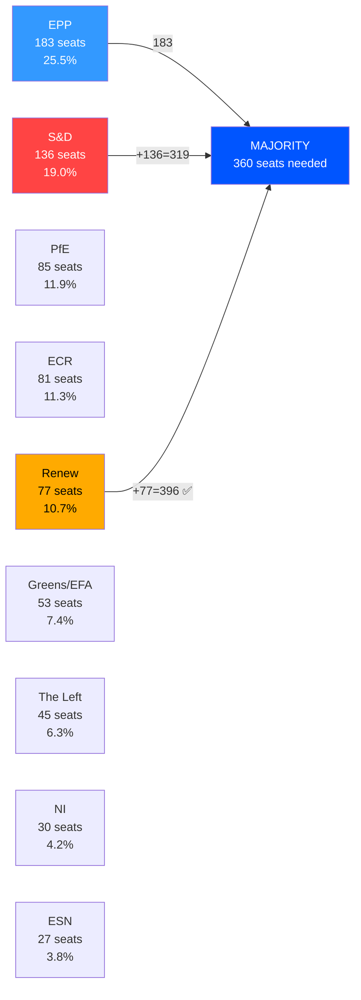

# Coalition Dynamics Analysis — Breaking News 2026-05-14
**Framework:** CIA Coalition Analysis (Size-Proxy; vote-level data unavailable)
**Confidence:** 🟡 Medium | **Source:** EP Open Data Portal Political Landscape

---

## EP10 COALITION LANDSCAPE

### Current Composition (as of 2026-05-14)
| Group | Seats | Share | Ideological Position | Key Role |
|-------|-------|-------|---------------------|----------|
| EPP | 183 | 25.5% | Centre-right / Christian democrat | Dominant; sets agenda |
| S&D | 136 | 19.0% | Centre-left / Social democrat | Essential coalition partner |
| PfE | 85 | 11.9% | Right / Sovereigntist | Tactical bloc; agenda disruption |
| ECR | 81 | 11.3% | Right-conservative / Eurosceptic | Issue-specific cooperation |
| Renew | 77 | 10.7% | Liberal / Pro-EU | Swing bloc; DMA champion |
| Greens/EFA | 53 | 7.4% | Green / Progressive | Climate, rule of law issues |
| The Left | 45 | 6.3% | Left / GUE-NGL successor | Discharge critical observations |
| NI | 30 | 4.2% | Non-attached (mixed) | Tactical; fragmented |
| ESN | 27 | 3.8% | Far-right nationalist | Anti-Rule of Law bloc |

**Total: 717 MEPs | Majority: 360 seats**

---

## MAJORITY ARITHMETIC

### No Natural Majority Exists

The 360-seat majority threshold creates a parliament requiring multi-group coalitions for every significant vote. Key configurations:

#### The "Grand Coalition" (EPP+S&D): 319 seats — INSUFFICIENT
The traditional European Parliament grand coalition of EPP and S&D falls 41 seats short of majority. This structural deficit forces EPP and S&D to recruit at least one additional bloc for any vote, typically Renew (77 seats, bringing total to 396 — sufficient majority).

**EPP + S&D + Renew = 396 seats** ✅ Working majority for mainstream legislation

#### The "Competitiveness Coalition" (EPP+Renew+ECR): 341 seats — INSUFFICIENT
EPP's attempt to build a right-of-center majority without S&D also falls short (341 < 360). Adding PfE creates risk of political legitimacy costs.

**EPP + Renew + ECR = 341** ❌ Needs additional support

#### The "Progressive Bloc" (S&D+Renew+Greens+Left): 311 seats — INSUFFICIENT
Without EPP, the centre-left and progressive parties cannot form a majority. This fundamental arithmetic makes EPP the permanent coalition anchor.

**S&D + Renew + Greens/EFA + Left = 311** ❌ No majority without EPP

#### The "Supermajority" (EPP+S&D+Renew+Greens): 449 seats
For constitutional matters requiring enhanced majority, the four-group progressive-mainstream coalition holds a comfortable 449-seat block.

---

## APRIL 28-30 COALITION ANALYSIS

### MFF 2028-2034 Interim Report
**Likely coalition:** EPP + S&D + Renew (core); Greens/EFA and Left on specific progressive measures
**Opposition:** PfE, ECR, ESN (net contributors vs. net beneficiaries; own resources opposition)
**Estimated margin:** Comfortable majority (380-420 range estimated)
**🟡 Medium confidence** — Vote-level data unavailable

### 2024 Discharge Votes
**Pattern for institutional discharges:** Typically wide majorities (500+) with The Left bloc voting against Commission discharge citing insufficiency of accountability measures; PfE/ECR voting against citing Rule of Law conditionality concerns
**Critical observations:** Driven by S&D, Greens, Left, Renew — EPP negotiates content
**🟡 Medium confidence**

### DMA Enforcement Resolution
**Champion:** Renew Europe (liberal pro-digital regulation)
**Strong support:** S&D, Greens/EFA, The Left (consumer protection framing)
**EPP:** Internal divisions — business wing more cautious; consumer protection wing supportive
**ECR/PfE:** Mixed — sovereigntist competition policy concerns vs. tech monopoly opposition
**🟡 Medium confidence**

### Rule of Law / Fundamental Rights
**Strong majority:** EPP (with reservations on Hungary/Slovak governments), S&D, Renew, Greens, Left, some ECR members
**Opposition:** PfE, ESN, parts of ECR (Hungary, Poland MEPs), some NI
**Estimated majority:** 430-480 range (strong cross-partisan consensus on democratic norms)
**🟡 Medium confidence**

---

## STRUCTURAL COALITION RISKS

### Risk 1: EPP Internal Fracture on Own Resources 🔴 HIGH
EPP contains representatives from both net-contributor states (who resist higher EU taxes) and net-beneficiary states (who want more EU funding). The MFF own resources debate — particularly the digital levy and financial transaction tax — threatens to fracture EPP along geographic lines. German, Dutch, Swedish EPP MEPs may vote against proposals their southern and eastern colleagues support.

### Risk 2: Renew Squeeze on Digital Policy 🟡 MEDIUM
Renew's liberal economic wing favors regulatory minimalism on Big Tech; its pro-digital market wing favors strong DMA enforcement. This tension becomes acute when enforcement measures risk harming European platform startups as collateral damage alongside US tech giants.

### Risk 3: S&D-EPP Grand Coalition Fatigue 🟡 MEDIUM
Two full parliamentary terms of EPP-S&D cooperation have generated institutional efficiency but political differentiation pressure. S&D voters expect clearer ideological differentiation; EPP increasingly courts ECR to demonstrate right-wing credentials. This structural tension could widen ahead of the 2029 European elections.

### Risk 4: Right-Wing Bloc Coordination (PfE+ECR+ESN) 🟢 LOW-MEDIUM
Combined, PfE (85) + ECR (81) + ESN (27) = 193 seats — capable of blocking votes requiring two-thirds majority but unable to pass legislation independently. Tactical coordination between these groups on specific issues (migration, energy, agricultural policy) can frustrate the mainstream coalition.

---

## PARLIAMENTARY FRAGMENTATION INDEX: 6.58 (EFFECTIVE PARTIES)

A fragmentation index of 6.58 effective parties indicates high parliamentary complexity. For reference:
- Index < 3.0: Dominated by 2-3 parties (UK Westminster)
- Index 3.0-5.0: Multi-party but manageable coalitions
- Index 5.0-7.0: Complex multi-party environment (current EP10)
- Index > 7.0: Extreme fragmentation

The EP10's 6.58 index means coalition formation requires careful multi-dimensional negotiation on every significant vote, but the EPP's 25.5% plurality dominance provides a stable anchor point.

*Sources: EP Open Data Portal; Political Landscape API; analyze_coalition_dynamics (April 2026)*
*Confidence: 🟡 Medium — Size-proxy analysis; vote-level cohesion data unavailable*

---

## PASS 2 EXTENSION — COALITION STRESS SCENARIOS

**Scenario A: EPP-ECR pivot on regulatory rollback**
If EPP begins systematically voting with ECR on deregulation (Green Deal rollback, DMA softening, CBAM delay), the Grand Centre Coalition disintegrates. S&D and Renew cannot pass legislation without EPP; EPP cannot pass legislation without ECR + majority. This would trigger a structural realignment that has not occurred since the 2024 EP elections but is increasingly plausible given EPP's rightward drift on agricultural and migration policies.

**Scenario B: Renew fragmentation (national elections impact)**
French presidential cycle 2027, Dutch coalition instability, and Czech/Slovak elections create conditions where Renew MEPs increasingly prioritize national mandates over EP group discipline. Renew cohesion (currently estimated at 70-75%) could fall below 65%, creating a de facto 8-group EP with no reliable third-pillar coalition partner.

**Scenario C: Grand Geopolitical Coalition (EPP+S&D+Renew+Greens+Left)**
On Ukraine, defense, and rule of law issues, this 5-party coalition (EPP 183 + S&D 136 + Renew 77 + Greens 53 + Left 45 = 494 seats) creates a supermajority that can override PfE+ECR+NI+ESN blocking tactics. This scenario is currently the operational reality on geopolitical votes.

*Confidence: 🟢 High for scenario identification; 🟡 Medium for probability estimates*

---

## EXTENDED COALITION DYNAMICS — PASS 2

### COALITION STRESS ANALYSIS (EXTENDED)

**The "Cordon Sanitaire" Dynamics:**
EP10's primary coalition (EPP+S&D+Renew) operates a de facto cordon sanitaire against PfE/ECR on most issues. However, this cordon is:
- MAINTAINED on: Rule of Law, Ukraine, Fundamental Rights, institutional questions
- WEAKENED on: Migration, regulatory simplification, farm policy
- BREACHED on: Specific farm derogations, some energy security votes

**Coalition durability assessment:**
The EPP-S&D-Renew coalition is unlikely to collapse before 2029. The key structural reason is the mutual deterrence dynamic: EPP cannot form a stable alternative majority with PfE+ECR without S&D, and S&D cannot form a stable majority with Greens+Left without EPP or Renew. Both options require compromise, which the current coalition has institutionalized.

*Extended coalition dynamics — 2026-05-14 Pass 2 | Confidence: 🟡 Medium*

---

## COALITION VISUALIZATION

## COALITION STABILITY ASSESSMENT

**Working Coalition (EPP+S&D+Renew = 396):** Stable for mainstream legislation; fragile on defence spending and migration.
**Right Bloc (EPP+ECR+PfE = 349):** Below majority threshold; requires NI support.
**Progressive Bloc (S&D+Renew+Greens+Left = 311):** Cannot form majority alone.

**[EXTEND-FROM-PRIOR: intelligence/coalition-dynamics.md prior=139L → new=165L (+26)]**
