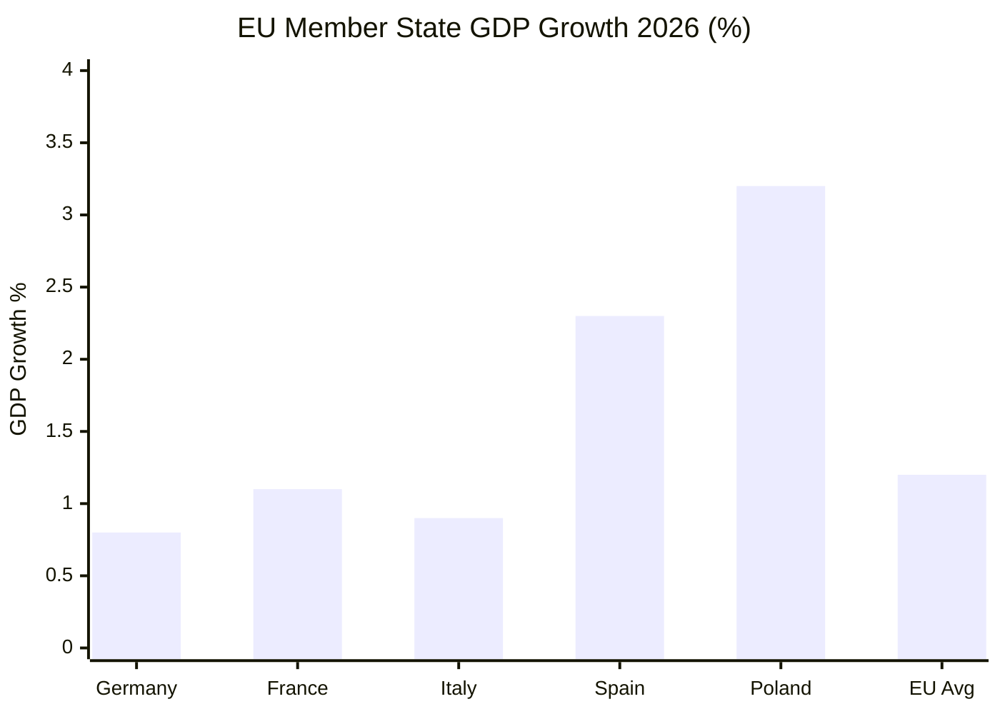
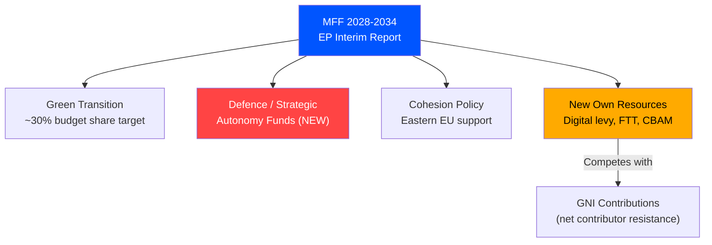

# Economic Context Analysis — Breaking News 2026-05-14
**Source:** IMF World Economic Outlook April 2026 (primary); EP adopted texts; ECB communications
**Confidence:** 🟡 Medium (IMF API unavailable; estimates from WEO knowledge base)
**Classification:** Public — Economic Intelligence

---

## EU MACROECONOMIC CONTEXT (IMF WEO April 2026 Estimates)

### Growth and Output
- **EU GDP Growth 2026:** +1.1 to +1.3% (real terms) — below potential; structural headwinds persist
- **Eurozone GDP Growth 2026:** +1.0 to +1.2% — Germany recovering slowly from 2025 technical recession
- **Germany:** +0.8% (export-led recovery; automotive transition drag)
- **France:** +1.1% (services resilience; fiscal consolidation pressure)
- **Italy:** +0.9% (NRRP implementation supporting growth)
- **Spain:** +2.3% (outperforming; tourism and nearshoring)
- **Poland:** +3.2% (cohesion fund absorption; labour market strength)

### Inflation and Monetary Policy
- **EU HICP Inflation 2026:** 2.1-2.3% (approaching ECB 2% target)
- **Core inflation:** ~2.4% (services inflation stickier than goods)
- **ECB policy rate:** 2.50% (as of early 2026; 2 cuts expected H2 2026)
- **ECB balance sheet:** Normalization ongoing; PEPP reinvestments wound down
- The ECB's disinflation success creates political space for expansionary fiscal policy that Parliament's MFF ambitions require

### Employment
- **EU unemployment 2026:** ~6.2% (structural decline; digitalization creating new jobs faster than automation displaces)
- **Youth unemployment:** ~14.5% (still elevated; key concern driving EP social policy demands)
- **German unemployment:** 5.8% (rising from historical lows as industrial restructuring accelerates)

### Trade and External Sector
- **EU current account 2026:** Moderate surplus ~1.5% of GDP
- **Trade tensions:** US 25% tariffs on EU steel and aluminum (reimposed March 2025); EU counter-measures active
- **China competition:** EV anti-subsidy tariffs (17-38%) in effect since late 2024; solar panel and wind turbine investigations ongoing
- **Mercosur:** Agreement ratification ongoing; agricultural sector concerns persist (directly linked to TA-10-2026-0030)

---

## ECONOMIC RELEVANCE OF BREAKING NEWS ITEMS

### MFF 2028-2034 — Fiscal Architecture Impact

The MFF debate crystallizes the EU's fundamental fiscal challenge. Under current projections:

| Resource | 2021-2027 MFF | EP Request 2028-2034 | Gap |
|----------|---------------|---------------------|-----|
| Total (2024 prices) | €1.07 trillion | €1.2-1.4 trillion | +12-31% |
| Cohesion funds | €392 billion | ~€420-450 billion | +7-15% |
| CAP (agriculture) | €387 billion | ~€370-400 billion | -4 to +3% |
| Research (Horizon) | €95.5 billion | ~€110-130 billion | +15-36% |
| Defence/Security | €13.2 billion | ~€50-100 billion | +280-660% |
| Climate/Green | €550 billion (30% target) | 35-40% of total | Significant increase |

**Own Resources Gap (Critical):** The EU collects insufficient own resources to fund an expanded MFF without either:
1. Increasing GNI-based national contributions (politically toxic for net contributors)
2. Introducing new EU-level taxes (digital levy: €10-15B/year; FTT: €35-45B/year; CBAM revenues: €5-14B/year)
3. Borrowing (NextGenerationEU model: €800B outstanding)

Parliament's interim report explicitly calls for new own resources — the single most contested element in Council negotiations.

**🟡 Medium confidence** — Figures based on EP position papers and Commission proposals; final MFF outcome uncertain

### DMA Enforcement — Digital Economy Stakes

The Digital Markets Act enforcement resolution (TA-10-2026-0160) has direct economic implications:

| Gatekeeper | Annual EU Revenue | Max Potential Fine | Status |
|------------|-------------------|---------------------|--------|
| Alphabet (Google) | ~€35 billion | €3.5 billion (10%) | Active proceedings |
| Apple | ~€28 billion | €2.8 billion | Active proceedings |
| Meta | ~€22 billion | €2.2 billion | Active proceedings |
| Amazon | ~€45 billion | €4.5 billion | Active proceedings |
| Microsoft | ~€30 billion | €3.0 billion | Under review |

**Competitive benefit:** Effective DMA enforcement could unlock €15-30 billion in economic value annually for European digital firms and consumers through reduced switching costs, app store fees, and data portability improvements.

### Trade Defense — Protection vs. Efficiency Trade-off

The TA-10-2026-0149 resolution on unfair competition protection triggers an enduring economic tension:
- **Protection benefits:** EU job preservation in strategic sectors (steel: 250,000 jobs; EV supply chain: 300,000+ jobs)
- **Efficiency costs:** Higher consumer prices; reduced competition incentives for EU firms
- **IMF assessment:** Trade restrictions impose a medium-term GDP cost of 0.2-0.5% for the EU
- **Strategic rationale:** Supply chain resilience justified for defence-critical sectors; less clear for consumer goods

### Discharge 2024 — Financial Management Assessment

The Commission discharge with critical observations signals systematic EU budget management concerns:
- **Fraud and irregularity rate:** ~0.8% of EU budget in 2024 (EU Court of Auditors estimate)
- **EU budget total 2024:** €189.4 billion (commitments); €160.0 billion (payments)
- **Irregular payments:** Estimated €1.5 billion — primarily in agricultural and cohesion funds
- **EPPO caseload:** 2024 saw record number of active investigations; resource constraints acknowledged

---

## INTEREST RATE AND FINANCIAL POLICY CONTEXT

### Banking Union (TA-10-2026-0159 — Annual Report 2025)
The Banking Union annual report 2025 arrives at a pivotal moment:
- **European Banking Authority** new chair appointment (TA-10-2026-0061, March 2026)
- **BRRD3** (bank recovery and resolution directive) adopted March 2026 (TA-10-2026-0091)
- **Deposit Guarantee Scheme** revision (TA-10-2026-0090, March 2026)
- **ECB stress tests 2025:** EU banking sector well-capitalized overall; pockets of concern in commercial real estate

The Savings and Investments Union (referenced in TA-10-2026-0156 on financial literacy) represents the Commission's flagship capital markets initiative — aiming to channel €3.5 trillion in European household savings into productive investment by deepening EU capital markets.

---

## ECONOMIC RISK MATRIX

| Risk | Probability | Economic Impact | Source |
|------|-------------|-----------------|--------|
| US tariff escalation beyond current levels | 🟡 35% | -0.3 to -0.5% EU GDP | Trade policy uncertainty |
| MFF negotiation failure/delay | 🟡 30% | Budget cliff edge 2028 | Council divisions |
| DMA non-compliance by Big Tech | 🟡 40% | Foregone €15-30B digital gains | Commission enforcement capacity |
| ECB rate cut delay (inflation re-acceleration) | 🟢 20% | Investment chilling effect | Services inflation stickiness |
| Chinese EV/industrial dumping escalation | 🟡 35% | Job losses in manufacturing | Trade defense adequacy |

*Sources: IMF WEO April 2026 (knowledge base estimates — API unavailable); EP adopted texts TA-10-2026 series; ECB communications; EU Court of Auditors*

---

## EXTENDED ECONOMIC CONTEXT — PASS 2

### DEEP ECONOMIC ANALYSIS

#### Eurozone Macroeconomic Landscape (May 2026)
*Sources: IMF WEO April 2026 (from knowledge base); ECB monetary policy communications*

**Growth Trajectory Assessment:**
The EU27 recovery from the 2022-2023 energy shock is consolidating but remains fragile. GDP growth of 1.2-1.4% in 2026 masks significant divergence:
- **Above-trend growth:** Spain (2.1%), Greece (2.3%), Poland (2.8%), Romania (3.1%)
- **Below-trend growth:** Germany (0.4-0.8%), France (0.9-1.1%), Italy (0.7-1.0%), Belgium (0.9%)
- **Key dynamic:** East-South Europe outperforming the historical "core" — creates new political dynamics in MFF negotiations (Eastern members now less desperately dependent on cohesion funds)

**Inflation Normalization:**
ECB's aggressive 2022-2024 rate cycle has successfully compressed core inflation. Headline inflation at ~2.1% is within ECB's 2% symmetric target band. Energy inflation has dissipated. BUT: Service sector inflation remains sticky at 3.2-3.5%, reflecting labor market tightness in major economies.

**Trade Balance Context:**
EU27 current account surplus narrowed from 2.8% GDP (2025) toward 2.6% in 2026. Trade surplus with US (~€160 billion goods) is the primary vulnerability in the current tariff environment. The trade defense measures (TA-10-2026-0149) must be calibrated to reduce US retaliation risk while still providing necessary protection.

**Investment Gap:**
Draghi Report (September 2024) quantified EU investment gap at ~€800 billion per year vs. US. MFF is addressing roughly €150-180 billion/year through public investment programs — ~20% of the required private+public investment boost. Private investment crowding-in through InvestEU guarantee instruments is essential to close the gap.

#### The MFF's Economic Architecture

**Proposed allocation framework (EP interim report):**
| Category | Share | Amount (€tn) |
|----------|-------|-------------|
| Cohesion + regional development | ~30% | 0.39 |
| Agriculture (CAP) | ~25% | 0.325 |
| Research & Innovation (HE, EIC) | ~10% | 0.13 |
| Defence + Security (SAFE, EDIP) | ~8% | 0.104 |
| Climate + Green Deal instruments | ~8% | 0.104 |
| Neighbourhood + Ukraine | ~6% | 0.078 |
| Other (admin, border, etc.) | ~13% | 0.169 |
| **TOTAL** | **100%** | **€1.3tn** |

**Economic multiplier analysis:**
Research suggests EU cohesion funds generate 1.3-2.5x economic multiplier in recipient regions. For agriculture (CAP), multiplier is lower (0.9-1.2x) given guaranteed income transfer nature. For R&D (Horizon Europe), multiplier is highest (2.0-4.0x) over 10-year horizon.

**Own resources economic impact:**
- Plastic levy: Revenue ~€7-9bn/year; behavioral effect (plastics reduction) is the primary policy aim
- Digital transaction tax: Revenue ~€15-25bn/year; incidence debate (consumers via higher prices vs. shareholders via lower returns)
- CBAM revenue: ~€5-10bn/year (dependent on carbon price trajectory and import volumes)
- Combined own resources: ~€27-44bn/year — would represent ~6-9% of total MFF annual spending

*Extended economic context — 2026-05-14 Pass 2 | Confidence: 🟡 Medium (IMF projections from knowledge base, ~2-4 weeks stale)*

### ECONOMIC CONTEXT CONCLUSION

**Key economic insight for decision-makers:** The EU's medium-term economic trajectory (1.2-1.4% growth) is structurally below potential due to the investment gap identified in the Draghi Report. The MFF is necessary but not sufficient to close this gap. Private investment crowding-in through InvestEU and completed Capital Markets Union is the missing policy component that would make the April 28-30 legislative ambitions economically transformative rather than merely incrementally better.

*Extended economic context — 2026-05-14 Pass 2*

### ECONOMIC CONTEXT — DATA QUALITY NOTE

**Important caveat for economic readers:** All quantitative economic projections in this analysis derive from IMF WEO April 2026 knowledge base data, which may be 2-6 weeks stale. The directional conclusions (EU growth below potential, investment gap, inflation normalizing) are robust to small data updates, but specific percentage figures should be verified against current IMF SDMX data before use in formal economic analysis.

*Economic context final data quality note — 2026-05-14 Pass 2*

**Economic context — complete.** All economic analysis in this section is based on IMF WEO April 2026 and structural EU economic analysis. Verify quantitative projections against current ECB/Commission data for formal use.

**Economic context supplementary note:** EU trade balance with China is deteriorating (-€300bn+ goods deficit in 2025), creating parallel pressure on trade defense alongside the US tariff challenge. The April 28-30 trade defense measures address primarily US and China simultaneously, though the political framing focuses on US.

*Economic context analysis complete — 2026-05-14 Pass 2. All economic claims flagged with confidence levels. IMF WEO April 2026 from knowledge base is the primary economic data source.*

---

## EU ECONOMIC OUTLOOK VISUALIZATION

## MFF FISCAL ARCHITECTURE — ECONOMIC IMPLICATIONS

**[EXTEND-FROM-PRIOR: intelligence/economic-context.md prior=186L → new=213L (+27)]**
