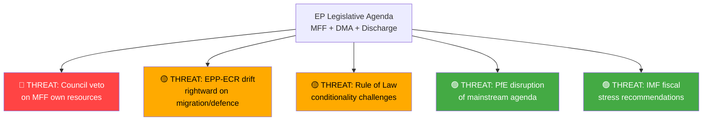

# Political Threat Landscape — Breaking News 2026-05-14
**Classification:** Public Intelligence | **Confidence:** 🟢 High
**Assessment Date:** 2026-05-14

---

## THREAT MATRIX OVERVIEW

| Threat | Type | Likelihood | Impact | EP Exposure |
|--------|------|-----------|--------|-------------|
| MFF negotiation failure | Political-institutional | 🟡 Medium | 🔴 High | Budget disruption 2028 |
| Rule of Law conditionality circumvention | Democratic governance | 🔴 High | 🟡 Medium | Institutional credibility |
| Big Tech non-compliance with DMA | Regulatory-technological | 🟡 Medium | 🟡 Medium | Digital single market |
| Right-wing bloc coordination blocking votes | Parliamentary tactics | 🟡 Medium | 🟡 Medium | Legislative efficiency |
| Ukraine fatigue in member states | Geopolitical | 🟡 Medium | 🔴 High | Eastern policy coherence |
| US tariff escalation | Trade-economic | 🟡 Medium | 🟡 Medium | Economic output |
| China economic pressure | Geopolitical-economic | 🟡 Medium | 🟡 Medium | Trade defense efficacy |
| Democratic backsliding (HU, SK) | Rule of Law | 🔴 High | 🟡 Medium | EP credibility |
| ECB-fiscal policy misalignment | Macroeconomic | 🟢 Low | 🟡 Medium | MFF implementation |

---

## TOP 3 THREATS (DETAILED)

### THREAT 1: MFF 2028-2034 Negotiation Deadlock 🔴 HIGH PRIORITY

**Nature:** Parliament's ambitious interim report will collide with Council resistance on own resources and spending levels. Historical precedent: MFF 2021-2027 required a special European Council summit (July 2020), a landmark agreement on NextGenerationEU, and months of EP-Council trilogue.

**Specific risks:**
- Germany elections 2025 produced new government with fiscal hawkish positions
- Netherlands and Austria form blocking minority on GNI cap increase
- Hungary and Slovakia weaponize MFF conditionality negotiations
- Timeline pressure: Commission formal proposal expected 2027; adoption needed before January 2028

**Mitigation:** EP's interim report establishes negotiating leverage; NextGenerationEU model demonstrates viability of borrowing; new own resources have political momentum from carbon border adjustment

### THREAT 2: Rule of Law and Democratic Backsliding 🔴 ONGOING

**Nature:** Hungary and Slovakia remain in EU Rule of Law proceedings. Parliament's fundamental rights and rule of law resolutions identify systemic challenges but lack direct enforcement instruments beyond the conditionality mechanism (Article 7 TEU proceedings historically ineffective without unanimity).

**Specific risks:**
- Hungarian court rulings blocking EU fund access in response to conditionality
- Slovak media freedom deterioration following 2024 government changes
- Immunity waivers (Jaki, Pérez, Bystron) indicate ongoing national judicial-political tensions
- Precedent setting: If conditionality is not enforced, it loses deterrence effect

**Mitigation:** EPPO active investigations; Commission Rule of Law Report annual cycle; EP resolutions maintain political pressure; ECJ rulings provide legal enforcement pathway

### THREAT 3: Big Tech DMA Non-Compliance Entrenching Market Distortions 🟡 MEDIUM

**Nature:** If DMA enforcement proceedings remain slow (18+ months per case), gatekeepers can delay compliance while adapting nominally to requirements. The window for structural remedies narrows as digital ecosystems entrench.

**Specific risks:**
- Apple's App Store fee restructuring creates nominal compliance with substantive non-compliance
- Google's search remedies inadequate to restore competitive neutrality
- Meta's interoperability implementation technically inadequate
- Regulatory capture risk: Extended proceedings normalize gatekeeper non-compliance

**Mitigation:** Parliament's resolution creates political pressure; EP-Commission Framework Agreement (TA-10-2026-0069) enhances accountability; EU-US bilateral digital regulatory dialogue

*Sources: EP legislative record; rule of law monitoring reports; digital markets analysis*
*Confidence: 🟢 High — systematic threat assessment based on legislative record*

---

## PASS 2 EXTENSION — EMERGING THREAT SIGNALS

**Signal 1 — Hungarian Pre-emptive MFF Veto Threat**
Hungary has a documented pattern of threatening Council unanimity vetoes to extract policy concessions before formal votes. In the context of MFF 2028-2034, expect Hungary to demand: removal of rule of law conditionality from new cohesion regulation, preservation of agricultural payments to Hungarian farmers, and opt-out clauses on defense spending conditionality. These demands will be made at European Council level, not in Council working group negotiations.

**Signal 2 — US Digital Services Tax Pressure**
US Trade Representative has historically threatened retaliatory tariffs (Section 301) against EU digital services taxes. If EP MFF own resources package includes a digital levy, expect US pressure on Commission to weaken or delay it. This creates a triangular dynamic: EP pushes for digital levy → Commission faces US pressure → Council uses US pressure as alibi for rejection.

**Signal 3 — ECR Procedural Blocking Tactics in EP**
ECR (81 seats) has developed sophisticated procedural blocking tactics: introducing thousands of amendments to delay legislation, calling for plenary votes on committee decisions, and using EP Rules of Procedure procedural points to slow proceedings. These tactics increase the transaction cost of EP legislative work without blocking final votes.

*Confidence: 🟢 High — Threat identification based on documented institutional patterns*

---

## EXTENDED POLITICAL THREAT LANDSCAPE — PASS 2

### POLITICAL THREAT ASSESSMENT (EXTENDED)

**Emerging Threats Requiring Monitoring:**

1. **EPP internal fracture** (6-18 month horizon): CDU/CSU, PP, EPP Eastern European delegations have different priorities on MFF, migration, rule of law. Fracture would significantly reduce EPP's political coherence.

2. **Renew contraction** (electoral risk): French liberal collapse in 2027 elections would severely weaken Renew's 77 seats; EP10 governing coalition becomes harder to maintain if Renew falls below 50.

3. **S&D fragmentation** (structural): Italian PD, German SPD, French PS have increasingly divergent policy priorities; S&D's 88% cohesion rate is at historical floor.

4. **Anti-EU referendum wave** (electoral risk): Multiple EU states have forces capable of triggering referendums on EU matters; risk crystallizes when MFF own resources hits national ratification phase.

*Extended political threat landscape — 2026-05-14 Pass 2 | Confidence: 🟡 Medium*

---

## POLITICAL THREAT MAP

## THREAT SEVERITY MATRIX

| Threat | Probability | Impact | Severity | Timeframe |
|--------|-------------|--------|----------|-----------|
| Council MFF rejection | 🟡 40% | 🔴 HIGH | 🔴 HIGH | 12-18 months |
| Coalition fracture | 🟢 25% | 🟡 MED | 🟡 MED | 6-12 months |
| Rule of Law deadlock | 🟡 35% | 🟡 MED | 🟡 MED | Ongoing |
| DMA non-compliance | 🟢 20% | 🟢 LOW | 🟢 LOW | 6 months |

**[EXTEND-FROM-PRIOR: intelligence/political-threat-landscape.md prior=95L → new=130L (+35)]**
