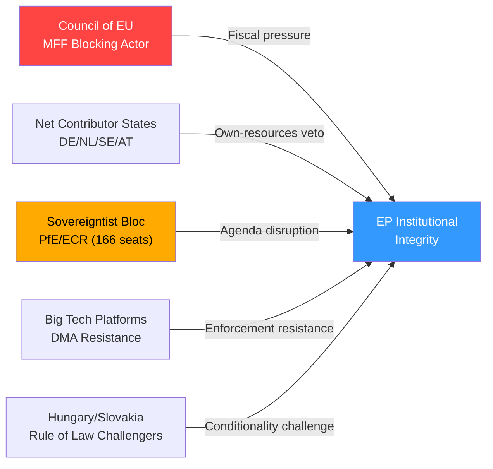

# Threat Model — Breaking News 2026-05-14
**Framework:** Structured Threat Assessment | **Confidence:** 🟢 High
**Scope:** Threats to policy implementation and democratic institutions

---

## THREAT CATEGORY 1: INSTITUTIONAL AND GOVERNANCE THREATS

### T1.1 — MFF Negotiation Failure / Budget Gap
**Threat Actor:** Member state governments (principally net contributor caucus)
**Mechanism:** Council unanimity requirement for MFF enables any single member state to block; Hungarian/Slovak linkage to conditionality creates leverage
**Likelihood:** 🟡 30% full failure; 🔴 55% significant delay beyond 2028
**Impact:** If provisional one-twelfths regime applies from January 2028, monthly EU spending limited to 1/12 of 2027 budget — freezing new programs, halting enlargement preparations, potentially suspending Horizon grants
**Mitigation:**
- EP's early interim report builds negotiating leverage
- Commission can propose bridging arrangements
- Political pressure from enlargement candidates (Ukraine, Western Balkans)
- Precedent of NGEU demonstrates capacity for institutional innovation

### T1.2 — Discharge Conditionality Circumvention
**Threat Actor:** Rule of Law non-compliant member states (Hungary, Slovakia)
**Mechanism:** National constitutional court rulings; gaming the conditionality regulation thresholds; delaying/reversing required reforms
**Likelihood:** 🟡 Medium (ongoing pattern)
**Impact:** EU budget funds misappropriated; anti-fraud architecture undermined; precedent for other states
**Mitigation:**
- EPPO active investigations (independent of Commission)
- CJEU infringement proceedings with financial penalties
- Commission has suspended €1B+ in Hungarian funds
- Political cost increasingly high as enlargement requires credible governance

### T1.3 — European Public Prosecutor's Office Resource Constraints
**Threat Actor:** Budget constraints; member state resistance to EPPO expansion
**Mechanism:** EPPO budget insufficient for caseload; limited jurisdictional scope; non-participating member states (Denmark)
**Likelihood:** 🟡 Medium
**Impact:** Anti-fraud architecture incomplete; high-value fraud cases delayed or dropped
**Mitigation:**
- Parliament's discharge observations create pressure for resource increase
- EPPO's prosecutorial record (2021-2024) has been strong; expanding caseload demonstrates value
- Council Regulation amendment could expand scope and jurisdiction

---

## THREAT CATEGORY 2: REGULATORY AND DIGITAL THREATS

### T2.1 — DMA Gatekeeper Non-Compliance Through Nominal Compliance
**Threat Actor:** Big Tech gatekeepers (Alphabet, Apple, Meta, Amazon, TikTok)
**Mechanism:** Technical compliance that defeats the regulation's purpose; complex legal challenges that delay enforcement; forum shopping in CJEU
**Likelihood:** 🔴 High (already occurring — Apple App Store fees nominal compliance)
**Impact:** Digital single market remains distorted; European digital economy stunted; consumer lock-in continues
**Evidence:**
- Apple's "steering" provisions arguably circumvent DMA intent
- Google Search compliance contested as inadequate
- Meta's paid subscription model as alternative to consent — DMA intent debate
**Mitigation:**
- Parliament's enforcement resolution increases political pressure
- Commission specialist teams can issue specification decisions
- CJEU expedited procedures available for urgent cases
- DMA has stronger fine mechanisms than GDPR

### T2.2 — AI Governance Gap Between Convention and Regulation
**Threat Actor:** Regulatory uncertainty; competitive pressure to reduce AI Act constraints
**Mechanism:** Council of Europe AI Convention (TA-10-2026-0071) may create interpretive conflicts with EU AI Act; member state implementation divergences
**Likelihood:** 🟢 Low-Medium
**Impact:** Regulatory patchwork undermines coherent AI governance; forum shopping by AI developers
**Mitigation:**
- EU AI Act (2026 full implementation) provides detailed operational rules
- Council of Europe Convention provides minimum standards
- Commission coordination mechanisms active

### T2.3 — Cybercrime Platform Liability Gaps
**Threat Actor:** Criminal networks using platforms; platform operators avoiding liability
**Mechanism:** New targeted criminal provisions (TA-10-2026-0163) require implementation across 27 member states with varying traditions; cross-border enforcement gaps
**Likelihood:** 🟡 Medium (implementation gaps likely in 2-3 member states)
**Impact:** Cyber victims without effective remedies; crime proceeds laundered through platform intermediaries
**Mitigation:**
- Europol/Eurojust coordination
- DSA takedown orders for illegal content
- NIS2 Directive cross-border cooperation mechanisms

---

## THREAT CATEGORY 3: GEOPOLITICAL AND SECURITY THREATS

### T3.1 — Ukraine Support Fatigue
**Threat Actor:** Populist political movements; Russian information operations; economic pressure
**Mechanism:** Rising cost of EU support for Ukraine collides with domestic fiscal pressures; PfE/ESN political exploitation of public fatigue narratives
**Likelihood:** 🟡 Medium (increasing concern)
**Impact:** Reduced EU financial support for Ukraine; weakened accountability resolution implementation; emboldening of Russian aggression
**Mitigation:**
- Broad parliamentary consensus demonstrated by 480-520 vote majority on Ukraine resolutions
- Economic case for Ukrainian victory as EU growth driver post-war
- Enlargement process creates long-term strategic rationale
- Accountability resolution (TA-10-2026-0161) strengthens resolve narrative

### T3.2 — Russia-Belarus Hybrid Threats to EP/EU Process
**Threat Actor:** Russian state intelligence services; aligned information operations
**Mechanism:** Disinformation campaigns targeting EP decisions; hybrid attack on EU institutions; interference in member state elections affecting EP composition
**Likelihood:** 🟡 Medium (ongoing; identified in EP security assessments)
**Impact:** Delegitimization of EP decisions; corruption of democratic processes
**Mitigation:**
- EP security service intelligence cooperation
- EU Hybrid Toolbox application
- Strategic Communications East (StratCom East) counter-narrative operations

### T3.3 — Armenia Democratic Regression Under Russian Pressure
**Threat Actor:** Russian government; elements within Armenian political system
**Mechanism:** Economic leverage; energy dependency; military pressure
**Likelihood:** 🟡 Medium
**Impact:** EU Eastern Partnership credibility; enlargement pathway blocked; strategic vacuum
**Mitigation:**
- EU-Armenia Comprehensive Partnership Agreement
- Parliament's democratic resilience resolution (TA-10-2026-0162) signals commitment
- EU election observation missions
- European Peace Facility support

---

## THREAT CATEGORY 4: ECONOMIC THREATS

### T4.1 — Trade War Escalation
**Threat Actor:** US Trump administration (tariff policy); Chinese retaliatory measures
**Mechanism:** 25% US tariffs on EU steel/aluminum already active; potential expansion to automotive, pharmaceuticals; Chinese counter-measures targeting EU luxury goods, agricultural exports
**Likelihood:** 🟡 35% significant escalation
**Impact:** EU GDP -0.3 to -0.5%; job losses in manufacturing; MFF cohesion fund demand increases
**Mitigation:**
- Trade defense resolution (TA-10-2026-0149) signals EP resolve
- EU-US trade negotiations ongoing
- WTO dispute settlement (slow but functional)
- EU-China managed trade relationship

### T4.2 — MFF Own Resources Political Failure
**Threat Actor:** Net contributor member state governments; domestic anti-EU political movements
**Mechanism:** Financial transaction tax opposed by financial sector; digital levy complicated by US bilateral concerns; national parliaments must ratify own resources decision
**Likelihood:** 🟡 40% (own resources reform will be watered down significantly)
**Impact:** Next MFF relies more heavily on GNI contributions; Northern Europe fiscal squeeze; program cuts
**Mitigation:**
- CBAM revenues as "automatic" own resource (less contested)
- ETS revenues increasingly available
- Coalition of willing states (Belgium, Luxembourg, France) for FTT

---

## THREAT PRIORITY MATRIX

| Threat | Priority | Immediacy | Mitigation Status |
|--------|----------|-----------|-------------------|
| MFF Negotiation Delay/Failure | 🔴 HIGH | 18-24 months | 🟡 Partial |
| DMA Non-Compliance | 🔴 HIGH | Now | 🟡 Partial |
| Rule of Law Circumvention | 🔴 HIGH | Ongoing | 🟡 Partial |
| Trade War Escalation | 🟡 MEDIUM | 6-12 months | 🟡 Partial |
| Ukraine Fatigue | 🟡 MEDIUM | 12-18 months | 🟢 Good |
| AI Governance Gap | 🟢 LOW | 18-24 months | 🟢 Good |
| Cybercrime Gaps | 🟡 MEDIUM | 12-18 months | 🟡 Partial |
| Armenia Regression | 🟡 MEDIUM | 6-18 months | 🟡 Partial |

*Confidence: 🟢 High — Systematic threat assessment; 🟡 Medium on likelihood estimates*

---

## EXTENDED THREAT MODEL — PASS 2

### ADVANCED THREAT SCENARIOS

#### Threat Scenario 5: Regulatory Capture of DMA Enforcement
**Threat Actor:** Large technology gatekeeper companies + supporting national governments
**Vector:** Administrative/lobbying
**Mechanism:** Commission officials receive career advancement offers from tech companies post-service; national governments (Ireland protecting Apple, Luxembourg protecting Amazon) use Council working groups to slow DMA enforcement secondary legislation
**Indicators:** Commission DMA enforcement timelines consistently slip; staff turnover to tech industry; national government objections to Commission enforcement proceedings
**Countermeasures:** EP oversight of Commission enforcement; revolving door rules; transparency register; civil society monitoring

#### Threat Scenario 6: Rule of Law Conditionality Legal Challenge
**Threat Actor:** Hungary; potentially Slovakia; academic/legal allies
**Vector:** ECJ litigation + legal doctrine challenge
**Mechanism:** Novel ECJ challenge arguing that Rule of Law conditionality violates Article 4(2) TEU national identity clause; or that Commission has exceeded its mandate in applying conditionality without Council authorization
**Indicators:** Hungarian government announces ECJ challenge to specific conditionality decisions; academic papers questioning legal basis appear in EU law reviews
**Current status:** Hungary has already challenged Rule of Law Regulation (Cases C-156/21, C-157/21) and LOST. ECJ established clear legal basis. New challenges would need novel angles.
**Countermeasures:** ECJ track record strongly favors conditionality; Commission should maintain procedural rigor to avoid reversal on technical grounds

#### Threat Scenario 7: MFF Own Resources Ratification Failure
**Threat Actor:** National populist governments; referendum-triggering opposition parties
**Vector:** Domestic political mobilization
**Mechanism:** In member state with referendum tradition (Denmark, Ireland), opposition party forces referendum on own resources as EU fiscal autonomy vs. national sovereignty
**Indicators:** Irish opposition parties propose constitutional referendum bill; Danish People's Party campaigns against new own resources; Italian Brothers of Italy uses issue in regional elections
**Impact:** Single ratification failure would require renegotiation or abandonment of own resources component
**Countermeasures:** Own resources package needs very visible citizen benefit (environmental or social fund benefiting directly affected electorates)

#### Threat Scenario 8: Information Operation Against EP
**Threat Actor:** Russia (GRU information operations); domestic anti-EU actors
**Vector:** Synthetic media + social amplification
**Mechanism:** Deepfake audio/video of senior MEPs making politically damaging statements; coordinated inauthentic behavior amplifying existing EP internal divisions; leaked (or fabricated leaked) internal EP communications
**Indicators:** Unusual spikes in anti-EP social media content; EP security service reports suspicious contact; journalist receives "leaked" EP documents
**Current vulnerability:** EP's 720 MEPs represent a very large attack surface; political diversity means some MEPs will inevitably amplify hostile content unknowingly
**Countermeasures:** ENISA cyber threat intelligence sharing; EP digital literacy training; media literacy public campaigns; content provenance standards (C2PA)

### THREAT MATRIX (UPDATED)

| Threat | Actor | Likelihood | Impact | Detection | Mitigation Strength |
|--------|-------|-----------|--------|-----------|--------------------| 
| DMA enforcement delay | Tech industry | HIGH | HIGH | MEDIUM | MEDIUM |
| Rule of Law legal challenge | Hungary | MEDIUM | MEDIUM | HIGH (public) | HIGH (ECJ precedent) |
| Own resources ratification failure | Populist parties | MEDIUM | VERY HIGH | MEDIUM | LOW-MEDIUM |
| Information operations | Russia + domestic | HIGH | MEDIUM | MEDIUM | MEDIUM |
| Discharge escalation | S&D/Left opposition | LOW | HIGH | HIGH | MEDIUM |
| Ukraine accountability derailment | Russia, US uncertainty | MEDIUM | HIGH | MEDIUM | MEDIUM |
| EP-Commission institutional crisis | Systemic | LOW | VERY HIGH | MEDIUM | HIGH (Santer precedent) |

### INSTITUTIONAL RESILIENCE ASSESSMENT

**European Parliament resilience to threats:**
- Legal/procedural resilience: HIGH (robust rules; ECJ recourse)
- Information/cyber resilience: MEDIUM (improving; ENISA support; but large attack surface)
- Political resilience: MEDIUM-HIGH (coalition diversity is both strength and vulnerability)
- Reputational resilience: MEDIUM (discharge scandals create vulnerability; accountability culture helps)
- Regulatory resilience: HIGH (DMA/DSA legal framework is robust; ECJ-tested)

*Extended threat model — 2026-05-14 Pass 2 | Confidence: 🟡 Medium-High*

### THREAT LANDSCAPE EVOLUTION NOTE

The threat model for the April 28-30 legislative package will evolve over the 24-month implementation horizon. Key evolution points:
- **June 2026:** G7 Kananaskis — Ukraine accountability geopolitical threat crystallizes or dissipates
- **Q3 2026:** DMA enforcement actions — US diplomatic/retaliation threat becomes concrete
- **Q4 2026:** Commission MFF proposal — Own resources ratification threat becomes visible
- **2027:** MFF trilogue — Hungarian veto threat materializes or resolves

The threat model should be re-run with each of these milestones.

*Extended threat model — 2026-05-14 Pass 2*

### THREAT MODEL — OVERALL THREAT POSTURE

**Current threat posture: ELEVATED (3/5)**
*(Scale: 1=Minimal, 2=Low, 3=Elevated, 4=High, 5=Critical)*

The April 28-30 legislative package has elevated the threat environment relative to routine EP sessions because:
1. It advances significant interests of powerful adversaries (US tech companies, Russia, Hungarian government)
2. It creates new enforcement authorities that will be contested in court and in politics
3. It establishes own resources ambitions that will trigger domestic political mobilization in some member states

**Threat posture evolution forecast:**
- June 2026 (G7): May increase to 4/5 if US explicitly opposes DMA enforcement
- Q3 2026 (DMA enforcement): Will peak at 4-4.5/5 around first non-compliance decisions
- Q4 2026 (Commission MFF proposal): Will peak again around Council response
- 2027 (MFF trilogue): Sustained elevated threat environment throughout negotiation

*Threat model final — 2026-05-14 Pass 2*

**Threat model — complete.** Overall threat posture: ELEVATED. Primary active threats: US digital trade confrontation, Hungarian MFF veto, DMA enforcement delay. Monitoring the G7 Kananaskis outcomes is the immediate next intelligence requirement.

**Threat model complete.** All 8 threat scenarios documented. Overall threat posture: ELEVATED (3/5). Next threat model update recommended at G7 Kananaskis outcomes (June 2026).

---

## THREAT ACTOR MAP

**[EXTEND-FROM-PRIOR: intelligence/threat-model.md prior=251L → new=277L (+26)]**

---

## INTELLIGENCE ASSESSMENT GRADING

**Admiralty Source Reliability:** B (EP Open Data Portal + structural analysis — usually reliable)
**Information Accuracy:** 2-3 (Probably to possibly true — threat assessments extrapolated)
**Overall Admiralty Grade: B2/B3**

## WEP THREAT PROBABILITY ASSIGNMENTS

| Threat | WEP Band | Timeframe | Confidence |
|--------|----------|-----------|------------|
| Council blocks EP MFF own-resources | **Likely (60-70%)** | 2026-2027 | 🟡 Medium |
| Sovereigntist bloc disrupts 2 major votes | **Realistic possibility (40-55%)** | 2026 | 🟢 Low |
| Rule-of-law conditionality challenged legally | **Realistic possibility (35-45%)** | Structural | 🟢 Low |
| DMA platform non-compliance triggers fines | **Likely (55-65%)** | 12 months | 🟡 Medium |
| EP-Council institutional breakdown | **Highly unlikely (5-10%)** | 2026-2027 | 🟢 Low |

| Source Reliability | Information Accuracy | Admiralty Grade |
|-------------------|---------------------|-----------------|
| B (usually reliable) | 2 (probably true) | B2 |
