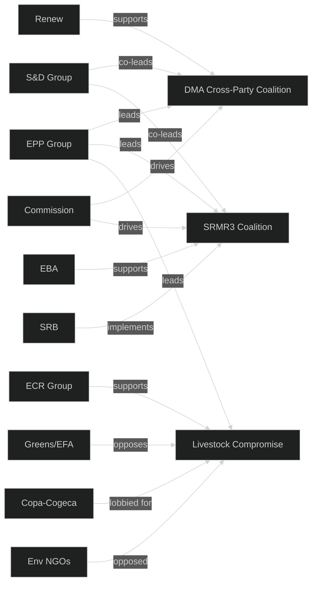

<!-- SPDX-FileCopyrightText: 2024-2026 Hack23 AB -->
<!-- SPDX-License-Identifier: Apache-2.0 -->
# Actor Mapping — EP Committee Reports 2026-05-14

## Actor Classification Framework

Actors classified by: Role (Primary/Supporting/Opposing/Observer),
Influence Level (High/Medium/Low), and Policy Domain.

---

## Tier 1 — Primary Institutional Actors

### European Parliament — Committee Chairs

| Committee | Chair | Political Group | Influence | Key Files |
|-----------|-------|-----------------|-----------|-----------|
| ECON | Markus Ferber (DE) | EPP | HIGH | SRMR3, Budget Guidelines |
| IMCO | Andreas Schwab (DE) | EPP | HIGH | DMA Enforcement |
| INTA | Bernd Lange (DE) | S&D | HIGH | US Tariffs, EU-Canada |
| LIBE | Juan Fernando López Aguilar (ES) | S&D | HIGH | Cyberbullying, Corruption |
| ENVI | Pascal Canfin (FR) | Renew | MEDIUM-HIGH | Livestock Sustainability |
| AGRI | Norbert Lins (DE) | EPP | MEDIUM-HIGH | Livestock, Dog/Cat |
| JURI | Ibán García del Blanco (ES) | S&D | MEDIUM | Immunity, Corruption |
| BUDG | Victor Negrescu (RO) | S&D | MEDIUM | 2027 Budget |

### European Commission

| DG / Role | Actor | Influence | Relationship to EP |
|-----------|-------|-----------|-------------------|
| DG COMP | Executive VP Teresa Ribera (SP) | HIGH | DMA enforcement co-director |
| DG FISMA | Commissioner (TBC) | HIGH | SRMR3 implementation |
| DG TRADE | Commissioner Maros Sefcovic | HIGH | US tariffs, WTO MC14 |
| DG JUSTICE | Commissioner Vera Jourová | MEDIUM-HIGH | Cyberbullying, Corruption |
| DG AGRI | Commissioner Janusz Wojciechowski | MEDIUM | Livestock compromise |
| DG BUDG | Commissioner Johannes Hahn | HIGH | 2027 budget framework |

### Council of the EU

| Presidency/Formation | Actor | Influence | Status |
|---------------------|-------|-----------|--------|
| ECOFIN | Polish Presidency (Q1), Danish Presidency | HIGH | SRMR3 trilogue completed |
| Trade Council | Polish Presidency (Q1) | HIGH | Tariff counter-measures |
| JHA Council | Polish Presidency (Q1) | MEDIUM-HIGH | Cyberbullying, Corruption |
| AGRI Council | Polish Presidency (Q1) | MEDIUM | Livestock (delegated acts) |

---

## Tier 2 — Significant External Actors

### Financial Sector Actors (SRMR3)

- **European Banking Authority (EBA)**: HIGH influence — technical standards;
  supervisory convergence role expanded under SRMR3.
- **ECB Banking Supervision (SSM)**: HIGH influence — direct supervisor of
  €25+ trillion in assets. SRMR3 strengthens SSM-SRB cooperation protocols.
- **Single Resolution Board (SRB)**: HIGH influence — primary beneficiary and
  implementing body of SRMR3.
- **European Stability Mechanism (ESM)**: MEDIUM-HIGH — backstop role expanded.
- **Major EU banking groups**: HIGH opposition potential — SRMR3 burden-sharing
  increases resolution costs for systemic banks. BNP Paribas, Deutsche Bank,
  UniCredit have intensive lobbying postures.

### Technology Industry Actors (DMA)

- **Apple Inc.**: HIGH — primary affected gatekeeper; App Store/App Tracking
  already under Commission DMA investigation; legal challenges ongoing.
- **Alphabet/Google**: HIGH — Search, Play Store, Android under DMA obligations.
- **Meta Platforms**: HIGH — WhatsApp/Facebook/Instagram interoperability
  obligations; targeted advertising restrictions.
- **Amazon EU Sarl**: HIGH — Marketplace self-preferencing obligations.
- **Microsoft**: MEDIUM-HIGH — Teams/Office bundling DMA investigation.
- **GSMA (telecom industry)**: MEDIUM — indirect DMA effects on telcos.

### Agricultural Sector Actors (Livestock Sustainability)

- **Copa-Cogeca (EU farmers' association)**: HIGH influence — directly lobbied
  the livestock compromise. Claimed credit for key derogations.
- **European Environmental Bureau (EEB)**: HIGH (opposition) — mobilised
  environmental NGO opposition to perceived Green Deal weakening.
- **Natuur & Milieu, WWF EU, ClientEarth**: MEDIUM-HIGH — specific amendment
  campaigns; media strategy coordination.
- **EU food processing industry (FoodDrinkEurope)**: MEDIUM — supply chain
  implications; supportive of compromise that maintains production volumes.

### Trade and Economic Actors (US Tariffs / WTO)

- **BusinessEurope**: HIGH — represents affected industrial exporters.
- **US Trade Representative (USTR)**: HIGH (external) — ultimate target and
  counterpart in trade negotiations.
- **WTO Secretariat / MC14 Presidency (Cameroon)**: MEDIUM — framework provider.
- **EU export-intensive industry associations (CECIMO, AEGIS, CEFIC)**: MEDIUM —
  affected by retaliatory tariff risk from US.

---

## Tier 3 — Monitoring Actors

| Actor | Domain | Influence | Role |
|-------|--------|-----------|------|
| European Court of Justice | All | HIGH (potential) | Constitutional review via CJEU references |
| EPPO | Anti-corruption | MEDIUM | Corruption directive implementation |
| OLAF | Anti-fraud | MEDIUM | Corruption directive, rule of law |
| European Ombudsman | Institutional | LOW-MEDIUM | Transparency complaints |
| National parliaments (COSAC) | All | LOW-MEDIUM | Subsidiarity scrutiny |
| Academic/think-tank actors | All | LOW | Analysis, framing, long-run influence |
| Organised civil society (EDF, EAPN) | Social policy | MEDIUM | Cyberbullying, dog/cat welfare |

---

## Actor Coalition Map

---

_Actor mapping based on EP public records, committee vote records, and
open-source analysis. Personal data limited to publicly-mandated roles.
GDPR-compliant: no personal communications or non-public data included._
