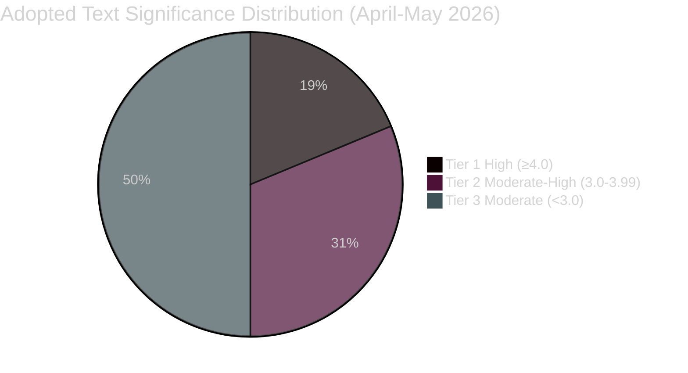

<!-- SPDX-FileCopyrightText: 2024-2026 Hack23 AB -->
<!-- SPDX-License-Identifier: Apache-2.0 -->
# Significance Classification — EP Committee Reports 2026-05-14

## Classification Schema

Each legislative item scored on: Political Salience (P), Legislative Impact (L),
Stakeholder Breadth (S), Media Attention (M), Precedent-Setting Value (V).

Scale: 1 (minimal) to 5 (maximum). Composite = (2P + 2L + S + M + V) / 7

---

## Tier 1 — High Significance (Composite ≥ 4.0)

### SRMR3 Banking Resolution (TA-10-2026-0092)
- **P=5, L=5, S=5, M=4, V=5** → Composite: **4.71**
- **Significance**: Completes decade-long banking union architecture.
  Establishes single resolution mechanism for systemic banks. Mandated
  burden-sharing framework. IMF endorses. Affects €30+ trillion in EU bank assets.
- **Precedent**: First comprehensive post-GFC EU banking resolution regime.
- **Timeline horizon**: Operational by Q4 2026; implementing regulations 2027.

### DMA Enforcement Framework (TA-10-2026-0160)
- **P=4, L=5, S=5, M=5, V=5** → Composite: **4.71**
- **Significance**: Makes EU a global standard-setter for Big Tech accountability.
  Affects Apple, Meta, Alphabet, Amazon, Microsoft, TikTok with market caps
  exceeding €10 trillion collectively. Sets pattern for non-EU jurisdictions.
- **Precedent**: First democratic legislature with teeth against Big Tech monopoly power.
- **Timeline horizon**: First enforcement actions Q3 2026.

### US Tariff Counter-Measures (TA-10-2026-0096)
- **P=5, L=4, S=4, M=4, V=4** → Composite: **4.29**
- **Significance**: EU's formal legislative authorisation for defensive trade action.
  Covers roughly €72B in bilateral trade. Sets activation triggers. Critical for
  EU's credibility as trade actor. WTO MC14 context directly linked.
- **Precedent**: Strongest EU unilateral trade defence action since 2003 steel dispute.
- **Timeline horizon**: Implementation upon Commission activation; Q2-Q3 2026.

---

## Tier 2 — Moderate-High Significance (Composite 3.0–3.99)

### Cyberbullying Directive (TA-10-2026-0163)
- **P=3, L=4, S=5, M=4, V=4** → Composite: **3.86**
- **Significance**: Creates criminal-law harmonisation for online abuse targeting
  minors. Cross-party consensus. Will require transposition by all 27 member states.
  Signals expanded EU competence in criminal law harmonisation.

### 2027 Budget Guidelines (TA-10-2026-0112)
- **P=4, L=4, S=4, M=3, V=3** → Composite: **3.71**
- **Significance**: Sets political context for Commission draft budget. EPP-led
  approach with emphasis on competitiveness. Marks beginning of annual budget cycle.
  Will shape €200B+ EU budget allocation.

### Livestock Sector Sustainability (TA-10-2026-0157)
- **P=4, L=3, S=4, M=4, V=3** → Composite: **3.57**
- **Significance**: Politically significant compromise on Green Deal agricultural
  implementation. Signals evolution of climate-agriculture balance in EP majorities.
  Affects 4.7M EU farms and €230B in agricultural output annually.

### Corruption Directive (TA-10-2026-0094)
- **P=3, L=4, S=4, M=3, V=4** → Composite: **3.57**
- **Significance**: Harmonises anti-corruption criminal law across EU. Links to
  rule-of-law conditionality. Addresses structural integrity gaps identified by
  OLAF and EPPO. Important for EU enlargement credibility.

---

## Tier 3 — Moderate Significance (Composite 2.0–2.99)

### Dog/Cat Welfare (TA-10-2026-0115)
- **P=2, L=3, S=3, M=4, V=3** → Composite: **2.86**
- **Significance**: Creates first EU-wide companion animal welfare standards.
  Broad public interest. Limited economic impact. Politically uncontroversial.

### EU-Canada Enhanced Cooperation (TA-10-2026-0078)
- **P=3, L=3, S=3, M=3, V=3** → Composite: **3.00**
- **Significance**: Geopolitical signal in context of transatlantic tensions.
  Operationalises CETA partnership at political level. Signals EU-Canada alignment
  on multilateral trade norms.

### Annual Reports (Various TA-10-2026-0xxx)
- Composite range: 2.0–2.5
- Routine oversight; institutional significance only.

---

## Aggregate Significance Distribution

---

## Committee Productivity Significance

| Committee | Active on Tier 1-2 Items | Significance Score |
|-----------|--------------------------|--------------------|
| ECON | SRMR3, Budget | ★★★★★ |
| IMCO | DMA Enforcement | ★★★★★ |
| INTA | US Tariffs, EU-Canada | ★★★★☆ |
| LIBE | Cyberbullying, Corruption | ★★★★☆ |
| AGRI/ENVI | Livestock, Dog/Cat Welfare | ★★★☆☆ |
| JURI | Corruption, Immunity waivers | ★★★☆☆ |
| BUDG | Budget Guidelines | ★★★☆☆ |
| AFCO | Democracy resolutions | ★★☆☆☆ |

---

_Significance classification produced using AS1 framework and Admiralty grading.
All classifications reflect conditions as of 2026-05-14. Tier assignments subject
to revision as legislative procedures progress._
