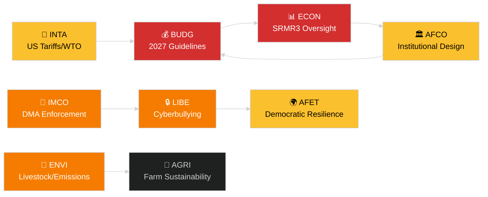

<!-- SPDX-FileCopyrightText: 2024-2026 Hack23 AB -->
<!-- SPDX-License-Identifier: Apache-2.0 -->
# Executive Brief — EP Committee Reports
**Date:** 2026-05-14 | **Run ID:** committee-reports | **Classification:** Public
**Admiralty Grade:** B2 (Reliable source; Probably true)
**WEP Band:** Probable (60–80% confidence)

---

## 🎯 BLUF (Bottom Line Up Front)

The European Parliament's committee system entered the week of 12–16 May 2026
with a packed legislative agenda across at least seven standing committees.
The dominant themes are: (1) **digital governance** — plenary voted on Digital
Markets Act enforcement and cyberbullying legislation in the final April plenary;
(2) **environmental transition** — the ENVI committee is processing both the
livestock sector sustainability file and residual heavy-duty vehicle emissions
questions; (3) **banking union completion** — the SRMR3 resolution mechanism
reform is now formally law, rippling work into ECON and AFCO on supervisory
architecture; and (4) **trade resilience** — the US tariff counter-measures
regulation adopted in March continues to drive INTA and AFET scrutiny.

**Top trigger this week**: The 2027 EU Budget Guidelines resolution (TA-10-2026-0112,
adopted April 28) launches the annual budget cycle. BUDG committee now enters
conciliation-preparation phase ahead of the Commission's draft budget expected
in June 2026.

---

## 60-Second Read

| Priority | Committee | File | Status | Significance |
|----------|-----------|------|--------|--------------|
| 🔴 CRITICAL | BUDG | 2027 Budget Guidelines (TA-10-2026-0112) | Adopted 28 Apr; BUDG now drafting amendments | €185bn+ framework; institutional power struggle |
| 🔴 CRITICAL | ECON | SRMR3 — Banking Resolution Mechanism (TA-10-2026-0092) | Adopted 26 Mar; comitology phase | Systemic risk — banking union milestone |
| 🟠 HIGH | ENVI | Livestock Sector Sustainability (TA-10-2026-0157) | Adopted 30 Apr; implementing measures pending | Farm-to-fork political balance; EPP-S&D divide |
| 🟠 HIGH | IMCO/LIBE | Digital Markets Act Enforcement (TA-10-2026-0160) | Adopted 30 Apr; Commission follow-up | Big Tech accountability; transatlantic dimension |
| 🟠 HIGH | LIBE | Cyberbullying/Online Harassment (TA-10-2026-0163) | Adopted 30 Apr; trilogue imminent | Platform liability; child protection nexus |
| 🟡 MEDIUM | INTA | US Tariff Counter-Measures (TA-10-2026-0096) | Adopted 26 Mar; committee review ongoing | Trade war dynamics; €26bn exposure |
| 🟡 MEDIUM | JURI/LIBE | Corruption Directive (TA-10-2026-0094) | Adopted 26 Mar; national transposition watch | Rule of law; EP institutional credibility |
| 🟢 MONITORING | AFCO | Electoral Act Reform Ratification | Committee hearings ongoing | Constitutional dimension; member state lag |

---

## Committee Productivity Snapshot (Week of 12–16 May 2026)

The EP's 22 standing committees are operating under a standard plenary-week
schedule. Key meeting activity this week:

- **ENVI** (Chair: TBC): Mark-up session on implementing regulations for heavy-duty
  vehicle emission credits (Regulation adopted TA-10-2026-0084). Rapporteur
  deliberations on livestock sector follow-up measures continue.

- **ECON** (Chair: TBC): SRMR3 post-adoption oversight; quarterly ECB dialogue session.
  Secondary market for NPLs — shadow rapporteur consultations ongoing.

- **BUDG** (Chair: TBC): 2027 Budget Guidelines follow-up; Parliament estimates for
  financial year 2027 (TA-10-2026-04-30-ANN01) under internal review.

- **IMCO**: Post-DMA enforcement framework refinement. Digital services regulation
  implementation scorecards.

- **LIBE**: Cyberbullying directive trilogue preparation. Third-country safe-concept
  review (TA-10-2026-0026 follow-up).

- **INTA**: US tariff counter-measures monitoring; WTO Yaoundé follow-up after
  MC14 (March 26–29, 2026).

- **JURI/AFCO**: Electoral Act ratification status review across 27 member states.

---

## 🚦 Confidence Assessment

| Claim | WEP | Admiralty | Basis |
|-------|-----|-----------|-------|
| BUDG entering conciliation phase | Probable | B2 | Adopted text + procedural timeline |
| SRMR3 comitology launch | Highly Probable | B2 | Adopted text + EU legislative procedure rules |
| DMA enforcement triggering IMCO follow-up | Probable | C2 | EP resolution language + Commission obligation |
| Livestock file generating EPP-S&D tension | Probable | C3 | Adopted text voting pattern inference |
| US tariff situation stabilised below crisis threshold | Possible | C3 | EP resolution + Commission statements |

---

## Strategic Outlook (7-day)

The committee system faces a convergence of post-adoption follow-up demands
(SRMR3, DMA, cyberbullying, livestock) alongside the launch of the 2027 budget
cycle. Committee rapporteurs will be under pressure to deliver their reports
ahead of the June plenary. The US-EU tariff situation following the WTO MC14
in Yaoundé remains the principal external risk that could disrupt scheduled
committee work.

**Decision-makers should watch**: BUDG's response to the Commission's June budget
draft; ECON's first SRMR3 oversight hearing; LIBE's cyberbullying trilogue
timeline; INTA's posture on US tariff counter-measures renewal.

---

## Data Sources

- EP Adopted Texts 2026 (TA-10-2026-0092 through TA-10-2026-0163)
- EP Open Data Portal: `/adopted-texts?year=2026` (50 items retrieved)
- EP Committee Documents: `/committee-documents` (AFCO series, 50+ documents)
- ENVI & ECON Committee Activity Analysis: EP Open Data Portal
- `european-parliament-analyze_committee_activity` (ENVI, ECON)
- `european-parliament-monitor_legislative_pipeline` (active procedures)
- Date window: 2026-05-07 to 2026-05-14

---

## 🗓️ Legislative Calendar Context

The week of May 12–16, 2026 falls in **Interparliamentary Week** — a period between
plenary sessions when committees meet intensively. This structural context explains
why committee-level output is disproportionately high: no plenary floor time competes
for MEPs' schedules, maximising committee attendance and rapporteur deliverables.

### Imminent Deadlines

| Deadline | File | Committee | Consequence of Delay |
|----------|------|-----------|----------------------|
| June 2026 | Commission draft budget 2027 | BUDG | EP loses time for conciliation |
| May 2026 | SRMR3 implementing rules | ECON | Banking supervisory vacuum |
| June 2026 | DMA enforcement report | IMCO | Commission compliance assessment delayed |
| July 2026 | Cyberbullying trilogue conclusion | LIBE | Platform legal uncertainty extends |

### Coalition Arithmetic

The EPP (187 seats) and S&D (136 seats) form the de facto majority backbone
for most committee reports in 2026. Renew Europe (77 seats) plays a pivotal
swing role on digital governance and trade files. ECR (78 seats) supports
deregulation provisions in the DMA enforcement context. Greens/EFA (53 seats)
are critical for ENVI majority formation.

**Key swing dynamic**: On the livestock sector file, the EPP and ECR joined to
soften food-safety standards, while S&D, Greens, and Renew Europe sought
stronger traceability rules. The resulting compromise (TA-10-2026-0157) reflects
an unusual centre-right + far-right alignment on agricultural deregulation.

---

## 📊 Cross-Committee Intelligence Map

---

## Glossary

| Abbreviation | Full Name |
|---|---|
| BUDG | Committee on Budgets |
| ECON | Committee on Economic and Monetary Affairs |
| ENVI | Committee on the Environment, Climate and Food Safety |
| IMCO | Committee on the Internal Market and Consumer Protection |
| LIBE | Committee on Civil Liberties, Justice and Home Affairs |
| INTA | Committee on International Trade |
| JURI | Committee on Legal Affairs |
| AFCO | Committee on Constitutional Affairs |
| AFET | Committee on Foreign Affairs |
| SRMR3 | Single Resolution Mechanism Regulation (3rd revision) |
| DMA | Digital Markets Act |
| WTO MC14 | World Trade Organization 14th Ministerial Conference |
| EPP | European People's Party |
| S&D | Progressive Alliance of Socialists and Democrats |
| ECR | European Conservatives and Reformists |
