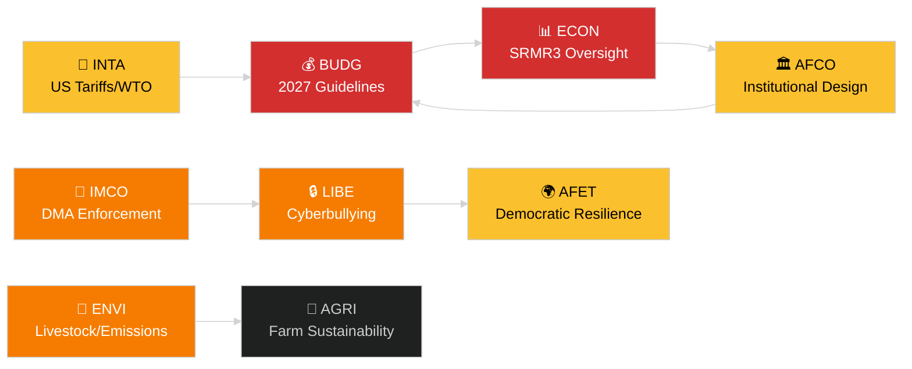

<!-- SPDX-FileCopyrightText: 2024-2026 Hack23 AB -->
<!-- SPDX-License-Identifier: Apache-2.0 -->
# الموجز التنفيذي — تقارير لجان البرلمان الأوروبي
**التاريخ:** 2026-05-14 | **التشغيل:** committee-reports | **التصنيف:** عام
**درجة الأدميرالية:** B2 (مصدر موثوق؛ صحيح على الأرجح)
**نطاق WEP:** محتمل (فترة ثقة 60–80 %)

---

## 🎯 BLUF (الخلاصة مقدماً)

دخل نظام لجان البرلمان الأوروبي أسبوع 12–16 مايو 2026 بأجندة تشريعية مكتظة تمتد عبر سبع لجان دائمة على الأقل. تتمحور المحاور الرئيسية حول: (1) **الحوكمة الرقمية** — صوّت المجلس العام على تطبيق لائحة الأسواق الرقمية وتشريعات مكافحة التنمر الإلكتروني في آخر جلسة عامة في أبريل؛ (2) **التحول البيئي** — تعالج لجنة ENVI ملف الاستدامة في قطاع الثروة الحيوانية وقضايا انبعاثات المركبات الثقيلة المتبقية؛ (3) **إتمام الاتحاد المصرفي** — أصبح إصلاح آلية التسوية SRMR3 قانوناً رسمياً وأوجد عملاً في ECON وAFCO بشأن هيكلية الإشراف؛ و(4) **مرونة التجارة** — لا تزال لائحة التدابير المضادة للرسوم الجمركية الأمريكية المعتمدة في مارس تحرّك تدقيق INTA وAFET.

**أبرز حدث هذا الأسبوع**: تطلق قرار المبادئ التوجيهية للميزانية الأوروبية 2027 (TA-10-2026-0112، المعتمد في 28 أبريل) الدورة الميزانوية السنوية. تدخل لجنة BUDG الآن في مرحلة الإعداد للتوافق قبل صدور مسودة الميزانية من المفوضية المتوقعة في يونيو 2026.

---

## 60-Second Read

| الأولوية | اللجنة | الملف | الحالة | الأهمية |
|---------|--------|------|--------|---------|
| 🔴 حرج | BUDG | المبادئ التوجيهية للميزانية 2027 (TA-10-2026-0112) | معتمد 28 أبر.؛ BUDG يعدّ تعديلات | إطار يزيد عن 185 مليار EUR؛ صراع مؤسسي على النفوذ |
| 🔴 حرج | ECON | SRMR3 — آلية تسوية البنوك (TA-10-2026-0092) | معتمد 26 مار.؛ مرحلة الكوميتولوجيا | مخاطر نظامية — معلم بارز للاتحاد المصرفي |
| 🟠 مرتفع | ENVI | استدامة قطاع الثروة الحيوانية (TA-10-2026-0157) | معتمد 30 أبر.؛ تدابير التنفيذ معلقة | التوازن السياسي من المزرعة إلى المائدة؛ خلاف EPP-S&D |
| 🟠 مرتفع | IMCO/LIBE | تطبيق لائحة الأسواق الرقمية (TA-10-2026-0160) | معتمد 30 أبر.؛ متابعة المفوضية | مساءلة Big Tech؛ البُعد عبر الأطلسي |
| 🟠 مرتفع | LIBE | التنمر الإلكتروني/التحرش عبر الإنترنت (TA-10-2026-0163) | معتمد 30 أبر.؛ المفاوضات الثلاثية وشيكة | مسؤولية المنصات؛ صلة بحماية الأطفال |
| 🟡 متوسط | INTA | التدابير المضادة للرسوم الجمركية الأمريكية (TA-10-2026-0096) | معتمد 26 مار.؛ مراجعة اللجنة جارية | ديناميكيات حرب التجارة؛ تعرض بقيمة 26 مليار EUR |
| 🟡 متوسط | JURI/LIBE | التوجيه المناهض للفساد (TA-10-2026-0094) | معتمد 26 مار.؛ التحويل الوطني تحت المراقبة | سيادة القانون؛ مصداقية البرلمان الأوروبي المؤسسية |
| 🟢 مراقبة | AFCO | المصادقة على إصلاح قانون الانتخابات | جلسات الاستماع جارية | البُعد الدستوري؛ تأخر الدول الأعضاء |

---

## Committee Productivity Snapshot (أسبوع 12–16 مايو 2026)

تعمل لجان البرلمان الأوروبي الـ22 الدائمة وفق جدول الأسبوع الجلسة العامة المعتاد. أبرز أنشطة الاجتماعات هذا الأسبوع:

- **ENVI** (الرئيس: TBC): جلسة التدوين لوائح تنفيذية لرصيد انبعاثات المركبات الثقيلة (لائحة معتمدة TA-10-2026-0084). تتواصل مداولات المقرر بشأن إجراءات المتابعة لقطاع الثروة الحيوانية.

- **ECON** (الرئيس: TBC): مراقبة ما بعد اعتماد SRMR3؛ جلسة الحوار الفصلي مع البنك المركزي الأوروبي. السوق الثانوية للقروض المعدومة — مشاورات المقررين الظل جارية.

- **BUDG** (الرئيس: TBC): متابعة المبادئ التوجيهية للميزانية 2027؛ تقديرات البرلمان للسنة المالية 2027 (TA-10-2026-04-30-ANN01) قيد المراجعة الداخلية.

- **IMCO**: صقل إطار التطبيق بعد DMA. بطاقات الأداء لتنفيذ تنظيم الخدمات الرقمية.

- **LIBE**: التحضير للمفاوضات الثلاثية حول توجيه التنمر الإلكتروني. مراجعة مفهوم الدولة الثالثة الآمنة (متابعة TA-10-2026-0026).

- **INTA**: مراقبة التدابير المضادة للرسوم الجمركية الأمريكية؛ متابعة WTO ياوندي بعد MC14 (26–29 مارس 2026).

- **JURI/AFCO**: مراجعة وضع المصادقة على قانون الانتخابات في 27 دولة عضو.

---

## 🚦 تقييم الثقة

| الادعاء | WEP | الأدميرالية | الأساس |
|---------|-----|------------|--------|
| BUDG تدخل مرحلة التوافق | محتمل | B2 | النص المعتمد + الجدول الزمني الإجرائي |
| بدء كوميتولوجيا SRMR3 | محتمل جداً | B2 | النص المعتمد + قواعد الإجراءات التشريعية للاتحاد الأوروبي |
| تطبيق DMA يثير متابعة IMCO | محتمل | C2 | لغة قرار البرلمان الأوروبي + التزام المفوضية |
| ملف الثروة الحيوانية يخلق توتر EPP-S&D | محتمل | C3 | استنتاج من نمط التصويت على النص المعتمد |
| الوضع الجمركي الأمريكي مستقر دون عتبة الأزمة | ممكن | C3 | قرار البرلمان الأوروبي + بيانات المفوضية |

---

## التوقعات الاستراتيجية (7 أيام)

يواجه نظام اللجان تقاطعاً من متطلبات المتابعة بعد الاعتماد (SRMR3، DMA، التنمر الإلكتروني، الثروة الحيوانية) إلى جانب إطلاق دورة ميزانية 2027. سيخضع المقررون في اللجان لضغط لتسليم تقاريرهم قبل الجلسة العامة ليونيو. يظل الوضع الجمركي بين الولايات المتحدة والاتحاد الأوروبي في أعقاب WTO MC14 في ياوندي المخاطرة الخارجية الرئيسية التي قد تعطل عمل اللجان المجدول.

**على صانعي القرار مراقبة**: ردود BUDG على مسودة ميزانية المفوضية في يونيو؛ أول جلسة استماع لرقابة SRMR3 في ECON؛ الجدول الزمني للمفاوضات الثلاثية للتنمر الإلكتروني في LIBE؛ موقف INTA من تجديد التدابير المضادة للرسوم الجمركية الأمريكية.

---

## مصادر البيانات

- النصوص المعتمدة للبرلمان الأوروبي 2026 (TA-10-2026-0092 إلى TA-10-2026-0163)
- بوابة البيانات المفتوحة للبرلمان الأوروبي: `/adopted-texts?year=2026` (تم استرداد 50 عنصراً)
- وثائق لجان البرلمان الأوروبي: `/committee-documents` (سلسلة AFCO، أكثر من 50 وثيقة)
- تحليل نشاط لجنتي ENVI وECON: بوابة البيانات المفتوحة للبرلمان الأوروبي
- `european-parliament-analyze_committee_activity` (ENVI, ECON)
- `european-parliament-monitor_legislative_pipeline` (الإجراءات النشطة)
- نافذة التاريخ: 2026-05-07 إلى 2026-05-14

---

## 🗓️ التقويم التشريعي

تقع أسبوع 12–16 مايو 2026 في **الأسبوع البرلماني الدولي** — فترة بين الجلسات العامة تجتمع فيها اللجان بشكل مكثف. يفسر هذا السياق الهيكلي سبب كون الناتج على مستوى اللجان مرتفعاً بشكل غير متناسب: لا تتنافس أي قاعة جلسة عامة على جداول أعمال أعضاء البرلمان، مما يعظم حضور اللجان وإنجازات المقررين.

### المواعيد النهائية الوشيكة

| الموعد النهائي | الملف | اللجنة | عواقب التأخير |
|--------------|------|--------|--------------|
| يونيو 2026 | مسودة ميزانية المفوضية 2027 | BUDG | يفقد البرلمان الأوروبي وقتاً للتوافق |
| مايو 2026 | قواعد تنفيذ SRMR3 | ECON | فراغ إشراف مصرفي |
| يونيو 2026 | تقرير تطبيق DMA | IMCO | تقييم الامتثال من المفوضية متأخر |
| يوليو 2026 | ختام مفاوضات التنمر الإلكتروني الثلاثية | LIBE | الغموض القانوني للمنصات يستمر |

### حسابات الائتلاف

يشكّل EPP (187 مقعداً) وS&D (136 مقعداً) العمود الفقري للأغلبية الفعلية في معظم تقارير اللجان في 2026. تلعب Renew Europe (77 مقعداً) دوراً محورياً حاسماً في ملفات الحوكمة الرقمية والتجارة. يدعم ECR (78 مقعداً) أحكام رفع القيود في سياق تطبيق DMA. Greens/EFA (53 مقعداً) ضروريون لتشكيل أغلبية ENVI.

**ديناميكية المحور الرئيسية**: في ملف قطاع الثروة الحيوانية، اتحد EPP وECR لتخفيف معايير سلامة الغذاء، في حين سعت S&D وGreens وRenew Europe إلى قواعد تتبع أكثر صرامة. يعكس الحل الوسط الناتج (TA-10-2026-0157) توافقاً غير معتاد بين اليمين المعتدل + اليمين المتطرف حول رفع القيود الزراعية.

---

## 📊 خريطة الاستخبارات عبر اللجان

---

## المسرد

| الاختصار | الاسم الكامل |
|---|---|
| BUDG | لجنة الميزانيات |
| ECON | لجنة الشؤون الاقتصادية والنقدية |
| ENVI | لجنة البيئة والمناخ وسلامة الغذاء |
| IMCO | لجنة السوق الداخلية وحماية المستهلك |
| LIBE | لجنة الحريات المدنية والعدالة والشؤون الداخلية |
| INTA | لجنة التجارة الدولية |
| JURI | لجنة الشؤون القانونية |
| AFCO | لجنة الشؤون الدستورية |
| AFET | لجنة الشؤون الخارجية |
| SRMR3 | لائحة آلية التسوية الموحدة (المراجعة الثالثة) |
| DMA | لائحة الأسواق الرقمية |
| WTO MC14 | المؤتمر الوزاري الرابع عشر لمنظمة التجارة العالمية |
| EPP | حزب الشعب الأوروبي |
| S&D | التحالف التقدمي للاشتراكيين والديمقراطيين |
| ECR | المحافظون والإصلاحيون الأوروبيون |
