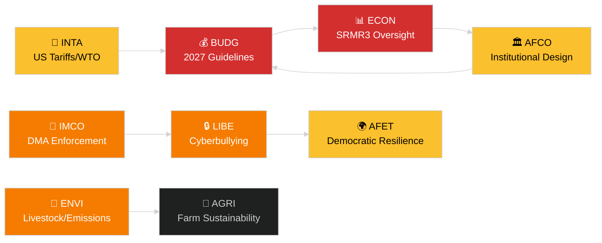

<!-- SPDX-FileCopyrightText: 2024-2026 Hack23 AB -->
<!-- SPDX-License-Identifier: Apache-2.0 -->
# Ledelsesoversigt — EP-udvalgsrapporter
**Dato:** 2026-05-14 | **Kørsel:** committee-reports | **Klassificering:** Offentlig
**Admiralitetsgrad:** B2 (Pålidelig kilde; Sandsynligvis sand)
**WEP-bånd:** Sandsynlig (60–80 % konfidensinterval)

---

## 🎯 BLUF (Bundlinje på forhånd)

Europa-Parlamentets udvalgsystem indledte ugen 12.–16. maj 2026 med en fyldt lovgivningsdagsorden på tværs af mindst syv stående udvalg. De dominerende temaer er: (1) **digital forvaltning** — plenarmødet stemte om håndhævelse af den digitale markedslov og lovgivning mod cybermobning på det sidste aprilplenarmøde; (2) **miljøomstilling** — ENVI-udvalget behandler både bæredygtighedsfilen for husdyrsektoren og resterende spørgsmål om udledning fra tunge køretøjer; (3) **færdiggørelse af bankunionen** — SRMR3-reformen af resolutionsmekanismen er nu formelt lov og skaber arbejde i ECON og AFCO om tilsynsarkitekturen; og (4) **handelsmæssig modstandsdygtighed** — forordningen om modforanstaltninger mod amerikanske toldsatser, der blev vedtaget i marts, fortsætter med at drive INTA og AFETs granskning.

**Vigtigste begivenhed denne uge**: Resolutionen om EU's budgetretningslinjer for 2027 (TA-10-2026-0112, vedtaget 28. april) indleder den årlige budgetcyklus. BUDG-udvalget er nu i forligelsesforberedende fase forud for Kommissionens udkast til budget, der forventes i juni 2026.

---

## 60-Second Read

| Prioritet | Udvalg | Fil | Status | Betydning |
|-----------|--------|-----|--------|-----------|
| 🔴 KRITISK | BUDG | 2027 Budgetretningslinjer (TA-10-2026-0112) | Vedtaget 28. apr; BUDG udformer ændringsforslag | 185+ mia. EUR ramme; institutionel magtkamp |
| 🔴 KRITISK | ECON | SRMR3 — Bankresolutionsmekanisme (TA-10-2026-0092) | Vedtaget 26. mar; komitologifase | Systemrisiko — bankunionens milepæl |
| 🟠 HØJ | ENVI | Bæredygtighed i husdyrsektoren (TA-10-2026-0157) | Vedtaget 30. apr; gennemførelsesforanstaltninger afventer | Jord-til-bord politisk balance; EPP-S&D-skillelinje |
| 🟠 HØJ | IMCO/LIBE | Håndhævelse af den digitale markedslov (TA-10-2026-0160) | Vedtaget 30. apr; Kommissionens opfølgning | Big Tech-ansvarlighed; transatlantisk dimension |
| 🟠 HØJ | LIBE | Cybermobning/online-chikane (TA-10-2026-0163) | Vedtaget 30. apr; trilog forestår | Platformsansvar; børnebeskyttelsesneksus |
| 🟡 MELLEM | INTA | Modforanstaltninger mod amerikanske toldsatser (TA-10-2026-0096) | Vedtaget 26. mar; udvalgsgennemgang igangværende | Handelskrigsdynamik; 26 mia. EUR eksponering |
| 🟡 MELLEM | JURI/LIBE | Korruptionsdirektiv (TA-10-2026-0094) | Vedtaget 26. mar; national gennemførelse overvåges | Retsstatsprincippet; EP's institutionelle troværdighed |
| 🟢 OVERVÅGNING | AFCO | Ratificering af valglovsreform | Udvalgshøringer igangværende | Konstitutionel dimension; forsinkelse i medlemsstaterne |

---

## Committee Productivity Snapshot (uge 12.–16. maj 2026)

EP's 22 stående udvalg arbejder efter en standard plenarmugeplanlægning. Vigtig mødeaktivitet denne uge:

- **ENVI** (formand: TBC): Markeringssession om gennemførelsesforordninger for emissionskreditter til tunge køretøjer (forordning vedtaget TA-10-2026-0084). Ordførerdrøftelser om opfølgningsforanstaltninger for husdyrsektoren fortsætter.

- **ECON** (formand: TBC): SRMR3 post-vedtagelsesovervågning; kvartalsvis ECB-dialogsession. Sekundærmarkedet for misligholdte lån — skyggeordførerkonsultationer igangværende.

- **BUDG** (formand: TBC): Opfølgning på budgetretningslinjer for 2027; Parlamentets overslag for regnskabsår 2027 (TA-10-2026-04-30-ANN01) under intern gennemgang.

- **IMCO**: Forfining af håndhævelsesramme efter DMA. Implementeringsscorecards for regulering af digitale tjenester.

- **LIBE**: Forberedelse af trilog om cybermobningsdirektivet. Gennemgang af konceptet om sikkert tredjeland (opfølgning af TA-10-2026-0026).

- **INTA**: Overvågning af modforanstaltninger mod amerikanske toldsatser; WTO Yaoundé-opfølgning efter MC14 (26.–29. marts 2026).

- **JURI/AFCO**: Statusgennemgang af ratificering af valgloven i 27 medlemsstater.

---

## 🚦 Konfidensvurdering

| Påstand | WEP | Admiralitet | Grundlag |
|---------|-----|-------------|----------|
| BUDG går ind i forligelsesfase | Sandsynlig | B2 | Vedtaget tekst + procedurens tidslinje |
| SRMR3 komitologistart | Meget sandsynlig | B2 | Vedtaget tekst + EU's lovgivningsprocedureregler |
| DMA-håndhævelse udløser IMCO-opfølgning | Sandsynlig | C2 | EP-resolutionssprog + Kommissionens forpligtelse |
| Husdyrsfilen skaber EPP-S&D-spænding | Sandsynlig | C3 | Vedtaget teksts afstemningmønster-slutning |
| Amerikansk toldsituation stabiliseret under krisetærskel | Mulig | C3 | EP-resolution + Kommissionsudtalelser |

---

## Strategisk udsigt (7 dage)

Udvalgsystemet står over for en konvergens af krav om opfølgning efter vedtagelse (SRMR3, DMA, cybermobning, husdyr) sideløbende med lanceringen af 2027-budgetcyklussen. Udvalgsordførere vil være under pres for at levere deres betænkninger forud for juniplenarmødet. Den amerikanskse toldsituation efter WTO's MC14 i Yaoundé er fortsat den primære eksterne risiko, der kan forstyrre planlagt udvalgsarbejde.

**Beslutningstagere bør overvåge**: BUDGs reaktion på Kommissionens budgetudkast i juni; ECONs første SRMR3-tilsynshøring; LIBEs cybermobningstrilogtidslinje; INTAs holdning til fornyelse af modforanstaltninger mod amerikanske toldsatser.

---

## Datakilder

- EP's vedtagne tekster 2026 (TA-10-2026-0092 til TA-10-2026-0163)
- EP's åbne dataportal: `/adopted-texts?year=2026` (50 elementer hentet)
- EP-udvalgsdokumenter: `/committee-documents` (AFCO-serien, 50+ dokumenter)
- ENVI & ECON-udvalgsaktivitetsanalyse: EP's åbne dataportal
- `european-parliament-analyze_committee_activity` (ENVI, ECON)
- `european-parliament-monitor_legislative_pipeline` (aktive procedurer)
- Datovindue: 2026-05-07 til 2026-05-14

---

## 🗓️ Lovgivningsmæssig kalender

Ugen 12.–16. maj 2026 falder i **Interparlamentarisk uge** — en periode mellem plenarmøderne, hvor udvalg mødes intensivt. Denne strukturelle kontekst forklarer, hvorfor output på udvalgsniveau er uforholdsmæssigt højt: ingen plenarsal konkurrerer om MEP'ernes tidsplaner, hvilket maksimerer udvalgsdeltagelse og ordførerresultater.

### Forestående frister

| Frist | Fil | Udvalg | Konsekvens af forsinkelse |
|-------|-----|--------|--------------------------|
| Juni 2026 | Kommissionens budgetudkast 2027 | BUDG | EP mister tid til forligelse |
| Maj 2026 | SRMR3-gennemførelsesregler | ECON | Banktilsynsvakuum |
| Juni 2026 | DMA-håndhævelsesrapport | IMCO | Kommissionens efterlevningsvurdering forsinkes |
| Juli 2026 | Afslutning af cybermobningstrilog | LIBE | Platformers retslige usikkerhed forlænges |

### Koalitionsaritmetik

EPP (187 pladser) og S&D (136 pladser) udgør den de facto majoritetsrygrad for de fleste udvalgsrapporter i 2026. Renew Europe (77 pladser) spiller en afgørende svingprolle på digitale styrings- og handelsfiler. ECR (78 pladser) støtter dereguleringsprovisionerne i DMA-håndhævelseskonteksten. Greens/EFA (53 pladser) er afgørende for ENVI-majoritetsdannelsen.

**Vigtig svingdynamik**: På husdyrssektorfilen sluttede EPP og ECR sig sammen for at blødgøre fødevaresikkerhedsstandarderne, mens S&D, Greens og Renew Europe søgte stærkere sporbarhedsregler. Det resulterende kompromis (TA-10-2026-0157) afspejler en usædvanlig center-højre + yderste højre-tilpasning om landbrugsderegulering.

---

## 📊 Tværudvalg efterretningskort

---

## Ordliste

| Forkortelse | Fuldt navn |
|---|---|
| BUDG | Budgetudvalget |
| ECON | Udvalget om Økonomi og Valutaforhold |
| ENVI | Udvalget om Miljø, Klima og Fødevaresikkerhed |
| IMCO | Udvalget om det Indre Marked og Forbrugerbeskyttelse |
| LIBE | Udvalget om Borgernes Rettigheder og Retlige og Indre Anliggender |
| INTA | Udvalget om International Handel |
| JURI | Retsudvalget |
| AFCO | Udvalget om Konstitutionelle Anliggender |
| AFET | Udenrigsudvalget |
| SRMR3 | Forordningen om den Fælles Afviklingsmekanisme (3. revision) |
| DMA | Den Digitale Markedslov |
| WTO MC14 | Verdenshandelsorganisationens 14. ministerkonference |
| EPP | Det Europæiske Folkeparti |
| S&D | Det Progressive Forbund af Socialdemokrater |
| ECR | De Europæiske Konservative og Reformister |
