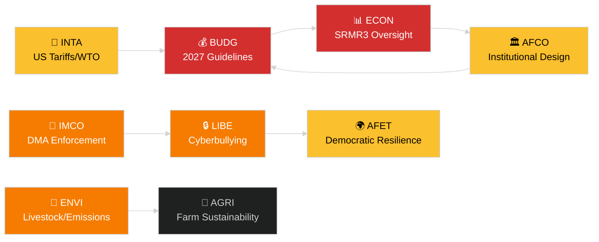

<!-- SPDX-FileCopyrightText: 2024-2026 Hack23 AB -->
<!-- SPDX-License-Identifier: Apache-2.0 -->
# Führungsübersicht — EP-Ausschussberichte
**Datum:** 2026-05-14 | **Lauf:** committee-reports | **Einstufung:** Öffentlich
**Admiralitätsstufe:** B2 (Zuverlässige Quelle; Wahrscheinlich wahr)
**WEP-Band:** Wahrscheinlich (60–80 % Konfidenzintervall)

---

## 🎯 BLUF (Kernaussage vorab)

Das Ausschusssystem des Europäischen Parlaments trat in die Woche vom 12. bis 16. Mai 2026 mit einer vollgepackten Gesetzgebungsagenda in mindestens sieben ständigen Ausschüssen ein. Die dominierenden Themen sind: (1) **digitale Governance** — das Plenum stimmte im letzten April-Plenum über die Durchsetzung des Gesetzes über digitale Märkte und Cybermobbing-Gesetzgebung ab; (2) **ökologischer Wandel** — der ENVI-Ausschuss bearbeitet sowohl die Nachhaltigkeitsdatei für den Viehsektor als auch offene Fragen zu Schadstoffemissionen schwerer Nutzfahrzeuge; (3) **Vollendung der Bankenunion** — die SRMR3-Reform des Abwicklungsmechanismus ist nun formell Gesetz und erzeugt Arbeitsaufwand in ECON und AFCO zur Aufsichtsarchitektur; und (4) **handelspolitische Widerstandsfähigkeit** — die im März angenommene Verordnung zu Gegenmaßnahmen gegen US-Zölle treibt weiterhin die Überprüfung durch INTA und AFET.

**Wichtigstes Ereignis dieser Woche**: Die Entschließung zu den EU-Haushaltsleitlinien 2027 (TA-10-2026-0112, angenommen am 28. April) eröffnet den jährlichen Haushaltszyklus. Der BUDG-Ausschuss tritt nun in die Vorbereitungsphase des Vermittlungsverfahrens ein, bevor im Juni 2026 der Kommissionsentwurf für den Haushalt erwartet wird.

---

## 60-Second Read

| Priorität | Ausschuss | Datei | Status | Bedeutung |
|-----------|-----------|-------|--------|-----------|
| 🔴 KRITISCH | BUDG | 2027 Haushaltsleitlinien (TA-10-2026-0112) | Angenommen 28. Apr.; BUDG erarbeitet Änderungsanträge | 185+ Mrd. EUR Rahmen; institutioneller Machtkampf |
| 🔴 KRITISCH | ECON | SRMR3 — Bankenabwicklungsmechanismus (TA-10-2026-0092) | Angenommen 26. März; Komitologiephase | Systemrisiko — Meilenstein der Bankenunion |
| 🟠 HOCH | ENVI | Nachhaltigkeit im Viehsektor (TA-10-2026-0157) | Angenommen 30. Apr.; Durchführungsmaßnahmen ausstehend | Farm-to-fork politisches Gleichgewicht; EPP-S&D-Spaltung |
| 🟠 HOCH | IMCO/LIBE | Durchsetzung des Gesetzes über digitale Märkte (TA-10-2026-0160) | Angenommen 30. Apr.; Kommissionsfolge | Big Tech-Rechenschaftspflicht; transatlantische Dimension |
| 🟠 HOCH | LIBE | Cybermobbing/Online-Belästigung (TA-10-2026-0163) | Angenommen 30. Apr.; Trilog unmittelbar bevorstehend | Plattformhaftung; Bezug zum Kinderschutz |
| 🟡 MITTEL | INTA | US-Zoll-Gegenmaßnahmen (TA-10-2026-0096) | Angenommen 26. März; Ausschussüberprüfung laufend | Handelskriegsdynamik; 26 Mrd. EUR Exposition |
| 🟡 MITTEL | JURI/LIBE | Korruptionsrichtlinie (TA-10-2026-0094) | Angenommen 26. März; nationale Umsetzung im Blick | Rechtsstaatlichkeit; institutionelle Glaubwürdigkeit des EP |
| 🟢 BEOBACHTUNG | AFCO | Ratifizierung der Wahlrechtsreform | Ausschussanhörungen laufend | Verfassungsdimension; Verzögerung in Mitgliedstaaten |

---

## Committee Productivity Snapshot (Woche 12.–16. Mai 2026)

Die 22 ständigen Ausschüsse des EP arbeiten nach einem Standard-Plenarwochenplan. Wichtige Sitzungsaktivitäten dieser Woche:

- **ENVI** (Vorsitz: TBC): Markierungssitzung zu Durchführungsverordnungen für Emissionsgutschriften schwerer Nutzfahrzeuge (Verordnung angenommen TA-10-2026-0084). Berichterstatter-Beratungen zu Folgemaßnahmen für den Viehsektor dauern an.

- **ECON** (Vorsitz: TBC): SRMR3-Überwachung nach Annahme; vierteljährliche EZB-Dialogsitzung. Sekundärmarkt für notleidende Kredite — Schattenberichterstatter-Konsultationen laufend.

- **BUDG** (Vorsitz: TBC): Folgemaßnahmen zu den Haushaltsleitlinien 2027; Parlamentsvoranschlag für Haushaltsjahr 2027 (TA-10-2026-04-30-ANN01) in interner Prüfung.

- **IMCO**: Verfeinerung des Durchsetzungsrahmens nach dem DMA. Bewertungskarten zur Umsetzung der Regulierung digitaler Dienste.

- **LIBE**: Trilog-Vorbereitung zur Cybermobbing-Richtlinie. Überprüfung des Konzepts sicherer Drittstaat (Folgemaßnahme TA-10-2026-0026).

- **INTA**: Überwachung der US-Zoll-Gegenmaßnahmen; WTO Yaoundé-Folgemaßnahme nach MC14 (26.–29. März 2026).

- **JURI/AFCO**: Statusüberprüfung der Ratifizierung des Wahlgesetzes in 27 Mitgliedstaaten.

---

## 🚦 Vertrauensbewertung

| Aussage | WEP | Admiralität | Grundlage |
|---------|-----|-------------|-----------|
| BUDG tritt in Vermittlungsphase ein | Wahrscheinlich | B2 | Angenommener Text + Verfahrenszeitplan |
| SRMR3-Komitologiestart | Sehr wahrscheinlich | B2 | Angenommener Text + EU-Gesetzgebungsverfahrensregeln |
| DMA-Durchsetzung löst IMCO-Folgemaßnahme aus | Wahrscheinlich | C2 | EP-Entschließungssprache + Kommissionsverpflichtung |
| Viehdatei erzeugt EPP-S&D-Spannungen | Wahrscheinlich | C3 | Schlussfolgerung aus dem Abstimmungsmuster des angenommenen Textes |
| US-Zollsituation unterhalb der Krisenschwelle stabilisiert | Möglich | C3 | EP-Entschließung + Kommissionserklärungen |

---

## Strategischer Ausblick (7 Tage)

Das Ausschusssystem steht vor einer Konvergenz von Anforderungen an Nachfolgetätigkeiten nach der Annahme (SRMR3, DMA, Cybermobbing, Vieh) parallel zum Start des Haushaltszyklus 2027. Ausschussberichterstatter werden unter Druck stehen, ihre Berichte vor dem Juni-Plenum vorzulegen. Die US-EU-Zollsituation nach dem WTO MC14 in Yaoundé bleibt das wesentlichste externe Risiko, das die geplante Ausschussarbeit stören könnte.

**Entscheidungsträger sollten beobachten**: BUDGs Reaktion auf den Kommissionsentwurf für den Haushalt im Juni; ECONs erste SRMR3-Überwachungsanhörung; LIBEs Zeitplan für den Cybermobbing-Trilog; INTAs Haltung zur Erneuerung der US-Zoll-Gegenmaßnahmen.

---

## Datenquellen

- EP-Angenommene Texte 2026 (TA-10-2026-0092 bis TA-10-2026-0163)
- EP Open Data Portal: `/adopted-texts?year=2026` (50 Einträge abgerufen)
- EP-Ausschussdokumente: `/committee-documents` (AFCO-Reihe, 50+ Dokumente)
- Analyse der Ausschussaktivität ENVI & ECON: EP Open Data Portal
- `european-parliament-analyze_committee_activity` (ENVI, ECON)
- `european-parliament-monitor_legislative_pipeline` (aktive Verfahren)
- Datumsfenster: 2026-05-07 bis 2026-05-14

---

## 🗓️ Legislativer Kalender

Die Woche vom 12. bis 16. Mai 2026 fällt in die **Interparlamentarische Woche** — einen Zeitraum zwischen Plenarsitzungen, in dem Ausschüsse intensiv tagen. Dieser strukturelle Kontext erklärt, warum die Ausschussproduktion unverhältnismäßig hoch ist: Kein Plenarsaal konkurriert um die Zeitpläne der Abgeordneten, was Ausschussanwesenheit und Berichterstatterleistungen maximiert.

### Unmittelbare Fristen

| Frist | Datei | Ausschuss | Konsequenz bei Verzögerung |
|-------|-------|-----------|---------------------------|
| Juni 2026 | Kommissionshaushaltsentwurf 2027 | BUDG | EP verliert Zeit für Vermittlung |
| Mai 2026 | SRMR3-Durchführungsregeln | ECON | Bankenaufsichtsvakuum |
| Juni 2026 | DMA-Durchsetzungsbericht | IMCO | Kommissions-Compliance-Bewertung verzögert |
| Juli 2026 | Abschluss des Cybermobbing-Trilogs | LIBE | Rechtliche Unsicherheit für Plattformen verlängert |

### Koalitionsarithmetik

EPP (187 Sitze) und S&D (136 Sitze) bilden das de facto Mehrheitsrückgrat für die meisten Ausschussberichte im Jahr 2026. Renew Europe (77 Sitze) spielt eine entscheidende Swing-Rolle bei Dateien zur digitalen Governance und zum Handel. ECR (78 Sitze) unterstützt Deregulierungsbestimmungen im DMA-Durchsetzungskontext. Greens/EFA (53 Sitze) sind entscheidend für die ENVI-Mehrheitsbildung.

**Wichtige Swing-Dynamik**: Bei der Viehdatei schlossen sich EPP und ECR zusammen, um Lebensmittelsicherheitsstandards abzuschwächen, während S&D, Greens und Renew Europe stärkere Rückverfolgbarkeitsregeln anstrebten. Der resultierende Kompromiss (TA-10-2026-0157) spiegelt eine ungewöhnliche Mitte-rechts + äußerst-rechts-Angleichung bei der Agrarderegulierung wider.

---

## 📊 Ausschussübergreifende Nachrichtenkarte

---

## Glossar

| Abkürzung | Vollständiger Name |
|---|---|
| BUDG | Haushaltsausschuss |
| ECON | Ausschuss für Wirtschaft und Währung |
| ENVI | Ausschuss für Umwelt, Klimawandel und Lebensmittelsicherheit |
| IMCO | Ausschuss für Binnenmarkt und Verbraucherschutz |
| LIBE | Ausschuss für bürgerliche Freiheiten, Justiz und Inneres |
| INTA | Ausschuss für internationalen Handel |
| JURI | Rechtsausschuss |
| AFCO | Ausschuss für konstitutionelle Fragen |
| AFET | Ausschuss für auswärtige Angelegenheiten |
| SRMR3 | Verordnung über den einheitlichen Abwicklungsmechanismus (3. Überarbeitung) |
| DMA | Gesetz über digitale Märkte |
| WTO MC14 | 14. Ministerkonferenz der Welthandelsorganisation |
| EPP | Europäische Volkspartei |
| S&D | Progressive Allianz der Sozialdemokraten |
| ECR | Europäische Konservative und Reformisten |
