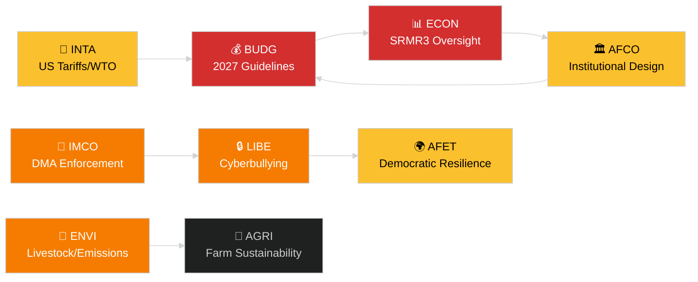

<!-- SPDX-FileCopyrightText: 2024-2026 Hack23 AB -->
<!-- SPDX-License-Identifier: Apache-2.0 -->
# Resumen ejecutivo — Informes de comisiones del PE
**Fecha:** 2026-05-14 | **Ejecución:** committee-reports | **Clasificación:** Público
**Grado de Almirantazgo:** B2 (Fuente fiable; Probablemente verdadero)
**Banda WEP:** Probable (60–80 % de intervalo de confianza)

---

## 🎯 BLUF (Conclusión al inicio)

El sistema de comisiones del Parlamento Europeo inició la semana del 12 al 16 de mayo de 2026 con una agenda legislativa cargada en al menos siete comisiones permanentes. Los temas dominantes son: (1) **gobernanza digital** — el Pleno votó sobre la aplicación del Reglamento de Mercados Digitales y la legislación contra el ciberacoso en el último Pleno de abril; (2) **transición medioambiental** — la comisión ENVI está procesando tanto el expediente de sostenibilidad del sector ganadero como las cuestiones residuales sobre emisiones de vehículos pesados; (3) **culminación de la unión bancaria** — la reforma SRMR3 del mecanismo de resolución es ahora formalmente ley y genera trabajo en ECON y AFCO sobre la arquitectura de supervisión; y (4) **resiliencia comercial** — el reglamento de contramedidas a los aranceles estadounidenses adoptado en marzo sigue impulsando el escrutinio de INTA y AFET.

**Principal detonante esta semana**: La resolución sobre las orientaciones presupuestarias de la UE para 2027 (TA-10-2026-0112, adoptada el 28 de abril) pone en marcha el ciclo presupuestario anual. La comisión BUDG entra ahora en fase de preparación de la conciliación antes del proyecto de presupuesto de la Comisión esperado para junio de 2026.

---

## 60-Second Read

| Prioridad | Comisión | Expediente | Estado | Importancia |
|-----------|---------|-----------|--------|------------|
| 🔴 CRÍTICO | BUDG | Orientaciones presupuestarias 2027 (TA-10-2026-0112) | Adoptado el 28 abr.; BUDG elabora enmiendas | Marco de 185+ Mmde EUR; lucha de poder institucional |
| 🔴 CRÍTICO | ECON | SRMR3 — Mecanismo de resolución bancaria (TA-10-2026-0092) | Adoptado el 26 mar.; fase de comitología | Riesgo sistémico — hito de la unión bancaria |
| 🟠 ALTO | ENVI | Sostenibilidad en el sector ganadero (TA-10-2026-0157) | Adoptado el 30 abr.; medidas de ejecución pendientes | Equilibrio político de la granja a la mesa; divergencia EPP-S&D |
| 🟠 ALTO | IMCO/LIBE | Aplicación del Reglamento de Mercados Digitales (TA-10-2026-0160) | Adoptado el 30 abr.; seguimiento de la Comisión | Responsabilidad Big Tech; dimensión transatlántica |
| 🟠 ALTO | LIBE | Ciberacoso/acoso en línea (TA-10-2026-0163) | Adoptado el 30 abr.; trílogo inminente | Responsabilidad de las plataformas; nexo con la protección de la infancia |
| 🟡 MEDIO | INTA | Contramedidas a los aranceles estadounidenses (TA-10-2026-0096) | Adoptado el 26 mar.; revisión en comisión en curso | Dinámica de guerra comercial; exposición de 26 Mmde EUR |
| 🟡 MEDIO | JURI/LIBE | Directiva anticorrupción (TA-10-2026-0094) | Adoptado el 26 mar.; transposición nacional vigilada | Estado de derecho; credibilidad institucional del PE |
| 🟢 SEGUIMIENTO | AFCO | Ratificación de la reforma de la ley electoral | Audiencias en comisión en curso | Dimensión constitucional; retraso en Estados miembros |

---

## Committee Productivity Snapshot (semana del 12 al 16 de mayo de 2026)

Las 22 comisiones permanentes del PE trabajan según un calendario estándar de semana plenaria. Actividades de reunión destacadas esta semana:

- **ENVI** (Presidencia: TBC): Sesión de marcado sobre reglamentos de ejecución de créditos de emisión para vehículos pesados (Reglamento adoptado TA-10-2026-0084). Las deliberaciones del ponente sobre medidas de seguimiento del sector ganadero continúan.

- **ECON** (Presidencia: TBC): Supervisión post-adopción de SRMR3; sesión de diálogo trimestral con el BCE. Mercado secundario de préstamos dudosos — consultas de ponente alternativo en curso.

- **BUDG** (Presidencia: TBC): Seguimiento de las orientaciones presupuestarias para 2027; estimaciones del Parlamento para el ejercicio 2027 (TA-10-2026-04-30-ANN01) en revisión interna.

- **IMCO**: Refinamiento del marco de aplicación post-DMA. Cuadros de mando de implementación de la regulación de servicios digitales.

- **LIBE**: Preparación del trílogo sobre la directiva de ciberacoso. Revisión del concepto de país tercero seguro (seguimiento de TA-10-2026-0026).

- **INTA**: Seguimiento de las contramedidas a los aranceles estadounidenses; seguimiento de la OMC Yaundé tras la CM14 (26–29 de marzo de 2026).

- **JURI/AFCO**: Revisión del estado de ratificación de la ley electoral en 27 Estados miembros.

---

## 🚦 Evaluación de confianza

| Afirmación | WEP | Almirantazgo | Base |
|------------|-----|-------------|------|
| BUDG entra en fase de conciliación | Probable | B2 | Texto adoptado + calendario procesal |
| Inicio de la comitología SRMR3 | Muy probable | B2 | Texto adoptado + normas del procedimiento legislativo de la UE |
| La aplicación del DMA desencadena el seguimiento de IMCO | Probable | C2 | Lenguaje de la resolución del PE + obligación de la Comisión |
| El expediente ganadero genera tensión EPP-S&D | Probable | C3 | Inferencia del patrón de votación del texto adoptado |
| Situación arancelaria estadounidense estabilizada por debajo del umbral de crisis | Posible | C3 | Resolución del PE + declaraciones de la Comisión |

---

## Perspectivas estratégicas (7 días)

El sistema de comisiones afronta una convergencia de demandas de seguimiento post-adopción (SRMR3, DMA, ciberacoso, ganadería) junto con el lanzamiento del ciclo presupuestario 2027. Los ponentes de las comisiones estarán bajo presión para entregar sus informes antes del Pleno de junio. La situación arancelaria entre EE.UU. y la UE tras la OMC CM14 en Yaundé sigue siendo el principal riesgo externo que podría interrumpir el trabajo planificado de las comisiones.

**Los responsables de tomar decisiones deben vigilar**: La respuesta de BUDG al proyecto de presupuesto de la Comisión en junio; la primera audiencia de supervisión SRMR3 de ECON; el calendario del trílogo de ciberacoso de LIBE; la posición de INTA sobre la renovación de las contramedidas a los aranceles estadounidenses.

---

## Fuentes de datos

- Textos adoptados del PE 2026 (TA-10-2026-0092 a TA-10-2026-0163)
- Portal Open Data del PE: `/adopted-texts?year=2026` (50 elementos recuperados)
- Documentos de comisiones del PE: `/committee-documents` (serie AFCO, 50+ documentos)
- Análisis de actividad de las comisiones ENVI y ECON: Portal Open Data del PE
- `european-parliament-analyze_committee_activity` (ENVI, ECON)
- `european-parliament-monitor_legislative_pipeline` (procedimientos activos)
- Ventana de fechas: 2026-05-07 al 2026-05-14

---

## 🗓️ Calendario legislativo

La semana del 12 al 16 de mayo de 2026 corresponde a la **Semana Interparlamentaria** — un período entre sesiones plenarias en el que las comisiones se reúnen de forma intensiva. Este contexto estructural explica por qué la producción a nivel de comisiones es desproporcionadamente alta: ningún hemiciclo compite por los horarios de los eurodiputados, lo que maximiza la asistencia a las comisiones y los resultados de los ponentes.

### Plazos inminentes

| Plazo | Expediente | Comisión | Consecuencia de retraso |
|-------|-----------|---------|------------------------|
| Junio 2026 | Proyecto de presupuesto 2027 de la Comisión | BUDG | El PE pierde tiempo para la conciliación |
| Mayo 2026 | Normas de ejecución SRMR3 | ECON | Vacío de supervisión bancaria |
| Junio 2026 | Informe de aplicación del DMA | IMCO | Evaluación de cumplimiento de la Comisión retrasada |
| Julio 2026 | Conclusión del trílogo de ciberacoso | LIBE | La incertidumbre jurídica de las plataformas se prolonga |

### Aritmética de coalición

El PPE (187 escaños) y el S&D (136 escaños) forman la columna vertebral de facto de la mayoría para la mayoría de los informes de comisión en 2026. Renew Europe (77 escaños) juega un papel fundamental de bisagra en los expedientes de gobernanza digital y comercio. El ECR (78 escaños) apoya las disposiciones de desregulación en el contexto de la aplicación del DMA. Los Verdes/ALE (53 escaños) son cruciales para la formación de mayoría en ENVI.

**Dinámica de bisagra clave**: En el expediente del sector ganadero, el PPE y el ECR se unieron para suavizar las normas de seguridad alimentaria, mientras que S&D, Verdes y Renew Europe buscaban normas de trazabilidad más estrictas. El compromiso resultante (TA-10-2026-0157) refleja una alineación inusual de centro-derecha + extrema derecha sobre la desregulación agrícola.

---

## 📊 Mapa de inteligencia inter-comisiones

---

## Glosario

| Abreviatura | Nombre completo |
|---|---|
| BUDG | Comisión de Presupuestos |
| ECON | Comisión de Asuntos Económicos y Monetarios |
| ENVI | Comisión de Medio Ambiente, Clima y Seguridad Alimentaria |
| IMCO | Comisión de Mercado Interior y Protección del Consumidor |
| LIBE | Comisión de Libertades Civiles, Justicia y Asuntos de Interior |
| INTA | Comisión de Comercio Internacional |
| JURI | Comisión de Asuntos Jurídicos |
| AFCO | Comisión de Asuntos Constitucionales |
| AFET | Comisión de Asuntos Exteriores |
| SRMR3 | Reglamento del Mecanismo Único de Resolución (3.ª revisión) |
| DMA | Reglamento de Mercados Digitales |
| WTO MC14 | 14.ª Conferencia Ministerial de la Organización Mundial del Comercio |
| EPP | Partido Popular Europeo |
| S&D | Alianza Progresista de Socialistas y Demócratas |
| ECR | Conservadores y Reformistas Europeos |
