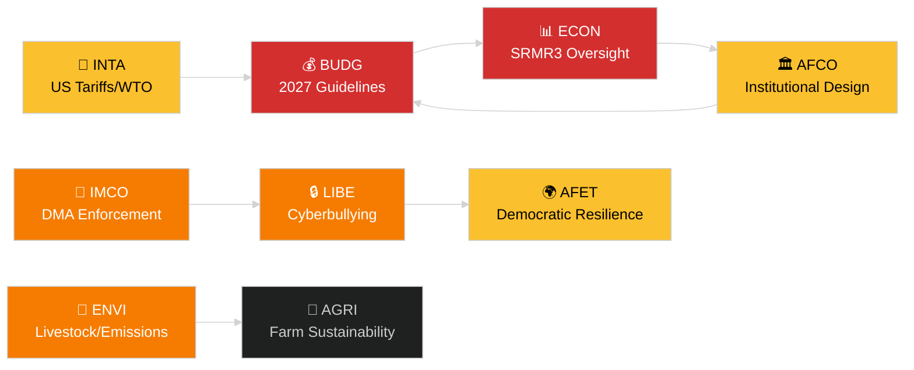

<!-- SPDX-FileCopyrightText: 2024-2026 Hack23 AB -->
<!-- SPDX-License-Identifier: Apache-2.0 -->
# Johtokatsaus — EP-valiokuntaraportit
**Päivämäärä:** 2026-05-14 | **Suoritus:** committee-reports | **Luokittelu:** Julkinen
**Admiraliteetti:** B2 (Luotettava lähde; Todennäköisesti totta)
**WEP-kaista:** Todennäköinen (60–80 % luottamusväli)

---

## 🎯 BLUF (Johtopäätös ensin)

Euroopan parlamentin valiokuntajärjestelmä aloitti viikon 12.–16. toukokuuta 2026 täyteen pakatulla lainsäädäntöagendalla vähintään seitsemässä pysyvässä valiokunnassa. Hallitsevat teemat ovat: (1) **digitaalinen hallinto** — täysistunto äänesti digitaalisia markkinoita koskevan lain toimeenpanosta ja verkkokiusaamista koskevasta lainsäädännöstä viimeisessä huhtikuun täysistunnossa; (2) **ympäristösiirtymä** — ENVI-valiokunta käsittelee sekä karjatalousalan kestävyystiedostoa että raskaiden ajoneuvojen jäljellä olevia päästökysymyksiä; (3) **pankkiunionin loppuunsaattaminen** — SRMR3-kriisinratkaisumekanismin uudistus on nyt virallisesti laki ja luo työtä ECON:lle ja AFCO:lle valvonta-arkkitehtuurin osalta; ja (4) **kaupan häiriönsietokyky** — maaliskuussa hyväksytty asetus Yhdysvaltain tulleja koskevista vastatoimista jatkaa INTA:n ja AFET:n tarkastelujen käynnistämistä.

**Tärkeimmät tapahtumat tällä viikolla**: EU:n vuoden 2027 budjettiohjeiden päätöslauselma (TA-10-2026-0112, hyväksytty 28. huhtikuuta) käynnistää vuotuisen budjettisyklin. BUDG-valiokunta siirtyy nyt sovittelun valmisteluvaiheeseen ennen kuin komissio julkaisee budjettiehdotuksensa kesäkuussa 2026.

---

## 60-Second Read

| Prioriteetti | Valiokunta | Tiedosto | Tila | Merkitys |
|--------------|-----------|---------|------|----------|
| 🔴 KRIITTINEN | BUDG | 2027 Budjettiohjeet (TA-10-2026-0112) | Hyväksytty 28. huhtik.; BUDG laatii tarkistuksia | 185+ mrd. EUR kehys; institutionaalinen valtataistelu |
| 🔴 KRIITTINEN | ECON | SRMR3 — Pankkien kriisinratkaisumekanismi (TA-10-2026-0092) | Hyväksytty 26. maalisk.; komitologiavaihe | Systeemiriski — pankkiunionin virstanpylväs |
| 🟠 KORKEA | ENVI | Karjatalousalan kestävyys (TA-10-2026-0157) | Hyväksytty 30. huhtik.; täytäntöönpanotoimenpiteet odottavat | Pellolta pöytään poliittinen tasapaino; EPP-S&D-jakolinja |
| 🟠 KORKEA | IMCO/LIBE | Digitaalisia markkinoita koskevan lain toimeenpano (TA-10-2026-0160) | Hyväksytty 30. huhtik.; komission seuranta | Big Tech -vastuullisuus; transatlanttinen ulottuvuus |
| 🟠 KORKEA | LIBE | Verkkokiusaaminen/online-häirintä (TA-10-2026-0163) | Hyväksytty 30. huhtik.; triloginki tulossa | Alustavastuullisuus; lasten suojelemisen yhteys |
| 🟡 KESKITASO | INTA | Yhdysvaltain tulleja koskevat vastatoimet (TA-10-2026-0096) | Hyväksytty 26. maalisk.; valiokunnan tarkastelu käynnissä | Kauppasodan dynamiikka; 26 mrd. EUR altistuminen |
| 🟡 KESKITASO | JURI/LIBE | Korruptiodirektiivi (TA-10-2026-0094) | Hyväksytty 26. maalisk.; kansallista implementointia seurataan | Oikeusvaltioperiaate; EP:n institutionaalinen uskottavuus |
| 🟢 SEURANTA | AFCO | Vaalilainsäädännön uudistuksen ratifiointi | Valiokunnan kuulemisia käynnissä | Perustuslaillinen ulottuvuus; jäsenvaltioiden viive |

---

## Committee Productivity Snapshot (viikko 12.–16. toukokuuta 2026)

EP:n 22 pysyvää valiokuntaa toimivat tavallisen täysistuntoviikon aikataulun mukaisesti. Tärkeät kokousaktiviteetit tällä viikolla:

- **ENVI** (puheenjohtaja: TBC): Merkintäistunto raskaiden ajoneuvojen päästöhyvitysten täytäntöönpanoasetuksista (asetus hyväksytty TA-10-2026-0084). Esittelijäneuvottelut karjatalousalan seurantatoimenpiteistä jatkuvat.

- **ECON** (puheenjohtaja: TBC): SRMR3 hyväksymisen jälkeinen valvonta; neljännesvuosittainen EKP-vuoropuheluistunto. NPL-sekundäärimarkkinat — varjoesittelijäkuulemiset käynnissä.

- **BUDG** (puheenjohtaja: TBC): Vuoden 2027 budjettiohjeiden seuranta; parlamentin arviot varainhoitovuodelle 2027 (TA-10-2026-04-30-ANN01) sisäisessä tarkastelussa.

- **IMCO**: DMA:n jälkeisen täytäntöönpanokehyksen tarkentaminen. Digitaalisten palveluiden sääntelyn toimeenpanon tuloskortti.

- **LIBE**: Verkkokiusaamisdirektiivin trilogin valmistelu. Turvallisen kolmannen maan käsitteen tarkastelu (TA-10-2026-0026 seuranta).

- **INTA**: Yhdysvaltain tulleja koskevien vastatoimien seuranta; WTO Yaoundén seuranta MC14:n jälkeen (26.–29. maaliskuuta 2026).

- **JURI/AFCO**: Vaalilainsäädännön ratifioinnin tila 27 jäsenvaltiossa.

---

## 🚦 Luottamusarviointi

| Väite | WEP | Admiraliteetti | Peruste |
|-------|-----|----------------|---------|
| BUDG siirtyy sovitteluvaiheeseen | Todennäköinen | B2 | Hyväksytty teksti + menettelyllinen aikataulu |
| SRMR3 komitologia käynnistyminen | Hyvin todennäköinen | B2 | Hyväksytty teksti + EU:n lainsäädäntömenettelysäännöt |
| DMA-täytäntöönpano käynnistää IMCO-seurannan | Todennäköinen | C2 | EP-päätöslauselman kieli + komission velvoite |
| Karjatalousjutu luo EPP-S&D-jännitystä | Todennäköinen | C3 | Hyväksytyn tekstin äänestyskaavapäätelmä |
| Yhdysvaltain tullit vakautunut kriisikynnyksen alapuolelle | Mahdollinen | C3 | EP-päätöslauselma + komission lausunnot |

---

## Strateginen näkymä (7 päivää)

Valiokuntajärjestelmä kohtaa konvergenssin hyväksymisen jälkeisistä seurantavaatimuksista (SRMR3, DMA, verkkokiusaaminen, karjatalous) samanaikaisesti vuoden 2027 budjettisyklin käynnistymisen kanssa. Valiokunnan esittelijät ovat paineessa toimittaa raporttinsa ennen kesäkuun täysistuntoa. Yhdysvaltain tullit WTO:n MC14:n jälkeen Yaoundéssa ovat edelleen ensisijainen ulkoinen riski, joka voi häiritä suunniteltua valiokuntien työtä.

**Päätöksentekijöiden tulisi seurata**: BUDG:n vastaus komission kesäkuun budjettiehdotukseen; ECON:n ensimmäinen SRMR3-valvontakuuleminen; LIBE:n verkkokiusaamistrilogi-aikataulu; INTA:n kanta Yhdysvaltain tulleja koskevien vastatoimien uusimiseen.

---

## Tietolähteet

- EP:n hyväksytyt tekstit 2026 (TA-10-2026-0092 – TA-10-2026-0163)
- EP:n avoin dataportti: `/adopted-texts?year=2026` (50 kohdetta haettu)
- EP:n valiokunnan asiakirjat: `/committee-documents` (AFCO-sarja, 50+ asiakirjaa)
- ENVI- ja ECON-valiokunnan aktiviteettianalyysi: EP:n avoin dataportti
- `european-parliament-analyze_committee_activity` (ENVI, ECON)
- `european-parliament-monitor_legislative_pipeline` (aktiiviset menettelyt)
- Päivämääräikkuna: 2026-05-07 – 2026-05-14

---

## 🗓️ Lainsäädäntökalenteri

Viikko 12.–16. toukokuuta 2026 sijoittuu **Interparlamentaariselle viikolle** — täysistuntojen väliselle jaksolle, jolloin valiokunnat kokoontuvat intensiivisesti. Tämä rakenteellinen konteksti selittää, miksi valiokuntatasoinen tuotos on suhteettoman korkea: mikään täysistunto ei kilpaile EP-jäsenten aikatauluista, mikä maksimoi valiokunnan osallistumisen ja esittelijöiden tulokset.

### Tulevat määräajat

| Määräaika | Tiedosto | Valiokunta | Viivästymisen seuraus |
|-----------|---------|-----------|----------------------|
| Kesäkuu 2026 | Komission budjettiehdotus 2027 | BUDG | EP menettää aikaa sovitteluun |
| Toukokuu 2026 | SRMR3 täytäntöönpanosäännöt | ECON | Pankkivalvonnan tyhjiö |
| Kesäkuu 2026 | DMA:n täytäntöönpanoraportti | IMCO | Komission vaatimustenmukaisuusarviointi viivästyy |
| Heinäkuu 2026 | Verkkokiusaamistrilogi päätökseen | LIBE | Alustojen oikeudellinen epävarmuus jatkuu |

### Koalitioaritmetiikka

EPP (187 paikkaa) ja S&D (136 paikkaa) muodostavat de facto enemmistön selkärangan useimmissa valiokuntaraporteissa vuonna 2026. Renew Europe (77 paikkaa) toimii ratkaisevana keinulautahahmona digitaalisen hallinnon ja kauppajutuissa. ECR (78 paikkaa) tukee purkusäädöksiä DMA:n täytäntöönpanokontekstissa. Greens/EFA (53 paikkaa) on ratkaiseva ENVI:n enemmistön muodostumisessa.

**Tärkeä heilahdus-dynamiikka**: Karjatalousalan tiedostossa EPP ja ECR liittyivät yhteen pehmentääkseen elintarviketurvallisuusstandardeja, kun taas S&D, Greens ja Renew Europe hakivat vahvempia jäljitettävyyssääntöjä. Tuloksena syntynyt kompromissi (TA-10-2026-0157) heijastaa epätavallista oikeisto- + äärioikeisto-linjautumista maatalouden sääntelyn purkamisen suhteen.

---

## 📊 Poikkivaliokuntainen tiedustelukartasto

---

## Sanasto

| Lyhenne | Koko nimi |
|---|---|
| BUDG | Budjettivaliokunta |
| ECON | Talous- ja raha-asioiden valiokunta |
| ENVI | Ympäristö-, ilmasto- ja elintarviketurvallisuusvaliokunta |
| IMCO | Sisämarkkina- ja kuluttajansuojavaliokunta |
| LIBE | Kansalaisvapauksien sekä oikeus- ja sisäasioiden valiokunta |
| INTA | Kansainvälisen kaupan valiokunta |
| JURI | Oikeudellisten asioiden valiokunta |
| AFCO | Perussopimus-, työjärjestys- ja toimielinasioiden valiokunta |
| AFET | Ulkoasioiden valiokunta |
| SRMR3 | Yhteistä kriisinratkaisumekanismia koskeva asetus (3. tarkistus) |
| DMA | Digitaalisia markkinoita koskeva laki |
| WTO MC14 | Maailman kauppajärjestön 14. ministerikonferenssi |
| EPP | Euroopan kansanpuolue |
| S&D | Sosialistien ja demokraattien progressiivinen liitto |
| ECR | Euroopan konservatiivit ja reformistit |
