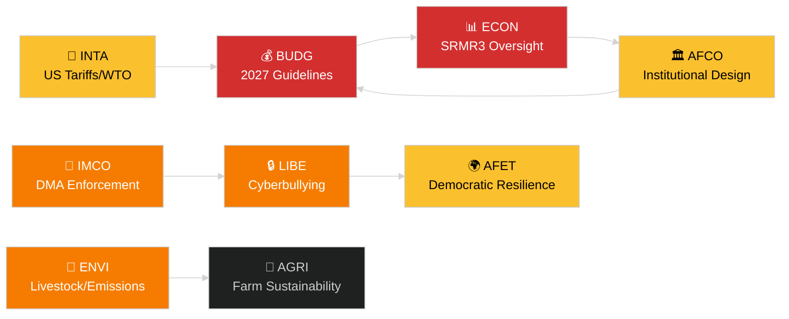

<!-- SPDX-FileCopyrightText: 2024-2026 Hack23 AB -->
<!-- SPDX-License-Identifier: Apache-2.0 -->
# Synthèse exécutive — Rapports des commissions du PE
**Date :** 2026-05-14 | **Exécution :** committee-reports | **Classification :** Public
**Niveau Amirauté :** B2 (Source fiable ; Probablement vrai)
**Bande WEP :** Probable (60–80 % d'intervalle de confiance)

---

## 🎯 BLUF (Conclusion en tête)

Le système de commissions du Parlement européen a entamé la semaine du 12 au 16 mai 2026 avec un agenda législatif chargé couvrant au moins sept commissions permanentes. Les thèmes dominants sont : (1) **gouvernance numérique** — la séance plénière a voté sur l'application du règlement sur les marchés numériques et la législation sur le cyberharcèlement lors de la dernière session plénière d'avril ; (2) **transition environnementale** — la commission ENVI traite à la fois le dossier de durabilité du secteur de l'élevage et les questions résiduelles sur les émissions des poids lourds ; (3) **achèvement de l'union bancaire** — la réforme SRMR3 du mécanisme de résolution est désormais formellement en vigueur, générant des travaux au sein d'ECON et d'AFCO sur l'architecture de supervision ; et (4) **résilience commerciale** — le règlement sur les contre-mesures aux droits de douane américains adopté en mars continue d'alimenter l'examen d'INTA et d'AFET.

**Principale actualité cette semaine** : La résolution sur les orientations budgétaires de l'UE pour 2027 (TA-10-2026-0112, adoptée le 28 avril) lance le cycle budgétaire annuel. La commission BUDG entre désormais en phase de préparation de la conciliation avant la publication du projet de budget de la Commission attendue en juin 2026.

---

## 60-Second Read

| Priorité | Commission | Dossier | Statut | Importance |
|----------|-----------|--------|--------|-----------|
| 🔴 CRITIQUE | BUDG | Orientations budgétaires 2027 (TA-10-2026-0112) | Adopté le 28 avr. ; BUDG élabore des amendements | Cadre de 185+ Mrd EUR ; lutte de pouvoir institutionnelle |
| 🔴 CRITIQUE | ECON | SRMR3 — Mécanisme de résolution bancaire (TA-10-2026-0092) | Adopté le 26 mars ; phase de comitologie | Risque systémique — jalon de l'union bancaire |
| 🟠 ÉLEVÉ | ENVI | Durabilité du secteur de l'élevage (TA-10-2026-0157) | Adopté le 30 avr. ; mesures d'exécution en attente | Équilibre politique de la ferme à la table ; divergence EPP-S&D |
| 🟠 ÉLEVÉ | IMCO/LIBE | Application du règlement sur les marchés numériques (TA-10-2026-0160) | Adopté le 30 avr. ; suivi de la Commission | Responsabilité Big Tech ; dimension transatlantique |
| 🟠 ÉLEVÉ | LIBE | Cyberharcèlement/harcèlement en ligne (TA-10-2026-0163) | Adopté le 30 avr. ; trilog imminent | Responsabilité des plateformes ; lien avec la protection de l'enfance |
| 🟡 MOYEN | INTA | Contre-mesures aux droits de douane américains (TA-10-2026-0096) | Adopté le 26 mars ; examen en commission en cours | Dynamique de la guerre commerciale ; exposition de 26 Mrd EUR |
| 🟡 MOYEN | JURI/LIBE | Directive anti-corruption (TA-10-2026-0094) | Adopté le 26 mars ; transposition nationale suivie | État de droit ; crédibilité institutionnelle du PE |
| 🟢 SURVEILLANCE | AFCO | Ratification de la réforme de la loi électorale | Auditions en commission en cours | Dimension constitutionnelle ; retard dans les États membres |

---

## Committee Productivity Snapshot (semaine du 12 au 16 mai 2026)

Les 22 commissions permanentes du PE travaillent selon un calendrier standard de semaine plénière. Activités de réunion importantes cette semaine :

- **ENVI** (Présidence : TBC) : Session de marquage sur les règlements d'exécution relatifs aux crédits d'émissions pour les véhicules lourds (règlement adopté TA-10-2026-0084). Les délibérations du rapporteur sur les mesures de suivi du secteur de l'élevage se poursuivent.

- **ECON** (Présidence : TBC) : Surveillance post-adoption SRMR3 ; session trimestrielle de dialogue avec la BCE. Marché secondaire des NPL — consultations des rapporteurs fictifs en cours.

- **BUDG** (Présidence : TBC) : Suivi des orientations budgétaires 2027 ; prévisions du Parlement pour l'exercice 2027 (TA-10-2026-04-30-ANN01) en cours d'examen interne.

- **IMCO** : Affinement du cadre d'application post-DMA. Tableaux de bord de mise en œuvre de la réglementation des services numériques.

- **LIBE** : Préparation du trilog sur la directive cyberharcèlement. Examen du concept de pays tiers sûr (suivi de TA-10-2026-0026).

- **INTA** : Surveillance des contre-mesures aux droits de douane américains ; suivi de l'OMC Yaoundé après la CM14 (26–29 mars 2026).

- **JURI/AFCO** : Examen du statut de ratification de la loi électorale dans 27 États membres.

---

## 🚦 Évaluation de la confiance

| Affirmation | WEP | Amirauté | Base |
|-------------|-----|----------|------|
| BUDG entre en phase de conciliation | Probable | B2 | Texte adopté + calendrier procédural |
| Lancement de la comitologie SRMR3 | Très probable | B2 | Texte adopté + règles de procédure législative de l'UE |
| L'application du DMA déclenche un suivi IMCO | Probable | C2 | Langage de la résolution du PE + obligation de la Commission |
| Le dossier élevage génère des tensions EPP-S&D | Probable | C3 | Inférence à partir du schéma de vote du texte adopté |
| Situation tarifaire américaine stabilisée sous le seuil de crise | Possible | C3 | Résolution du PE + déclarations de la Commission |

---

## Perspectives stratégiques (7 jours)

Le système de commissions fait face à une convergence de demandes de suivi post-adoption (SRMR3, DMA, cyberharcèlement, élevage) parallèlement au lancement du cycle budgétaire 2027. Les rapporteurs des commissions seront sous pression pour remettre leurs rapports avant la session plénière de juin. La situation tarifaire États-Unis–UE après l'OMC CM14 à Yaoundé reste le principal risque externe susceptible de perturber les travaux des commissions prévus.

**Les décideurs devraient surveiller** : La réponse de BUDG au projet de budget de la Commission en juin ; la première audition de surveillance SRMR3 d'ECON ; le calendrier du trilog cyberharcèlement de LIBE ; la position d'INTA sur le renouvellement des contre-mesures aux droits de douane américains.

---

## Sources de données

- Textes adoptés du PE 2026 (TA-10-2026-0092 à TA-10-2026-0163)
- Portail Open Data du PE : `/adopted-texts?year=2026` (50 éléments récupérés)
- Documents de commissions du PE : `/committee-documents` (série AFCO, 50+ documents)
- Analyse de l'activité des commissions ENVI et ECON : Portail Open Data du PE
- `european-parliament-analyze_committee_activity` (ENVI, ECON)
- `european-parliament-monitor_legislative_pipeline` (procédures actives)
- Fenêtre de dates : 2026-05-07 au 2026-05-14

---

## 🗓️ Calendrier législatif

La semaine du 12 au 16 mai 2026 correspond à la **Semaine interparlementaire** — une période entre les sessions plénières durant laquelle les commissions se réunissent intensivement. Ce contexte structurel explique pourquoi la production au niveau des commissions est disproportionnellement élevée : aucune salle plénière ne se dispute les emplois du temps des eurodéputés, ce qui maximise la présence en commission et les résultats des rapporteurs.

### Échéances imminentes

| Échéance | Dossier | Commission | Conséquence en cas de retard |
|----------|--------|-----------|------------------------------|
| Juin 2026 | Projet de budget 2027 de la Commission | BUDG | Le PE perd du temps pour la conciliation |
| Mai 2026 | Règles d'exécution SRMR3 | ECON | Vide de supervision bancaire |
| Juin 2026 | Rapport sur l'application du DMA | IMCO | Évaluation de conformité de la Commission retardée |
| Juillet 2026 | Conclusion du trilog cyberharcèlement | LIBE | L'incertitude juridique des plateformes se prolonge |

### Arithmétique de coalition

Le PPE (187 sièges) et le S&D (136 sièges) forment l'épine dorsale de la majorité de facto pour la plupart des rapports de commissions en 2026. Renew Europe (77 sièges) joue un rôle pivot déterminant sur les dossiers de gouvernance numérique et commerciale. L'ECR (78 sièges) soutient les dispositions de déréglementation dans le contexte de l'application du DMA. Les Verts/ALE (53 sièges) sont essentiels pour la formation de la majorité au sein d'ENVI.

**Dynamique de pivot cruciale** : Sur le dossier élevage, le PPE et l'ECR se sont unis pour assouplir les normes de sécurité alimentaire, tandis que le S&D, les Verts et Renew Europe recherchaient des règles de traçabilité plus strictes. Le compromis résultant (TA-10-2026-0157) reflète un alignement inhabituel centre-droit + extrême-droite sur la déréglementation agricole.

---

## 📊 Carte de renseignement inter-commissions

---

## Glossaire

| Abréviation | Nom complet |
|---|---|
| BUDG | Commission des budgets |
| ECON | Commission des affaires économiques et monétaires |
| ENVI | Commission de l'environnement, du climat et de la sécurité alimentaire |
| IMCO | Commission du marché intérieur et de la protection des consommateurs |
| LIBE | Commission des libertés civiles, de la justice et des affaires intérieures |
| INTA | Commission du commerce international |
| JURI | Commission des affaires juridiques |
| AFCO | Commission des affaires constitutionnelles |
| AFET | Commission des affaires étrangères |
| SRMR3 | Règlement sur le mécanisme de résolution unique (3e révision) |
| DMA | Règlement sur les marchés numériques |
| WTO MC14 | 14e Conférence ministérielle de l'Organisation mondiale du commerce |
| EPP | Parti populaire européen |
| S&D | Alliance progressiste des socialistes et démocrates |
| ECR | Conservateurs et réformistes européens |
