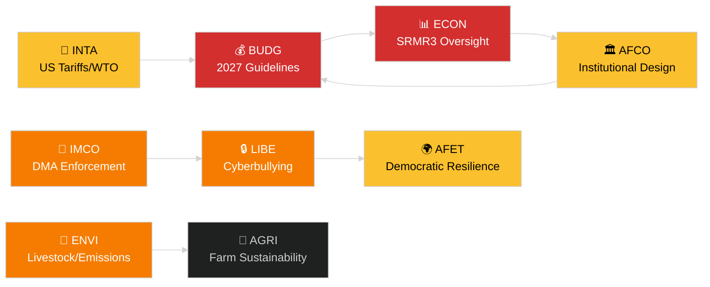

<!-- SPDX-FileCopyrightText: 2024-2026 Hack23 AB -->
<!-- SPDX-License-Identifier: Apache-2.0 -->
# סיכום מנהלים — דוחות ועדות הפרלמנט האירופי
**תאריך:** 2026-05-14 | **הרצה:** committee-reports | **סיווג:** ציבורי
**דרגת אדמירליות:** B2 (מקור אמין; כנראה נכון)
**רצועת WEP:** סביר (רווח ביטחון 60–80%)

---

## 🎯 BLUF (מסקנה מראש)

מערכת הוועדות של הפרלמנט האירופי פתחה את שבוע 12–16 במאי 2026 עם סדר יום חקיקתי עמוס הפרוס על פני שבע ועדות קבועות לפחות. הנושאים הדומיננטיים הם: (1) **ממשל דיגיטלי** — המליאה הצביעה על אכיפת תקנת שווקי הדיגיטל וחקיקה נגד פגיעה מקוונת במהלך מפגש המליאה האחרון של אפריל; (2) **מעבר סביבתי** — ועדת ENVI מעבדת גם את תיק הקיימות בענף בעלי החיים וגם שאלות שוליות בנושא פליטות רכבים כבדים; (3) **השלמת האיחוד הבנקאי** — רפורמת SRMR3 של מנגנון ההסדרה היא כעת חוק פורמלי ויוצרת עבודה ב-ECON וב-AFCO בנושא ארכיטקטורת הפיקוח; ו-(4) **חוסן מסחרי** — תקנת אמצעי הנגד לתעריפי ארה"ב שאומצה במרץ ממשיכה להניע בדיקה של INTA ו-AFET.

**הדק הראשי השבוע**: החלטת הנחיות התקציב של האיחוד האירופי ל-2027 (TA-10-2026-0112, אומצה ב-28 באפריל) מפעילה את מחזור התקציב השנתי. ועדת BUDG נכנסת כעת לשלב ההכנה לגישור לפני טיוטת התקציב של הנציבות הצפויה ביוני 2026.

---

## 60-Second Read

| עדיפות | ועדה | תיק | סטטוס | משמעות |
|--------|------|-----|-------|--------|
| 🔴 קריטי | BUDG | הנחיות תקציב 2027 (TA-10-2026-0112) | אומץ 28 אפר'; BUDG מנסח תיקונים | מסגרת של 185+ מיליארד EUR; מאבק כוח מוסדי |
| 🔴 קריטי | ECON | SRMR3 — מנגנון הסדרת בנקים (TA-10-2026-0092) | אומץ 26 מרץ; שלב קומיטולוגיה | סיכון סיסטמי — אבן דרך של האיחוד הבנקאי |
| 🟠 גבוה | ENVI | קיימות בענף בעלי החיים (TA-10-2026-0157) | אומץ 30 אפר'; אמצעי יישום בהמתנה | איזון פוליטי מהחווה לשולחן; פיצול EPP-S&D |
| 🟠 גבוה | IMCO/LIBE | אכיפת תקנת שווקי הדיגיטל (TA-10-2026-0160) | אומץ 30 אפר'; מעקב נציבות | אחריות Big Tech; ממד טרנס-אטלנטי |
| 🟠 גבוה | LIBE | פגיעה מקוונת/הטרדה באינטרנט (TA-10-2026-0163) | אומץ 30 אפר'; טרילוג קרוב | אחריות פלטפורמות; קשר להגנת ילדים |
| 🟡 בינוני | INTA | אמצעי נגד לתעריפי ארה"ב (TA-10-2026-0096) | אומץ 26 מרץ; סקירת ועדה מתמשכת | דינמיקת מלחמת סחר; חשיפה של 26 מיליארד EUR |
| 🟡 בינוני | JURI/LIBE | הנחיית מניעת שחיתות (TA-10-2026-0094) | אומץ 26 מרץ; עקיבת יישום לאומי | שלטון החוק; אמינות מוסדית של הפרלמנט האירופי |
| 🟢 מעקב | AFCO | אישרור רפורמת חוק הבחירות | ישיבות שמיעה מתמשכות | ממד חוקתי; עיכוב במדינות החברות |

---

## Committee Productivity Snapshot (שבוע 12–16 במאי 2026)

22 הוועדות הקבועות של הפרלמנט האירופי פועלות לפי לוח זמנים סטנדרטי של שבוע מליאה. פעילויות ישיבות חשובות השבוע:

- **ENVI** (יו"ר: TBC): מפגש סימון לתקנות יישום לזיכויי פליטות לרכבים כבדים (תקנה שאומצה TA-10-2026-0084). דיוני המדווח על אמצעי מעקב בענף בעלי החיים נמשכים.

- **ECON** (יו"ר: TBC): פיקוח לאחר אימוץ SRMR3; מפגש דיאלוג רבעוני עם הבנק המרכזי האירופי. שוק משני להלוואות בעייתיות — התייעצויות עם מדווחי צל מתמשכות.

- **BUDG** (יו"ר: TBC): מעקב אחר הנחיות תקציב 2027; הערכות הפרלמנט לשנת הכספים 2027 (TA-10-2026-04-30-ANN01) בסקירה פנימית.

- **IMCO**: שיפור מסגרת האכיפה לאחר DMA. כרטיסי ניקוד ליישום רגולציית שירותים דיגיטליים.

- **LIBE**: הכנת הטרילוג על הנחיית פגיעה מקוונת. סקירת מושג מדינת צד שלישי בטוחה (מעקב TA-10-2026-0026).

- **INTA**: ניטור אמצעי הנגד לתעריפי ארה"ב; מעקב WTO יאונדה לאחר MC14 (26–29 מרץ 2026).

- **JURI/AFCO**: סקירת מצב אישרור חוק הבחירות ב-27 מדינות חברות.

---

## 🚦 הערכת אמינות

| טענה | WEP | אדמירליות | בסיס |
|------|-----|-----------|------|
| BUDG נכנסת לשלב גישור | סביר | B2 | טקסט שאומץ + ציר זמן פרוצדורלי |
| השקת קומיטולוגיית SRMR3 | סביר מאוד | B2 | טקסט שאומץ + כללי הליך חקיקה אירופי |
| אכיפת DMA מפעילה מעקב IMCO | סביר | C2 | שפת החלטת הפרלמנט האירופי + התחייבות הנציבות |
| תיק בעלי החיים יוצר מתח EPP-S&D | סביר | C3 | מסקנה מדפוס הצבעה על הטקסט שאומץ |
| מצב התעריפים האמריקאי מייצב מתחת לסף המשבר | אפשרי | C3 | החלטת הפרלמנט האירופי + הצהרות הנציבות |

---

## תחזית אסטרטגית (7 ימים)

מערכת הוועדות מתמודדת עם התכנסות של דרישות מעקב לאחר אימוץ (SRMR3, DMA, פגיעה מקוונת, בעלי חיים) לצד השקת מחזור תקציב 2027. מדווחי הוועדות יהיו תחת לחץ לספק את דוחותיהם לפני מפגש המליאה של יוני. מצב התעריפים בין ארה"ב לאיחוד האירופי לאחר WTO MC14 ביאונדה נשאר הסיכון החיצוני הראשי שעלול לשבש עבודת הוועדות המתוכננת.

**קובעי מדיניות צריכים לעקוב**: תגובת BUDG לטיוטת תקציב הנציבות ביוני; ישיבת הפיקוח הראשונה של SRMR3 ב-ECON; ציר הזמן של הטרילוג לפגיעה מקוונת של LIBE; עמדת INTA על חידוש אמצעי הנגד לתעריפי ארה"ב.

---

## מקורות נתונים

- טקסטים שאומצו על ידי הפרלמנט האירופי 2026 (TA-10-2026-0092 עד TA-10-2026-0163)
- פורטל הנתונים הפתוחים של הפרלמנט האירופי: `/adopted-texts?year=2026` (50 פריטים אוחזרו)
- מסמכי ועדות הפרלמנט האירופי: `/committee-documents` (סדרת AFCO, 50+ מסמכים)
- ניתוח פעילות ועדות ENVI ו-ECON: פורטל הנתונים הפתוחים של הפרלמנט האירופי
- `european-parliament-analyze_committee_activity` (ENVI, ECON)
- `european-parliament-monitor_legislative_pipeline` (הליכים פעילים)
- חלון תאריכים: 2026-05-07 עד 2026-05-14

---

## 🗓️ לוח שנה חקיקתי

שבוע 12–16 במאי 2026 נופל ב**שבוע הבין-פרלמנטרי** — תקופה בין מפגשי מליאה שבה ועדות נפגשות בעצימות. ההקשר המבני הזה מסביר מדוע התפוקה ברמת הוועדות גבוהה באופן לא פרופורציונלי: אין אולם מליאה המתחרה על לוחות הזמנים של חברי הפרלמנט האירופי, מה שמקסם נוכחות בוועדות ותוצרי מדווחים.

### מועדים קרובים

| מועד אחרון | תיק | ועדה | השלכות עיכוב |
|-----------|-----|------|-------------|
| יוני 2026 | טיוטת תקציב הנציבות 2027 | BUDG | הפרלמנט האירופי מאבד זמן לגישור |
| מאי 2026 | כללי יישום SRMR3 | ECON | ריק פיקוח בנקאי |
| יוני 2026 | דוח אכיפת DMA | IMCO | הערכת ציות של הנציבות מתעכבת |
| יולי 2026 | סיום טרילוג פגיעה מקוונת | LIBE | אי-ודאות משפטית של פלטפורמות נמשכת |

### חשבון הקואליציה

EPP (187 מושבים) ו-S&D (136 מושבים) מהווים את עמוד השדרה של הרוב הפועלי ברוב דוחות הוועדות ב-2026. Renew Europe (77 מושבים) ממלאת תפקיד ציר מכריע בתיקי ממשל דיגיטלי ומסחר. ECR (78 מושבים) תומכת בהוראות רגולציה מופחתת בהקשר אכיפת DMA. Greens/EFA (53 מושבים) חיוניים ליצירת רוב ב-ENVI.

**דינמיקת ציר מרכזית**: בתיק ענף בעלי החיים, EPP ו-ECR התאחדו להקל על תקני בטיחות מזון, בעוד S&D, Greens ו-Renew Europe ביקשו כללי מעקב מחמירים יותר. הפשרה שהתקבלה (TA-10-2026-0157) משקפת התאמה יוצאת דופן של ימין-מרכז + קצה ימין על בטול רגולציה חקלאית.

---

## 📊 מפת מודיעין בין-ועדתית

---

## מילון מונחים

| קיצור | שם מלא |
|---|---|
| BUDG | ועדת התקציבים |
| ECON | ועדת ענייני כלכלה ומוניטרים |
| ENVI | ועדת הסביבה, האקלים ובטיחות המזון |
| IMCO | ועדת השוק הפנימי והגנת הצרכן |
| LIBE | ועדת חירויות אזרחיות, צדק וענייני פנים |
| INTA | ועדת הסחר הבינלאומי |
| JURI | ועדת ענייני משפט |
| AFCO | ועדת ענייני חוקתיים |
| AFET | ועדת ענייני חוץ |
| SRMR3 | תקנת מנגנון ההסדרה האחיד (מהדורה שלישית) |
| DMA | תקנת שווקי הדיגיטל |
| WTO MC14 | הוועידה המיניסטריאלית ה-14 של ארגון הסחר העולמי |
| EPP | המפלגה העממית האירופית |
| S&D | הברית המתקדמת של סוציאליסטים ודמוקרטים |
| ECR | השמרנים והרפורמיסטים האירופיים |
