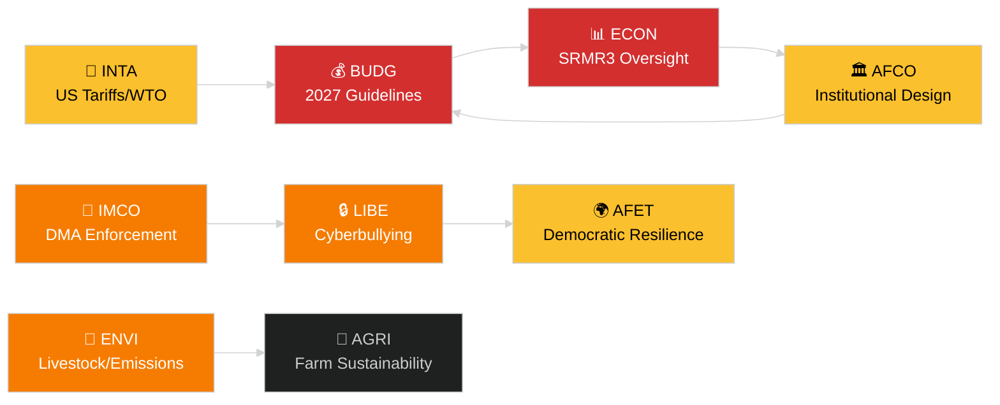

<!-- SPDX-FileCopyrightText: 2024-2026 Hack23 AB -->
<!-- SPDX-License-Identifier: Apache-2.0 -->
# エグゼクティブ・ブリーフ — EP委員会報告書
**日付：** 2026-05-14 | **実行：** committee-reports | **分類：** 公開
**信頼性評価：** B2（信頼できる情報源；おそらく真実）
**WEPバンド：** 蓋然的（信頼区間60〜80%）

---

## 🎯 BLUF（結論を先に）

欧州議会の委員会制度は、2026年5月12〜16日の週、少なくとも7つの常任委員会にわたる充実した立法議題とともに始まりました。主要テーマは次のとおりです。（1）**デジタルガバナンス** — 本会議は4月最後の本会議でデジタル市場法の執行およびサイバーいじめに関する立法について採決しました。（2）**環境移行** — ENVI委員会は畜産部門の持続可能性案件と重量車輌の残存排出ガス問題を処理中です。（3）**銀行同盟の完成** — SRMR3の破綻処理メカニズム改革が正式に発効し、監督アーキテクチャに関してECONとAFCOに作業を生じさせています。（4）**貿易の強靱性** — 3月に採択された対米関税対抗措置規則が引き続きINTAとAFETの審査を牽引しています。

**今週の最重要トリガー**：2027年EU予算ガイドライン決議（TA-10-2026-0112、4月28日採択）が年次予算サイクルを開始しました。BUDG委員会は、2026年6月に予定されている欧州委員会の予算案前の調停準備段階に入りました。

---

## 60-Second Read

| 優先度 | 委員会 | 案件 | 状態 | 重要度 |
|-------|--------|------|------|--------|
| 🔴 緊急 | BUDG | 2027年予算ガイドライン（TA-10-2026-0112） | 4月28日採択；BUDGが修正案作成中 | 1,850億EUR超の枠組み；機関間の権力争い |
| 🔴 緊急 | ECON | SRMR3 — 銀行破綻処理メカニズム（TA-10-2026-0092） | 3月26日採択；コミトロジー段階 | システミックリスク — 銀行同盟の節目 |
| 🟠 高 | ENVI | 畜産部門の持続可能性（TA-10-2026-0157） | 4月30日採択；実施措置待ち | 農場から食卓への政治的バランス；EPP-S&D分裂 |
| 🟠 高 | IMCO/LIBE | デジタル市場法の執行（TA-10-2026-0160） | 4月30日採択；欧州委員会がフォローアップ | Big Tech の説明責任；大西洋横断的側面 |
| 🟠 高 | LIBE | サイバーいじめ/オンライン嫌がらせ（TA-10-2026-0163） | 4月30日採択；トリローグ間近 | プラットフォームの責任；子どもの保護との関連 |
| 🟡 中 | INTA | 対米関税対抗措置（TA-10-2026-0096） | 3月26日採択；委員会審査継続 | 貿易戦争の動向；260億EUR の暴露リスク |
| 🟡 中 | JURI/LIBE | 汚職防止指令（TA-10-2026-0094） | 3月26日採択；各国の国内法転換を監視 | 法の支配；欧州議会の機関的信頼性 |
| 🟢 監視 | AFCO | 選挙法改正の批准 | 委員会公聴会進行中 | 憲法的側面；加盟国の遅延 |

---

## Committee Productivity Snapshot（2026年5月12〜16日の週）

欧州議会の22常任委員会は標準的な本会議週スケジュールで運営されています。今週の重要な会議活動：

- **ENVI**（委員長：TBC）：重量車輌排出クレジットの実施規則に関するマークアップ会議（規則採択済み TA-10-2026-0084）。畜産部門のフォローアップ措置に関する報告者審議が継続中。

- **ECON**（委員長：TBC）：SRMR3採択後の監督；欧州中央銀行との四半期対話セッション。不良債権の流通市場 — シャドーラポーターとの協議継続中。

- **BUDG**（委員長：TBC）：2027年予算ガイドラインのフォローアップ；2027年度の議会見積もり（TA-10-2026-04-30-ANN01）が内部審査中。

- **IMCO**：DMA後の執行枠組みの精緻化。デジタルサービス規制の実施スコアカード。

- **LIBE**：サイバーいじめ指令のトリローグ準備。第三国の安全概念に関する審査（TA-10-2026-0026のフォローアップ）。

- **INTA**：対米関税対抗措置の監視；MC14後のWTOヤウンデフォローアップ（2026年3月26〜29日）。

- **JURI/AFCO**：27加盟国での選挙法批准状況の審査。

---

## 🚦 信頼性評価

| 主張 | WEP | 信頼性 | 根拠 |
|------|-----|--------|------|
| BUDGが調停段階に入る | 蓋然的 | B2 | 採択テキスト＋手続き上のタイムライン |
| SRMR3コミトロジー開始 | 非常に蓋然的 | B2 | 採択テキスト＋EU立法手続き規則 |
| DMA執行がIMCOのフォローアップを誘発 | 蓋然的 | C2 | 欧州議会決議の文言＋欧州委員会の義務 |
| 畜産案件がEPP-S&D間の緊張を生む | 蓋然的 | C3 | 採択テキストの投票パターンからの推論 |
| 対米関税状況が危機閾値を下回る水準で安定 | 可能性あり | C3 | 欧州議会決議＋欧州委員会声明 |

---

## 戦略的展望（7日間）

委員会制度は、採択後のフォローアップ要求（SRMR3、DMA、サイバーいじめ、畜産）と2027年予算サイクルの開始が同時進行する状況に直面しています。委員会の報告者は6月本会議前に報告書を提出するよう圧力を受けることになります。ヤウンデでのWTO MC14後の米国・EU間の関税状況は、予定されている委員会作業を混乱させる可能性がある主要な外部リスクとして残っています。

**意思決定者が注視すべき点**：6月の欧州委員会予算案に対するBUDGの対応；ECONの最初のSRMR3監督ヒアリング；LIBEのサイバーいじめトリローグのタイムライン；対米関税対抗措置の更新に関するINTAの姿勢。

---

## データソース

- 欧州議会採択テキスト2026年（TA-10-2026-0092〜TA-10-2026-0163）
- 欧州議会オープンデータポータル：`/adopted-texts?year=2026`（50件取得）
- 欧州議会委員会文書：`/committee-documents`（AFCOシリーズ、50件以上）
- ENVI・ECON委員会活動分析：欧州議会オープンデータポータル
- `european-parliament-analyze_committee_activity`（ENVI、ECON）
- `european-parliament-monitor_legislative_pipeline`（活動中の手続き）
- 対象期間：2026-05-07〜2026-05-14

---

## 🗓️ 立法カレンダー

2026年5月12〜16日の週は、**欧州議会間週**に当たります — 本会議と本会議の間の期間で、委員会が集中的に会合を開きます。この構造的な文脈が、委員会レベルの生産性が不均衡に高い理由を説明しています。本会議場が欧州議会議員のスケジュールを奪い合うことなく、委員会への出席と報告者の成果を最大化します。

### 差し迫った期限

| 期限 | 案件 | 委員会 | 遅延の結果 |
|------|------|--------|-----------|
| 2026年6月 | 欧州委員会の2027年予算案 | BUDG | 欧州議会が調停の時間を失う |
| 2026年5月 | SRMR3実施規則 | ECON | 銀行監督の空白 |
| 2026年6月 | DMA執行報告書 | IMCO | 欧州委員会のコンプライアンス評価が遅延 |
| 2026年7月 | サイバーいじめトリローグの終結 | LIBE | プラットフォームの法的不確実性が継続 |

### 連立の計算

EPP（187議席）とS&D（136議席）が2026年のほとんどの委員会報告書において事実上の過半数の基盤を形成しています。Renew Europe（77議席）はデジタルガバナンスと貿易の案件において重要なスウィング役を果たしています。ECR（78議席）はDMA執行の文脈において規制緩和条項を支持しています。Greens/EFA（53議席）はENVI委員会の過半数形成において不可欠な存在です。

**重要なスウィングのダイナミクス**：畜産部門の案件では、EPPとECRが食品安全基準を緩和するために連携したのに対し、S&D、Greens、Renew Europeはより厳格なトレーサビリティ規則を求めました。その結果生まれた妥協案（TA-10-2026-0157）は、農業規制緩和についての中道右派と極右の異例な連携を反映しています。

---

## 📊 委員会横断的インテリジェンスマップ

---

## 略語集

| 略語 | 正式名称 |
|---|---|
| BUDG | 予算委員会 |
| ECON | 経済通貨委員会 |
| ENVI | 環境・気候・食品安全委員会 |
| IMCO | 域内市場・消費者保護委員会 |
| LIBE | 市民的自由・司法・内務委員会 |
| INTA | 国際貿易委員会 |
| JURI | 法務委員会 |
| AFCO | 憲法問題委員会 |
| AFET | 外務委員会 |
| SRMR3 | 単一破綻処理メカニズム規則（第3次改定） |
| DMA | デジタル市場法 |
| WTO MC14 | 世界貿易機関第14回閣僚会議 |
| EPP | 欧州人民党 |
| S&D | 社会主義者・民主主義者進歩同盟 |
| ECR | 欧州保守改革派 |
