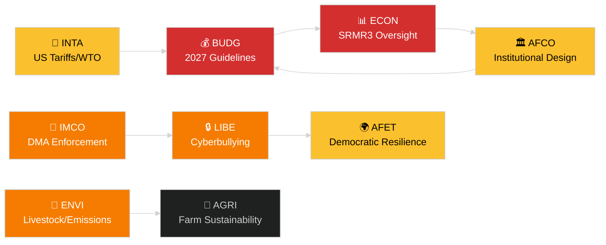

<!-- SPDX-FileCopyrightText: 2024-2026 Hack23 AB -->
<!-- SPDX-License-Identifier: Apache-2.0 -->
# 집행 브리핑 — 유럽의회 위원회 보고서
**날짜:** 2026-05-14 | **실행:** committee-reports | **분류:** 공개
**신뢰도 등급:** B2 (신뢰할 수 있는 출처; 아마도 사실)
**WEP 대역:** 개연성 있음 (신뢰 구간 60–80%)

---

## 🎯 BLUF (결론 먼저)

유럽의회의 위원회 시스템은 적어도 7개 상임 위원회에 걸친 빽빽한 입법 의제와 함께 2026년 5월 12~16일 주를 시작했습니다. 지배적인 주제는 다음과 같습니다. (1) **디지털 거버넌스** — 본회의는 4월 마지막 본회의에서 디지털 시장법 집행과 사이버 폭력 방지 법률에 대해 표결했습니다. (2) **환경 전환** — ENVI 위원회는 축산 부문 지속가능성 파일과 중량 차량의 잔여 배출 문제를 모두 처리하고 있습니다. (3) **은행 동맹 완성** — SRMR3 결의 메커니즘 개혁이 이제 공식적으로 법률이 되어 감독 체계에 관해 ECON과 AFCO에 작업을 창출하고 있습니다. (4) **무역 회복력** — 3월에 채택된 대미 관세 대응 조치 규정이 INTA와 AFET의 검토를 계속 추동하고 있습니다.

**이번 주 주요 트리거**: 2027년 EU 예산 지침 결의(TA-10-2026-0112, 4월 28일 채택)가 연례 예산 사이클을 개시했습니다. BUDG 위원회는 이제 2026년 6월에 예상되는 유럽위원회 예산 초안 전에 조정 준비 단계에 들어갔습니다.

---

## 60-Second Read

| 우선순위 | 위원회 | 파일 | 현황 | 중요성 |
|---------|--------|------|------|--------|
| 🔴 긴급 | BUDG | 2027년 예산 지침 (TA-10-2026-0112) | 4월 28일 채택; BUDG 수정안 작성 중 | 1,850억 EUR 이상 프레임워크; 기관 간 권력 다툼 |
| 🔴 긴급 | ECON | SRMR3 — 은행 결의 메커니즘 (TA-10-2026-0092) | 3월 26일 채택; 코미톨로지 단계 | 시스템 리스크 — 은행 동맹 이정표 |
| 🟠 높음 | ENVI | 축산 부문 지속가능성 (TA-10-2026-0157) | 4월 30일 채택; 이행 조치 대기 중 | 농장에서 식탁까지 정치적 균형; EPP-S&D 분열 |
| 🟠 높음 | IMCO/LIBE | 디지털 시장법 집행 (TA-10-2026-0160) | 4월 30일 채택; 유럽위원회 후속 조치 | Big Tech 책임; 대서양 횡단 차원 |
| 🟠 높음 | LIBE | 사이버 폭력/온라인 괴롭힘 (TA-10-2026-0163) | 4월 30일 채택; 삼자 협상 임박 | 플랫폼 책임; 아동 보호 연계 |
| 🟡 중간 | INTA | 대미 관세 대응 조치 (TA-10-2026-0096) | 3월 26일 채택; 위원회 검토 진행 중 | 무역 전쟁 역학; 260억 EUR 노출 |
| 🟡 중간 | JURI/LIBE | 반부패 지침 (TA-10-2026-0094) | 3월 26일 채택; 각국 전환 모니터링 | 법치주의; 유럽의회의 기관적 신뢰성 |
| 🟢 모니터링 | AFCO | 선거법 개혁 비준 | 위원회 청문회 진행 중 | 헌법적 차원; 회원국 지연 |

---

## Committee Productivity Snapshot (2026년 5월 12~16일 주)

유럽의회의 22개 상임 위원회는 표준 본회의 주 일정에 따라 운영되고 있습니다. 이번 주 주요 회의 활동:

- **ENVI** (위원장: TBC): 중량 차량 배출 크레딧 이행 규정에 대한 마크업 회의 (규정 채택 TA-10-2026-0084). 축산 부문 후속 조치에 관한 보고자 논의가 계속됩니다.

- **ECON** (위원장: TBC): SRMR3 채택 후 감독; 유럽중앙은행과의 분기별 대화 세션. 부실 대출 유통 시장 — 그림자 보고자 협의 진행 중.

- **BUDG** (위원장: TBC): 2027년 예산 지침 후속 조치; 2027 회계연도 의회 추정치 (TA-10-2026-04-30-ANN01) 내부 검토 중.

- **IMCO**: DMA 이후 집행 프레임워크 정교화. 디지털 서비스 규제 이행 점수표.

- **LIBE**: 사이버 폭력 지침 삼자 협상 준비. 안전 제3국 개념 검토 (TA-10-2026-0026 후속).

- **INTA**: 대미 관세 대응 조치 모니터링; MC14 이후 WTO 야운데 후속 (2026년 3월 26~29일).

- **JURI/AFCO**: 27개 회원국에서의 선거법 비준 현황 검토.

---

## 🚦 신뢰도 평가

| 주장 | WEP | 신뢰도 | 근거 |
|------|-----|--------|------|
| BUDG 조정 단계 진입 | 개연성 있음 | B2 | 채택 텍스트 + 절차적 일정 |
| SRMR3 코미톨로지 개시 | 매우 개연성 있음 | B2 | 채택 텍스트 + EU 입법 절차 규칙 |
| DMA 집행으로 IMCO 후속 조치 유발 | 개연성 있음 | C2 | 유럽의회 결의 언어 + 유럽위원회 의무 |
| 축산 파일로 EPP-S&D 긴장 발생 | 개연성 있음 | C3 | 채택 텍스트 투표 패턴 추론 |
| 미국 관세 상황 위기 임계값 이하 안정 | 가능성 있음 | C3 | 유럽의회 결의 + 유럽위원회 성명 |

---

## 전략적 전망 (7일)

위원회 시스템은 채택 후 후속 조치 요구(SRMR3, DMA, 사이버 폭력, 축산)와 2027년 예산 사이클 개시가 동시에 진행되는 상황에 직면해 있습니다. 위원회 보고자들은 6월 본회의 전에 보고서를 제출해야 하는 압박을 받을 것입니다. 야운데에서의 WTO MC14 이후 미국과 EU 사이의 관세 상황은 예정된 위원회 작업을 방해할 수 있는 주요 외부 리스크로 남아 있습니다.

**정책 결정자들이 주목해야 할 사항**: 6월 유럽위원회 예산 초안에 대한 BUDG의 반응; ECON의 첫 SRMR3 감독 청문회; LIBE의 사이버 폭력 삼자 협상 일정; 대미 관세 대응 조치 갱신에 관한 INTA의 입장.

---

## 데이터 출처

- 유럽의회 채택 텍스트 2026 (TA-10-2026-0092~TA-10-2026-0163)
- 유럽의회 공개 데이터 포털: `/adopted-texts?year=2026` (50개 항목 검색)
- 유럽의회 위원회 문서: `/committee-documents` (AFCO 시리즈, 50개 이상)
- ENVI & ECON 위원회 활동 분석: 유럽의회 공개 데이터 포털
- `european-parliament-analyze_committee_activity` (ENVI, ECON)
- `european-parliament-monitor_legislative_pipeline` (활성 절차)
- 날짜 범위: 2026-05-07~2026-05-14

---

## 🗓️ 입법 달력

2026년 5월 12~16일 주는 **유럽의회 간 주(Interparliamentary Week)**에 해당합니다 — 위원회가 집중적으로 회의를 개최하는 본회의 사이의 기간입니다. 이 구조적 맥락은 위원회 수준의 생산성이 불균형적으로 높은 이유를 설명합니다. 어떤 본회의장도 의원들의 일정을 두고 경쟁하지 않아 위원회 참석과 보고자 결과물이 최대화됩니다.

### 임박한 기한

| 기한 | 파일 | 위원회 | 지연의 결과 |
|------|------|--------|-----------|
| 2026년 6월 | 유럽위원회 2027년 예산 초안 | BUDG | 유럽의회가 조정을 위한 시간을 잃음 |
| 2026년 5월 | SRMR3 이행 규칙 | ECON | 은행 감독 공백 |
| 2026년 6월 | DMA 집행 보고서 | IMCO | 유럽위원회 준수 평가 지연 |
| 2026년 7월 | 사이버 폭력 삼자 협상 마무리 | LIBE | 플랫폼의 법적 불확실성 연장 |

### 연정 산술

EPP (187석)와 S&D (136석)는 2026년 대부분의 위원회 보고서에서 사실상의 다수결 기반을 형성하고 있습니다. Renew Europe (77석)은 디지털 거버넌스와 무역 파일에서 중요한 스윙 역할을 합니다. ECR (78석)은 DMA 집행 맥락에서 규제 완화 조항을 지지합니다. Greens/EFA (53석)는 ENVI의 다수결 구성에 필수적입니다.

**핵심 스윙 역학**: 축산 부문 파일에서 EPP와 ECR은 식품 안전 기준 완화를 위해 연합했고, S&D, Greens, Renew Europe은 보다 엄격한 추적 가능성 규칙을 추구했습니다. 그 결과 나온 타협안(TA-10-2026-0157)은 농업 규제 완화에 대한 중도 우파 + 극우의 이례적인 공조를 반영합니다.

---

## 📊 위원회 간 인텔리전스 지도

---

## 약어 목록

| 약어 | 전체 명칭 |
|---|---|
| BUDG | 예산 위원회 |
| ECON | 경제통화위원회 |
| ENVI | 환경·기후·식품안전위원회 |
| IMCO | 역내시장·소비자보호위원회 |
| LIBE | 시민자유·사법·내무위원회 |
| INTA | 국제무역위원회 |
| JURI | 법무위원회 |
| AFCO | 헌법문제위원회 |
| AFET | 외교위원회 |
| SRMR3 | 단일결의메커니즘규정 (3차 개정) |
| DMA | 디지털 시장법 |
| WTO MC14 | 세계무역기구 제14차 각료회의 |
| EPP | 유럽인민당 |
| S&D | 사회주의자·민주주의자 진보동맹 |
| ECR | 유럽보수개혁파 |
